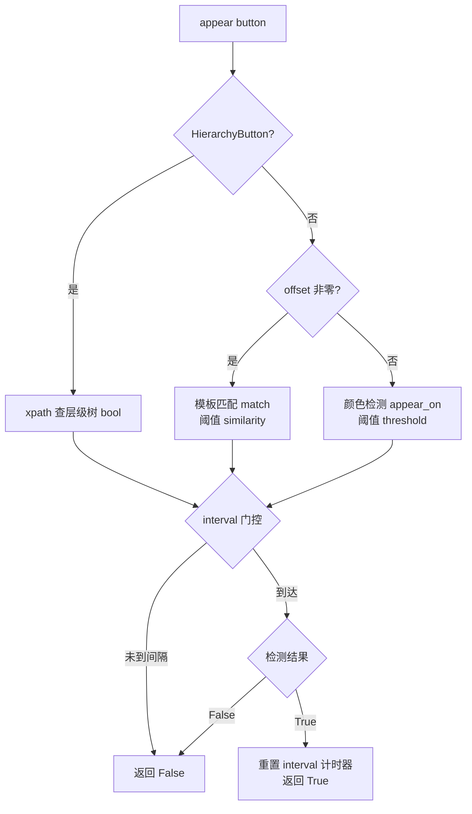
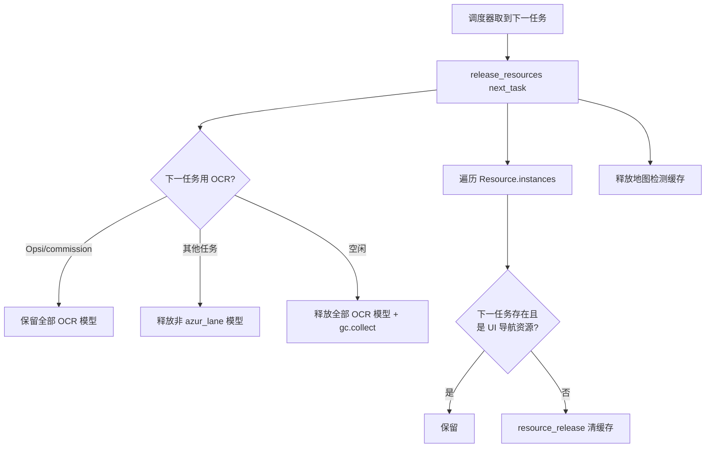
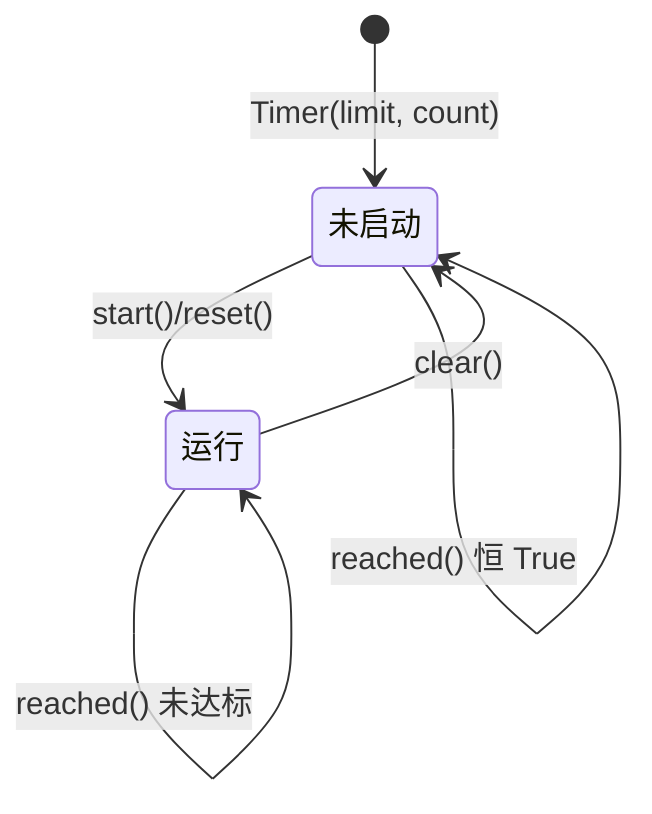

# 基础层 module/base

> 所有游戏功能模块的公共地基：模块基类、按钮/模板识别、资源缓存管理、计时器、过滤器与各类横切工具。

## 1. 模块概述

`module/base` 是整个自动化框架的最底层支撑层。上层的每个游戏任务模块（出击、大世界、委托等）都继承自这里的 `ModuleBase`，通过它持有配置（`AzurLaneConfig`）和设备（`Device`），并获得「截图 → 识别 → 操作」循环所需的全部原语：按钮检测、模板匹配、状态循环、间隔控制。

这一层回答的问题是：当几百个功能模块共享同一套识别与操作手段时，哪些东西必须抽出来放在最底下统一实现。答案是四类设施：

1. **识别原语**——`Button`（颜色检测/模板匹配）、`Template`（模板匹配）、`Mask`（遮罩），以及配套的图像工具函数（`module/base/utils.py`）。游戏识别基于 1280×720 截图，所有资源坐标都遵循这一约定。
2. **资源生命周期**——`Resource` 基类把所有按钮和模板实例登记到全局注册表，供调度器在任务切换时批量释放图像缓存，控制 7×24 小时运行的内存占用。
3. **时间与节奏控制**——`Timer` 双重计时器是所有状态循环防连击、防卡死判断的基石；`Filter` 则负责解析用户配置的过滤字符串（如退役舰船选择器）。
4. **横切服务**——异步执行器（后台线程池）、远程 API 客户端、设备 ID、每日备份、SSH 指纹清理、调试录屏等与游戏逻辑无关但被多处使用的工具。

设计上的关键取舍是**继承深度换组合简单**：`ModuleBase` 把 UI 导航（`module/ui/ui.py` 的 `UI` 类）、弹窗处理（`module/handler/info_handler.py` 的 `InfoHandler`）串成一条继承链（`ModuleBase → InfoHandler → UI → 各业务模块`），使业务模块能直接调用 `self.appear()`、`self.ui_ensure()` 等方法，而无需感知中间层。基础层本身保持无状态循环逻辑——所有状态（`interval_timer`、截图缓存）都挂在实例或设备上，由单线程调度器顺序驱动。

## 2. 模块职责

### 负责

- 定义 `ModuleBase`：配置/设备绑定、`appear()` 系列检测、状态循环语法糖（`loop()`）、间隔计时器管理。
- 定义 `Button` / `Template` / `Mask`：颜色检测、模板匹配（原图/二值化/亮度通道）、GIF 多帧模板、按钮网格 `ButtonGrid`。
- 全局资源注册与按任务释放（`Resource.instances`、`release_resources()`），含 OCR 模型与地图检测缓存的差异化保留策略。
- `Timer`（时间 + 访问双重计数）、时间字符串解析（`future_time` 等）。
- `Filter` 正则过滤系统：解析 `>` 分隔的优先级排序规则，应用于舰船/装备/商品对象列表。
- `utils.py` 图像处理与随机坐标工具（点击点随机化、裁剪、颜色比较、OCR 预处理）。
- 装饰器：`Config.when()` 按配置分发同名方法、`cached_property` 及配套删除工具。
- 横切工具：`AsyncExecutor` 后台队列、`ApiClient` 远程 API 上报、`device_id` 硬件指纹、`backup` 每日备份、`retry` 通用重试、`ssh` 主机指纹清理、`debug_clip` 调试录屏。

### 不负责

- 设备连接与截图实现（adb/minitouch/scrcpy 等）——属于设备层 `module/device`，本层只消费 `Device` 的 `screenshot()`/`click()` 接口。
- UI 页面图与导航路径——属于 `module/ui`（`Page` 图谱与页面 `assets.py`）。
- OCR 模型的加载与推理——属于 `module/ocr`；本层只在资源释放时负责卸载模型缓存。
- 配置的定义与迁移——属于 `module/config`；本层只消费配置值。
- 游戏业务逻辑（战斗、地图、商店等）——全部在 `module/base` 之上的业务模块中。

## 3. 模块位置

```
module/base/
├── base.py            # ModuleBase：所有功能模块的最高基类
├── button.py          # Button（颜色/模板识别）、ButtonGrid（网格）
├── template.py        # Template：模板匹配资源（TEMPLATE_ 前缀约定）
├── resource.py        # Resource 基类、全局注册表、release_resources()
├── mask.py            # Mask：灰度遮罩模板（地图 UI 遮罩等）
├── filter.py          # Filter：正则过滤系统（舰船/装备/商品选择器）
├── timer.py           # Timer 双重计时器、future_time 等时间工具
├── decorator.py       # Config.when()、cached_property、run_once 等
├── utils.py           # 图像处理、随机坐标、颜色比较等工具函数
├── async_executor.py  # AsyncExecutor 单例：后台 asyncio 事件循环线程
├── api_client.py      # ApiClient：bug 上报、遥测提交、公告获取
├── device_id.py       # 硬件指纹设备 ID（匿名统计用）
├── backup.py          # 每日备份（数据库 + 用户配置）
├── retry.py           # 通用重试装饰器（改自 retry 库）
├── ssh.py             # 清理 SSH known_hosts 指纹记录（非 SSH 连接）
└── debug_clip.py      # 大世界战后调试录屏（设备端 screenrecord）
```

| 文件 | 作用 | 主要使用者 |
| --- | --- | --- |
| `base.py` | `ModuleBase` 基类与检测/循环原语 | 全部业务模块（经继承链） |
| `button.py` | `Button`、`ButtonGrid` | 各模块 `assets.py`（生成产物） |
| `template.py` | `Template` | 同上，模板类资源 |
| `resource.py` | 资源注册表与释放 | 调度器 `alas.py`、`server.py` |
| `timer.py` | `Timer`、时间解析 | 状态循环、调度 |
| `filter.py` | `Filter` | 商店、退役、委托等选择器 |
| `utils.py` | 图像/坐标工具 | 几乎所有模块（`from module.base.utils import *`） |
| `decorator.py` | 装饰器全家桶 | 全仓（`Config.when` 是业务模块的核心分发手段） |
| `async_executor.py` | 后台任务队列 | 统计提交、日志上报 |
| `api_client.py` | 远程 API 客户端 | `alas.py`、遥测提交器 |
| `device_id.py` | 设备 ID | 遥测、统计库 |
| `backup.py` | 每日备份 | `alas.py` 启动时 |
| `retry.py` | 通用重试 | `module/runtime/updater.py` |
| `ssh.py` | 清理 SSH 主机指纹 | 远程模拟器管理、远程访问 |
| `debug_clip.py` | 战后调试录屏 | 短猫相接、侵蚀 1 练级 |

## 4. 核心入口

| 入口 | 用途 |
| --- | --- |
| `ModuleBase(config, device=None, task=None)` | 业务模块构造入口；`config` 可传实例或配置名，`device` 可传实例、序列号或 `None` 自动创建 |
| `self.appear()` / `self.appear_then_click()` | 状态循环内的检测/检测并点击，是最常用的外部调用入口 |
| `self.loop()` / `self.loop_hierarchy()` | 状态循环语法糖，自动截图（或取 UI 层级树） |
| `Button(...)` / `Template(file=...)` | 各模块 `assets.py` 中的资源常量构造，模块导入时即注册 |
| `release_resources(next_task='')` | 调度器在任务切换/等待时调用，批量释放图像与 OCR 缓存 |
| `Filter(regex, attr, preset)` | 各选择器模块定义过滤规则的入口 |
| `async_executor`（全局实例） | 向后台线程投递阻塞操作（统计写入、上报） |

追代码建议从 `ModuleBase.appear()` 开始：它是理解「一次检测如何路由到颜色/模板/层级三种模式」的钥匙；再沿 `Button.match` / `Button.appear_on` 下探识别细节。

## 5. 核心组件

### ModuleBase（base.py）

| 成员 | 类型 | 说明 |
| --- | --- | --- |
| `config` | `AzurLaneConfig` | 构造时绑定；支持传配置名自动加载 |
| `device` | `Device` | 构造时绑定；`None` 时按配置自动创建，传序列号字符串则覆盖 `Emulator_Serial` |
| `worker` | `ThreadPoolExecutor` | 类级缓存属性（`cached_class_property`），**所有实例共享**的单线程后台池，用于把与主流程无依赖的批量计算投递到后台 |
| `interval_timer` | `dict[str, Timer]` | 按按钮名管理的间隔计时器，`appear(interval=...)` 的防连击闸门 |
| `stat` / `emotion` | `AzurStats` / `Emotion` | 延迟初始化的统计与心情组件 |
| `image_file`（setter） | — | 从本地图片注入已有 `device.image`；离线测试需先隔离配置和设备构造 |

三种检测模式的分发逻辑在 `appear()` 中：

| 传入对象 | 检测方式 |
| --- | --- |
| `HierarchyButton`（或 xpath 字符串，经 `ensure_button` 转换） | UI 层级树 xpath 查找，`bool(button)` 判断节点唯一存在 |
| `offset` 非零 | 模板匹配 `Button.match()`，阈值 `similarity`（默认 0.85） |
| 其余（`offset=0`） | 颜色检测 `Button.appear_on()`，容差 `threshold`（默认 10） |

`interval > 0` 时先查 `interval_timer`，未到期直接返回 `False`；检测为真后重置计时器。每次检测都会 `device.stuck_record_add(button)`，供设备层判断「是否卡在同一画面」。

### Button 与 Template（button.py / template.py）

两者都继承 `Resource`，构造函数签名与 `dev_tools/button_extract.py` 的生成格式一一对应（`area/color/button/file` 可为按服务器的字典）。

| 能力 | Button | Template |
| --- | --- | --- |
| 颜色检测 | `appear_on()`（区域均色比对） | 无 |
| 模板匹配 | `match` / `match_binary` / `match_luma`，在 `area` 外扩 `offset` 范围内搜索 | 同左，另支持 `match_multi`（多目标）、`match_result`（返回坐标） |
| 位置修正 | 匹配后更新 `_button_offset`，`button` 属性返回修正后的可点击区域 | 匹配点经 `_point_to_button` 转为一次性 `Button` |
| 服务器回退 | 无（回退在生成器完成，见第 15 节） | 同左 |
| `split_server()` | 拆成 4 个服务器专用按钮 | 同左 |

`button` 属性的动态性是点击正确性的关键：模板匹配类按钮位置不固定，`match()` 找到实际位置后写入 `_button_offset`，之后 `Device.click()` 从 `button.button`（而非原始 `_button`）内取随机点，点击就落在真实位置上。`load_offset()` 则用于把一个按钮的检测偏移复制给另一按钮（如滑动后整组 UI 平移的场景）。

`ButtonGrid` 用 `origin + delta` 描述规则网格（商店货架、仓库格子），按下标 `(x, y)` 即取对应 `Button`，免去为每个格子写常量。

### Resource 与 release_resources（resource.py）

- `Button.__init__` / `Template.__init__` 自动调用 `resource_add(self.file)`，以文件路径为键登记进类属性 `Resource.instances`（无 `file` 的纯颜色按钮不注册——它们没有图像缓存可释放）。
- `resource_release()` 删除 `cached` 列表中的缓存属性并清空已加载图像。**下次访问属性时按当前全局服务器重新解析**——这正是切换服务器后资源立即生效的机制。
- `release_resources(next_task)` 的调用时机（核实自 `alas.py` 与 `module/config/server.py`）：
  - 调度器每轮 `get_next_task()` 派发新任务前调用一次，传入下一任务名；
  - 长等待（关闭模拟器/关闭游戏/空闲）时多次调用，传空表示全部释放；
  - `set_server()` 切换服务器时调用（传空，全部释放）。
- 保留策略由 `next_task` 驱动：
  - UI 导航资源（`module/ui/assets.py` 全部常量 + `ui.py`/`info_handler.py` 中页面检测与弹窗按钮，通过**源码正则扫描**收集）在「有下一个任务」时保留——释放后无法识别当前页面；
  - OCR 模型：下一任务是 `Opsi*` 或 `commission` 时全保留；其他任务保留 `azur_lane` 模型；空闲全释放（使用 OCR 服务器时改为空闲期断开连接）；
  - 地图检测缓存图像（`ASSETS` 的遮罩与角点模板）每次释放。
- `gc.collect(2)` 仅在 OCR 模型实际被释放时执行，避免在截图与战斗循环中引入 GC 停顿。

### Timer（timer.py）

双重计数：`reached()` 需**同时**满足「经过时间 > limit」和「访问次数 > count」。`count` 的价值在慢设备：截图一次可能耗时超过 `limit`，纯时间条件会让 interval 门控失效（每次循环都已超时）；访问次数按 `Timer.from_seconds(limit, speed≈0.5s)` 从预期截图速度推算，保证两次触发之间至少隔 `count` 次循环迭代。

未 `start()` 的 Timer 每次 `reached()` 返回 `True`（首次快速尝试）；`clear()` 后回到该状态（立即放行），`reset()` 则重新计时。`interval_reset()`（重新计时）与 `interval_clear()`（立即放行）的差异正来源于此。

时间字符串工具（`future_time`、`future_time_range`、`time_range_active`）统一走 `module.config.time_source.now()`，测试可注入虚拟时钟。

### Filter（filter.py)

解析形如 `cvlvl125>cv>reset` 的过滤串：`load()` 统一各种 Unicode 全角 `>`/`-` 变体后按 `>` 切分，逐段用构造时的正则提取属性值（捕获组与 `attr` 一一对应）；预设字符串（如 `reset`）不解析直接透出；`apply()` 按规则顺序输出匹配对象，实现优先级排序。无效段落打 warning 并替换为不可能匹配的哨兵值（`'1nVa1d'`），被静默跳过而非报错中断。特例：`sub_genre` 为 `None` 的通用物品可匹配带 `sub_genre` 的规则。使用方（商店、退役、委托、科研书籍等）各自定义正则与预设。

### AsyncExecutor（async_executor.py）

进程级单例，后台 daemon 线程跑一个 `asyncio` 事件循环。`submit()` 对同步函数包一层协程再 `run_coroutine_threadsafe`，因此**所有同步任务在 loop 线程内串行执行**——这把 SQLite 写入天然串行化，是统计库并发安全的实现基础。`flush()` 用哨兵任务近似「排空队列」，并注册在 `atexit` 保证退出前落盘。

### 其余文件

| 文件 | 设计要点 |
| --- | --- |
| `decorator.py` | `Config.when(**配置)` 装饰器按当前配置值分发到同名不同实现（同一方法写多份 `@Config.when(USE_XXX=True/False)`），是业务模块处理服务器/选项差异的核心手段；`cached_property` 把值写入实例 `__dict__`，因此 `del_cached_property` 删键即重置缓存，`resource_release` 全靠这一点 |
| `utils.py` | 见「数据流」；重点函数按场景：`random_rectangle_point`（点击随机化，Device 层所有点击的坐标来源）、`random_rectangle_vector_opted`（滑动路径随机化，带白/黑名单防止滑动被游戏当点击）、`crop`（越界黑边填充，模拟 pillow 行为）、`get_color`/`color_similar`（颜色检测）、`color_bar_percentage`（进度条百分比）、`load_image`（去 alpha、可裁剪）、`extract_letters`/`extract_white_letters`（OCR 预处理：字母黑、背景白）、`lower_template_match_similarity`（非原生 720p 截图的阈值放宽）、`node2location`/`location2node`（地图网格坐标 A1 风格互转） |
| `mask.py` | `Mask(Template)`：加载后自动转灰度，`apply()` 与截图按位与，用于在地图检测前抹掉 UI 区域（`module/map_detection` 的 `UI_MASK` 等） |
| `retry.py` | 改自 `retry` 库：重试耗尽后抛**原始异常**（原版抛 RetryError），并输出异常详情。目前仅 `module/runtime/updater.py` 使用；设备层另有自己的 `retry_backend`（`module/device/method/retry.py`），二者是独立实现，不要混用 |
| `ssh.py` | 不是 SSH 连接库。`clear_ssh_host_key()` 先用 `ssh -G` 查询目标主机实际使用的 known_hosts 文件，再 `ssh-keygen -R` 只删该主机的指纹记录，供远程模拟器管理与远程访问场景避免主机指纹变更导致的交互卡死 |
| `device_id.py` | Windows 用 WMIC 查主板/CPU/BIOS/磁盘序列号，Linux 用 machine-id，macOS 用硬件 UUID（已舍弃 MAC 地址），拼接后 SHA-256 取前 32 位。变更时把旧 ID 暂存内存供统计数据库热迁移；`log/device_id.json` 每 5 分钟由 daemon 线程覆写 |
| `backup.py` | 每日备份：SQLite 原生 `backup()` 接口热备两个统计库 + `deploy.yaml` + 用户配置 JSON（排除 `template*`），写入 `AzurPilot_Data_Backup/<日期>/`，按保留天数清理。`enable=False` 时直接返回，不动备份目录 |
| `api_client.py` | 远程 API 客户端（bug 日志、CL1 遥测、公告拉取），上报走 `async_executor` 异步化；`get_announcement` 同步。请求失败仅记日志，绝不阻断游戏流程 |
| `debug_clip.py` | 设备端 `screenrecord` 录制调试录像（30fps 输出、真实时间戳），`clip_recording()` 上下文管理器由侵蚀 1 练级与短猫相接使用。所有失败路径只记日志、优雅降级为不录，绝不影响游戏逻辑 |

## 6. 工作流程

### 一次检测（appear）的决策路径



间隔门控在检测之前：`interval_timer` 按按钮名索引，`limit` 变化时自动重建。模板匹配成功还会更新 `_button_offset`，后续 `self.device.click(button)` 会点在匹配出的真实位置（偏移区域内再取随机点）。

### 任务切换时的资源释放



释放后属性并未消失：下次访问 `button.image` 等缓存属性时按需重新加载。UI 导航资源的名单来自对 `module/ui/assets.py`、`module/ui/ui.py`、`module/handler/info_handler.py` 三个源文件的**启动时正则扫描**（`PreservedAssets`），因此新增页面或弹窗按钮无需登记——只要按项目惯例命名并写进这些文件，就自动纳入保留名单。

## 7. 调用关系

### 上游

| 模块 | 关系 |
| --- | --- |
| `alas.py`（调度器） | 每个任务实例化业务模块（间接构造 `ModuleBase`）；调用 `release_resources()` 控制内存；调用 `backup()`、`ApiClient`、`clear_ssh_host_key()` |
| 业务功能模块（campaign、os、shop 等） | 全部经 `InfoHandler → UI → ModuleBase` 继承链获得本层能力 |
| `module/config/server.py` | `set_server()` 触发 `release_resources()` |
| `module/statistics/*` | 通过 `async_executor`、`ApiClient`、`device_id` 上报数据 |

### 下游

| 模块 | 用途 |
| --- | --- |
| `module/device` | 截图、点击（点击坐标来自 `random_rectangle_point(button.button)`）、层级树；`stuck_record_add` 依赖 Button 可哈希性 |
| `module/config` | `self.config.*` 读写配置；`server.server` 决定资源解析结果 |
| `module/ocr` | 消费 `extract_letters` 预处理；OCR 模型缓存由 `release_resources` 卸载 |
| `module/map_detection` | 消费 `Mask` 遮罩与 `fit_points` 等工具 |

## 8. 数据流

识别主链路（每轮状态循环一次）：

```
Device.screenshot() 产出 np.ndarray (720, 1280, 3) RGB
    → ModuleBase.appear(button)
        → Button.appear_on / match 读取 button.area 区域
        → 返回 bool
    → 命中时 Device.click(button)
        → random_rectangle_point(button.button) 生成随机坐标
        → 按控制方式（ADB/minitouch/scrcpy…）下发点击
```

过滤链路（商店/退役/委托等）：

```
用户配置字符串（如 "cvlvl100>dd>reset"）
    → Filter.load() 切分与解析
    → apply(对象列表) 按优先级输出匹配对象
    → 业务代码按结果执行操作
```

上报链路（异步、不阻塞主流程）：

```
统计/错误事件 → ApiClient.submit_*() → async_executor.submit()
    → 后台 loop 线程串行执行 HTTP POST（失败仅记日志）
```

## 9. 状态模型

`Timer` 是本层唯一有明确状态机的组件：



| 状态 | `_start` | `reached()` 行为 |
| --- | --- | --- |
| 未启动（cleared） | 0 | 恒 `True`（首次快速尝试 / interval 清除后立即放行） |
| 运行 | 启动时刻 | 时间与访问次数均达标才 `True` |

## 10. 配置

基础层自身消费的配置项不多，多数是为其上的业务逻辑服务的固定值：

| 配置 | 类型 | 默认值 | 说明 |
| --- | --- | --- | --- |
| `Alas.Backup.Enable` | bool | `true` | 每日备份开关（`backup.py`），关闭后既不备份也不清理历史 |
| `Alas.Backup.KeepDays` | int | `7` | 备份保留天数，校验范围 [1, 3650]，小于 1 按 1 处理 |
| `Alas.DropRecord.BugReport` | bool | `true` | bug 日志上报开关，经 `submit_bug_log(enabled=...)` 传入 |
| `BUTTON_OFFSET`（ManualConfig 常量） | int | `30` | `appear(offset=True)` 时模板匹配的默认搜索偏移，定义在 `module/config/config_manual.py`，非用户配置 |

备份与上报均可在 WebUI 中关闭。`useOcrServer` 来自部署配置（`deploy.yaml`），决定 `release_resources()` 释放本地 OCR 模型还是仅断开远程 OCR 连接。

## 11. 异常与错误处理

| 异常 | 原因 | 处理 |
| --- | --- | --- |
| `ImageNotSupported` | `get_bbox` 遇到全黑图或未知通道数 | 上抛给调用方（生成按钮资源时中断该文件提取） |
| `GameStuckError` / `GameTooManyClickError` | 检测/点击长期无进展（本层 `stuck_record_add` 与 `interval_timer` 提供输入） | 由设备层抛出，上层任务循环恢复，见设备层文档 |
| `requests` 各类异常（`api_client.py`） | 网络失败、超时、非 2xx | 双域名依次重试，全部失败返回 `(False, 0, 原因)`，调用方忽略即可 |
| 录屏任何失败（`debug_clip.py`） | adb/ffmpeg/设备不支持 | 只记日志，优雅降级为「本段未保存」，绝不抛回游戏流程 |

本层的总原则：**识别与计时不抛异常**（返回 bool 交给状态循环决策），**横切服务吞异常降级**（上报、备份、录屏失败不影响游戏任务），**配置解析警告不中断**（Filter 无效规则跳过）。真正的致命流程错误（卡死、游戏退出）由设备层与异常体系（`module/exception.py`）负责。

## 12. 并发与线程模型

- **调度器单线程假设**：`ModuleBase` 实例（含 `interval_timer`、按钮的 `_button_offset` 等可变状态）只在调度器线程内被访问，因此这些状态不加锁。若在别的线程调用模块方法，需要自行保证互斥。
- **`AsyncExecutor`**：进程级单例，构造于首次导入时；daemon 线程名 `AsyncExecutorThread` 持有事件循环。同步任务在该线程内串行执行（这是统计库 SQLite 写入的串行化机制）。进程退出时 `atexit` 触发 `flush(timeout=5)` 尽量落盘。
- **`ModuleBase.worker`**：类级缓存属性，全进程共享一个 `ThreadPoolExecutor(1)`（单工作线程）。适合投递与主流程无时序依赖的批量计算；因为单线程，投递的任务之间也是有序串行的。注意提交的任务不应再触碰 `self.device`（截图/点击不属于该池的职责）。
- **`device_id`**：`threading.Timer` 每 5 分钟覆写 `device_id.json`，daemon 属性，进程退出自然结束；首次读取有惰性初始化但无锁，依赖「同进程内先读后写」的时序。
- **`Resource.instances`**：普通类属性字典，注册发生在各模块导入时、释放在调度器线程，均单线程，无锁。

## 13. 缓存与持久化

| 缓存 | 位置 | 写入时机 | 失效时机 |
| --- | --- | --- | --- |
| Button/Template 图像（`image`/`image_binary`/`image_luma`） | 内存 | 首次 `match`/`ensure_template` | `release_resources()` 或再次访问前手动 `resource_release()` |
| 服务器相关解析结果（`area`/`color`/`file`/`name` 等 `cached` 属性） | 实例 `__dict__` | 首次访问 | 同上；释放后按**当前**全局服务器重新解析 |
| OCR 模型 | `OCR_MODEL` cached 属性与检测缓存 | 首次 OCR 调用 | 按下一任务策略释放（见工作流程） |
| 地图检测遮罩/角点 | `ASSETS` cached 属性 | 首次地图检测 | 每次释放周期 |
| `device_id.json` | `log/` | 初始化与每 5 分钟 | 无（持续覆写） |
| 每日备份 | `AzurPilot_Data_Backup/<日期>/` | 调度器启动时当日首次 | 按保留天数删除目录 |

设计意图：模板图像是最大的可释放缓存（每个约 6MB，OCR 模型约 20MB），而识别逻辑本身（面积、颜色）是廉价数据，保留在实例上无压力。因此 `resource_release` 只删图像与缓存属性，不销毁对象。

## 14. 生命周期

```
导入业务模块
    → 模块级 Button/Template 常量构造，注册进 Resource.instances
调度器每轮任务
    → get_next_task() 先 release_resources(next_task)（保留 UI 资源）
    → 实例化任务模块（ModuleBase.__init__ 绑定 config/device）
    → 状态循环运行（检测/点击/OCR）
    → 任务结束，回到等待或下一任务（再次释放）
进程退出
    → AsyncExecutor.flush() 落盘后台队列
```

`ModuleBase` 本身无 `close()`：设备连接由 `Device` 管理，模块实例随任务结束被丢弃。OCR 服务器连接在空闲期由 `release_resources()` 主动断开。

## 15. 扩展方式

### 新增一个按钮/模板资源

1. 截取 1280×720 整屏截图放入 `assets/<server>/<module>/`；普通按钮直接命名（如 `GOTO_MAIN.png`），模板匹配资源以 `TEMPLATE_` 开头（如 `TEMPLATE_AMBUSH_EVADE_SUCCESS.png`）。
2. 前缀的意义在生成器：`dev_tools/button_extract.py` 按文件名决定生成 `Button(area=..., color=..., ...)` 还是 `Template(file=...)`——`TEMPLATE_` 前缀的图会被裁剪出内容区域存成小图并生成 `Template` 常量，其余按整图提取 bbox/颜色生成 `Button`。可用 `XXX.AREA.png` / `XXX.BUTTON.png` 覆写对应属性。
3. 运行 `uv run -m dev_tools.button_extract`，检查生成的各模块 `assets.py`（勿手改）。
4. 某服务器缺少图片时，生成器自动回退用 cn 服务器资源并在日志提示 `not found, use cn server assets`——所以 `assets.py` 中的字典永远有 4 个键，回退发生在**生成期**而非运行期。

### 新增按配置分发的方法

用 `@Config.when(KEY=value)` 为同一方法名写多个实现，运行时按当前配置选择；所有条件都不满足时回落到最后定义的原始函数并打 warning。

### 新增过滤器

在业务模块中定义 `FILTER_REGEX`（含捕获组）、`FILTER_ATTR`（与捕获组对应）、可选 `FILTER_PRESET`，构造 `Filter` 后用 `load(用户串)` + `apply(对象列表)` 使用，参考 `module/shop/base.py`。

### 后台执行非阻塞任务

优先 `ModuleBase.worker.submit(func, ...)`（模块级单线程池）；需要串行写库或 HTTP 上报则用 `async_executor`（统计与上报的事实标准）。

## 16. 修改注意事项

- **`assets.py` 是生成产物**：任何按钮坐标/颜色修正都应改 `assets/` 下的图片文件或用 `dev_tools/button_region_editor.py` 调整后重新生成，不手改 `module/*/assets.py`。
- **`TEMPLATE_` 前缀是提取协议**：生成器、区域编辑器与相对录制工具都按该前缀区分模板与按钮，改名会破坏资源管线；文件名需全大写。
- **`import module.config.server as server`**：全局服务器是模块级变量，`set_server()` 用赋值替换它，`from ... import server` 会拿到旧值的引用快照。所有按服务器分发的代码必须遵守此导入写法。
- **`Button.cached` / `Template.cached` 列表必须与新增缓存属性同步维护**：漏登记的缓存属性不会被 `resource_release()` 清除，任务切换后可能沿用旧服务器或旧图像。
- **`Button.load_color()` 不可逆**：直接覆写实例的 `color` 与图像缓存，仅用于「把当前画面固化为模板」的特殊场景，误用会污染全局注册表中的共享按钮。
- **按钮可哈希且按名比较**（`__eq__`/`__hash__` 基于 `name`）：改名会改变卡死记录、点击记录与保留资源的匹配行为；同模块内避免重名。
- **Timer 的 `reached()` 有副作用**（访问计数 +1）：把同一个 Timer 同时用于门控与超时判断会互相干扰计数。
- **`Config.when` 条件按定义顺序匹配**：首个全部满足的分支生效；运行时配置变化后缓存的方法分发不会自动刷新（装饰发生在导入期）。

## 17. 已知限制

- `ApiClient` 的主/备域名当前实际相同（都是 `alas-apiv2.nanoda.work`），故障转移形同虚设；`submit_bug_log` 的服务端接口也已废弃（代码注释明确说明），调用仍保留但基本无效果。
- `ButtonGrid` 在未显式传 `name` 时用 `traceback` 从调用处源码文本提取赋值语句左侧作为名字——重构赋值行会静默改变按钮命名。
- `module/base/retry.py` 与设备层 `retry_backend` 是两套独立实现，参数语义不同（如 `on_exhausted` 只存在于后者），容易混淆。
- `device_id.json` 每 5 分钟覆写一次，主要价值是让外部能看到当前 ID；指纹含主机名（`platform.node()`），对极端克隆环境可能不唯一。
- `Mask.set_channel` 的 3→0 通道转换直接取 R 通道（`cv2.split` 第一通道），依赖遮罩图三通道内容一致的前提。

## 18. 示例

最小业务模块骨架（省略业务细节，只保留核心路径）：

```python
from module.base.timer import Timer
from module.ui.page import page_main
from module.ui.ui import UI

class MyTask(UI):
    def run(self):
        self.ui_ensure(page_main)          # 导航到主页（UI 层能力）
        for _ in self.loop(timeout=Timer(60, count=10)):
            if self.appear(MY_DONE):        # 退出条件每轮检测，不设置 interval
                break
            if self.appear_then_click(MY_START, offset=(30, 30), interval=3):
                continue                   # 模板匹配 + 点击，命中后重新截图
            if self.ui_additional():       # 通用界面处理，操作后获取新截图
                continue
```

配套资源（`assets/cn/my_task/MY_START.png` 等，经 `dev_tools/button_extract` 生成 `module/my_task/assets.py`）与用户过滤串的消费：

```python
MY_FILTER = Filter(r'^(cv|dd)(\d*)$', attr=['type', 'level'], preset=('reset',))
MY_FILTER.load('cv>dd')          # 解析
result = MY_FILTER.apply(ship_list)  # 按优先级排序后的舰船
```

## 19. 调试方法

- **离线识别调试**：优先直接调用接收图片的识别对象；测试实例方法时准备隔离配置与假设备，再用 `image_file` 注入截图。正常构造模块会创建配置和真实 `Device`，设置图片不会绕过此前的初始化。具体夹具见[编码规范第 11 节](../overview/conventions.md#11-调试方法)。
- **资源加载情况**：`Resource.resource_show()` 打印注册表中尚未加载图像的资源。
- **模拟丢操作**：`@function_drop(0.3)` 装饰 `Device.click` 可模拟模拟器丢点击，验证重试逻辑。
- **计时**：`module/base/timer.py` 的 `@timer` 装饰器打印函数耗时（仅调试用）。
- **日志线索**：点击日志形如 `Click (1091,  628) @ BUTTON_NAME`，模板匹配失败可在 `appear` 处临时降低 `similarity` 观察相似度值；录屏产物在 `./log/clips/`。
- **遇识别异常先查**：当前全局服务器（`module.config.server.server`）与资源目录是否匹配；非原生 720p 标记是否被意外开启；`interval_timer` 是否被 `interval_clear` 意外放行。

## 20. 相关模块

- [装饰器与工具函数](decorator-utils.md) — `decorator.py` 与 `utils.py` 的深入说明
- [配置系统](../config.md) — `AzurLaneConfig` 的加载、热重载与 `self.config` 的关系
- [设备层](../device.md) — `Device` 的截图/点击实现与卡死检测（消费本层的按钮与计时器）
- [UI 导航](../ui.md) — `UI(InfoHandler)` 继承链的下一层，页面图与导航
- [处理器层](../handler.md) — `InfoHandler` 弹窗处理，`ModuleBase` 的直接子类
- [OCR 系统](../ocr.md) — 消费本层预处理函数；OCR 模型缓存的释放策略在本层实现
