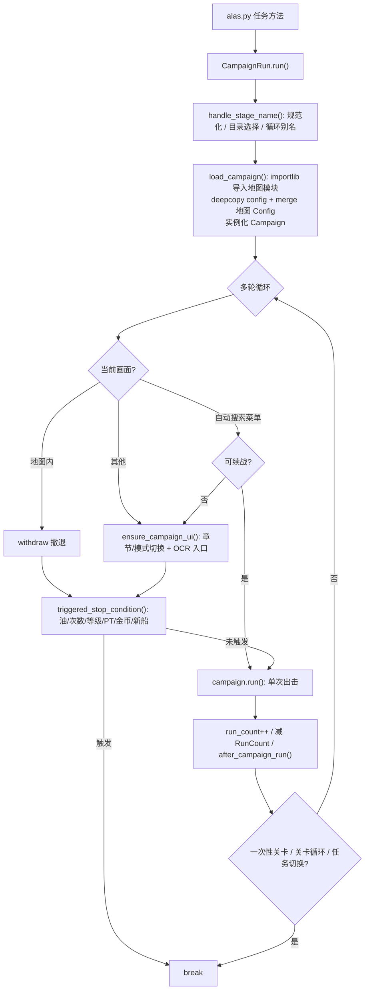
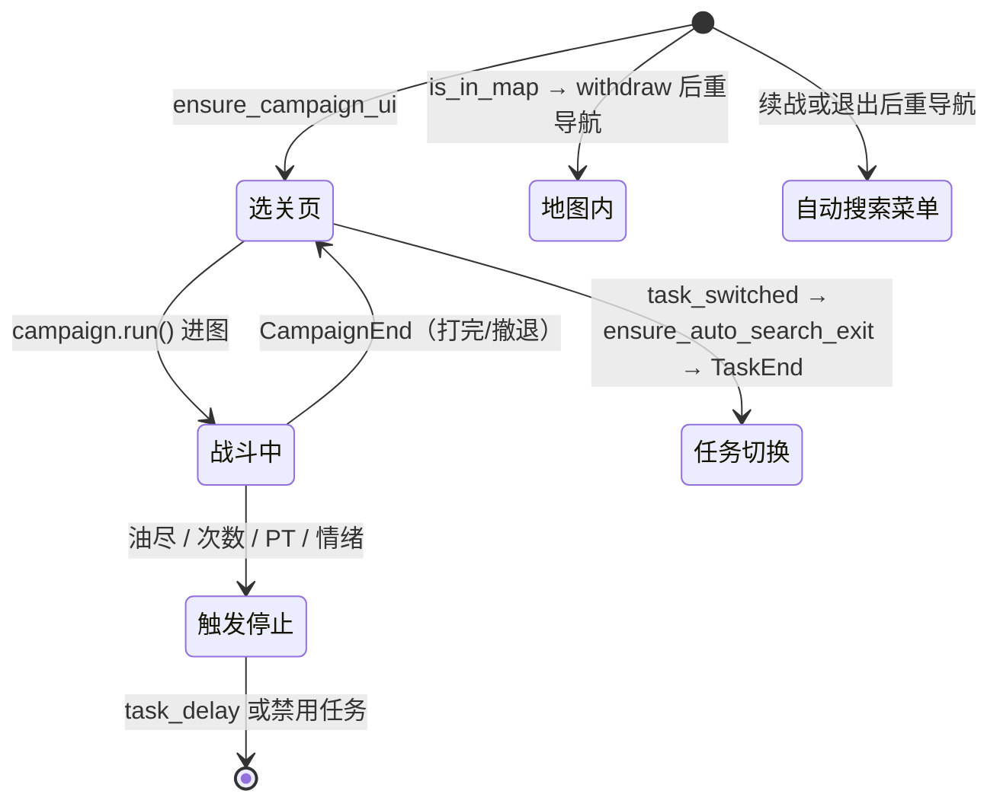

# 战役执行（module/campaign 与 campaign/）

> 碧蓝航线出击类任务的编排层：把用户配置里的「打哪个关卡、打到什么程度」翻译成「导航到关卡页 → 动态加载地图定义 → 循环出击 → 判定停止条件」，并托管全部活动的地图定义文件。

## 1. 模块概述

「战役执行」覆盖两处代码：`module/campaign/` 是执行框架，`campaign/` 是被框架加载的地图定义仓库。框架解决的问题是——游戏里所有出击玩法（主线、活动、作战档案、SOS、困难、钻石打捞）共享同一套交互骨架（选关页 → 准备界面 → 棋盘地图 → 战斗 → 结算），但每个关卡的地图布局与作战策略各不相同。框架把这个骨架沉淀为继承链，把「每张地图不同的部分」外置成 `campaign/` 下的独立 Python 文件，两者通过 `importlib` 动态导入拼接。

**地图定义是 Python 文件，不是 YAML**。每个活动目录里是一个关一个文件（`a1.py`、`sp.py`、`campaign_7_2.py`），文件同时包含网格数据（`MAP` 对象）、地图机制配置（`Config` 类）与战斗逻辑（`Campaign` 类的 `battle_N` 策略函数）。这样设计的原因：作战策略本质是代码（按战斗进度决定清谁、绕谁、打 Boss），YAML 表达不了；而数据与逻辑同文件让活动适配变成「复制一个相近活动的目录再改」，无需理解框架内部。

编排分两层，职责严格分开：

- `CampaignBase`（单次出击）：拿到 `ENTRANCE` 按钮后进入地图、初始化网格、按 `battle_count` 分发战斗函数，直到 `CampaignEnd`。
- `CampaignRun`（多轮任务）：决定打哪个文件、循环多少轮、何时停（石油/次数/等级/PT 等）。每轮调用一次 `CampaignBase.run()`。

`os_run.py`（`OSCampaignRun`）是特例：它不执行棋盘战役，而是大世界任务在调度器一侧的「方法宿主」——14 个 `opsi_*` 方法统一套上行动力守卫后，把实际工作委托给 `module/os` 的 `OperationSiren`。

## 2. 模块职责

### 负责

- 关卡名规范化：用户输入（`7-2`、`D3`、`TH1`）到地图文件名（`campaign_7_2`、`d3`）的转换，活动专属别名（`stage_name.py`）。
- 关卡选择页导航：章节切换、普通/困难/EX 模式切换、多代活动 UI 适配（20241219、20260326 布局）。
- 关卡入口识别：模板定位 + OCR 读关卡名，建立「关卡名 → 入口按钮」映射。
- 地图模块动态加载与实例化，地图 `Config` 合并进任务配置。
- 单次出击编排：进图、地图初始化、战斗函数分发、撤退、自动搜索续战。
- 多轮循环与停止条件：次数、等级、石油、金币、活动 PT、新舰船、任务均衡器、活动时间。
- 活动生命周期：活动结束自动禁用任务、GemsFarming 回退 2-4、突袭/活动互斥禁用、委托通知中断。
- 钻石打捞（GemsFarming）与 1-1 伏击（Ambush11）两个专用任务的换船/装备码/情绪控制。
- 大世界任务的调度入口聚合（`OSCampaignRun`）。

### 不负责

- 棋盘上的寻路与清敌决策——属于地图系统（见 [地图系统](map.md)），`CampaignBase` 继承 `Map` 复用其 `clear_*` 策略。
- 战斗内部的自动/手动操作、结算、血量平衡——属于战斗系统（见 [战斗系统](combat.md)）。
- 大世界海域内的具体任务逻辑——实现在 `module/os/tasks/`（见 [大世界核心](os/index.md)），本模块只做入口聚合。
- 退役/强化的完整流程——`GemsFarming` 继承 `Retirement` 复用（见 [退役与装备](game/retire-equipment.md)）。
- 通用弹窗、信息条处理——属于处理器层（见 [处理器层](handler.md)）。
- 按钮/模板图片资源——由 `dev_tools.button_extract` 生成，本模块只引用 `assets.py`。

## 3. 模块位置

```
module/campaign/
├── run.py               # CampaignRun：任务级多轮编排（选关、加载、停止条件）
├── campaign_base.py     # CampaignBase：单次出击执行与战斗策略分发
├── campaign_ui.py       # CampaignUI：章节/模式导航、入口获取、活动 UI 适配
├── campaign_ocr.py      # CampaignOcr：关卡入口模板匹配 + 关卡名 OCR
├── campaign_status.py   # CampaignStatus：石油/金币/PT 数值 OCR
├── campaign_event.py    # CampaignEvent：活动生命周期管理与页面路由
├── stage_name.py        # 关卡名的纯转换规则（不触碰配置与文件系统）
├── fleet_selection.py   # FleetSelectionMixin：低耗任务共用的选船交互
├── gems_farming.py      # GemsFarming：紧急委托钻石打捞任务
├── ambush_1_1.py        # Ambush11：1-1 伏击刷关任务
├── os_run.py            # OSCampaignRun：大世界任务的方法宿主
└── assets.py            # 战役界面按钮/模板（生成产物，勿手改）

campaign/                # 地图定义仓库（约 136 项，截至 2026-09）
├── Readme.md            # 活动登记表，config_updater 据此生成 Campaign.Event 选项
├── campaign_main/       # 主线 1-1 ~ 16-4，含章级共享基类 campaign_14_base 等
├── campaign_hard/       # 困难模式（campaign_hard.py + 12-4 / 14-4）
├── campaign_sos/        # SOS 潜艇图（campaign_3_5 ~ campaign_10_5）
├── campaign_war_archives/  # 作战档案共享基类
├── event_YYYYMMDD_cn/   # 每期活动一个目录（约 83 个）
└── war_archives_YYYYMMDD_cn/  # 档案收录的复刻活动地图（约 48 个）
```

一个活动目录的典型内容（以 `campaign/event_20260908_cn/` 为例）：`a1.py`…`d3.py` 每关一个文件、`sp.py` 特殊关、`d3_3.py` 变体关（复用 `d3` 的地图与刷新表、覆写战斗策略）、`campaign_base.py` 该活动共享的基类微调。

## 4. 核心入口

| 入口 | 用途 |
| --- | --- |
| `alas.py` 的 `main/main2/main3/event/event2/event3/c72_mystery_farming/c122_medium_leveling/c124_large_leveling` | 直接构造 `CampaignRun` 并调用 `run(name, folder, mode)`，配置项区分具体战役 |
| `GemsFarming.run()` / `Ambush11.run()` | 钻石打捞与 1-1 伏击任务入口（`alas.py` 的 `gems_farming`、`three_oil_low_cost`、`ambush11`） |
| `module/event/base.py` 的 `EventBase(CampaignRun)` | 活动日常（`EventA`~`EventD` → `CampaignABCD`）与每日 SP（`CampaignSP`）的基类 |
| `module/hard/hard.py` `CampaignHard`、`module/sos/sos.py` `CampaignSos`、`module/war_archives` `CampaignWarArchives`、`module/handover` `OperationHandover` | 继承 `CampaignRun` 的专项任务 |
| `OSCampaignRun.opsi_*()`（14 个方法） | `alas.py` 中 `opsi_explore`、`opsi_shop` 等大世界任务的转发入口 |
| `campaign/{folder}/{name}.py` 的 `MAP` / `Config` / `Campaign` | 地图文件三方接口，`load_campaign()` 消费 |

追代码建议从 `CampaignRun.run()`（module/campaign/run.py）开始：它一次串起关卡名处理、动态加载、UI 导航与停止条件，是理解本模块的枢纽。

## 5. 核心组件

### 继承关系（MRO 简图）

```
ModuleBase
└── CampaignStatus(UI)                  # 资源 OCR
    └── CampaignEvent                   # 活动生命周期
        └── CampaignUI(MapOperation, CampaignEvent, CampaignOcr)   # 选关页导航
            └── CampaignBase(CampaignUI, Map, AutoSearchCombat)    # 单次出击
                └── 地图文件中的 Campaign 子类（每关一个）

CampaignEvent + ShopStatus
└── CampaignRun                         # 多轮任务编排
    ├── GemsFarming(FleetSelectionMixin, CampaignRun, FleetEquipment, …, Retirement)
    ├── Ambush11(FleetSelectionMixin, CampaignRun, FleetEquipment, Retirement)
    ├── CampaignHard / CampaignSos / CampaignWarArchives / EventBase / OperationHandover

OSMapOperation
└── OSCampaignRun                       # 大世界方法宿主
```

这是历史演进的深继承链：每一层只加一类职责（状态 OCR → 活动管理 → 选关 UI → 出击执行 → 多轮任务），代价是必须靠 MRO 才能确定 `self.xxx` 落在哪层。

### 关键类

| 类 | 职责 |
| --- | --- |
| `CampaignBase` | 单次出击：`run()` 进图 → `map_init` → 最多 20 场 `execute_a_battle()`；`battle_function()` 三种 `@Config.when` 变体（数据不足 / 全清 / 标准）；`AUTO_SEARCH_WITHDRAW` 支持自律寻敌中撤退 |
| `CampaignUI` | `ensure_campaign_ui()` 把 UI 收敛到目标关卡页并设置 `ENTRANCE`；`campaign_set_chapter()` 按主线 → 20260326 → 20241219 → 普通 event → SP 的优先级尝试路由；模块级 `MODE_SWITCH_*` / `ASIDE_SWITCH_*` 开关单例 |
| `CampaignOcr` | `campaign_match_multi()` 用通关图标模板定位所有入口，OCR 读取关卡名；`_campaign_separate_name()` 拆分章节与序号；多数票决定 `campaign_chapter` |
| `CampaignStatus` | `get_oil()` / `get_coin()` / `get_event_pt()` OCR，写入 `LogRes` 仪表盘；JP 服数字颜色不同、PT 需要反色预处理（`PtOcr`） |
| `CampaignEvent` | 活动结束 `_disable_tasks()`（cross_set 联动禁用 + GemsFarming 回退 2-4）、PT/时间限制、任务均衡器、`ui_goto_event/sp/coalition` 路由与活动可用性检查、突袭/活动互斥 |
| `CampaignRun` | `handle_stage_name()` 关卡名流水线 → `load_campaign()` 动态导入 → 多轮循环与九类停止条件 |
| `GemsFarming` / `Ambush11` | 在 `load_campaign()` 里动态构造 `GemsCampaign(覆写类, module.Campaign)`，注入专用情绪管理与低情绪撤退 |
| `FleetSelectionMixin` | 低耗任务共用的船坞选船：普通稀有度 CV/DD 模板匹配、`ShipScanner` 等级/情绪/编队过滤、困难模式换用准备界面按钮 |
| `OSCampaignRun` | 大世界任务入口：每个 `opsi_*` = 行动力溢出守卫 + 调用 `OperationSiren` 对应方法 + `ActionPointLimit` 延迟策略 |

### 地图文件的三方接口

每个 `campaign/**/*.py` 必须提供三个模块级名字，`load_campaign()` 逐一消费：

| 名字 | 类型 | 用途 |
| --- | --- | --- |
| `MAP` | `CampaignMap` | 网格数据：`shape`、`map_data`（格子符号）、`weight_data`（寻路权重）、`spawn_data`（每战刷新表）、`camera_data` |
| `Config` | class | 地图机制配置（`MAP_HAS_SIREN`、`STAGE_ENTRANCE`、`MAP_CHAPTER_SWITCH_20241219` 等），经 `config.merge(Config())` 覆盖任务配置 |
| `Campaign` | class | 继承 `CampaignBase` 的战斗策略：`battle_0`…`battle_N` 按 `battle_count` 查表，未定义的场次回退 `battle_default()` |

`map_data` 的格子符号（`module/map_detection/grid_info.py` 的 `decode()`）：`--` 海洋、`++` 陆地、`__` 潜艇点、`SP` 舰队出生点、`ME`（大小写等价）敌人、`MB` Boss、`MM` 神秘、`MA` 弹药、`MS` 塞壬。

## 6. 工作流程

### 双层循环



`CampaignBase.run()`（单次出击内部）再套一层：`map_get_info` 读通关信息 → `enter_map` → 普通模式 `map_init`（锁定舰队、初始化网格）或自动搜索模式直接重置计数 → 最多 20 场战斗循环。每场的战斗函数按配置在三个实现中选择：

- 标准模式：按 `battle_count` 从 `battle_N` 向下查找到 `battle_0`，都没有则 `battle_default()`（清任意敌人）。地图文件靠定义不同 `battle_N` 覆写特定场次（如 `battle_3` 打 Boss）。
- 全清模式（`MAP_CLEAR_ALL_THIS_TIME`）：清光敌人/塞壬/要塞后才打 Boss。
- 数据不足模式（`POOR_MAP_DATA`）：优先 Boss，其次塞壬、普通敌人。

### 关卡名流水线（handle_stage_name）

```
用户输入 'TH1' / '7-2' / 'd3-3'
  → to_map_file_name()            # 'campaign_7_2'、'th1'
  → _select_stage_folder()        # GemsFarming/ThreeOilLowCost 按关卡名自动选主线或活动目录
  → d3-3 别名检查                 # 目录里存在 d3_3.py 才启用三战撤退逻辑
  → normalize_event_stage()       # stage_name.py：活动 SP 别名、A1→T1、a1→t1 等
  → 特殊章节强制约束               # 限时图强制 threat_safe / 覆写石油与情绪
  → STAGE_LOOP_ALIAS 循环选择      # 'TH' → TH1..TH5 按剩余次数取模轮换
  → hard 模式目录切换              # campaign_main → campaign_hard（需同名文件存在）
  → normalize_post_loop_stage()   # 循环后才生效的别名
```

`stage_name.py` 刻意做成不访问配置与文件系统的纯函数，便于离线单测；`T_CHAPTER_FOLDERS` 等「哪些活动接受 A1 作为 T1 别名」的清单以集合维护，新活动复用旧命名时在此登记。

### 大世界入口聚合（os_run.py）

`OSCampaignRun` 自身不实现任何游戏操作。每个 `opsi_*` 方法都是同一模板：

```
opsi_shop():
  _run_opsi_task_with_ap_overflow_guard(lambda c: c.os_shop())
  ↓ 守卫内部
  临时 cross_set 关闭 OpsiPreventActionPointOverflow 任务
  campaign = load_campaign()   # merge OSConfig + os_init()
  runner(campaign)
  finally 恢复防溢出任务调度
  ↓ 异常路径
  ActionPointLimit → delay_opsi_tasks_after_ap_limit() → opsi_task_delay()
```

关闭防溢出任务的原因：普通大世界任务运行时行动力会被消耗，防溢出任务此时插入调度没有意义且可能冲突；结束后按实际状态重新排程。个别方法有专属分支：`opsi_meowfficer_farming` 行动力不足时按「距重置是否不足一天」分流到次日或 2.5 小时；`opsi_scheduling` 须在 `os_init()` 前拦截（否则会先执行一次自律寻敌）；`opsi_month_boss` 在 TW 服直接停用。

## 7. 调用关系

### 上游

| 模块 | 关系 |
| --- | --- |
| `alas.py` | 所有出击任务的 `def main()`、`def event()`、`def gems_farming()`、`def opsi_*()` 等方法在此构造运行器并调用 `run()` |
| `module/event` | `EventBase` 继承 `CampaignRun`；`CampaignABCD`/`CampaignSP` 复用其循环，外层再套「每日一关」调度 |
| `module/hard`、`module/sos`、`module/war_archives`、`module/handover` | 继承 `CampaignRun`（部分同时继承 `CampaignBase`）叠加专项逻辑 |
| `module/raid`、`module/coalition`、`module/event_hospital`、`module/event/maritime_escort` | 只继承 `CampaignEvent` 复用活动管理与停止条件，不加载 `campaign/` 地图 |
| `module/config` | 提供配置、`override`、`task_delay`/`task_call`/`task_stop` 调度原语 |

### 下游

| 模块 | 用途 |
| --- | --- |
| `campaign/` 地图文件 | `importlib.import_module` 动态加载 `MAP`/`Config`/`Campaign` |
| `module/map` | `Map`/`MapOperation` 提供寻路、清敌、进图、撤退 |
| `module/combat` | 战斗执行与 `AutoSearchCombat` 自动搜索战斗 |
| `module/ui` | 页面导航（`ui_goto_campaign/event/sp`）、`Switch` 模式切换 |
| `module/ocr` | 关卡名、石油/金币/PT 数字识别 |
| `module/retire`、`module/equipment` | GemsFarming 的退役换船、装备码装卸 |
| `module/shop` | `ShopStatus.status_get_gems()` 读取钻石余额 |
| `module/os` | `OperationSiren` 与 `module/os/tasks/*` 承接大世界实际逻辑 |
| `module/notify`、`module/log_res` | 停止条件触发的推送通知、资源数值落仪表盘 |

## 8. 数据流

```
用户配置 (Campaign.Name / StopCondition.* / GemsFarming.*)
        │  handle_stage_name 流水线
        ▼
地图文件名 (folder + name) ──importlib──► module.MAP / module.Config / module.Campaign
                                              │
                        config.deepcopy().merge(Config()) → campaign 专属配置
                                              │
       截图 ──► CampaignOcr（模板定位 + OCR 关卡名）──► stage_entrance / ENTRANCE
                                              │
                       CampaignBase.run() ──► Map 寻路/清敌 ──► Combat 战斗
                                              │
       截图 ──► CampaignStatus（油/金币/PT OCR）──► LogRes ──► Dashboard 配置项
                                              │
              triggered_stop_condition() ──► task_delay / task_stop / 推送通知
```

两个方向的配置写入值得注意：向外，`_disable_tasks()` 用 `cross_set` 修改**其他任务**的开关（活动结束联动）；向内，`load_campaign` 对 `self.config` 做深拷贝再合并地图 `Config`，用户配置文件不被地图配置污染。

## 9. 状态模型

`CampaignRun.run()` 每轮开始时先识别 UI 所处状态再决定动作，这是恢复能力的关键——调度器可能在任意界面接管（上次任务死在地图里、掉线重启等）：



状态识别与动作的对应关系：`is_in_map()`（地图内）先撤退；`is_in_auto_search_menu()` 且满足续战条件（已打过至少一轮 + 无地图成就要求）可跳过导航直接继续，否则退出菜单重走导航。`handle_stage_name` 的 `is_stage_loop` 有意不做复位——它描述的是本次运行器实例的固有属性，而非瞬时状态。

## 10. 配置

配置路径 `<Task>.<Group>.<Argument>`，代码经 `self.config.Group_Argument` 访问；地图文件的 `Config` 类在 `load_campaign` 时合并进深拷贝的配置副本。

| 配置 | 类型 | 默认值 | 说明 |
| --- | --- | --- | --- |
| `Campaign.Name` | str | `12-4` | 关卡名，用户输入格式 |
| `Campaign.Event` | option | `campaign_main` | 活动目录，选项由 `config_updater` 从 `campaign/Readme.md` 生成（按服务器区分） |
| `Campaign.Mode` | option | `normal` | normal / hard；hard 时掉落记录目录加 `_hard` 后缀 |
| `Campaign.UseAutoSearch` | bool | `true` | 自动搜索模式，决定 `CampaignBase.run()` 走哪条战斗路径 |
| `Campaign.UseClearMode` | bool | `true` | 通关模式（快进），影响 `map_data_loop` 加载 |
| `Campaign.DefeatWithdraw` | option | `withdraw_stop` | 战败处理：继续 / 换队 / 停止（`ScriptEnd` → 禁用任务） |
| `StopCondition.RunCount` | int | 0 | 每轮递减，归零触发停止并可禁用调度 |
| `StopCondition.OilLimit` / `OilLimitHardFloor` | int | 1000 / 500 | 实际阈值取两者较大值（#444 的低耗安全网） |
| `StopCondition.MapAchievement` | option | `non_stop` | 连打 / 全清 / 100% / 三星 / 威胁安全 |
| `StopCondition.ReachLevel` / `GetNewShip` / `CoinLimit` | 混合 | 0/false | 等级、新舰船、金币上限停止条件 |
| `EventGeneral.PtLimit` / `TimeLimit` | 混合 | 0 / 默认时间 | 活动 PT 与活动结束时间，超限联动 `_disable_tasks` |
| `TaskBalancer.Enable` / `CoinLimit` / `TaskCall` | 混合 | false / 10000 / Main | 金币不足时切换到指定任务 |
| `GemsFarming.*` | 混合 | — | 换旗舰/先锋、普通船筛选、装备码、情绪策略、先锋等级区间 |
| `Emotion.Mode` / `Fleet1Value` 等 | 混合 | — | 心情计算模式与各舰队心情记录 |

关键关联：`GemsFarming`/`ThreeOilLowCost` 共用同一组 `GemsFarming.*` 参数；`StopCondition_MapAchievement` 与 `can_use_auto_search_continue()` 联动（非 `non_stop` 时禁用续战，因为自动搜索菜单里读不到地图信息）；活动类配置 `MAP_CHAPTER_SWITCH_*`、`STAGE_ENTRANCE` 由地图文件 `Config` 注入而非用户设置。

## 11. 异常与错误处理

| 异常 | 原因 | 处理 |
| --- | --- | --- |
| `CampaignEnd` | 战役正常结束（胜利、撤退、情绪控制） | `CampaignBase.run()` 捕获后返回；GemsFarming 据消息文本分流换船流程 |
| `MapEnemyMoved` | 敌人移动导致路径失效 | `execute_a_battle()` 内最多重试 10 次，`battle_count` 已推进则视为成功 |
| `CampaignNameError` | OCR 未识别出关卡 / 模式切换时出现撤退按钮 | `ensure_campaign_ui()` 循环重试至 5 秒超时 |
| `ScriptEnd('Campaign name error')` | 重试后仍找不到关卡 | 上抛终止任务；`CampaignABCD` 会提示改用 Event 任务解锁 |
| `ScriptError` | 战斗函数耗尽 / 未执行任何战斗 | `Error_HandleError` 开启时撤退自保，否则上抛 |
| `ModuleNotFoundError`（load_campaign） | 地图文件不存在（未适配或目录错误） | 记录现有文件列表后 `RequestHumanTakeover`（人工接管） |
| `RequestHumanTakeover` | 装备码导出/应用失败、困难条件不足等 | 上抛终止，防止装备状态丢失等不可逆后果 |
| `HardNotSatisfied` | 困难模式条件不满足 | GemsFarming 捕获后换船重试，二次失败转 `GameStuckError` |
| `ActionPointLimit` | 大世界行动力不足 | 各 `opsi_*` 捕获后按任务语义延迟（次日刷新 / 定长分钟） |
| `TaskEnd` | `task_stop()` 抛出 | 上层调度器捕获，属正常任务切换 |

自动恢复与终止的边界：情绪 bug（客户端长时间运行心情计算错误）触发 `task_call('Restart')` 重启游戏而非停止任务；委托通知则调用 `task_call('Commission')` 后停止当前任务。设备层的 `GameStuckError` / `GameTooManyClickError` 由 `module/device` 统一恢复，本模块不吞异常。

## 12. 并发与线程模型

战役执行整体运行在调度器单线程内，无内部锁与队列。需要留意的跨线程接触点：

- `self.config` 可能被 WebUI 热重载并发修改；`task_switched()` 每轮内部调用 `config.load()` 重读文件，写操作走 `multi_set()` 原子保存。因此循环内对配置的判断都应在读取后立即使用，不长期缓存。
- `MODE_SWITCH_*`、`ASIDE_SWITCH_*` 是**模块级单例**，所有战役实例共享；`campaign_set_chapter_20241219` 的 SPEX 分支临时改 `offset` 后在 `finally` 恢复，就是为避免污染共享状态。
- `GemsFarming._initial_flagship_check_done`、`Ambush11._initial_flagship_check_done` 用**类属性**做进程内持久化：任务实例与配置实例会随调度重建，类属性在进程存活期内不变，保证「初始旗舰等级检查」只执行一次。
- `OSCampaignRun._run_opsi_task_with_ap_overflow_guard` 用 `cross_set` + `finally` 保证「关闭防溢出任务 → 运行 → 恢复调度」在异常路径下也不泄漏。

## 13. 缓存与持久化

- `stage_entrance` 字典：每次 `_get_stage_name()` 整体重建，不跨截图缓存；`_stage_image` / `_stage_image_gray` 是 `cached_property`，OCR 前后用 `del_cached_property` 显式失效。
- `_map_battle`（Boss 前战斗数）为 `cached_property`，随每次 `load_campaign` 新建的 campaign 实例自然失效。
- 用户配置中的持久化状态：`EventDaily_LastStage`（活动日常断点续刷）、`WarArchives_DailyRunCountRemain/Record`（档案每日额度，跨天按服务器刷新时间重置）、`Emotion.Fleet1Value` 等心情记录、`Dashboard.*`（`LogRes` 写入的油/金币/PT 快照）。
- `@Config.when` 装饰器把方法变体登记在类级 `func_list`，实例化时不重复解析；`POOR_MAP_DATA` 等开关在运行中变化不会重新绑定，需要重载配置才能生效（依赖此语义的代码在 `map_get_info` 等处有注释说明）。

## 14. 生命周期

1. **创建**：`alas.py` 任务方法构造 `CampaignRun(config, device)`，全部能力经继承链就位，无单独初始化。
2. **加载**：`load_campaign()` 若关卡名未变则直接复用；否则 `importlib.import_module` 加载地图模块（进程内缓存），深拷贝配置合并地图 `Config`，实例化 `module.Campaign`。GemsFarming/Ambush11 在此步骤动态构造覆写子类替换实例。
3. **运行**：`run()` 的多轮循环；每轮先做 UI 状态恢复，再出击，再判停止条件。地图模块类对象进程内缓存，实例随关卡切换重建。
4. **收尾**：`ensure_auto_search_exit()` 保证退出自动搜索菜单后任务结束；`config.update()` 把仪表盘与计数写回；实例整体丢弃，无显式销毁。

## 15. 扩展方式（活动适配）

新活动适配的标准流程（详见 `campaign/Readme.md` 与 [地图系统](map.md) 的地图文件构造说明）：

1. **复制相近活动**：从结构最接近的 `event_*` 目录复制，逐关修改 `MAP` 网格/权重/刷新表、`Config` 机制开关、`Campaign` 策略函数；活动级共享调整放该目录的 `campaign_base.py`。
2. **登记 Readme.md**：在 `campaign/Readme.md` 表格加一行（Aired Date | Directory | Event Name | CN/EN/JP/TW），复用旧地图的活动也必须登记（目录名可与首播日期不同）。
3. **生成配置**：运行 `uv run -m module.config.config_updater`，为 `Campaign.Event` 生成各服务器选项与 i18n 键，随后补齐 `zh-CN`/`zh-MIAO`/`en-US`/`ja-JP`/`zh-TW` 翻译。
4. **资源**：活动专属按钮/PT 图标经 `uv run -m dev_tools.button_extract` 提取进 `assets/{server}/campaign/`。
5. **特殊 UI**（按需）：新章节侧边栏布局在 `campaign_ui.py` 加 `ASIDE_SWITCH_YYYYMMDD` 与 `campaign_set_chapter_*` 分支；新关卡名别名（如 `vsp`→`sp`）加进 `stage_name.py` 的别名字典；无「威胁：安全」指示器的活动在 `_apply_event_achievement_fallback` 处理。

新增一类**任务**（而非活动）时：继承 `CampaignRun`（需要棋盘执行再加 `CampaignBase`），覆写 `run()` 或 `triggered_stop_condition()`，在 `alas.py` 加同名方法并在 `module/config/argument/` 登记任务与参数。

## 16. 修改注意事项

- **不要把地图定义改成数据文件**。`battle_N` 是策略代码，与网格数据同文件是刻意设计；`Config` 类里「generated config」标记段由 `dev_tools/map_extractor.py` 生成，手工修改会被覆盖。
- **`d3_3` 特殊别名**：UI 导航用 `d3` 的入口，逻辑加载 `d3_3.py`；该别名只在目录里确实存在 `d3_3.py` 时启用。改名或挪目录会同时影响 `campaign_get_entrance` 与 `handle_stage_name` 两处。
- **`AUTO_SEARCH_WITHDRAW`**：自律寻敌运行中撤退按钮被开关替换，普通 `withdraw()` 会卡死（#275），故三战撤退图需置 `AUTO_SEARCH_WITHDRAW = True` 走 `auto_search_withdraw()`。普通地图保持 `False`，否则 Boss 战败会被误撤退。
- **活动结束联动会写别人的配置**：`_disable_tasks()` 修改同活动全部任务的 `Scheduler.Enable` 与心情温泉开关，并把 GemsFarming 重置回 2-4。调整禁用逻辑时必须同时检查 `_reset_gems_farming` 的回退目标。
- **override 的可见性**：`config.override()` 作用于运行时副本；同键重复覆盖会更新值而非报错，作战档案的开荒策略切换依赖这一语义。反过来，依赖 `len(config.modified)` 判断「有修改需保存」的代码会被额外 override 干扰。
- **停止条件的 `oil_check` 参数**：自动搜索菜单里读不到石油（OCR 区域被遮挡），循环里两处 `triggered_stop_condition` 分别传 `not is_in_auto_search_menu()` 与 `False`，调整判断顺序时勿破坏该语义。
- **JP 服与 EN 服的识别差异**集中在 `_get_num()`（数字颜色/遮罩）与 `campaign_extract_name_image`（`@Config.when(SERVER='en')` 的独立实现），改识别参数需四服同查。

## 17. 已知限制

- `alas.py` 的 `opsi_daily_delay()` 调用 `OSCampaignRun.opsi_daily_delay()`，但 `OSCampaignRun` 并无此方法，运行时会抛 `AttributeError`（代码缺陷，见仓库 issue 记录；本文档按实际源码记录）。
- 突袭（Raid）、联动（Coalition）等活动在 `campaign/Readme.md` 登记，但仓库没有对应的 `raid_*`/`coalition_*` 地图目录——它们不使用棋盘地图，`Campaign.Event` 选项仅用于界面与 OCR 参数选择。
- `MODE_SWITCH_20241219` 的 SPEX 分支内有一段重复的 `ex_sp` 处理（`campaign_set_chapter_20241219` 尾部两个相同 if），功能无害但属冗余代码。
- 活动特殊行为以硬编码目录名散布在 `run.py`（限时图强制配置、任务均衡器例外）与 `stage_name.py`（别名字典），新增活动若踩中同类特殊情况需要逐处登记，缺少集中式声明。

## 18. 示例

一个最小可用的地图文件（摘自 `campaign/event_20260908_cn/a1.py`，省略权重与格子解包）：

```python
from module.campaign.campaign_base import CampaignBase
from module.map.map_base import CampaignMap

MAP = CampaignMap('A1')
MAP.shape = 'I8'                       # 9 列 8 行
MAP.camera_data = ['D2', 'D6']         # 相机驻留点
MAP.map_data = """
    -- Me -- SP -- SP -- Me --        # SP 出生点 / Me 敌人格 / ++ 陆地
    ...
"""
MAP.spawn_data = [                      # 每战开始时的刷新表
    {'battle': 0, 'enemy': 2, 'siren': 1},
    {'battle': 3, 'enemy': 1, 'boss': 1},
]

class Config:
    MAP_HAS_SIREN = True               # 机制开关（部分由工具生成）
    MAP_CHAPTER_SWITCH_20241219 = True # 活动页使用 20241219 布局

class Campaign(CampaignBase):
    MAP = MAP
    ENEMY_FILTER = '1L > 1M > 1E > 1C > ...'

    def battle_0(self):                # 前 3 战清塞壬与按过滤器清敌
        if self.clear_siren():
            return True
        if self.clear_filter_enemy(self.ENEMY_FILTER, preserve=0):
            return True
        return self.battle_default()

    def battle_3(self):                # 第 4 战打 Boss
        return self.clear_boss()
```

调用侧（`alas.py` 中每个出击任务都是这一行）：

```python
CampaignRun(config=self.config, device=self.device).run(
    name=self.config.Campaign_Name,     # 'a1'
    folder=self.config.Campaign_Event,  # 'event_20260908_cn'
    mode=self.config.Campaign_Mode)
```

## 19. 调试方法

- **日志骨架**：`logger.hr(name, level=1)` 标记每轮出击；`[战役-运行]`（多轮）、`[战役-基础]`（单次出击、使用的战斗函数）、`[战役-OCR]`（入口识别）、`[Map_info]`（通关百分比与星级）、`章节`/`关卡`（OCR 结果 attr）。资源数值同步记录在配置 `Dashboard.*`。
- **地图文件未找到**：`load_campaign` 会打印目录下现有文件，先确认 `Campaign.Event` 与文件名（大小写、`-`/`_`）一致，再确认活动已适配。
- **Campaign name error**：`ensure_campaign_ui` 超时通常是入口识别失败。检查 `config_manual.py` 的 `STAGE_ENTRANCE`（normal/blue/half/20240725）是否覆盖当前活动的入口图标样式，以及 `MAP_CHAPTER_SWITCH_*` 是否需要为该活动开启。
- **离线验证**：用 `assets/{server}/campaign/` 的既有截图配合模板匹配回放入口识别；`stage_name.py` 是纯函数可直接单测。
- **停止条件排查**：循环里每次判定都有 `logger.hr('触发停止条件: ...')` 与对应 `logger.attr`（活动PT、物资限制等），配合 `LogRes` 写入的 `Dashboard` 数值可回溯是哪个条件触发。

## 20. 相关模块

- [战斗系统](combat.md) —— `Combat` 与 `AutoSearchCombat` 执行每一场战斗，情绪控制在战斗准备时介入
- [地图系统](map.md) —— `Map`/`Fleet`/`Camera` 寻路清敌，地图文件 `MAP` 对象的定义规范
- [大世界核心](os/index.md) —— `OSCampaignRun` 转发的任务实现在 `module/os/tasks/`
- [退役与装备](game/retire-equipment.md) —— GemsFarming 换船依赖的 `Retirement` 与装备码
- [调度器（alas.py）](entry/alas.md) —— 所有战役任务的方法入口与调度上下文
- [配置系统](config.md) —— `override`、`cross_set`、`task_delay`/`task_call` 的语义
- [处理器层](handler.md) —— 快进/成就判定（`FastForwardHandler`）、自动搜索菜单处理
- [OCR 系统](ocr.md) —— `Ocr`/`Digit` 底层与 `PtOcr` 预处理
