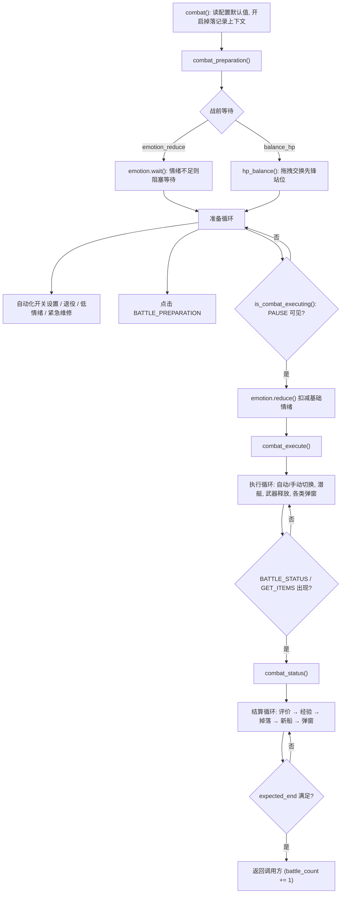
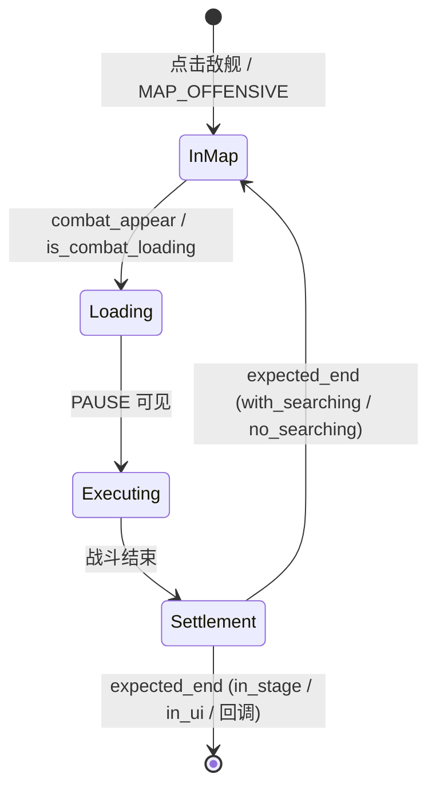

# 战斗系统 module/combat

> 模块化组合出的「单场战斗」执行器：从出击准备、自动/手动战斗、潜艇调度到结算与掉落记录，并以纯时间模型管理情绪、以颜色识别管理血量。

## 1. 模块概述

`module/combat` 回答的问题是：当几十个上层任务（主线、活动、大世界、演习、每日、raid、大舰队战……）都需要「打一场战斗」时，如何把这场战斗拆成可复用、可独立验证的能力，而不是一个几千行的上帝类。

答案是**职责 mixin 组合**。`Combat` 主类通过多重继承把七个正交能力拼在一起：

- `Level`——等级 OCR 与等级停止条件；
- `HPBalancer`——血量读取、战前换位、低血量撤退判断；
- `Retirement`——船坞满时的退役/强化（继承自 `module/retire`）；
- `SubmarineCall`——战斗内的潜艇呼叫；
- `CombatAuto`——自动/手动模式检测与切换；
- `CombatManual`——手动模式下的预设走位；
- `AutoSearchHandler`——自律寻敌状态检测（继承自 `module/handler`）。

每个 mixin 只处理战斗的一个切面，各自只依赖 `ModuleBase` 提供的截图/点击/识别原语，因此可以单独实例化测试（潜艇进阶规则 `SubmarineAdvancedConfig` 即有独立单测 `tests/test_submarine_advanced.py`）。`Combat` 本体只保留**编排**职责：把「准备 → 执行 → 结算」三个阶段串起来，并在正确的时机调用各 mixin 的处理器。这种设计让大世界战斗（`module/os_combat`）可以重写 `combat_appear()` 但复用全部结算逻辑，让演习模块只借用 `combat_ui` 资源而不引入整个战斗流程，让潜艇规则引擎可以脱离屏幕操作单独跑测试。

模块支持两种并存的战斗范式：

| 范式 | 载体 | 特点 |
| --- | --- | --- |
| 手动地图战斗 | `Combat` 本体，由地图层 `Fleet._goto()` 调用 | 脚本控制走位与选择目标，战斗内控制自动/手动模式、潜艇、武器释放 |
| 自律寻敌（自动搜索） | `AutoSearchCombat`，由 `CampaignBase` 驱动 | 游戏自己移动舰队与开战，脚本只负责弹窗、结算、情绪与撤退决策 |

情绪（`Emotion`）与血量（`HPBalancer`）是横切这两种范式的两个资源模型：情绪决定「能不能打、要不要等」，血量决定「要不要换位、要不要撤退」。

## 2. 模块职责

### 负责

- 完整单场战斗的编排：`combat()`（准备 → 执行 → 结算）及其自动搜索变体 `auto_search_combat()`。
- 战斗画面识别：战斗准备页、加载进度条、二十余种暂停按钮皮肤、十余种退出按钮皮肤。
- 自动/手动模式切换（`CombatAuto`）与手动模式的三个预设走位（`CombatManual`）。
- 战斗内潜艇呼叫（`SubmarineCall`）与进阶潜艇出击规则引擎（`submarine_advanced.py`）。
- 情绪的纯时间模型：恢复计算、战前等待、战后扣减、沉船惩罚、红脸保底、客户端情绪 bug 触发重启（`emotion.py`，同时通过 `ModuleBase.emotion` 服务于全部模块）。
- 血量读取与平衡：HP 条颜色分析、侦察舰换位、紧急维修、低血量撤退判断（`hp_balancer.py`）。
- 等级 OCR 与等级触发旗标（`level.py`）。
- 结算推进与掉落记录的截图挂点（`handle_battle_status` / `handle_get_items` / `handle_get_ship`）。

### 不负责

- 决定「打哪个敌人、走哪条路」——属于地图系统 `module/map`（见 [地图系统](map.md)）。
- 关卡选择、任务循环与停止条件的最终裁决——属于战役执行层（见 [战役执行](campaign.md)）。
- 退役/强化的完整流程实现——`Retirement` 在 `module/retire` 中实现，Combat 只是继承复用（见 [退役与装备](game/retire-equipment.md)）。
- 通用弹窗识别与低情绪红脸弹窗处理——在处理器层 `InfoHandler` 中（见 [处理器层](handler.md)）。
- 演习的实时血量监控——`module/exercise/hp_daemon.py` 自行实现，仅复用 `combat_ui` 资源。
- 截图、点击、拖拽等设备操作——属于设备层。

## 3. 模块位置

```text
module/combat/
├── combat.py               # Combat 主类：三阶段战斗流程编排、画面识别（暂停/退出皮肤遍历）
├── auto_search_combat.py   # AutoSearchCombat：自律寻敌战斗流程与战败撤退处理
├── combat_auto.py          # CombatAuto：自动/手动模式检测与切换
├── combat_manual.py        # CombatManual：手动模式预设走位与武器释放
├── emotion.py              # Emotion / FleetEmotion：情绪模型（被所有模块共用）
├── hp_balancer.py          # HPBalancer：血量读取、侦察舰换位、撤退判断
├── level.py                # Level / LevelOcr：等级 OCR 与等级停止条件
├── submarine.py            # SubmarineCall：战斗内潜艇呼叫状态机
├── submarine_advanced.py   # SubmarineAdvancedConfig / SubmarinePlan：进阶潜艇规则引擎
└── assets.py               # 战斗准备/结算界面按钮资源（生成产物）
module/combat_ui/
└── assets.py               # 战斗执行界面资源：PAUSE/QUIT 各皮肤（生成产物）
tests/test_submarine_advanced.py   # 潜艇进阶规则单测
```

| 文件 | 作用 |
| --- | --- |
| `combat.py` | `Combat` 主类：`combat()` 三阶段编排、`combat_appear()`/`is_combat_loading()`/`is_combat_executing()` 画面识别、暂停与退出按钮的多皮肤遍历 |
| `auto_search_combat.py` | 自律寻敌下的战斗执行、资源监控（石油/物资）、沉船判定与战败撤退/换队 |
| `emotion.py` | 情绪的连续时间模型，被 `ModuleBase.emotion` 提供给全仓使用 |
| `hp_balancer.py` | 6 个 HP 条的颜色识别、按权重修正、战前拖拽换位 |
| `level.py` | 「LV.XX」OCR（去前缀、去遮罩、去蓝底）与 `LV_TRIGGERED`/`LV32_TRIGGERED` |
| `submarine.py` | 战斗内潜艇按钮的检测、点击与弹药扣减时机 |
| `submarine_advanced.py` | 纯数据规则引擎：YAML 解析、条件匹配、出击规划、弹药/支援记账 |
| `assets.py` | `module/combat` 界面的按钮/模板资源，由 `dev_tools.button_extract` 生成 |
| `module/combat_ui/assets.py` | 战斗执行界面（暂停/退出按钮）资源，独立成包供演习等只需战斗 UI 资源的场景引用 |

`module/combat_ui` 与 `module/combat` 的拆分是刻意的：战斗执行界面的暂停按钮皮肤资源被演习（`module/exercise`）与战斗流程共同使用，若放入 `combat` 会让演习被迫继承整套战斗逻辑；拆开后两边只共享生成产物。

## 4. 核心入口

| 入口 | 用途 |
| --- | --- |
| `Combat.combat()` | 完整单场战斗（准备 → 执行 → 结算），手动地图模式由 `Fleet._goto()`、伏击、raid、日常等调用 |
| `Combat.combat_appear()` | 检测是否进入战斗画面，地图行走循环轮询的「进入战斗」信号 |
| `Combat.map_offensive()` | 手动地图模式下从点击「出击」按钮到战斗加载的过渡循环 |
| `AutoSearchCombat.auto_search_combat()` | 自律寻敌模式下单场战斗（加载 → 执行 → 结算） |
| `Combat.emotion`（`ModuleBase` 的 `cached_property`） | 情绪模型入口，任何模块都可 `self.emotion` 访问 |
| `SubmarineAdvancedConfig` | 进阶潜艇规则的解析与规划（被 `module/map/submarine.py` 使用） |

追代码的建议顺序：先读 `combat.py` 的 `combat()` 与三个阶段函数，再看 `auto_search_combat.py` 的同名三段流程，最后按需深入各 mixin。

## 5. 核心组件

### Combat（combat.py）

战斗编排器，本体只保留流程方法与画面识别。关键方法：`combat_appear()`（战斗准备/加载检测）、`is_combat_loading()`（底部加载条模板 + 进度换算）、`is_combat_executing()`（遍历全部暂停按钮皮肤判断战斗进行中）、`combat_preparation()` / `combat_execute()` / `combat_status()` 三阶段、`combat()` 总编排。

### Combat 的继承组合

| 基类 | 提供的能力 | 关键字段 |
| --- | --- | --- |
| `Level` | 等级 OCR、等级触发 | `_lv`、`_lv_before_battle`（6 位置，-1 为未检测） |
| `HPBalancer` | HP 读取、换位、撤退判断 | `_hp`、`_hp_has_ship`（按 `fleet_current_index` 分舰队缓存） |
| `Retirement` | 船坞满退役/强化 | `_unable_to_enhance`（强化失败转退役） |
| `SubmarineCall` | 战斗内潜艇呼叫 | `submarine_call_flag`、`submarine_advanced`（进阶规则状态） |
| `CombatAuto` | 自动/手动切换 | `auto_mode_checked`、`auto_mode_switched` |
| `CombatManual` | 手动预设走位 | `manual_executed` |
| `AutoSearchHandler` | 自律寻敌识别与开关 | 来自 `module/handler/auto_search.py` |

注意 `CombatAuto` 与 `CombatManual` 共用 `auto_mode_checked`/`auto_mode_switched` 字段：手动走位必须在「自动模式检查完成」之后才执行，两者是同一场战斗中的协作状态，而非各自独立。

### Emotion / FleetEmotion（emotion.py)

纯时间模型，不识别画面。`FleetEmotion` 追踪一个舰队，`Emotion` 编排两个舰队与可选的公海舰队。

| 字段/属性 | 说明 |
| --- | --- |
| `current` | 当前计算的情绪值（含时间恢复），0–150 |
| `speed` | 恢复速度：`DIC_RECOVER`（港区 20 / 后宅一楼 40 / 后宅二楼 50）除以 10，即每 6 分钟点数；誓约与温泉各 +10/小时 |
| `limit` | 控制阈值：保持经验加成 120 / 防绿脸 40 / 防黄脸 30 / 防红脸 2 |
| `max` | 情绪上限：港区 119、后宅 150 |
| `_fractional_seconds` | 未满 1 点的恢复余数，`record()` 时回扣到 Record 时间戳，使余数可跨次累积 |
| `Emotion.total_reduced` | 本轮运行累计扣减量，达到随机阈值（约 55–105）判定客户端情绪 bug，触发重启游戏 |

换算基准是「每 6 分钟恢复一档」：`speed` 取档位点数的十分之一（即每小时恢复量），`update()` 再除回 360 秒得到每秒恢复量，`get_recovered()` 反向乘回。

### HPBalancer（hp_balancer.py)

`hp_get()` 通过 `ButtonGrid`（按服务器偏移）读取 6 条 HP 条，用 `color_bar_percentage` 对红/绿参考色取最大占比；后 3 位（先锋）乘以 `HpControl_HpBalanceWeight` 权重后存入 `self.hp`。`hp_balance()` 计算先锋三艘的期望站位并拖拽交换；`hp_retreat_triggered()` 判断任一有船位置血量低于 `HpControl_LowHpRetreatThreshold`。

### SubmarineCall 与 SubmarineAdvancedConfig

`SubmarineCall.handle_submarine_call()` 是战斗内每轮循环的处理器：确认可用图标（`SUBMARINE_AVAILABLE_CHECK_1/2`）→ 点击 `SUBMARINE_READY` → 见 `SUBMARINE_CALLED` 才算呼叫成功并记账。

`SubmarineAdvancedConfig` 是纯数据规则引擎（不触碰屏幕）：解析 YAML（`ammo`、`support`、7×7 `range` 网格、`rules` 字典），拒绝一切危险输入（非白名单键、非 `battle_-?\d+` 索引、非显式比较表达式、非法敌舰模式），`choose()` 按召唤优先于狩猎的顺序选出满足条件且可执行的 `SubmarinePlan(mode, support, location)`，`consume()` 保证一次计划只扣一次弹药。

| 概念 | 说明 |
| --- | --- |
| 规则索引 | `battle_0` 匹配所有战斗；`battle_2` 匹配第 2 战；`battle_-1` 匹配最后一场（需要 `total`，由地图 spawn_data 推算） |
| 条件 | `ammo`/`support` 为 `>2`、`>=3` 等显式比较；`enemy` 为「规模+舰种」通配（如 `3M`、`*T`、`0E`）；`in_range` 要求目标在狩猎范围 |
| 远洋支援 | 仅召唤可用且支援次数 > 0；狩猎永远不能用；规则可用 `support: false` 显式退出 |
| 移动 | `move: true` 时从候选格中选代价最低、且移动后能覆盖目标的位置 |

地图侧接入（`module/map/submarine.py` 的 `SubmarineAdvanced`，由 `Fleet` 组合）负责：每张地图重置弹药、点击敌舰前调用 `submarine_advanced_prepare()` 切换狩猎开关或移动潜艇、进入战斗时 `consume('hunt')`。详见 [地图系统](map.md)。

## 6. 工作流程

### 手动地图战斗（Combat.combat）

由地图层在舰队走到敌舰格后调用（见 [地图系统](map.md)），一次调用打完一场：



阶段与页面的对应关系（docstring 中以 `Pages:` 标注）：

1. **准备**：入口为战斗准备页，出口为暂停按钮可见。自动化开关（`AUTOMATION_ON/OFF`）按配置切换，带 1 秒防抖计时器；确认弹窗、低情绪、船坞满、紧急维修都在此消化。
2. **执行**：出口为结算画面。自动模式只确认摇杆消失（切自动）；手动模式执行一次预设走位（居中/左下/左上），非纯自动模式下还会定时释放空袭/鱼雷（`handle_combat_weapon_release`）。
3. **结算**：按「战斗评价 → 经验 → 掉落 → 新船」推进，`battle_status`/`exp_info` 两个标记处理游戏白屏 bug（评价页可能闪现两次）；直到 `expected_end`（`in_stage`/`with_searching`/`no_searching`/`in_ui`/回调）满足。

### 自律寻敌战斗（AutoSearchCombat）

游戏自己移动舰队、自己开战，脚本退居「监工」：

- `auto_search_moving()`：等待期间监视石油/物资 OCR（触发 `auto_search_oil/coin_limit_triggered`）与舰队等级，处理退役、低情绪弹窗；自动搜索菜单出现则抛 `CampaignEnd`。
- `auto_search_combat_execute()`：加载期处理弹窗；进入战斗后先扣基础情绪，然后与手动模式类似的循环（潜艇/自动切换/弹窗），但**不点战斗评价**——自律寻敌会自动过渡结算，脚本只识别评价等级用于情绪记账（非 S 评价记沉船），`OPTS_INFO_D` 弹窗是沉船的确认性标志。
- `auto_search_combat_status()`：处理结算页与战败善后。战败策略由 `Campaign_DefeatWithdraw` 决定：`withdraw_continue`（撤退继续）、`switch_fleet`（切另一队继续，超时退化为撤退）、`withdraw_stop`（连续 3 次战败后终止任务，抛 `ScriptEnd`）。

与手动战斗的关键差异：没有 `combat_preparation`（游戏不开准备页），没有血量平衡与手动走位，情绪扣减点从「暂停按钮出现」提前到「战斗加载完成」，战败分支与撤退决策远比手动模式复杂。

### 情绪的生命周期

```text
update()  ← 任何操作前调用：按 Record 至今的秒数连续恢复（speed/360 每秒）
   ↓
check_reduce(battle)  ← 进战役前：按 Fleet_FleetOrder 拆分双方战斗数，恢复不到阈值则 task_delay + ScriptEnd
   ↓
wait(fleet_index)  ← combat_preparation 内：阻塞 sleep(60) 直到恢复到阈值（含本场扣减）
   ↓
reduce(fleet_index)  ← 进入战斗后：扣 2 点（双倍经验书 4 点）；沉船另扣 10（可被 Emotion_IgnoreShipwreck 无视）
   ↓
record()  ← 与 update 成对：新 Value + Record 时间戳写回配置，余数回扣
```

公海舰队（`PublicEmotion_Enable` 且当前任务在 `PublicEmotion_Tasks` 列表）把上述过程收敛到一份共享情绪上，跨任务复用同一支舰队时情绪记账不重复。计算模式下若仍出现红脸弹窗，`handle_combat_low_emotion()`（处理器层）会走保底：退出关卡、`emotion.emergency_reset()` 全体清零、任务延迟到服务器刷新并抛 `ScriptEnd`。

## 7. 调用关系

### 上游（组合/继承 Combat 的模块）

| 模块 | 关系 |
| --- | --- |
| `module/campaign` | `CampaignBase(CampaignUI, Map, AutoSearchCombat)`——主线/活动的两种战斗形态都从这里出 |
| `module/map` | `Fleet` 经 `AmbushHandler(Combat)` 获得战斗能力，在 `_goto()` 内调用 `combat()` |
| `module/os_combat` | 大世界战斗：继承 `Combat` 后重写 `combat_appear`、S 评价延迟点击 |
| `module/raid` / `module/guild` / `module/daily` / `module/meta_reward` / `module/freebies` / `module/eventstory` | 各自的活动战斗直接复用 `combat()` |
| `module/event_hospital` / `module/coalition` | 活动变体战斗，重写部分处理器 |
| `module/handler/ambush` | 伏击/空袭处理器，迎击时调用 `combat(expected_end='no_searching')` |
| `module/os_handler/target` | 大世界目标打击经 `OSTargetHandler(OSTarget, Combat, UI)` |
| `module/exercise` | 不继承 Combat，仅复用 `combat_ui` 资源做血量监控 |

### 下游

| 模块 | 用途 |
| --- | --- |
| `module/base` | `ModuleBase` 检测/循环原语、`Timer`、`ButtonGrid`、`Config.when` 按服务器/设备分发 |
| `module/device` | 截图、点击、拖拽、`screenshot_interval_set('combat')` 降低战斗期截图频率 |
| `module/ocr` | `LevelOcr(Digit)` 等级识别 |
| `module/retire` | `Retirement` 退役/强化，战斗中船坞满弹窗的处理者 |
| `module/handler` | `InfoHandler` 弹窗族、`AutoSearchHandler` 自律寻敌、`StrategyHandler` 潜艇策略（经地图层） |
| `module/statistics` | `DropImage` 掉落截图上下文，结算时 `drop.handle_add()` |
| `module/config` | 情绪 Value/Record 持久化（`multi_set`）、任务延迟（`task_delay`）、运行期旗标 |
| `module/map`（被引用） | 进阶潜艇规则引擎被 `module/map/submarine.py` 消费 |

## 8. 数据流

```text
截图 (device.screenshot)
  → 识别：模板/颜色 (按钮、HP 条、暂停皮肤) + OCR (等级、石油/物资)
  → 状态判定：combat_appear / is_combat_loading / is_combat_executing / 结算画面
  → 操作：点击 (按钮)、拖拽 (潜艇移动、先锋换位)、长按 (手动走位)
  → 资源记账：
      情绪  config.Emotion_FleetNValue/Record  ←→ update()/record() 时间模型
      血量  截图颜色 → self.hp (内存) → hp_balance 拖拽 / hp_retreat_triggered 撤退
      弹药  SubmarineAdvancedConfig.ammo/support (内存，每图重置)
  → 停止条件旗标：LV_TRIGGERED / GET_SHIP_TRIGGERED / auto_search_oil_limit_triggered 等
  → 掉落截图 → DropImage → AzurStats 提交或本地保存
```

情绪是唯一**跨任务持久**的状态（写回用户配置 JSON），血量与潜艇弹药都是单场/单图生命周期。

## 9. 状态模型

一场战斗内画面状态的推进（检测函数见括号）：



| 状态 | 检测 | 说明 |
| --- | --- | --- |
| 地图中 | `is_in_map()` | 手动模式由此进入战斗；自律寻敌由游戏自动推进 |
| 战斗加载 | `is_combat_loading()` | 底部加载条模板匹配 + 进度换算；未见加载条但 PAUSE 可见时兜底为 True |
| 战斗执行 | `is_combat_executing()` | 遍历二十余种 PAUSE 皮肤；命中即把按钮加入卡死记录 |
| 结算 | `BATTLE_STATUS_*` / `GET_ITEMS_*` / `EXP_INFO_*` / `GET_SHIP` | 多页结算，顺序由 `battle_status`/`exp_info` 标记协调 |

另外两条正交状态线：自动/手动模式（`auto_mode_checked` 确认一次后不再改，`auto_mode_switched` 抑制手动走位的重复下移）与潜艇（`submarine_call_flag` 一次性、`submarine_advanced.consumed` 防重复扣弹）。

## 10. 配置

配置路径 `<Task>.<Group>.<Argument>`，代码经 `self.config.Group_Argument` 访问。战斗系统的键分布在多个组：

| 配置 | 类型 | 默认值 | 说明 |
| --- | --- | --- | --- |
| `Emotion.Mode` | 选项 | `calculate` | `calculate`（预检+等待）/ `ignore`（无视红脸直接确认）/ `calculate_ignore` |
| `Emotion.IgnoreShipwreck` | bool | `false` | 无视沉船额外扣减（10 点） |
| `Emotion.Fleet{1,2}Value` / `Record` | int / datetime | 119 / 2020-01-01 | 情绪现值与记账时间戳；`Record` 为隐藏项 |
| `Emotion.Fleet{1,2}Control` | 选项 | `prevent_green_face` | keep_exp_bonus(120) / prevent_green_face(40) / prevent_yellow_face(30) / prevent_red_face(2) |
| `Emotion.Fleet{1,2}Recover` | 选项 | `not_in_dormitory` | 港区 / 后宅一楼 / 后宅二楼 |
| `Emotion.Fleet{1,2}Oath` / `Onsen` | bool | false | 誓约 / 温泉各 +10/小时 |
| `PublicEmotion.Enable` / `Tasks` | bool / textarea | false / 空 | 公海舰队：启用后列表内任务共用一份情绪 |
| `HpControl.UseHpBalance` | bool | false | 战前血量平衡（`combat(balance_hp=None)` 的默认来源） |
| `HpControl.HpBalanceThreshold` | float | 0.2 | 先锋血量差低于此值视为均衡 |
| `HpControl.HpBalanceWeight` | str | `1000, 1000, 1000` | 三个先锋位的权重（容忍中文逗号） |
| `HpControl.UseEmergencyRepair` | bool | false | 战前自动使用紧急维修 |
| `HpControl.RepairUseSingleThreshold` / `RepairUseMultiThreshold` | float | 0.3 / 0.6 | 单舰阈值 / 一排最高血量阈值 |
| `HpControl.UseLowHpRetreat` / `LowHpRetreatThreshold` | bool / float | false / 0.3 | 低血量撤退（地图层 `_goto` 前检查） |
| `Submarine.Fleet` | 选项 | 0 | 0=不使用潜艇 |
| `Submarine.Mode` | 选项 | `do_not_use` | do_not_use / hunt_only / boss_only / hunt_and_boss / every_combat / advanced |
| `Submarine.AdvancedConfig` | YAML textarea | 内置示例 | 进阶规则：ammo/support/range/rules |
| `Submarine.AutoSearchMode` | 选项 | `sub_standby` | 自律寻敌中潜艇待命/自动召唤（写入游戏内设置） |
| `Fleet.Fleet{1,2}Mode` | 选项 | `combat_auto` | combat_auto / combat_manual / stand_still_in_the_middle / hide_in_bottom_left / hide_in_upper_left |
| `Fleet.FleetOrder` | 选项 | `fleet1_mob_fleet2_boss` | 情绪预检时按此拆分两队的战斗数 |
| `Campaign.UseFleetLock` | bool | true | 锁定编队；为 true 时禁用 `hp_balance` |
| `Campaign.Use2xBook` | bool | false | 双倍经验书：情绪单场扣减 2 → 4 |
| `Campaign.DefeatWithdraw` | 选项 | `withdraw_stop` | 战败处理：撤退继续 / 换队 / 撤退停止（3 连败终止） |
| `StopCondition.ReachLevel` | int | 0 | 等级停止条件（`Level.lv_triggered`） |
| `Optimization.CombatScreenshotInterval` | float | 1.0 | 战斗期截图间隔（`screenshot_interval_set('combat')`） |
| `DropRecord.CombatRecord` | 选项 | `do_not` | 战斗掉落截图：不记录 / 保存 |

关联关系：

- `Emotion.Mode` 决定 `emotion.is_calculate`/`is_ignore`，进而决定 `handle_combat_low_emotion()`（处理器层）走保底还是点确认；`combat(emotion_reduce=None)` 默认取 `emotion.is_calculate`。
- `keep_exp_bonus`（阈值 120）与 `not_in_dormitory`（上限 119）互斥，同时配置直接 `RequestHumanTakeover`。
- `Submarine_Mode='advanced'` 时 `Submarine.AdvancedConfig` 才生效，且**不支持自律寻敌**（`map_is_auto_search` 下不初始化规则）；`boss_only`/`hunt_and_boss` 在地图层会转换为战斗内的 `every_combat`（Boss 战）。
- `Fleet.Fleet1Mode`/`Fleet2Mode` 同时驱动 `CombatAuto`（是否开自动）与 `CombatManual`（手动走位选哪种）。

另有运行期旗标（非用户配置，定义于 `module/config/config_manual.py`，写在战役运行器的配置副本上）：`LV_TRIGGERED`、`LV32_TRIGGERED`、`STOP_IF_REACH_LV32`（由地图文件设置）、`GET_SHIP_TRIGGERED`、`GEMS_EMOTION_TRIGGERED`。

## 11. 异常与错误处理

| 异常 | 原因 | 处理 |
| --- | --- | --- |
| `ScriptEnd` | 情绪预检不通过（`check_reduce`）；计算模式红脸弹窗保底；`withdraw_stop` 连续 3 次战败 | 上抛给调度器，任务按延迟时间重排 |
| `CampaignEnd` | 回到关卡页（`handle_in_stage`）；自动搜索菜单出现；撤退完成 | 由战役运行循环捕获，视为一场/一图正常结束 |
| `RequestHumanTakeover` | `keep_exp_bonus` + 港区恢复的矛盾配置；地图文件未找到等无法自行恢复的场景 | 终止并要求人工介入 |
| `ScriptError` | 进阶潜艇 YAML 非法（初始化时即抛）、未知 `Fleet_FleetOrder`、潜艇狩猎开关确认失败 | 上抛，属配置/地图适配错误 |
| `GameStuckError` / `GameTooManyClickError` | 画面长时间无变化 / 点击过频（设备层检测） | 依赖上层恢复机制，各循环通过 `stuck_record_clear()`、`Timer` 间隔避免误触发 |

设计取向：**情绪问题宁可提前终止也不硬打**——预检不过就延迟任务，计算模式红脸直接清零保底；战败不终止任务（除连续 3 次），而是撤退或换队继续。进阶潜艇规则对一切非法配置在**执行任何动作前**抛 `ScriptError`，宁可不出击也不误耗弹药。

## 12. 并发与线程模型

战斗模块自身单线程：整个「截图→识别→操作」循环运行在调度器 worker 线程内（见 [调度器](entry/alas.md)），实例不跨线程共享。需要留意的三点：

- `Emotion.wait()` 内部是 `sleep(60)` 的阻塞等待，可能阻塞任务线程数小时；任务级的长等待应走 `check_reduce()` 的 `ScriptEnd + task_delay`（把时间让给调度器），只有「已在地图中、马上要打」才用阻塞等待。
- 情绪 Value/Record 的写回用 `config.multi_set()` 包裹，两字段一次保存，避免中途异常留下不一致的记账。
- `module/config/time_source` 提供 NTP 校准时间，情绪恢复与 Record 的比较都用它，防止本机时钟漂移导致长跑累积误差。
- 类属性计时器是历史坑：`SubmarineCall.submarine_call_reset()` 专门把 Timer 重建为实例属性，并有单测锁定（`test_combat_timers_are_not_shared_between_instances`）；新增状态不要依赖类属性可变性。

## 13. 缓存与持久化

| 数据 | 位置 | 写入时机 | 失效 |
| --- | --- | --- | --- |
| 情绪 Value/Record | 用户配置 JSON（`Emotion_Fleet{1,2}*`、`PublicEmotion_Fleet*`） | `record()`（进战斗前、扣减后）与 `check_reduce` | 任何时候重开任务都从持久值恢复 |
| HP / 有船标记 | 内存 `_hp`/`_hp_has_ship`（按舰队索引） | `hp_get()` | `hp_reset()` 在每次 `map_control_init()` 清空 |
| 等级 | `_lv`、`_lv_before_battle` | `lv_get()` | `lv_reset()` 在进图时重置 |
| 进阶潜艇 ammo/support | `SubmarineAdvancedConfig` 实例 | `consume()` | `submarine_advanced_reset()` 每张地图重建；自动搜索地图不创建 |
| 掉落截图 | `DropImage.images` → `./screenshots` 或 AzurStats | 结算点击前 `handle_add()` | `with stat.new(...)` 退出时统一提交 |
| 战斗期截图间隔 | `device._screenshot_interval` | 准备/加载期切到 `combat` 档 | `combat_status()` 入口恢复默认 |

## 14. 生命周期

- **创建**：战役运行器每次加载地图文件时深拷贝配置并新建 `Campaign` 实例（`load_campaign`），Combat 及其全部 mixin 随之创建；`emotion` 是 `ModuleBase` 的 `cached_property`，首次访问才构造。
- **每场战斗**：`combat()` 开头重置潜艇/自动/手动状态与 `battle_status_click_interval`；`combat_preparation` 清空卡死与点击记录。
- **每张地图**：`map_init()` → `submarine_advanced_reset()`、`hp_reset()`、`lv_reset()`。
- **跨任务**：只有情绪记账持久化；`Emotion.total_reduced` 与 `bug_threshold` 随实例存活，实例随任务结束销毁。

## 15. 扩展方式

- **新增暂停/退出按钮皮肤**：用 `dev_tools.button_extract` 提取资源到 `module/combat_ui/assets.py`（生成产物，勿手改），在 `is_combat_executing()` / `handle_combat_quit()` 添加匹配分支，并在分支注释说明放置顺序的原因（相近外观必须先查颜色冲突者）。
- **新增潜艇模式**：扩展 `Submarine.Mode` 选项 → 在 `SubmarineCall.handle_submarine_call()` 定义行为 → 如需地图上下文，在 `module/map/submarine.py` 接入并在 `Fleet._submarine_mode()` 返回对应模式字符串。
- **新增情绪控制档位**：`DIC_LIMIT` 加阈值 → `argument.yaml` 的 `Fleet*Control` 选项补齐 → 运行 `uv run -m module.config.config_updater` → 补 `module/config/i18n/*.json` 五语翻译。
- **新增手动走位模式**：`CombatManual` 加一个 `handle_combat_stand_still_*` 并在 `handle_combat_manual()` 挂入；`Fleet_*Mode` 选项同步。
- 规则引擎（`submarine_advanced.py`）保持纯数据：新条件类型必须同时补 `tests/test_submarine_advanced.py` 的非法输入用例。

## 16. 修改注意事项

- **匹配顺序有语义**：`is_combat_executing()` 与 `handle_combat_quit()` 是按皮肤逐个尝试的长列表，顺序承载着消歧规则（如 `PAUSE_Star` 必须先于 `PAUSE_Nurse`；`PAUSE_Neon/Cyber` 外观近似靠颜色区分；JP 服务器的 `PAUSE` 走颜色+暗区双重校验）。调整顺序或新增分支前先读现有注释。
- **mixin 字段共享**：`auto_mode_checked` 等字段被两个 mixin 共用，MRO 上 `CombatAuto` 在 `CombatManual` 之前；改动任一方的字段语义要检查另一方。
- **情绪换算三处联动**：`speed`（档位点数 `//10` 得每小时）、`update()`（每小时 `/360` 得每秒）、`get_recovered()`（`*360/speed` 反推）是同一换算的三份表达，且 `record()` 依赖 `_fractional_seconds` 回扣；改任何一处都要同时核对另外两处，否则恢复量与等待时间会系统性偏差。
- **`record()` 必须与 `update()` 成对**：即使值不变也要更新 Record 时间戳，否则下次 `update()` 会从旧时间戳重复计算已消费的恢复量（历史上真实修过此 bug）。
- **进阶潜艇绝不盲点**：`advanced_call` 必须看到 `SUBMARINE_READY` 才点、见 `SUBMARINE_CALLED` 才扣弹；点击重试不得重复扣减。旧模式（`boss_only` 等）没有宽限期语义，勿混用。
- **潜艇寻路会污染全图 cost**：地图层为潜艇寻路后必须还原水面舰队寻路（`find_path_initial()`），这个配对不能拆。
- **掉落记录与点击节奏耦合**：`save_get_items` 时 `battle_status_click_interval = 7`，结算画面会被 `appear(interval=7)` 压住不点，给掉落截图留窗口；调整结算逻辑时不要移除这个机制。
- **`hp_balance` 与舰队锁定互斥**：`Campaign_UseFleetLock=true` 时游戏禁止在准备页拖动舰船，`hp_balance()` 直接返回 False，属预期行为。

## 17. 已知限制

- 情绪是**纯时间模型**，依赖用户正确配置恢复地点、誓约与温泉状态；游戏客户端长时间运行后自身会算错情绪，靠累计扣减量触发重启（`triggered_bug`）兜底。
- 手动模式并非真正操控战斗：只有三个预设走位（居中/左下/左上长按）与武器释放，高难图的精细操作无法表达。
- `hp_balance` 在舰队锁定关卡不可用；HP/等级识别依赖默认战斗界面的布局，非默认皮肤/缩放可能导致读数异常（代码对 EN/JP 服务器有独立网格）。
- 进阶潜艇规则不支持自律寻敌地图，且移动依赖地图寻路可达性，不可达时静默放弃本次出击（有单测覆盖）。
- 战斗评价 S/A/B/C 的动画过渡帧可能短暂误匹配 D 评价模板，自动搜索侧以 `OPTS_INFO_D` 弹窗作为沉船的确认性标志绕开，该判据依赖游戏弹窗行为。

## 18. 示例

一个最小的新活动战斗类只需继承 `Combat` 并调用 `combat()`：

```python
from module.combat.combat import Combat

class MyEventCombat(Combat):
    def run_one_battle(self):
        # 参数为 None 时读取用户配置；expected_end 也可传回调
        self.combat(
            balance_hp=True,          # 战前血量平衡
            emotion_reduce=True,      # 战前等待+战后扣减情绪
            auto_mode='combat_auto',  # 自动战斗
            submarine_mode='do_not_use',
            expected_end='in_ui',     # 结算后见返回箭头即结束
            fleet_index=1,
        )
```

进阶潜艇规则可脱离屏幕单独验证（与 `tests/test_submarine_advanced.py` 同构）：

```python
from module.combat.submarine_advanced import SubmarineAdvancedConfig

state = SubmarineAdvancedConfig(open('submarine.yaml').read())
plan = state.choose(battle=2, total=6, enemy='3M', target=(4, 3), origin=(3, 3))
if plan is not None:
    state.set_plan(plan)
    # 执行 plan.location 移动 / 战斗后:
    state.consume(plan.mode)   # 一次计划只扣一次
```

## 19. 调试方法

- 日志按阶段打标：`[战斗-准备]`、`[战斗-执行]`、`[战斗-结算]`、`[战斗-结束]`（`logger.hr` 分隔），血量为 `[HP]`/`[血量]` 行，情绪为 `[情绪-*]`，潜艇为 `[地图-潜艇]` 与 `潜艇剩余弹药`。
- 战斗画面识别异常时先看 `logger.attr('战斗UI', pause)` 输出的按钮名——皮肤没匹配上是战斗卡死的最常见原因。
- 情绪问题先查三件事：`Emotion_*Value/Record` 是否被外部改过、`Control` 与 `Recover` 组合是否合法、`[情绪-Bug]` 累计扣减是否触发。
- 进阶潜艇规则可先跑 `uv run python -m unittest tests.test_submarine_advanced`；非法 YAML 会在初始化时抛 `ScriptError` 并指明字段。
- 截图频率变化有独立日志（`[设备-截图] 截图间隔设置为 …s`），战斗卡顿优先确认是否停留在 `combat` 间隔。
- 识别改动优先用已有截图离线验证；未实测需明确说明。

## 20. 相关模块

- [战役执行](campaign.md) —— 战斗的主要调用方，两种战斗形态的任务循环
- [地图系统](map.md) —— 走位、敌舰选择、进阶潜艇的地图侧接入
- [处理器层](handler.md) —— 弹窗族、低情绪红脸、伏击、自律寻敌处理器
- [退役与装备](game/retire-equipment.md) —— `Retirement` 的完整退役/强化流程
- [配置系统](config.md) —— 配置键定义与持久化机制
- [基础层](base/index.md) —— `ModuleBase`、按钮/模板识别与状态循环原语
