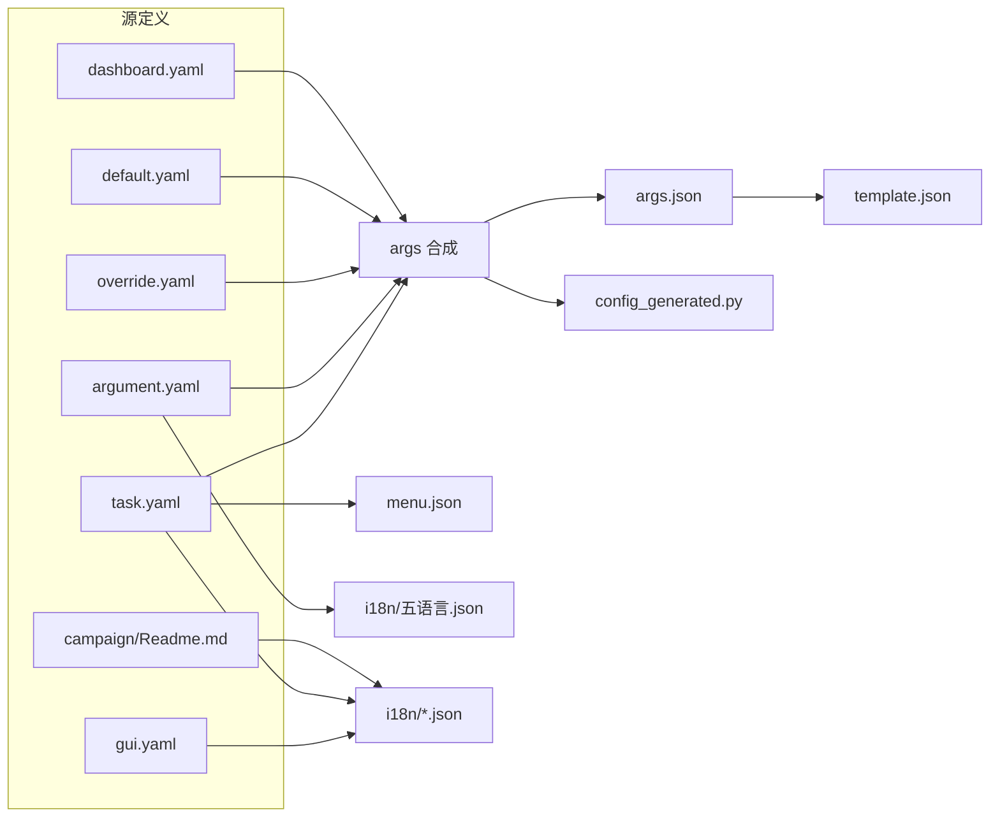
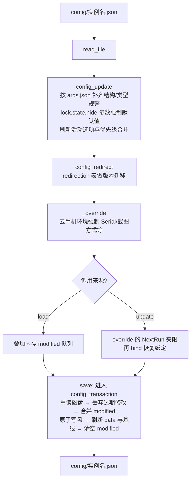
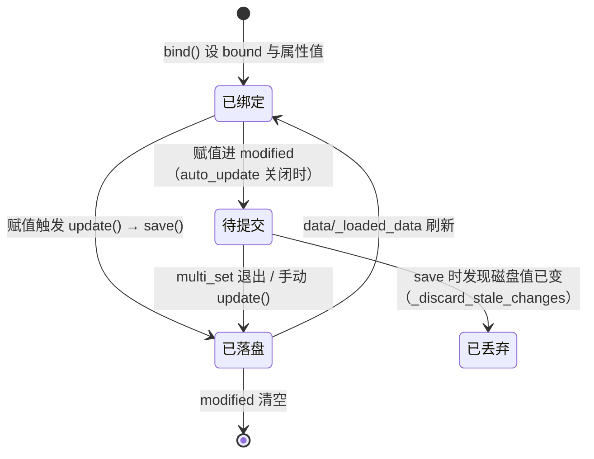

# 配置系统（module/config）

> 以「YAML 源定义 → 生成器 → 运行时绑定」三段式管理全部用户配置：WebUI 的选项树、调度器的任务参数与游戏代码的属性访问都由这里提供。

## 1. 模块概述

AzurPilot 按实例（一份 `config/<name>.json`）运行，每个实例包含几十个任务、数百个参数。配置系统要同时满足四个角色：

- **游戏代码**要像读普通属性一样读写参数（`self.config.Campaign_Name`），修改要落盘并在多进程之间不丢失；
- **调度器**要把配置当作任务队列读（`Scheduler.Enable` / `Scheduler.NextRun`），并通过优先级文本排序；
- **WebUI** 要拿到完整的选项树（类型、默认值、可选值、显示控制）和五语言翻译来渲染编辑界面；
- **开发者**要能声明式地新增参数，而不是手写大量样板。

为此模块拆成三段：

- **定义层**：`module/config/argument/` 下六个 YAML 手工维护。`task.yaml` 定任务与菜单，`argument.yaml` 定参数与控件，`default.yaml` 定任务默认值，`override.yaml` 定强制覆盖，`gui.yaml` 定界面文案，`dashboard.yaml` 定仪表盘资源。
- **生成层**：`config_updater.py` 把 YAML 合成 `args.json`（选项树）、`menu.json`（菜单）、`config_generated.py`（属性默认值类）、`template.json`(全新实例模板）和 `i18n/*.json`（翻译）。生成产物不手改，CI 重新生成并 diff 校验。
- **运行时层**：`AzurLaneConfig` 把用户 JSON 与默认值合并、做版本迁移，再把当前任务的参数**绑定成实例属性**；写操作经 `modified` 队列与跨进程事务锁落盘。

这个拆分解决的问题：选项结构变更只改 YAML 一处，游戏代码、WebUI、翻译、模板全部自动跟随；而运行时「读哪份配置、绑定哪个任务、并发谁后写」的复杂性被封装在 `AzurLaneConfig` 一个类里，业务代码只见 `self.config.Xxx_Yyy`。

## 2. 模块职责

### 负责

- 配置定义的单一事实来源：六个 YAML 源文件与三层路径（task → group → argument）
- 配置生成：args.json / menu.json / config_generated.py / template.json / i18n / deploy 模板
- 用户配置的加载、默认值合并、类型规整、版本迁移（redirection）、云手机环境覆盖
- 任务参数绑定：把 `Task.Group.Argument` 路径映射为 `Group_Argument` 属性，写属性即写配置
- 调度原语：`get_next`（选任务）、`task_delay`（延后）、`task_call`（跨任务注入）、任务切换检测
- 跨进程配置写事务（`transaction.py`）：调度器进程与 WebUI API 进程共用一把文件锁
- 配置文件变更检测（mtime 热重载依据）与 NTP 校准时间源
- 服务器标识（`server.py` 全局变量）与包名/渠道包/游戏服务器列表

### 不负责

- 不渲染配置界面（WebUI 前端与 `module/api/` 只消费 args.json 与 i18n）
- 不决定任务何时执行（调度决策在 `alas.py`，本模块只提供数据与原语）
- 不管理 `config/deploy.*.yaml` 部署配置的运行时读取（deploy 层自理，本模块只生成模板）
- 不保存界面偏好（`module/webui/webui_prefs.py` 刻意与配置 schema 解耦）
- 不校验 WebUI 提交的值——那在 `module/api/config_service.py` 按白名单完成

## 3. 模块位置

```text
module/config/
├── argument/                  # 定义层（手改）
│   ├── task.yaml              # 任务分组 → 任务 → 选项组列表；菜单形态
│   ├── argument.yaml          # 选项组 → 参数 → {type/value/option/validate/display/...}
│   ├── default.yaml           # 按任务覆盖参数默认值（仅 value）
│   ├── override.yaml          # 强制覆盖：值、display、type（用户不可改）
│   ├── gui.yaml               # WebUI 界面文案的翻译键
│   ├── dashboard.yaml         # 仪表盘资源清单（石油/金币/魔方…）
│   ├── args.json              # 生成：完整选项树（WebUI 主数据源）
│   └── menu.json              # 生成：侧边栏菜单
├── i18n/                      # 生成（但保留人工翻译）：五语言翻译
├── config.py                  # AzurLaneConfig：加载/绑定/保存/调度原语
├── config_updater.py          # ConfigGenerator + ConfigUpdater：生成器与迁移
├── config_generated.py        # 生成：GeneratedConfig 属性默认值类
├── config_manual.py           # ManualConfig：手动常量、默认调度优先级
├── deep.py                    # deep_get/deep_set/deep_iter 等嵌套字典工具
├── transaction.py             # 跨线程、跨进程配置写事务锁
├── watcher.py                 # ConfigWatcher：mtime 变更检测
├── task_priority.py           # 优先级文本解析与合并
├── server.py                  # 全局服务器变量与包名映射
├── utils.py                   # 读写（原子 IO）、parse_value、路径、服务器时间
├── env.py                     # IS_ON_PHONE_CLOUD 环境检测
├── time_source.py             # NTP 校准时间源（network_time 单例）
├── redirect_utils/            # 版本迁移的值转换函数
├── mcp_helper.py              # 为 MCP 服务器提供任务/参数元数据
└── code_generator.py          # 通用代码生成器（现仅科研预设生成器使用）
```

| 文件 | 作用 |
| --- | --- |
| `config.py` | 运行时核心：`AzurLaneConfig`、`Function`、`ConfigBackup`、`MultiSetWrapper` |
| `config_updater.py` | `ConfigGenerator`（YAML → 产物）+ `ConfigUpdater`（加载/迁移/save_callback） |
| `transaction.py` | `config_transaction()`：进程内 RLock + 跨进程文件锁 |
| `watcher.py` | `ConfigWatcher`：`start_watching` / `should_reload` |

## 4. 核心入口

| 入口 | 用途 |
| --- | --- |
| `AzurLaneConfig(config_name, task=None)` | 构造入口。加载配置并绑定任务（默认 `Alas`）；调度器、停止收尾进程、调试代码都从这里进 |
| `uv run -m module.config.config_updater` | 生成器入口。改完 YAML 后必须运行 |
| `config.save()` / `config.update()` | 写入入口（`save` 由 `update` 与 `multi_set` 驱动） |
| `config.cross_get / cross_set` | 跨任务读写入口，路径为完整 `Task.Group.Argument` |
| `config.task_call / task_delay` | 调度协作入口，业务模块以此注入或延后任务 |
| `ConfigGenerator().generate()` | 编程式生成入口（`__main__` 即完整生成流程） |

## 5. 核心组件

### AzurLaneConfig

`class AzurLaneConfig(ConfigUpdater, ManualConfig, GeneratedConfig, ConfigWatcher)` —— 四个基类各管一段：

| 基类 | 提供的能力 |
| --- | --- |
| `ConfigUpdater` | `read_file`（读取即合并默认值）、`config_update`、`config_redirect`、`save_callback` |
| `ManualConfig` | 硬编码常量、`SERVER`、`SCHEDULER_PRIORITY`（用户优先级与默认优先级合并） |
| `GeneratedConfig` | 全部参数的类级默认值（生成产物），供 IDE 补全与「取默认值」场景 |
| `ConfigWatcher` | `start_watching` / `should_reload`，供调度器空闲等待检测配置变更 |

关键实例状态：

| 字段 | 类型 | 说明 |
| --- | --- | --- |
| `data` | dict | 当前配置树（用户 JSON 合并默认后），键为任务名 |
| `modified` | dict | 待保存修改，键为完整路径 `Task.Group.Argument`；`save()` 成功后才清空 |
| `bound` | dict | 属性名 → 完整路径的映射，`bind()` 时重建 |
| `overridden` | dict | `override()` 强制覆盖值；重载后依然生效（不可逆） |
| `auto_update` | bool | 属性修改后是否立即提交；`multi_set()` 期间临时关闭 |
| `pending_task` / `waiting_task` | list[Function] | `get_next_task()` 的调度队列产物 |
| `task` | Function | 当前绑定的任务；`cross_set` 默认写它的路径 |
| `_loaded_data` | dict | 上次读盘基线，用于丢弃过期修改 |

`Function`（同文件）是调度侧的任务描述：`enable` / `command` / `next_run`，从任意任务字典的 `Scheduler` 组构造，`get_next_task` 的排序单元。

### 生成器与数据结构

`ConfigGenerator.args` 产出的 `args.json` 中，每个参数是带属性的对象：`type`（checkbox/select/textarea/input/datetime/storage/state/lock/task_priority 等）、`value`、可选 `option` / `validate` / `display` / `preserve_empty` / `mode`。前端与 `ConfigService.validate` 都依赖这套属性做控件渲染与白名单校验。

### 事务锁（transaction.py）

`config_transaction(path)` 是本模块唯一的跨进程同步原语，见第 12 节。

## 6. 工作流程

### 生成管道（离线，CI 校验）



`ConfigGenerator.args` 的合成规则（决定 WebUI 看到什么）：

1. 以 `task.yaml`（和 `dashboard.yaml`）声明的 group 清单为准，从 `argument.yaml` 整组复制参数定义；每个任务自动附加 `Storage` 组（运行时键值存储）。
2. `default.yaml` 只写 `value`，且同样要过 `check_override` 校验。
3. `override.yaml` 经 `check_override` 后落位，规则见第 15 节。
4. 每个有 `Scheduler.Command` 的任务：`Command.value` 设为任务名并 `display: hide`；非主线任务隐藏 `Campaign.Mode`。

`generate_i18n` 对通过 `deep_load` 读取的普通翻译保留旧值；**新增的 name/help 缺翻译时值就是键路径本身**（如 `Main.Campaign.Name`），需人工补齐五语言，选项文案缺失时回落到选项值。活动名、游戏服务器名称等动态条目会重新生成，手改这些值不保证保留。zh-TW 额外套一张小的用词替换表（設置→設定、文件→檔案等），并非完整简繁转换，生成后仍需校对。活动名按「同语言服务器 > en > cn > jp > tw」取自 `campaign/Readme.md` 的活动表；zh-MIAO 没有对应服务器语言，直接按 en → cn → jp → tw 回退。`generate()` 还会把该活动表重新对齐列宽写回。

### 运行时加载与保存



要点：

- **读不上锁**。JSON 经 `deploy.atomic` 临时文件 + `os.replace` 写入，读侧要么拿到旧整体要么新整体，不会读到半截；锁只保护「读—改—写」复合操作。
- **save 不用旧快照覆盖**。事务内重读磁盘最新值，只把 `modified` 里的字段合并上去；用户在 WebUI 改的其他字段原样保留。
- **过期修改被主动丢弃**（`_discard_stale_changes`）：若某字段在基线之后已被外部修改（磁盘值 ≠ 基线），运行器对该字段的待写修改直接作废，并同步回绑属性，防止旧任务回写覆盖用户输入。
- `override()` 除了强制覆盖参数，还承担 `Scheduler.NextRun` 的合法性夹限（委托/奖励 ≤12h、科研 ≤24h、大世界任务 ≤31 天等）。这里刻意**不设通用上限**：秘书舰、跨月、珍珠采购等任务的合法休眠可达 8~31 天，通用夹限曾把合法长休眠反复重置成「立即运行」，造成热循环。

### 属性绑定与写入

`bind(func)` 构造 `func_list = [General, Alas, (OpsiGeneral | TaskBalancer, EventGeneral), 当前任务, ...]`，按顺序遍历每个任务数据里的 `group.argument`，先到先得（`visited` 去重）地写 `bound[path_to_arg('Group.Argument')] = 'Task.Group.Argument'`，并把值设为实例属性。之后：

- **读**：`self.config.Group_Argument` 直接命中属性。
- **写**：`__setattr__` 查 `bound`，命中则 `cross_set('Task.Group.Argument', value)` → 进 `modified` → `auto_update` 为真时立即 `update()`（重读磁盘、夹限、重绑、事务保存）。业务代码对配置的每一次赋值都是一次带并发保护的落盘。
- **批量写**：`with config.multi_set():` 期间挂起自动提交，退出时统一 `update()` 一次；提交失败保留 `modified` 供重试，异常不回滚已赋值。
- **跨任务**：`cross_get / cross_set` 用完整路径读写其他任务（如 `task_delay` 改 `<task>.Scheduler.NextRun`）。

## 7. 调用关系

### 上游

| 模块 | 关系 |
| --- | --- |
| [调度器](entry/alas.md) | 持有 `AzurLaneConfig`，用 `get_next/task_call/task_delay/check_task_switch` 驱动调度；经 `del_cached_property` 整体重建 config 实现任务间热重载 |
| [API 服务](webui/api.md) | `ConfigService` 消费 args.json/i18n/template.json 渲染与校验；`config.patch` 与本模块的 `save()` 共用事务锁写同一份 JSON |
| [MCP SSE 服务器](entry/mcp-server.md) | `mcp_helper.McpConfigHelper` 从 args.json + i18n 读取任务元数据供外部 AI 查询 |
| `module/runtime/` | 停止收尾进程构造临时 `AzurLaneConfig` 读取 `Optimization_WhenSchedulerStopped`；进程管理器注入 `stop_event` |

### 下游

| 模块 | 用途 |
| --- | --- |
| 几乎所有 `module/` 业务代码 | 以 `self.config.Xxx_Yyy` 读参数、赋值写参数、`override()/temporary()` 做运行时覆盖 |
| `module/combat/emotion.py` 等 | `set_record` / `multi_set` 维护「值 + 记录时间」型参数 |
| `module/os/tasks/scheduling.py` | 用 `cross_get` 读智能调度配置、`Storage.Storage` 存运行状态 |
| `module/device/`、识别资源 | `server.py` 的全局服务器决定加载哪套 assets 与 OCR 资源 |
| `module/submodule/`（maa/fpy 桥接） | 复用同一套生成器与 deep 工具，配置写到 `config/<name>.<mod>.json` |

## 8. 数据流

```text
task.yaml ─┐
argument.yaml ─┤
default.yaml ─┼─→ args.json ─→ config_generated.py（类默认值，IDE 补全）
override.yaml ─┤       │
dashboard.yaml ┘       └─→ ConfigService.schema → WebUI 选项树
gui.yaml ──────────→ i18n/*.json（旧翻译优先保留）─→ WebUI / MCP 翻译
campaign/Readme.md ─→ 活动 option 列表（同时回写对齐表格）

config/template.json（生成器以 is_template=True 产出）
        └─→ 新建实例的初始 JSON

用户编辑（WebUI config.patch）──┐
运行时属性赋值（save）────────┴─→ config_transaction ─→ config/<name>.json
        └─→ 下次 load()/热重载读回 → bind → 业务属性
```

## 9. 状态模型

一次配置修改在运行时层的状态流转：



- `auto_update=True`（默认）：赋值即时提交，业务代码无感知。
- `modified` 只在**写盘成功后**清空，磁盘错误不丢修改。
- 模板配置（`config_name` 以 `template` 开头）进入只读模式：`auto_update=False`，不加载不绑定，供开发工具引用默认值。

## 10. 配置

配置路径格式 `<Task>.<Group>.<Argument>`（如 `OpsiScheduling.OpsiScheduling.OperationCoinsPreserve`），代码访问 `self.config.Group_Argument`。配置文件位于 `config/<实例名>.json`，子模块实例为 `config/<实例名>.<mod>.json`。

关键关联：

| 配置 | 关联 |
| --- | --- |
| `Scheduler.Enable / NextRun / Command / Sensitive` | 调度队列的直接输入；`Command` 由生成器按任务名隐藏锁定；`Sensitive` 驱动调度器的敏感任务停机 |
| `General.YukikazeTaskManager.TaskPriorityAdjustment` | 用户优先级文本，`SCHEDULER_PRIORITY` 将其与 args.json 默认值合并（新任务按默认邻位插入） |
| `Alas.Emulator.PackageName` | 决定 `to_server()` → 全局 server → 资源目录与 i18n 活动 option 的选取 |
| `Alas.Optimization.TaskHoardingDuration` | 调度器空闲时的「囤积」时长，影响 `get_next` 的等待策略 |
| `OpsiScheduling.OperationCoinsPreserve` ↔ `OpsiHazard1Leveling.OperationCoinsPreserve` | 智能调度与侵蚀 1 的黄币保留；运行时按 `UseSmartSchedulingOperationCoinsPreserve` 开关择一读取（见第 15 节的联动说明） |
| `<Task>.Emotion.*Value / *Record` | 成对字段：改 Value 必须同步刷新 Record 时间戳，否则情绪恢复量被重复计入（API 层 `_sync_record_time` 负责） |
| `Dashboard.*`（Oil/Coin/Gem 等） | 仪表盘资源，由 dashboard.yaml 定义、任务运行时写回 Value/Record |
| `Storage.Storage` | 生成器给每个任务附加的 `storage` 类型组，WebUI 禁止编辑，运行时当作键值状态区使用 |

## 11. 异常与错误处理

| 异常 | 原因 | 处理 |
| --- | --- | --- |
| `TimeoutError('等待配置事务锁超时')` | 15 秒内拿不到配置文件锁 | 直接抛出；调用方（调度器/ API）按各自异常路径恢复 |
| `RequestHumanTakeover` | `get_next()` 发现没有任何启用任务 | 上抛终止调度器，提示启用至少一个任务 |
| `TaskEnd` | 业务代码主动结束当前任务（`task_stop`） | 调度器视为成功返回 |
| `ScriptError` | `task_delay` 缺参数、`task_call` 目标不存在等代码错误 | 上抛，由调度器按连续失败计数处理 |
| 键不存在 | `deep_get` 返回 default；`deep_get_with_error` 抛 `KeyError` | 业务代码自行选择容错或严格模式 |

恢复语义：配置写入失败（磁盘错误）不会丢失 `modified`（清空动作放在写盘成功之后），下次赋值或 `update()` 会重试；`_discard_stale_changes` 丢弃的是「已被外部改动字段」的过期修改，属于主动让步而非错误。

## 12. 并发与线程模型

**为什么需要事务锁**：一份配置同时被两个进程写——调度器 worker 进程（业务赋值触发 `save()`）和 WebUI API 进程（`ConfigService.patch` 合并字段编辑）。两者各持自己的内存快照，若无同步，运行器的一次保存就可能用旧快照覆盖用户刚在浏览器里改的其他字段。`transaction.py`（2026-09 引入）为此提供 `config_transaction(path)`：

- **进程内**：按解析后的绝对路径维护 `threading.RLock`，同线程重入直接放行（`_local.held` 记录已持有键）。
- **跨进程**：对 `<config>.json.lock` 文件加字节锁（Windows `msvcrt.locking`，POSIX `fcntl.flock`），非阻塞尝试、20ms 轮询、15 秒超时抛 `TimeoutError`；进程崩溃时操作系统自动释放文件锁。
- **粒度是单个配置文件**：不同实例互不阻塞。读操作不加锁（依赖原子替换）。
- **共享写权限的双方**：`AzurLaneConfig.save()`（运行器侧）与 `ConfigService.patch/delete`（API 进程）。回归测试 `tests/test_config_transaction.py` 覆盖「过期 worker 不得撤销同字段编辑」「多进程不丢更新」等场景。

其余并发事实：

- WebUI 通过 `State.manager.Event()` 创建跨进程事件代理，worker 将其注入 `AzurLaneConfig.stop_event`，`task_switched` 与调度循环轮询它；不能用普通 `threading.Event` 替代。配置对象的内存状态没有统一的线程锁，文件事务锁也不保护 `bind()` 等内存操作，新增跨线程访问时需单独检查同步与快照边界。
- `is_hoarding_task` 是**类属性**，进程内所有实例共享；当前架构一进程一调度器所以安全，若一进程跑多实例需重新审视。
- `check_task_switch()` 是任务中途感知配置/队列变化的机制：`task_switched()` 重读配置并比较下一个任务，切换即抛 `TaskEnd`，业务循环在安全点调用它（如 `module/campaign/run.py`）。

## 13. 缓存与持久化

| 数据 | 位置 | 生命周期 |
| --- | --- | --- |
| 用户配置 | `config/<name>.json` | 持久；`save()` 事务内原子替换；删除实例时移入 `config/backup/` |
| 配置锁文件 | `config/<name>.json.lock` | 1 字节占位文件，随配置文件存在 |
| 全新实例模板 | `config/template.json` | 生成器产物；`ConfigService.create` 的默认来源 |
| 选项树/菜单 | `module/config/argument/args.json`、`menu.json` | 生成；调度器取优先级默认值、WebUI 取 schema 时实时读取 |
| 翻译 | `module/config/i18n/<lang>.json` | 普通译文生成时保留旧值；活动名、服务器名称等动态条目会重建（见第 6 节） |
| 读盘基线 | `AzurLaneConfig._loaded_data` | 每次 load/save 后更新，用于判断外部修改 |
| 绑定表 | `bound` dict | 每次 `bind()` 清空重建 |
| NTP 偏移 | `network_time` 单例内存 | 启动校准、30 分钟刷新；失败退回本机时间并可环境变量禁用 |

## 14. 生命周期

- **创建**：调度器 worker、停止收尾进程、调试脚本各自 `AzurLaneConfig(config_name)`。构造即 `load → bind → save`（模板配置除外）；alas.py 把它挂在 `cached_property` 上，失败即退出进程。
- **运行**：任务开始前 `bind(task)` 重绑参数；任务中赋值即保存；任务边界与空闲等待中经 `should_reload()`（mtime）感知外部修改，alas.py 丢弃整个 config 缓存重建——**配置对象本身被整体替换而非增量更新**。
- **销毁**：无显式析构；随进程退出。持锁期间崩溃由操作系统文件锁兜底释放。
- 模板配置在构造后直接返回（不 load/bind），生命周期止于属性默认值容器。

## 15. 扩展方式

### 新增/修改一个参数

1. 在 `argument.yaml` 对应组下定义参数（标量简写自动推断类型：bool→checkbox、有 option→select、名含 `Filter`→textarea、datetime 值→datetime；字典写法则显式给 type/value/option/validate/display）。
2. 在 `task.yaml` 把该组挂到目标任务（否则不进 args.json）。
3. 需要用户不可改时在 `override.yaml` 加路径；需要任务级默认值时写 `default.yaml`。
4. 运行 `uv run -m module.config.config_updater`，检查 args.json / config_generated.py / template.json 的差异。
5. 为五语言补翻译：`i18n/*.json` 中新增键当前值是键路径，逐一填入；zh-TW 检查自动替换结果；选项文案同样要核对。
6. 代码中经 `self.config.Group_Argument` 访问（`config_generated.py` 重新生成后 IDE 可补全）。

### 强制覆盖规则（override.yaml / check_override）

- 只对已存在的参数生效，路径不存在会打印警告并跳过；`default.yaml` 走同一校验。
- 覆盖值类型必须与原值一致（`SuccessInterval`/`FailureInterval` 豁免）；原有 `option` 时覆盖值必须在选项内。
- 字典形态：逐键写入；`type` 为 `state`/`lock` 保持原样，**其余类型若给了非空 value 通常附带 `display: hide`**（界面隐藏但运行时生效）。
- 标量形态：写 value 并强制 `display: hide`。
- `argument.yaml` 中以 `_` 开头的组在加载时被过滤（`_info` 等内部结构）。

### 版本迁移（redirection）

`ConfigUpdater.redirection` 表：`(源路径, 目标路径, 可选转换函数)`。源值缺失则跳过；目标已有值则不覆盖（同键迁移除外）。转换函数放 `redirect_utils/`（如 `upload_redirect` 合并布尔对、`coalition_to_little_academy` 归一联动难度、`execute_fixed_patrol_scan_redirect` 清洗旧枚举）。新增迁移后旧配置在下次 `read_file` 时自动转换，无需用户操作。

### 保存联动

历史上 `ConfigUpdater.save_callback(key, value)` 以生成器模式返回联动写入（Emotion `Value`→`Record`；`OpsiScheduling` 与 `OpsiHazard1Leveling` 的 `OperationCoinsPreserve` 互相同步）。**截至 2026-09，旧 WebUI 移除后该方法已无调用方**：新 API 层在 `ConfigService._sync_record_time` 内等价实现了 Value→Record 刷新；黄币保留的运行时取值改为 `OpsiScheduling` 侧按开关在两个配置间选择（`module/os/tasks/scheduling.py`），不再双向写回。新增保存联动应优先在 `ConfigService.patch` 的事务内实现。

## 16. 修改注意事项

- **生成产物绝不手改**：args.json、menu.json、config_generated.py、template.json、i18n 结构均由生成器维护。CI 的 `button-config-check` 会重新运行 `button_extract` + `config_updater` 并 `git diff --exit-code`，手改或漏跑生成器都会挂 CI。i18n 是唯一例外——生成器保留已有翻译，翻译可以直接改 JSON。
- **不要把真实用户配置当模板**；模板只能由生成器产出（其中 AzurStatsID 置空）。
- **改 `server.py` 时保持 `SERVER_CHECKER_SERVER_LIST` 条目顺序**：配置值按列表下标持久化，重排等于给全体用户换服。
- **`import module.config.server as server`**，不要 `from ... import server`——它是要被 `set_server()` 就地替换的全局变量；切换服务器须在导入游戏模块前完成，否则资源已按旧服务器加载。
- **`override()` 的逐任务 NextRun 夹限是有意为之**：不要加「所有任务不得超过 N 小时」的通用兜底，历史上它把秘书舰等合法长休眠打成热循环（38 分钟被调起 219 次）。新任务需要上限就在 `override()` 里逐个声明。
- **绑定是先到先得**：`func_list` 顺序为 General → Alas → 共享组 → 当前任务；同名 `Group.Argument` 以先绑定者为准。给任务新挂一个已在别处使用的组之前，确认不会截胡。
- **写配置一律走属性赋值或 `cross_set`**，不要绕过 `modified` 队列直接改 `self.data`（改了也不会落盘，且会被下次 load 冲掉）。
- **`deep_set/deep_get` 只认字典路径**：对列表下标写值不受支持；遍历用 `deep_iter`（depth 默认 3，恰好是 task→group→argument）。
- **测试配置类不要走完整 `__init__`**：`AzurLaneConfig.__new__` + 手工装 `modified/bound` 是既有测试模式；`AzurLaneConfig.__init__` 会真的保存配置，测试须用临时目录。

## 17. 已知限制

- `AzurLaneConfig` 单类承担加载、绑定、调度队列、覆盖、迁移五重职责（四个基类拼合），方法间共享 `data/modified/bound` 三份可变状态，改动需同时考虑 `load/update/save/bind` 四条路径的交互。
- `config_update` 在每次 `read_file` 时全量重算（含活动刷新与优先级合并），读配置的代价随 args 规模增长；`read_file` 里写回磁盘的代码被刻意注释，意味着迁移结果要等下次保存才持久化。
- `save_callback` 成为无调用方的遗留代码，黄币保留「双向同步」的旧行为已不存在；文档与直觉若基于旧行为会产生误判。
- `deep_iter_diff` / `deep_iter_patch` / `deep_values` / `deep_get_with_error` / `deep_exist` 目前没有调用方（热重载基于 mtime + 整体重建，不做差异比较）。
- `is_hoarding_task`、`stop_event` 是类属性，依赖「一进程一实例」的部署形态。
- zh-MIAO（喵语）同样参与 `LANGUAGES` 的生成循环：普通译文由人工补充并在生成时保留，活动名、游戏服务器名称等动态条目会重建。活动名无喵语服务器来源时使用 en → cn → jp → tw 回退，不能通过直接修改动态键来持久保留喵语译名。

## 18. 示例

新增一个参数并消费（最小路径）：

```yaml
# module/config/argument/argument.yaml —— 在已有组里加一个参数
OpsiScheduling:
  OperationCoinsReturnThreshold:
    value: 20000
```

```yaml
# task.yaml 里该组已挂在 OpsiScheduling 任务下，无需再动
```

```bash
uv run -m module.config.config_updater
```

生成后 `config_generated.py` 出现 `OpsiScheduling_OperationCoinsReturnThreshold = 20000`，WebUI 自动出现输入框。业务代码：

```python
# 读
threshold = self.config.OpsiScheduling_OperationCoinsReturnThreshold
# 写（绑定了 OpsiScheduling 任务时，等价于写 OpsiScheduling.OpsiScheduling.OperationCoinsReturnThreshold）
self.config.OpsiScheduling_OperationCoinsReturnThreshold = 15000
# 临时覆盖，离开 with 后恢复
with self.config.temporary(OpsiScheduling_OperationCoinsPreserve=0):
    ...
```

跨任务注入一次立即运行的恢复任务：

```python
self.config.task_call('Restart')          # NextRun=now 且强制启用
self.config.task_delay(minute=30)         # 当前任务 30 分钟后再跑
```

## 19. 调试方法

- **生成验证**：`uv run -m module.config.config_updater` 后 `git diff` 审查产物；CI 的 button-config-check job 做同样的事。
- **单元测试**：`uv run python -m unittest tests.test_config_batch tests.test_config_transaction`，覆盖批量修改、覆盖顺序、事务互斥与情绪时间戳联动。
- **日志标记**：`[配置]`（加载/绑定/保存/延迟）、`[配置-监视]`（mtime 变更）、`[配置-大世界]`（批量延迟）。保存日志会带「共 N 项修改」。
- **只读实验**：把配置名取为 `template` 开头即进入只读模式，构造失败也不会写盘。
- **查选项为何没出现**：依次核对 argument.yaml 的组是否被 task.yaml 挂载、是否被 override 隐藏（`display: hide`）、check_override 是否因类型/option 不匹配拒绝（生成器会在 stdout 打印原因）。
- **遇保存丢失先查**：是否绕过了属性赋值直接改 `self.data`；`_discard_stale_changes` 是否因外部改动丢弃了 `modified`（日志中保存项数会少于预期）。

## 20. 相关模块

- [调度器（alas.py）](entry/alas.md) — 消费 `get_next/task_call`，并以缓存重建实现任务间热重载
- [WebUI 总览](webui/index.md) — 配置编辑界面如何消费 args.json 与 i18n
- [API 服务](webui/api.md) — `config.patch` 的事务写入口与白名单校验
- [WebUI 启动器（gui.py）](entry/gui.md) — 拉起 API 进程与 worker 进程的两端
- [基础层 module/base](base/index.md) — `Filter`（优先级解析）、原子 IO 的底层依赖
- [编码规范与设计模式](overview/conventions.md) — 配置路径约定与生成器工作流的总纲
- [MCP SSE 服务器](entry/mcp-server.md) — `mcp_helper` 的消费方
