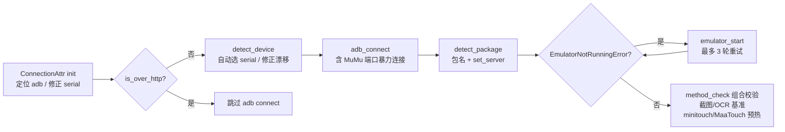
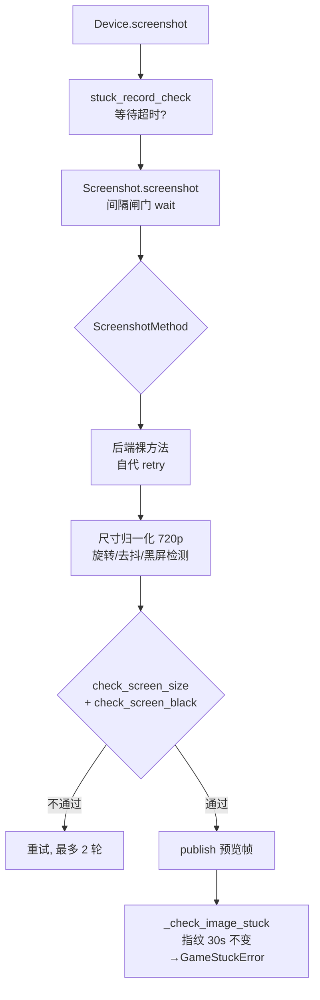

# 设备层 module/device

> 脚本与模拟器之间唯一的 I/O 通道：把 ADB 连接、十余种截图/控制后端、应用管理与模拟器启停整合为一个 `Device` 对象，并内置防卡死与点击频率检测。

## 1. 模块概述

`module/device` 回答一个具体问题：如何让同一套「截图 → 识别 → 操作」业务代码，稳定跑在夜神、蓝叠、雷电、MuMu、MEmu、WSA、云手机乃至真机等差异巨大的环境上。这些环境的差别不只在「模拟器牌子」，更在于**截图通路的速度**：通用 `adb exec-out screencap` 一张图约 300–500ms，而 MuMu 的 `nemu_ipc`、雷电的 `ldopengl` 走模拟器内部 IPC/OpenGL 直读渲染缓冲，只需几十毫秒。状态循环的节奏完全由截图速度决定，因此设备层必须允许「按环境挑选最快的通路」。

由此形成模块的核心设计——**后端可插拔 + 运行时分发**：

1. 每种截图/控制技术（ADB、netcat、uiautomator2、aScreenCap、DroidCast、scrcpy、nemu_ipc、ldopengl、minitouch、MaaTouch、Hermit 等）实现为一个 `Connection` 的 mixin 子类，只提供 `screenshot_xxx` / `click_xxx` 这类裸方法和自己的恢复策略；
2. `Screenshot` / `Control` / `AppControl` 通过多重继承把这些 mixin 组合起来，运行时按配置项 `Emulator_ScreenshotMethod`、`Emulator_ControlMethod` 从方法表（`screenshot_methods` / `click_methods`）里取出对应函数分发——截图与控制两条通路互相独立，可自由混搭（如 nemu_ipc 截图 + MaaTouch 控制，这是 MuMu 上的推荐形态）；
3. 所有裸方法经统一的 `retry_backend` 重试骨架包装：先按异常类型选择恢复动作（重连 ADB、重启后端服务、重装包），重试耗尽后统一抛 `EmulatorNotRunningError`，把「设备离线」这一事实交给调度器决策。

模拟器进程本身的管理（发现、启动、停止、重启）被拆到 `platform/` 子包，`Device` 通过 `platform` 属性惰性持有一个 `Platform` 实例做委托。这个边界是刻意的：设备层提供「能启停模拟器」的能力，而**何时重启、重启几次、要不要深度重启**是调度层的恢复策略（见 [调度器](entry/alas.md)）。

## 2. 模块职责

### 负责

- ADB 连接生命周期：设备检测（`detect_device`）、连接/重连（`adb_connect` / `adb_reconnect`）、端口转发与反向代理（`adb_forward` / `adb_reverse`，含去重复用）、netcat 快速通道（`adb_shell_nc`）。
- 屏幕截图：按配置分发到后端，统一做分辨率归一化（非 1280×720 时缩放回资源空间）、方向旋转、去抖动（可选）、黑屏/分辨率校验。
- 触控与输入：点击、长按、滑动、拖拽（贝塞尔曲线 + 抖动模拟人手）、向量滑动、按住滑动；u2 文本输入与 IME 检测。
- 应用（碧蓝航线客户端）生命周期：前台包名检测、启动（am/monkey 双链）、停止、清缓存；UI 层级 dump 与 XPath 查询。
- 模拟器发现与管理：注册表/进程扫描（Windows）、/Applications 扫描（macOS）、SSH 远程命令；启停命令按模拟器类型分发，含 MuMu12 专属的僵死进程清理与深度重启。
- 运行稳定性检测：卡死检测（截图指纹 + 等待计时器双通道）、点击频率检测（最近 15 次点击统计）。
- 基准测试入口：首次连接时自动为截图方式与 OCR 设备跑简化基准并写回配置。

### 不负责

- 恢复策略决策：收到 `EmulatorNotRunningError` 后何时重启模拟器、是否深度重启，由调度器 `alas.py` 的 `_try_restart_emulator()` 决定（见 [调度器](entry/alas.md)）。
- OCR 模型加载与推理——`module/ocr`；本层只负责跑 `Optimization_OcrDevice` 基准写配置。
- 按钮定义与模板匹配——`module/base`；本层只接收 `Button` 对象并在其区域内随机取点。
- 配置项定义、迁移与热重载——`module/config`；本层只读写具体字段。
- 业务状态循环——`module/base` 的 `ModuleBase`；本层提供 `screenshot()`/`click()` 原语与卡死检测，不决定循环内容。

## 3. 模块位置

```text
module/device/
├── device.py            # Device 主类：组合四个 mixin，卡死/点击检测，基准测试入口
├── connection.py        # ADB 连接管理：连接、重连、转发、nc 通道、设备/包名检测
├── connection_attr.py   # 连接属性底座：adb 二进制定位、serial 校正、模拟器家族判定
├── screenshot.py        # Screenshot mixin：截图分发与统一后处理
├── control.py           # Control mixin：点击/滑动/拖拽分发
├── input.py             # Input mixin：文本输入（u2）
├── app_control.py       # AppControl mixin：应用启停、前台检测、层级 dump
├── env.py               # IS_WINDOWS / IS_MACINTOSH / IS_LINUX 常量
├── pkg_resources/       # Python 3.14 下的 pkg_resources 兼容层（adbutils/u2 依赖）
├── method/              # 各后端实现 + 统一重试骨架
│   ├── retry.py         # retry_backend：有界重试骨架（所有后端共用）
│   ├── utils.py         # ADB 错误分类、ImageTruncated、HierarchyButton、u2 monkey patch
│   ├── pool.py          # WORKER_POOL 线程池（nemu_ipc 超时保护、并发 adb connect）
│   ├── remove_warning.py# 剥离 VMOS/Waydroid/多屏等环境的 shell/截图前导警告
│   ├── adb.py  uiautomator_2.py  ascreencap.py  droidcast.py
│   ├── scrcpy/          # scrcpy 服务端管理 + H.264 解码线程 + 触控发送
│   ├── nemu_ipc.py      # MuMu12 IPC（ctypes 加载 external_renderer_ipc.dll）
│   ├── ldopengl.py      # 雷电 OpenGL 截图（ldopengl64.dll）
│   ├── minitouch.py  maatouch.py  hermit.py  wsa.py  adb.py
└── platform/            # 模拟器发现与启停（按操作系统分发）
    ├── emulator_base.py / emulator_windows.py / emulator_mac.py
    ├── platform_base.py / platform_windows.py / platform_mac.py
    └── utils.py         # 平台层自己的 cached_property 与目录遍历
```

| 文件/目录 | 作用 |
| --- | --- |
| `device.py` | `Device` 组合入口与运行期守护（卡死、点击频率） |
| `connection.py` | `Connection`：一切 ADB 交互的公共基类 |
| `connection_attr.py` | `ConnectionAttr`：serial、adb 路径、u2 客户端、家族判定缓存属性 |
| `method/retry.py` | 统一重试骨架 `retry_backend`，后端只提供 recover 函数 |
| `method/pool.py` | `WORKER_POOL`：mimic trio 的线程池，nemu_ipc 靠它做超时强杀 |
| `platform/` | 模拟器实例发现、启停命令、启动监视 |

## 4. 核心入口

| 入口 | 用途 |
| --- | --- |
| `Device(config)` | 标准构造：连接设备 + 自动启动模拟器（最多 4 次尝试）+ 基准测试 + 控制预热 |
| `Device.for_existing_device(config)` | 收尾专用：不启动模拟器、不改配置，连不上直接抛 `EmulatorNotRunningError` |
| `Platform(config, connect=False)` | 模拟器离线时的轻量入口：只解析 serial 与模拟器实例，供调度器重启模拟器 |
| `self.device.screenshot()` / `click()` / `swipe()` / `app_start()` | 业务模块经 `ModuleBase` 使用的日常接口 |
| `device.dump_hierarchy()` | UI 层级树获取，配合 `xpath_to_button()` |
| `WORKER_POOL.start_thread_soon()` | 供 nemu_ipc 等需要超时强杀的阻塞调用使用 |

追代码建议从 `Device.__init__` → `Connection.__init__` → `screenshot()` 这条线开始，它覆盖了连接、检测、分发三个核心环节。

## 5. 核心组件

### Device（device.py）

| 成员 | 类型 | 说明 |
| --- | --- | --- |
| `image` | `np.ndarray` | 最近一次截图（RGB numpy 数组），业务识别的唯一数据源 |
| `package` | `str` | 游戏包名；`auto` 时由 `detect_package()` 检测并写回配置 |
| `platform` | `Platform` | 惰性创建的模拟器管理实例（`connect=False`，不触发 ADB 连接） |
| `stuck_timer` / `stuck_timer_long` | `Timer` | 60s / 195s 等待超时；长等待名单（战斗结算、PAUSE 等）命中时以 195s 为准 |
| `_stuck_image_timer` | `Timer` | 截图指纹（16×16 缩略哈希）30s 不变判卡死 |
| `click_record` | `deque(maxlen=15)` | 最近点击记录，类属性 |
| `_screenshot_interval` | `Timer` | 截图间隔闸门，由 `screenshot_interval_set()` 按配置收敛 |

注意 `click_record`、`stuck_timer`、`detect_record` 等是**类属性**：同一进程内多个 Device 实例会共享它们。当前每个 worker 进程只构造一个 Device，因此无实际冲突，但这是隐含约束。

### Mixin 继承结构

```text
Device(Screenshot, Control, AppControl, Input)
Screenshot(Adb, WSA, DroidCast, AScreenCap, Scrcpy, NemuIpc, LDOpenGL)
Control(Hermit, Minitouch, Scrcpy, MaaTouch, NemuIpc)
AppControl(Adb, WSA, Uiautomator2)
Input(Uiautomator2)
所有方法类的公共底座：Connection(ConnectionAttr)
```

多重继承在这里不是设计癖，而是**方法分发机制**：每个后端在自己的模块里定义 `screenshot_xxx()` / `click_xxx()`，`Screenshot.screenshot_methods`、`Control.click_methods` 这两张字典把配置值映射到具体实现；后端类同时继承 `Connection` 以获得 adb/serial 能力，部分还继承 `Platform`（nemu_ipc/ldopengl 需要定位模拟器安装目录）。收益是：新增后端只需新增一个文件并注册进字典，不改任何分发逻辑。

### 截图后端一览

| 方法名 | 原理 | 适用/备注 |
| --- | --- | --- |
| `ADB` | `screencap` PNG 经 adb 管道 | 兜底，最慢（约 300–500ms） |
| `ADB_nc` | `screencap | nc` 直连主机监听 socket，绕过 adb 协议开销 | 明显快于 ADB |
| `uiautomator2` | atx-agent HTTP 截图 | WSA/HTTP 设备的必选 |
| `aScreenCap` / `aScreenCap_nc` | 设备端二进制读 framebuffer，lz4 压缩 | 仅 Android 5–9（SDK 21–28） |
| `DroidCast` / `DroidCast_raw` | 设备端 app_process HTTP 服务；raw 为 RGB565 位图 | Android 6–12（SDK 23–32）；raw 免编码更快 |
| `scrcpy` | H.264 视频流 + PyAV 后台解码 | 持续视频流；截图=取最新帧 |
| `nemu_ipc` | MuMu12 官方 IPC DLL | 仅 Windows + MuMu12 ≥ 3.8.13，最快档 |
| `ldopengl` | 雷电 ldopengl64.dll 读渲染缓冲 | 仅 Windows + LDPlayer9/14 |

后缀 `_nc` 表示 netcat 变体：不经过 adb 协议传输数据，而是让设备端把数据 `| nc <host> <port>` 直接发到 Alas 在主机上监听的 socket（`adb_shell_nc`）。监听地址由 `_nc_server_host_port` 按设备类型选择：蓝叠 Hyper-V 走 adb reverse；AVD 客户端用 `10.0.2.2`；mac 模拟器用 `10.0.2.2`；局域网真机绑定同网段 IP。设备上要有 `nc` 或 `busybox nc`（`nc_command` 探测，Android ≥9 优先 busybox）。

### 控制后端一览

| 方法 | 原理 |
| --- | --- |
| `ADB` | `input tap/swipe`，慢且滑动需 2.5 倍时长 |
| `uiautomator2` | atx-agent 注入手势 |
| `minitouch` | atx-agent 启动的 minitouch socket 协议（c/d/m/u/w 命令） |
| `MaaTouch` | scrcpy 协议 + minitouch 风格接口，支持同步命令（默认值） |
| `nemu_ipc` | MuMu 内部 RPC 触控（低性能机易丢步，保留为可选项） |
| `Hermit` | HTTP 注入，仅 VMOS（无 u2/minitouch 的环境） |
| `scrcpy` | scrcpy 控制通道（代码保留，配置选项未暴露） |

### WORKER_POOL（method/pool.py）

模仿 `trio.to_thread.start_thread_soon` 的自研线程池（默认上限 8 线程，空闲 10s 自动退出），全局单例。两个用途：nemu_ipc 的 DLL 调用可能挂死，用 `job.get_or_kill(timeout)` 在独立线程上跑并按需 `_JobKill` 强杀；MuMu 端口漂移时并发暴力连接附近端口。任务结果通过 `Outcome`（Value/Error）传递，异常在线程内捕获后于 `get()` 处重放。

## 6. 工作流程

### 初始化（Device.__init__）



初始化有两个不同形态：`auto_start_emulator=False`（调度器用，恢复权在调度器）与 `initialize_runtime=False`（`for_existing_device`，收尾用，只连不改）。`platform` 属性始终用 `connect=False` 构造，避免「模拟器离线时初始化设备」这一路径里 Platform 内部又去做完整 ADB 连接、与外层异常处理互相嵌套。

### 一次截图



两点值得强调：其一，方法分发发生在**每一次** `screenshot()` 里——字典查找 + 当前配置值，因此基准测试写回新方法后下一次截图立即生效，无需重建任何连接；其二，`check_screen_size`/`check_screen_black` 首次通过后即被短路，之后截图主路径只剩「分发 → 后处理」，这是热路径上刻意做的最小化。

### 重试骨架（method/retry.py）

所有后端的 `@retry` 都是 `retry_backend` 的 partial：最多 `RETRY_TRIES=5` 次，退避 0/0/1/3/3 秒；每轮先执行上一轮选出的恢复动作再重试。`recover(self, error, trial)` 返回下一个恢复函数，返回 `None` 表示无法自动恢复（升级为 `RequestHumanTakeover`）。`RequestHumanTakeover` 与 `EmulatorNotRunningError` 永不重试、原样上抛——前者是人工接管信号，后者是交给调度器的统一「设备离线」信号。重试耗尽的默认异常可由 `on_exhausted` 指定，截图类方法指定为 `EmulatorNotRunningError`，触控类保持 `RequestHumanTakeover`。

### 模拟器启动（Windows）

`emulator_start()` 是「先停后启 + 启动监视」的完整流程：停实例（MuMu12 走 MuMuManager 同步 `shutdown_player` 并轮询确认实例真正关闭）→ 清理僵死残留进程（多开时跳过）→ 按类型发启动命令（MuMu12 用 `MuMuManager api launch_player`，雷电用 `ldconsole launch --index N --mini`）→ `emulator_start_watch()` 每 0.5s 轮询「设备出现在 ADB 列表 → shell 可用 → 游戏包存在」，等待时长按 `failures` 参数从 `EMULATOR_START_WATCH_TIMEOUTS`（60→90→120→180→300s）阶梯取值。整个过程由 `emulator_op_exclusive` 装饰器持有的**类级互斥锁**保护：拿不到锁直接抛 `EmulatorOpBusy`，避免两个恢复流程一个在启动、一个在关闭互相踩踏。MuMu12 的 `deep=True` 深度重启会额外结束全部 MuMu 进程（含虚拟机服务）——这是设备较差时「连续重启都起不来」的最后一招。

## 7. 调用关系

### 上游

| 模块 | 关系 |
| --- | --- |
| `alas.py` 调度器 | 持有 `Device`；捕获 `EmulatorNotRunningError`/`RequestHumanTakeover` 后调 `_try_restart_emulator()`（决策层），设备层只提供 `emulator_start/stop` 能力 |
| `module/base` ModuleBase | 业务模块经继承链调用 `device.screenshot()/click()`；每次检测调 `stuck_record_add` |
| `module/handler` LoginHandler | 登录等待期间用 `stuck_timeout_override` 放宽卡死阈值 |
| `module/runtime/scheduler_stop.py` | WebUI 停止收尾用 `Device.for_existing_device` 执行关游戏/回主页/关模拟器 |
| `module/mcp/device_worker.py` | MCP 的 `get_screenshot`/`restart_emulator`/`restart_adb` 工具在独立 spawn 进程中构造 `Device` 执行 |
| `module/daemon/benchmark.py` | 消费 Device 的各后端方法跑基准（截图方式 auto 的实现者） |

### 下游

| 模块 | 用途 |
| --- | --- |
| `adbutils` | ADB 协议客户端（`adb_client`/`adb`）；被 monkey patch 指向项目内 adb 二进制 |
| `uiautomator2` | u2 设备通道（截图/触控/包管理），被 patch 掉 minicap 与日志 |
| `deploy.Windows.emulator.EmulatorManager` | serial='auto' 且无设备时的暴力连接（仅此一处跨层借用） |
| 模拟器官方工具 | MuMuManager / ldconsole / bsconsole / memuc / mumutool：实例启停与状态查询 |

## 8. 数据流

```text
截图通路（每个状态循环一次）：
  后端裸方法（socket/HTTP/IPC/DLL）→ BGR/RGB bytes
    → cv2 解码 + 色彩转换 → resize 到 720p（如非 1280×720）
    → 可选去抖（fastNlMeansDenoising, 40-60ms）
    → 方向旋转 → self.image
    → publish() 复制一帧给预览编码线程（后台 JPEG，丢帧不阻塞）

控制通路：
  Button.button 区域 → random_rectangle_point 随机取点
    → click_methods 分发 → 后端 socket/HTTP/IPC → 设备
    → handle_control_check 记录点击（防连击统计）

模拟器管理：
  serial + EmulatorInfo 配置 → 注册表/文件系统枚举实例
    → find_emulator_instance（serial → id → 配置回退）
    → 平台专属命令（MuMuManager / ldconsole / …）→ 启动监视轮询
```

所有后端返回前都已转成 RGB numpy 数组；`Screenshot.screenshot()` 是唯一做后处理的地方（缩放、旋转、去抖），下游模块永远拿到 720p 资源空间的图像。

## 9. 状态模型

设备恢复没有显式状态机，但存在一条隐式的异常升级链：

| 状态 | 触发 | 去向 |
| --- | --- | --- |
| 正常 | — | — |
| 瞬时故障 | ADB 抖动/图像截断 | 后端 retry 内恢复（重连/重启服务），对上层不可见 |
| 传输耗尽 | 5 次重试仍失败 | 抛 `EmulatorNotRunningError` |
| 模拟器离线 | 调度器捕获上者 | `_try_restart_emulator()`（含深度重启阶梯） |
| 需人工接管 | 未授权/参数错误/配置缺失 | `RequestHumanTakeover`，调度器仍会尝试重启模拟器 |

Device 构造也有自己的小型阶梯：`super().__init__` 抛 `EmulatorNotRunningError` 时，若允许自动启动则 `emulator_start(failures=trial)` 重试至多 3 轮（等待随轮次放宽），仍失败则把离线异常交给上层；`EmulatorOpBusy`（别的流程正在启停模拟器）被转译为 `EmulatorNotRunningError`，避免白跑剩余尝试。

## 10. 配置

| 配置 | 类型 | 默认值 | 说明 |
| --- | --- | --- | --- |
| `Emulator.Serial` | str | `auto` | 设备序列号；支持大量防呆修正（中文标点、纯端口、模拟器名混写），`auto` 时单设备自动选定 |
| `Emulator.PackageName` | str | `auto` | 游戏包名，`auto` 时 `detect_package()` 检测并写回 |
| `Emulator.ScreenshotMethod` | str | `auto` | `auto` 时启动跑简化基准选最快；非法组合（如 nemu_ipc 非 MuMu）自动回退 |
| `Emulator.ControlMethod` | str | `MaaTouch` | 与截图方法互相独立，不强制配套 |
| `Emulator.AdbRestart` | bool | `false` | 重连时若设备列表为空是否重启整个 ADB 服务 |
| `EmulatorInfo.Emulator/name/path` | str | `auto`/空 | 模拟器类型/实例名/主程序路径；自动检测成功后写回，供冷启动回退构造实例 |
| `EmulatorInfo.EnableRemoteSSH` 等 | — | `false` | 远程 SSH 启停模拟器（Base 平台） |
| `Optimization.ScreenshotInterval` | float | `0.3` | 截图间隔上限；nemu_ipc/ldopengl 允许 0.2，scrcpy 固定 0.1 |
| `Optimization.OcrDevice` | str | `auto` | `auto` 时跑 OCR 基准（GPU 优先）写回 |
| `Error.AdbOfflineThreshold` | int | `3` | 调度器侧连续离线重启的退避阈值（消费方在 alas.py） |

代码内常量（`config_manual.py`，用户不可配）：`FORWARD_PORT_RANGE=(20000,21000)`、`REVERSE_SERVER_PORT=7903`、各后端本地/远端文件路径（ascreencap、DroidCast_raw APK、scrcpy-server jar、MaaTouch 等）。家族判定完全由**端口号区间**驱动：MuMu12 为 16384+32n，MuMu6 为 7555，雷电/蓝叠共用 5555+2n（`emulator-5554+n` 配对），夜神 62001+，VMOS 5667+。

## 11. 异常与错误处理

| 异常 | 原因 | 处理 |
| --- | --- | --- |
| `ImageTruncated` | 截图流被警告/噪声污染、解码失败 | 连续 3 次触发阈值后依次尝试重启 DroidCast、重初始化 aScreenCap、重连 ADB |
| `PackageNotInstalled` | 包名失效/游戏被卸载 | retry 中转 `detect_package()` 重新检测 |
| `AdbError` 分类 | device offline / timeout / closed / rest / 空错误等 | `handle_adb_error()` 分类，可恢复则 `adb_reconnect`；未分类（如未授权）直接人工接管 |
| `NemuIpcError` / `NemuIpcIncompatible` | MuMu 版本过旧、实例死亡 | reconnect 或 RequestHumanTakeover |
| `MinitouchOccupiedError` | minitouch 单连接被占 | `restart_atx()` 踢掉旧连接 |
| `JobTimeout` | nemu_ipc DLL 调用挂死 | WORKER_POOL 强杀线程后重试，超时逐轮放宽 |
| `GameStuckError` / `GameTooManyClickError` | 等待超时 / 点击循环 | 由调度器 `run()` 捕获→保存错误现场→重启游戏恢复 |
| `EmulatorNotRunningError` | 重连耗尽、冷启动失败、10061 拒连 | 调度器 `_try_restart_emulator()`，永不放弃 |
| `RequestHumanTakeover` | 授权、保活开关、网络桥接等无法自动修复 | 调度器记录后仍会尝试重启模拟器恢复 |
| `EmulatorOpBusy` | 模拟器启停互斥锁被占 | 调用方跳过本轮，不打断进行中的操作 |

恢复责任的分层边界（测试 `test_device_recovery.py` 明确固化）：设备层只做**传输级**恢复（重连 ADB、重启后端），重试耗尽统一抛 `EmulatorNotRunningError` 而不自行重启模拟器；重启模拟器/游戏是调度器的决策。这保证 `get_orientation` 等非截图调用失败时不会各自为政地重启模拟器。

## 12. 并发与线程模型

- **主通路是单线程串行的**。每个 Alas 实例运行在独立 worker 进程里，状态循环「截图→识别→操作」由单线程顺序驱动；`Device` 实例不做加锁，**不线程安全**，跨线程复用同一 Device 是未定义行为。截图是主要瓶颈（ADB 约 300–500ms，间隔闸门默认 0.3s），控制与识别都远快于它，因此没有并发化收益。
- `WORKER_POOL`（`method/pool.py`）是设备层唯一常驻线程池：nemu_ipc 的 DLL 调用与并发 adb connect 在其上执行；线程空闲 10s 自灭，`get_or_kill` 超时后用 `PyThreadState_SetAsyncExc` 强杀（不安全但别无选择，代码注释明示）。
- scrcpy 启动一个 daemon 解码线程持续收 H.264 帧；等待期（长间隔等待、关模拟器前）由 `release_during_wait()` 调 `_scrcpy_server_stop()`/`nemu_ipc_release()` 释放占用，等待结束由下次调用自动重建。
- minitouch/MaaTouch 支持预热：`early_*_init()` 在开始截图时起 daemon 线程预先建立连接，把首次点击加速约 0.05–0.4s。
- 模拟器启停互斥：`PlatformWindows._emulator_op_lock` 是**类属性锁**——因为调度器每轮恢复会新建 Platform 实例、甚至绕过 Platform 直接调 `Device.emulator_start()`，只有类级锁才能让所有调用方互斥；WebUI/MCP 是独立进程，各持一把互不影响。抢锁失败抛 `EmulatorOpBusy`。
- 截图预览走被动通道：`publish()` 只复制一帧进容量 1 的队列，编码线程后台转 JPEG，丢帧绝不阻塞游戏循环。

## 13. 缓存与持久化

- 几乎所有连接资源都是 `cached_property`：`adb_binary`、`adb_client`、`adb`、`u2`、`reverse_server`、`droidcast_session`、`_minitouch_builder`、`nemu_ipc` 等。失效方式统一是 `del_cached_property` + 下次访问惰性重建；`release_resource()` 集中清理会话类资源。
- `method/utils.py` 模块级 monkey patch：去掉 u2 的 minicap 安装、重定向 u2 日志到项目 logger、修补 adbutils 1.0 缺失的 `check_okay()`——import 即生效，不可重复触发。
- 截图去抖动启用时（`Emulator_ScreenshotDedithering`）每张图多花 40–60ms；错误截图环形队列 `screenshot_deque`（长度由 `Error.ScreenshotLength` 控制，1–400）供错误现场保存。
- 写回配置的自动检测结果：serial 修正、包名、`EmulatorInfo_*` 三元组、基准测试选出的 `Emulator_ScreenshotMethod` / `Optimization_OcrDevice`。雷电的 `127.0.0.1:5555+X ↔ emulator-5554+X` 配对与 MuMu12 的端口漂移是**动态修正，不写配置**。

## 14. 生命周期

1. **创建**：`AzurLaneAutoScript.device`（cached_property）首次访问时构造 `Device(config, auto_start_emulator=False)`——调度器显式收回自动启动权，模拟器离线直接冒泡由调度器重启。
2. **初始化**：serial 防呆修正 → detect_device（auto 选设备、雷电/MuMu 配对重定向）→ adb_connect → 包名检测 → MuMu 保活检查（开着「后台挂机保活」会直接 RequestHumanTakeover）→ 截图间隔设定 → method_check 合法性修正 → 截图/OCR 基准（仅非模板配置）→ 控制预热。
3. **运行**：单线程循环消费；卡死/点击检测贯穿每次截图与点击。
4. **释放**：长等待时 `release_during_wait()` 释放 scrcpy/nemu_ipc；WebUI 停止收尾用 `for_existing_device` 做只读连接（不允许触发改状态的操作）；进程退出依赖 daemon 线程自动回收，无显式析构。

## 15. 扩展方式

### 新增截图后端

1. 在 `method/` 新建实现类，继承 `Connection`，实现 `screenshot_xxx()`；错误恢复接入 `module/device/method/retry.py` 的 `retry_backend`（写一个 `_retry_recover`）。
2. 在 `Screenshot` 的继承列表加入该类，并在 `screenshot_methods` 字典注册名字到方法。
3. 在 `argument.yaml` 的 `Emulator.ScreenshotMethod` 选项中登记；如与模拟器绑定，在 `Device.method_check()` 加回退规则。
4. 如需参与自动选择，在 `Benchmark.get_test_methods()` / `run_simple_screenshot_benchmark()` 增加候选（带 SDK/平台过滤）。
5. 补 `tests/test_device_backend_retry.py` 中的重试行为断言。

### 新增模拟器支持

`emulator_windows.Emulator.path_to_type()`（按 exe 路径识别类型）→ `iter_instances()`（从安装目录的 vbox/nemu/conf 文件推实例与 serial）→ `PlatformWindows._emulator_start/_emulator_stop` 增加对应命令分支；`EmulatorBase` 的类型常量必须与 `argument.yaml` 的 `EmulatorInfo.Emulator` 选项一致。

## 16. 修改注意事项

- **不要绕过 `retry_backend` 骨架自写重试**。后端差异只能体现在 `_retry_recover` 里；`RequestHumanTakeover`、`EmulatorNotRunningError` 及恢复动作自身抛出的异常必须原样传播，`tests/test_device_backend_retry.py` 对全部 11 个后端锁定了这一契约。
- **`Config.when(DEVICE_OVER_HTTP=...)` 是硬分支**：HTTP 连接（云手机）下 `adb_command`、`adb_connect`、`adb_shell` 都有独立实现，改动对应方法时两个分支都要看。
- **`PlatformWindows._emulator_op_lock` 必须保持类属性**。实例属性锁挡不住「每轮恢复新建实例」和「绕过 Platform 直接调 Device.emulator_start」这两条路径。
- **nemu_ipc 截图与控制不强制配套**是踩过坑的决定：上游曾强制联动又因慢机丢步回退；本仓库恢复过联动，实测会静默覆盖用户手选的 MaaTouch，故保持独立（`method_check` 中有完整注释）。
- `Device` 的检测类属性（`click_record`、`stuck_timer`、`detect_record`、`_screen_size_checked` 等）在**类上**，同进程多实例会互相污染；如需多设备共存要先把它们实例化。
- 一切识别都假设 1280×720：非该尺寸的截图会被 `resize_screenshot_to_720p` 缩放（已验证 MuMu 多档分辨率），改动该管线会同时影响所有模板资源。
- MuMu12 启停必须走「同步关闭 → 轮询确认实例停止 → 再启动」，`shutdown_player` 是异步的，直接跟着发 launch 会把启动请求吞掉（命令成功、实例永远起不来）。
- 远程/云手机（`is_over_http`、`is_chinac_phone_cloud`）下 nc 变体与多数后端不可用，`method_check`/`serial_check` 已有强制回退；新增选项时先核对这两处。

## 17. 已知限制

- scrcpy 后端（截图+控制）在当前配置选项中不可选，属于保留实现；`Emulator_ScreenshotMethod` 的 scrcpy 分支（间隔固定 0.1、`release_during_wait`）仍会生效，但用户无法从配置直接选到它。
- `nemu_ipc` 触控在低性能电脑上滑动丢步、拖拽变形，偶发挂死丢点击；因此它被排除在自动基准之外，控制方式帮助文本中有警告。
- nemu_ipc 的 DLL 调用靠线程强杀实现超时，被杀的 native 调用可能有残留副作用（代码注释明示「终止线程确实不安全」）。
- 图像截断计数 `_image_truncated_counts` 是模块级 dict，按 serial 索引，多设备同进程共享（与检测类属性同类问题）。
- `WORKER_POOL` 线程池跨实例共享上限 8 线程；极端情况下多个实例的 nemu_ipc 调用会互相争抢（表现见代码注释「Alasio 用于本地低频访问」的取舍）。
- 设备层部分检测依赖 Windows 注册表与窗口枚举（`check_mumu_error_dialog`、MUI Cache），在精简系统或权限受限环境下会静默降级为「检测不到」。

## 18. 示例

业务模块眼中的设备（省略状态循环细节）：

```python
self.device.screenshot()                 # 卡死检测 + 后端分发 + 后处理，图像存 self.device.image
if self.appear(GET_MISSION):             # 识别发生在 module/base，消费 self.image
    self.click(GET_MISSION)              # 控制分发 + 点击记录
self.device.screenshot_interval_set(1.0) # 慢场景降低截图频率
```

独立进程里复用设备能力（MCP worker 的做法）：

```python
device = Device(AzurLaneConfig(instance))
device.emulator_stop()
device.emulator_start()   # 深度重启等参数同样委托 platform
image = device.screenshot()
```

## 19. 调试方法

- 日志统一带 `[设备-]` 前缀：`[设备-连接]` 连接与重连、`[设备-截图]` 分发与间隔、`[设备-卡死]`/`[设备-点击]` 触发的恢复检测、`[设备-Windows]` 模拟器启停。启动即打印 ADB 路径、serial、包名、服务器等 attr 行，可快速定位连错设备。
- 截图方式可疑时：手动把 `Emulator.ScreenshotMethod` 设为 `auto` 重启，或在 WebUI 运行 Benchmark 任务看各后端耗时表（nemu_ipc/ldopengl 仅在对应模拟器可用时出现）。
- 模拟器发现与启停可单独验证：`python -m module.device.platform.emulator_windows` 直接打印本机所有实例；`PlatformWindows('alas')` 可单独调试启停。
- 回归测试：`tests/test_device_backend_retry.py`（重试骨架）、`tests/test_device_recovery.py`（恢复责任边界）、`tests/test_emulator_restart_mutex.py`（启停互斥）均不需要真实设备。
- 遇到「永远起不来」先查：启停互斥日志（`EmulatorOpBusy`）、`RESTART_EMULATOR_OP_TIMEOUT` 与监视阶梯是否被改动、MuMu 保活/网络桥接的两个 critical 提示。

## 20. 相关模块

- [调度器（alas.py）](entry/alas.md)——异常恢复决策方：`_try_restart_emulator`、失败阶梯、看门狗强杀。
- [基础层 module/base](base/index.md)——消费 `Device.screenshot()/click()` 的上层原语；`appear()` 每次检测都会登记卡死记录。
- [OCR 系统](ocr.md)——`Optimization_OcrDevice` 基准决定 OCR 跑在 GPU 还是 CPU。
- [WebUI 总览](webui/index.md)——手动停止后的 `close_game`/`close_emulator` 收尾与实时截图预览都走设备层。
- [MCP SSE 服务器](entry/mcp-server.md)——`get_screenshot`/`restart_emulator`/`restart_adb` 工具的底层实现（`module/mcp/device_worker.py`）。
- [配置系统](config.md)——`Emulator.*`、`EmulatorInfo.*`、`Optimization.*` 的定义与写回。
