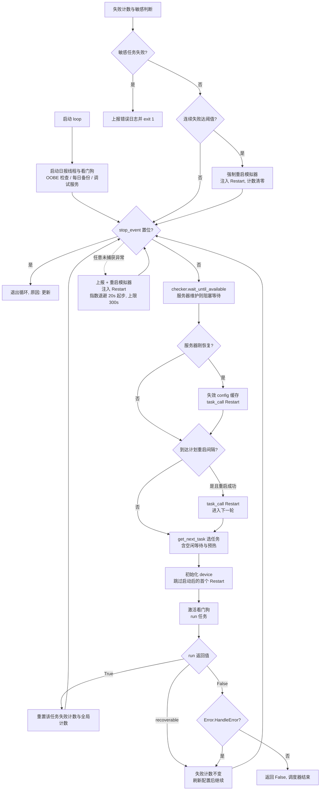
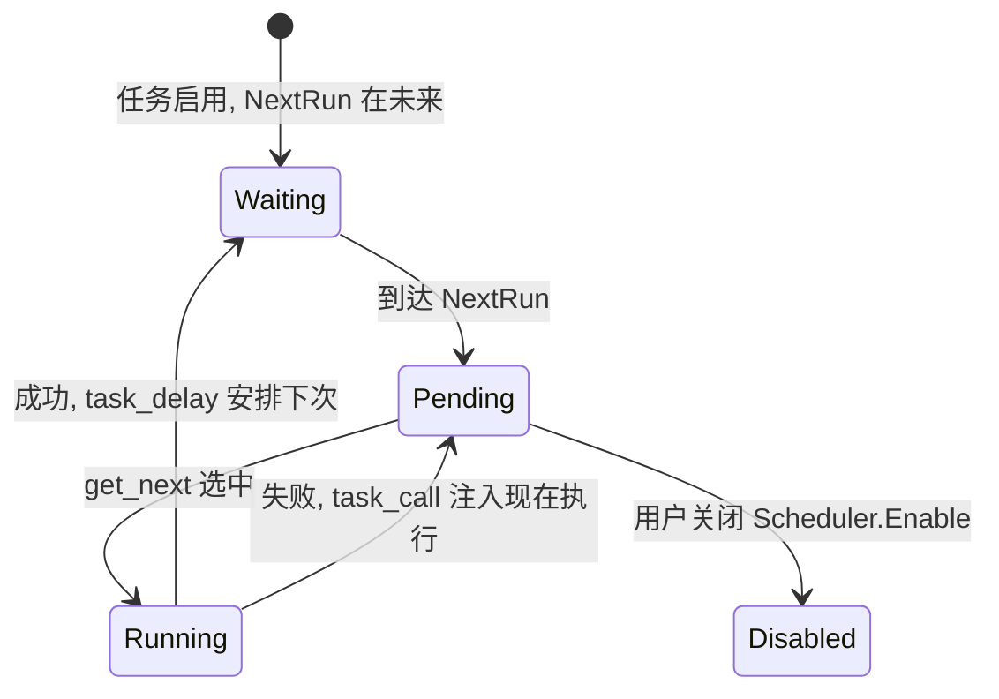

# 调度器（alas.py）

> 每个实例一个调度器进程，主线程串行执行游戏任务，后台线程承担看门狗、日报检查等辅助工作；通过分级异常恢复支持长期运行。

## 1. 模块概述

`alas.py` 是 AzurPilot 的运行时心脏。WebUI 只负责展示与配置编辑，真正的游戏操作由本模块驱动的 worker 进程完成：它不断循环「选出下一个到期任务 → 绑定配置 → 执行 → 按结果安排下次运行」，并在任何失败（游戏卡死、模拟器掉线、代码异常、服务器维护）后自动恢复，而不是退出。

它存在的核心原因有三个：

- **把「何时做什么」从业务代码中剥离**。各游戏功能模块（科研、委托、大世界……）只实现自己的 `run()`，完全不知道彼此存在；排队、优先级、互斥、恢复全部由调度器统一裁决。
- **把失败当作常态而非异常**。模拟器可能崩、网络可能断、游戏客户端可能有 bug，调度器的反应永远是「分级恢复 + 继续跑」，只有两类情况才会终止：代码 bug 连续复现（`ScriptError` 连续 3 次）和敏感任务失败（避免状态或数据损坏）。
- **集中管理模拟器生命周期**。设备的 `Device` 构造以 `auto_start_emulator=False` 创建，模拟器的启动/重启/关闭决策全部上收到调度器，避免设备层与恢复层互相嵌套启动重试。

一个 AzurPilot 实例（一份用户配置）对应一个调度器进程。多个实例并行时，每个进程有独立的 `AzurLaneAutoScript` 与状态。

## 2. 模块职责

### 负责

- 任务调度：按 `SCHEDULER_PRIORITY` 优先级与 `Scheduler.NextRun` 时间戳选出下一个任务。
- 任务分发：把任务命令名动态分发给 `AzurLaneAutoScript` 上的同名方法，方法内再委托给具体业务模块。
- 错误恢复：分类处理运行异常，决定重启游戏、重启模拟器还是终止进程。
- 模拟器管理：计划内定时重启、离线后强制重启、长等待期间省资源关闭与预热。
- 看门狗：任务超时或到达强制定时重启条件时，杀死模拟器进程强制中断任务。
- 服务器维护感知：游戏服务器维护期间暂停调度，恢复后重启游戏。
- 配置热重载：在任务边界与空闲等待中检测配置文件变更，无重启生效。
- 附带生命周期事务：每日备份、每日日报定时检查、错误现场保存与上报。

### 不负责

- 不实现任何游戏操作逻辑（全部委托给 `module/` 下的业务模块）。
- 不管理 WebUI 进程与 API 服务（由 `gui.py` 与 `module/runtime/` 负责，调度器只是被它们创建的子进程）。
- 不解析或校验配置结构（由配置系统 `module/config/` 负责）。
- 不做跨实例协调；多个实例之间没有通信。
- 不直接维护后台定时器——WebUI 侧的更新检查等由独立的 `TaskHandler` 驱动，与本模块无关（见第 7 节）。

## 3. 模块位置

```text
仓库根/
├── alas.py                        # 调度器本体：AzurLaneAutoScript 类 + __main__
└── module/
    ├── config/
    │   ├── config.py              # AzurLaneConfig：get_next / task_call / task_delay / bind
    │   ├── config_manual.py       # SCHEDULER_PRIORITY 默认任务优先级
    │   ├── watcher.py             # ConfigWatcher：配置文件 mtime 监视
    │   └── deep.py                # deep_get / deep_set 等嵌套字典工具
    ├── server_checker.py          # ServerChecker：游戏服务器可用性检查
    ├── server_status.py           # 网关直连查询，作为状态 API 的后备数据源
    ├── exception.py               # 全部自定义异常（本模块的恢复策略依据）
    ├── device/device.py           # Device，device 缓存属性的构造目标
    ├── runtime/
    │   ├── process_manager.py     # WebUI 侧：创建本模块所在 worker 进程、注入 stop_event
    │   ├── task_handler.py        # WebUI 自用后台任务（更新检查等），不是游戏调度器
    │   └── preview.py             # set_task：向 WebUI 发布当前任务边界
    ├── base/backup.py             # 每日备份
    └── statistics/daily_summary.py # 每日日报服务（惰性创建）
```

| 文件 | 作用 |
| --- | --- |
| `alas.py` | 唯一源码文件，包含 `AzurLaneAutoScript` 类与 `__main__` 入口 |
| `module/config/config.py` | 提供 `get_next()`（选任务）、`task_call()`（注入任务）、`task_delay()`（改 NextRun）等调度原语 |
| `module/server_checker.py` | 查询游戏服务器状态，维护期间阻塞调度 |

## 4. 核心入口

| 入口 | 用途 |
| --- | --- |
| `AzurLaneAutoScript(config_name).loop()` | 主入口。WebUI 经 `ProcessManager` 创建 worker 进程后调用；直接运行 `python alas.py` 也走这里（默认配置 `alas`） |
| `AzurLaneAutoScript(config_name).run(command, skip_first_screenshot=True)` | 单任务入口。WebUI「立即执行」某任务时跳过调度循环直接运行 |
| `config.task_call('Restart')` | 跨任务注入入口。业务模块以此请求恢复，效果是把目标任务 `NextRun` 置为现在并强制启用 |
| `AzurLaneAutoScript.stop_event` | 类属性。WebUI 注入由 `State.manager.Event()` 创建的跨进程事件代理，调度器在轮询点响应停止信号 |

追代码建议从 `loop()` 开始读，它是全部生命周期的汇聚点；单次任务的行为再看 `run()`。

## 5. 核心组件

### AzurLaneAutoScript

调度器本体。任务执行与失败计数主要由主线程维护；看门狗、日报与模拟器启停辅助线程另有生命周期和共享状态，不能将整个实例视为单线程对象。修改跨线程状态时需核对第 12 节的事件、读写边界与启停互斥机制。

| 字段 | 类型 | 说明 |
| --- | --- | --- |
| `config_name` | str | 实例配置名，决定读写哪份用户配置 |
| `config` / `device` / `checker` | cached_property | 三大资源，惰性构造；通过 `del_cached_property` 失效重载（见第 13 节） |
| `is_first_task` | bool | 调度器启动后的首个 `Restart` 直接跳过——进程刚启动时游戏通常已就绪，无需重启 |
| `failure_record` | dict[str, int] | 每任务连续失败计数；仅存内存，进程重启即清零 |
| `consecutive_game_stuck` / `consecutive_adb_offline` / `consecutive_unexpected_error` | int | 各类连续故障计数，驱动「重启游戏 → 重启模拟器」的升级 |
| `script_error_count` | int | `ScriptError` 连续计数，达到 3 次退出（代码 bug 重试无意义） |
| `last_emulator_restart_time` | float | 上次计划重启模拟器的 `time.monotonic()`，用于定时重启间隔 |
| `_watchdog_*` | 线程与标志 | 看门狗线程及其「激活」标志，仅任务执行期间激活 |
| `_warmup_measured_cold_seconds` 等 | float/None | 预热实测耗时，用于动态计算下次提前量 |
| `_daily_summary_*` | 线程与服务 | 日报定时检查，默认关闭且完全不创建 |

### 协作对象

| 对象 | 来源 | 说明 |
| --- | --- | --- |
| `Function` | `module/config/config.py` | 配置侧的任务描述：`enable` / `command` / `next_run`，调度器的「任务单」 |
| `ServerChecker` | `module/server_checker.py` | 查公共状态 API，失败时直连游戏网关（`module/server_status.py`）；服务器设为 `disabled` 时恒可用 |
| `Device` | `module/device/device.py` | 截图与控制。构造时 `auto_start_emulator=False`：初始化失败直接上抛，重启模拟器的决定权留给调度器 |

## 6. 工作流程

### 主循环 `loop()`



每轮的固定动作：

1. **停止检查**：`stop_event` 置位（WebUI 要求更新或停止）则退出循环，进程正常收尾。
2. **维护等待**：`checker.wait_until_available()` 在服务器维护或状态 API 与网关都不可达时反复退避查询，不推进任务。恢复瞬间（`is_recovered`）刷新配置并注入 `Restart`，因为阻塞期间游戏状态必然已失效。
3. **计划重启**：`EmulatorManagement_ScheduledEmulatorRestart` 开启时，距上次重启超过 `RestartIntervalHours`（默认 4 小时）就在任务间隙重启模拟器——刻意放在任务之间而非中断正在运行的任务。
4. **选任务**：`get_next_task()`（见下）。
5. **执行**：刷新 `device.config` 指向最新配置，清除卡死与连点记录，置看门狗为活跃，然后 `run(inflection.underscore(task))`。
6. **结果结算**：更新失败计数、触发敏感任务停机判断或连续失败强制恢复、按结果重置各计数器，进入下一轮。

### 空闲等待 `get_next_task()`

`config.get_next()` 有待执行任务时取优先级最高的；否则从等待队列取最近要到期的任务，并给返回副本的 `next_run` 加上囤积时长。两个队列均为空时会抛出 `RequestHumanTakeover`，提示至少启用一个任务。若剩余等待时间较长，按配置决定等待姿态：

- `Optimization_CloseEmulatorDuringLongWait` 且等待超过 3 小时、存在本地模拟器实例：直接关闭模拟器省资源，醒来后 `_start_emulator_after_long_wait()` 重新拉起；非 `Restart` 任务随后注入 `Restart` 走登录流程。
- 否则按 `Optimization_WhenTaskQueueEmpty` 执行：`close_game`（关游戏）、`goto_main`（停在主界面）或 `stay_there`（原地不动）。
- 预热开启（`Optimization_WarmupEnable`）且剩余等待超过提前量时，在任务开始前提前启动模拟器/游戏并登录到主界面，任务到点后直接执行。提前量按场景分别实测记忆：「上次实测 + 2 分钟」，无实测时用 `Optimization_WarmupMinutes`（默认 15 分钟）兜底。预热失败不外抛，注入 `Restart` 交给常规恢复。

等待通过 `wait_until()` 实现：每 5 秒检查一次 `stop_event` 与配置文件 mtime。配置一旦被 WebUI 修改，`should_reload()` 命中，返回 `False`，外层丢弃 config 缓存重新走选择流程——这就是空闲期的配置热重载。

### 任务执行 `run(command)`

`run()` 是任务级异常的唯一出口，返回值三态：

- `True`：成功（含 `TaskEnd` 正常结束）。
- `'recoverable'`：失败但已就地安排恢复（几乎总是 `task_call('Restart')`），不计入任务失败次数。
- `False`：不可恢复失败，计入失败计数。

每个异常分支的第一动作都是 `_check_sensitive_exit()`：严格重启开启（`Error_StrictRestart`）且该任务配置了 `Scheduler.Sensitive` 时，立即保存现场、推送通知并 `exit(1)`——敏感任务（默认 `OpsiCrossMonth`、`OpsiObscure`、`OpsiAbyssal`）出错不做任何自动重启，避免在错误状态上继续写入。是否敏感不是写死的常量，而是运行时读 `{Task}.Scheduler.Sensitive` 配置动态判断，用户可自行调整。

异常分级（详见第 11 节）的本质是一根「恢复力度」的标尺：重启游戏最轻（秒级），重启模拟器最重（分钟级）。多数异常走轻端；`GameStuckError` 与未预期异常带独立连续计数，连续超过 `Error_GameStuckThreshold` 才升级到模拟器重启。恢复动作完成后统一返回 `'recoverable'`。

### 全局异常兜底

`loop()` 的最外层 `except` 是最后一道防线：上报错误日志（仅首次）、可选触发 LLM 错误分析、尽力重启模拟器、注入 `Restart`，然后按 `min(300, 20 × 2^(连续失败-1))` 秒指数退避后重试。调度器**永不因连续失败而退出**，退出只保留给代码 bug 与敏感任务。

## 7. 调用关系

### 上游

| 模块 | 关系 |
| --- | --- |
| `gui.py` → `module/api` → `module/runtime/process_manager.py` | 进程所有者。WebUI 以 `multiprocessing.Process` 启动 worker，把停止事件注入 `AzurLaneConfig.stop_event` 与 `AzurLaneAutoScript.stop_event`，随后调用 `loop()`。用户点击停止时由 `ProcessManager` 直接终止进程树 |
| `module/runtime/updater.py` | 更新流程先停 worker，置位 `stop_event` 使 `loop()` 走「更新退出」路径而非报错退出 |

### 下游

| 模块 | 用途 |
| --- | --- |
| `module/config/` | 选任务（`get_next`）、改计划（`task_delay`）、注入任务（`task_call`）、读跨任务配置（`cross_get`） |
| `module/device/` | 全部截图与控制 I/O；模拟器启停经平台层，受启停互斥锁保护 |
| `module/server_checker.py` | 维护检测 |
| `module/research` 等约 90 个业务模块 | 任务方法的实际实现，全部方法内惰性导入 |
| `module/handler/login.py`、`module/ui/ui.py` | `restart` / `start` / `goto_main` 三个基础任务 |
| `module/notify` | onepush 推送与 WebUI 通知，所有告警双通道发出 |
| `module/llm.py` | 可选的异常 AI 分析（`Error_LlmAnalysis`） |
| `module/base/backup.py` | 每日备份 |
| `module/statistics/daily_summary.py` | 日报生成与推送 |
| `module/base/api_client.ApiClient` | 崩溃日志上报 |

### 与 `TaskHandler` 的区别

`module/runtime/task_handler.py` 的 `TaskHandler` 名字里也有「任务调度」，但它服务于 **WebUI 进程**：在 `module/api/lifecycle.py` 中承载更新检查、定时更新、远程访问保活等生成器任务。它不接触设备、不运行游戏任务，与调度循环零耦合。读到 `TaskHandler` 时不要与 `alas.py` 的调度混淆——游戏任务的唯一调度者是 `loop()`。

## 8. 数据流

```text
用户在 WebUI 修改配置
    └→ 写入 config/<config_name>.json
         └→ 任务边界处 del_cached_property('config') → 下轮重建 AzurLaneConfig 读盘

每轮循环:
    config.get_next() ──► Function(Enable/Command/NextRun)
        │ config.bind(task) 把该任务的参数挂到 self.config.<Group>_<Argument>
        ▼
    run(command) ──► 业务模块 ──► device 截图/点击
        │               └─► task_delay / cross_set ──► config.modified ──► 保存回 JSON
        ▼
    返回值 True / 'recoverable' / False
        └─► failure_record 更新；失败时 task_call('Restart') 改写 Restart.NextRun
             └→ 下一轮 get_next() 自然选中 Restart
```

要点：**调度状态完全落在配置文件的 `Scheduler.NextRun` 字段里**，内存中的 `failure_record` 只辅助恢复决策，进程重启后调度队列原样保留。通知（onepush / WebUI）与 WebUI 当前任务展示（`set_task`）是旁路输出，不参与决策。

## 9. 状态模型

调度器没有显式状态机，但每个任务在其眼中只有有限几个位置：



| 状态 | 载体 | 含义 |
| --- | --- | --- |
| Waiting / Pending | `Scheduler.NextRun`（持久化） | 未到期 / 已到期待选 |
| Running | 调度器主线程 | 正在执行；期间看门狗计时 |
| 失败计数 | `failure_record`（内存） | `True` 清零，`'recoverable'` 保持不变，`False` 加一 |

「囤积」用于延后唤醒、聚合任务。`Optimization_TaskHoardingDuration` 大于 0 时，等待任务的返回副本会在原 `next_run` 上加上囤积时长，例如 12:00 到期、囤积 10 分钟，返回的等待目标为 12:10，不会提前执行。处于 `is_hoarding_task` 状态时，待执行判断使用 `now - hoarding`，与延后策略配套；该等待副本不会直接改写持久化计划。选出待执行任务或进入实际执行阶段时会复位囤积标志。

## 10. 配置

调度器自身的配置挂在 `Alas` 任务下（`self.config.Group_Argument` 访问），任务级配置在每个任务的 `Scheduler` 组：

| 配置 | 类型 | 默认值 | 说明 |
| --- | --- | --- | --- |
| `<Task>.Scheduler.Enable` | checkbox | false | 任务开关；`Restart` 恒为 true |
| `<Task>.Scheduler.NextRun` | datetime | 2020-01-01 | 调度时间戳，早于当前时间即待执行 |
| `<Task>.Scheduler.SuccessInterval` / `FailureInterval` | int | 0 / 120 | `task_delay(success=...)` 用的成功/失败重跑间隔 |
| `<Task>.Scheduler.ServerUpdate` | time | 00:00 | 服务器刷新点，每日重启的排期基准 |
| `<Task>.Scheduler.Sensitive` | checkbox | false | 敏感任务标记；`OpsiCrossMonth`/`OpsiObscure`/`OpsiAbyssal` 默认 true |
| `<Task>.Scheduler.PushNotification` | checkbox | false | 该任务每次结束后推送结果 |
| `Error.HandleError` | bool | true | 关闭后非可恢复失败将终止调度而非继续 |
| `Error.StrictRestart` | bool | false | 严格重启总开关（配合 `Sensitive` 生效） |
| `Error.GameStuckRestart` / `GameStuckThreshold` | bool/int | false / 3 | 卡死是否允许升级到模拟器重启及阈值 |
| `Error.AdbOfflineThreshold` | int | 3 | 模拟器重启超过该次数后拉长等待间隔（不放弃） |
| `Error.WatchdogEnable` / `WatchdogTaskEnable` / `WatchdogTaskTimeout` | bool/bool/分钟 | false/false/120 | 看门狗总开关、任务超时子开关与阈值；超时为 0 表示禁用 |
| `Error.LlmAnalysis` | bool | true | 异常时调用 LLM 分析 |
| `Optimization.WhenTaskQueueEmpty` | option | goto_main | 空闲行为：stay_there / goto_main / close_game |
| `Optimization.CloseEmulatorDuringLongWait` | checkbox | true | 等待超过 3 小时关闭模拟器 |
| `Optimization.WarmupEnable` / `WarmupMinutes` | bool/分钟 | true/15 | 任务预热开关与无实测时的提前量 |
| `Optimization.TaskHoardingDuration` | int | 0 | 任务囤积分钟数 |
| `EmulatorManagement.ScheduledEmulatorRestart` / `ForceScheduledRestart` | checkbox | false | 计划重启与「运行中也强制中断」 |
| `EmulatorManagement.RestartIntervalHours` | int | 4 | 计划重启间隔 |
| `EmulatorManagement.DeepRestartAfterFailures` | int | 0 | 连续重启失败 N 次后改用 MuMu 深度重启；0 禁用 |
| `Backup.Enable` / `Backup.KeepDays` | bool/int | true/7 | 每日备份与保留天数 |
| `DailySummary.Enable` / `TriggerTime` | bool/str | false / 20:00 | 每日日报 |
| `Restart.RandomDelay` | str | "5, 50" | 每日重启在服务器刷新后的随机延后区间（分钟） |
| `YukikazeTaskManager.TaskPriorityAdjustment` | textarea | 空 | 用户自定义任务优先级，覆盖默认值 |

配置间关联：严格停机 = `Error.StrictRestart` 与 `{Task}.Scheduler.Sensitive` 同时为真，两处分别独立可配，因此可以对单个任务精细控制；看门狗的两项检测共用一个线程，但由各自的子开关单独控制。`Emulator_PackageName` / `Emulator_ServerName` 既决定游戏包名，也是日报判断服务器的依据。

## 11. 异常与错误处理

`run()` 内按异常类型分级；所有分支先过敏感任务检查，再执行恢复动作：

| 异常 | 原因 | 处理 | 返回 |
| --- | --- | --- | --- |
| `TaskEnd` | 任务主动结束（如情绪不足延迟） | 视为正常结束 | `True` |
| `GameNotRunningError` | 游戏进程不存在 | 注入 `Restart` | `'recoverable'` |
| `GameStuckError` / `GameTooManyClickError` | 画面无推进 / 重复连点 | 连续计数达 `GameStuckThreshold` 则重启模拟器，否则 10 秒后重启游戏 | `'recoverable'` |
| `GameBugError` | 客户端 bug | 重启游戏 | `'recoverable'` |
| `GamePageUnknownError` | 页面无法识别 | 先查服务器：可用则重启游戏；维护中则阻塞等待，等完返回 | `'recoverable'` / `False` |
| `ScriptError` | 代码 bug | 连续 3 次内注入 `Restart` 重试；达到 3 次退出 | `'recoverable'` / `exit(1)` |
| `EmulatorNotRunningError` | 模拟器离线 | `_try_restart_emulator()`（永不放弃，超阈值只加长间隔）+ `Restart` | `'recoverable'` |
| `RequestHumanTakeover` | 严重到无法安全自动判断 | 也先尝试重启模拟器自动恢复，不再直接终止 | `'recoverable'` |
| `AutoSearchSetError` | 自动搜索设置失败 | 重启游戏 | `'recoverable'` |
| 其他 `Exception` | 未预期异常 | 连续计数达 `GameStuckThreshold` 升级为重启模拟器，否则仅重启游戏 | `'recoverable'` |
| `EmulatorOpBusy` | 已有模拟器启停操作在跑 | 放弃本轮恢复，后台操作结束后下一轮调度接手（非错误，是并发保护） | `False`（重启函数内消化） |

调度循环兜底（`loop()` 最外层 `except`）：保存并上报错误日志、重启模拟器、注入 `Restart`、按 20 秒起步、300 秒封顶的指数退避后重试，永不退出。

终止路径只有四条：`ScriptError` 连续 3 次；敏感任务失败（`_check_sensitive_exit` 或失败计数命中）；`stop_event` 更新信号；配置/设备初始化即失败。其余一切故障都应自动恢复。

**为什么恢复性失败不计入失败次数**：失败计数驱动的是「强制重启模拟器」这类高代价动作。可恢复错误已经各自触发过针对性恢复（重启游戏或模拟器），再累加计数只会让本已自愈的问题被反复升级；同时计数不清零，真正的顽固故障仍会在下一轮 `False` 结果中累积到阈值。

**为什么主循环捕获一切异常后继续跑**：目标是无人值守 7×24 运行，任何一次未预期异常终止进程，损失的是整个夜间挂机时段；而「重启模拟器 + 注入 Restart」对绝大多数故障都是有效复位。指数退避保证重试有节制，避免在硬故障上打转刷日志。

## 12. 并发与线程模型

调度器所在的 worker 进程由 WebUI 的 `ProcessManager`（`multiprocessing.Process`）创建，主线程独占 `loop()`。

| 线程 | 创建者 | 生命周期 | 职责 |
| --- | --- | --- | --- |
| 主线程 | ProcessManager | 进程全程 | `loop()` 调度与任务执行 |
| 看门狗 `alas-watchdog`（daemon） | `_start_watchdog()`，任一子功能开启才创建 | 随进程退出 | 每 30 秒检查任务是否超时、是否到达强制定时重启条件 |
| 日报 `daily-summary-scheduler-<config>`（daemon） | `_start_daily_summary_scheduler()`，仅日报开启时创建 | 随进程退出或功能关闭 | 每秒检查是否到达日报触发窗口 |
| 模拟器启停 worker（daemon，瞬时） | `_emulator_op_with_timeout()` | 操作结束或被超时放弃 | 真正执行 stop/start，超时放弃后仍持有平台启停锁直到完成 |

关键约定：

- **看门狗激活窗口**。`_watchdog_active` 仅在 `run()` 前后置位/复位，空闲等待与退避 `sleep` 期间自动暂停，避免把正常的长等待误判为卡死。
- **看门狗为什么杀模拟器而不是杀任务**：任务主线程可能阻塞在 uiohook 级的底层 I/O（uiautomator2 HTTP、ADB shell）中，Python 层无法安全中断线程；杀死模拟器进程会让主线程的下一次 I/O 调用失败并抛异常，从而自然汇入统一的异常恢复流程。这比从外部强杀线程安全得多。
- **模拟器启停的并发保护**：`_emulator_op_with_timeout` 用独立线程执行操作并设硬超时（600 秒，覆盖模拟器完整冷启动预算）；超时放弃的线程仍在真实操作模拟器并持有平台层启停互斥锁，后续任何启停请求都会收到 `EmulatorOpBusy` 而被跳过，防止「一个线程正在启动、另一个随即关闭」的踩踏。
- **跨进程停止信号**：WebUI 生命周期通过 `State.manager.Event()` 创建事件代理并交给 `ProcessManager`，worker 将其挂到 `AzurLaneConfig.stop_event` 与 `AzurLaneAutoScript.stop_event`。主循环和 `wait_until()` 轮询该代理，在检查点响应停止请求；普通 `threading.Event` 不能替代这条跨进程信号链。看门狗自身的 `_watchdog_stop` 才是进程内线程事件。
- **线程间不共享 config 对象**：日报线程刻意不访问 `self.config`（任务执行期间它绑定着当前任务参数，跨线程重载会破坏一致性），而是直接读配置文件并按 mtime 缓存只读快照。

## 13. 缓存与持久化

| 数据 | 位置 | 生命周期 |
| --- | --- | --- |
| `config` / `device` / `checker` | `cached_property`（实例 `__dict__`） | 手动失效：`del_cached_property` 在任务结束、错误恢复、服务器恢复、模拟器重启后触发，下次访问重建 |
| `failure_record` | 内存 dict | 进程内累计；成功清零，进程重启清零 |
| `_warmup_measured_cold_seconds` / `_warmup_measured_game_only_seconds` | 实例属性 | 每次预热成功后覆盖，用于动态计算提前量 |
| `_i18n_task_names` | 模块级缓存 | 进程内一次加载，供推送通知使用本地化任务名 |
| `_daily_summary_settings` | 实例属性 + 文件 mtime 比对 | 配置文件变更后重读 |
| 错误现场 | `./log/error/<config>/<时间戳>/` | 截图与日志均经敏感信息遮罩后落盘，按 `Error_SaveErrorRetentionDays` 过期后删除或备份到 `bak/` |

缓存失效是本模块的「配置热重载」机制：**不做增量合并，直接丢弃整个 `config` 缓存让下轮任务重新加载**。这保证每次任务绑定参数时拿到的是磁盘最新值，代价是任务之间才生效、任务执行中途不切换（任务中途的配置感知由配置系统的 `check_task_switch` 负责，见 [配置系统](../config.md)）。注意：`module/config/deep.py` 中的 `deep_iter_diff` 目前没有调用方，热重载并不基于字典差异比较，而是基于 mtime 检查 + 整体重建。

## 14. 生命周期

1. **创建**：WebUI 请求启动实例时，`ProcessManager` 拉起 worker 进程，注入 `stop_event`，构造 `AzurLaneAutoScript(config_name)` 并调用 `loop()`。`__init__` 只初始化轻量状态，不碰配置与设备。
2. **初始化**（`loop()` 开头）：文件日志 → 日报线程（可选）→ 看门狗（可选）→ OOBE 检查 → 每日备份 → 调试服务（`ALAS_DEBUG_SERVER=1` 时）。`config` 在此处首次加载；失败即 `exit(1)`，由父进程感知退出。
3. **运行**：无限调度循环。`config` / `device` / `checker` 在首次访问时惰性构造，之后按需失效重建。
4. **销毁**：三条正常退出路径（`stop_event` 置位、`loop()` 返回 `False`、内部 `exit`）最终都结束进程；日报线程在 `stop_event` 路径被显式停止，其余 daemon 线程随进程消亡。模拟器与游戏进程不随 worker 退出而关闭（收尾动作由 WebUI 侧的独立收尾进程按配置执行）。

## 15. 扩展方式

新增一个可调度任务：

1. 在 `module/config/argument/task.yaml` 注册任务与菜单，在 `argument.yaml` 定义参数（含 `Scheduler` 组），运行配置生成器（见 [配置系统](../config.md)）。
2. 在 `module/<功能>/` 实现处理器，提供 `run()`。
3. 在 `AzurLaneAutoScript` 上添加与任务命令同名（驼峰转下划线）的方法，保持统一形态：

```python
def my_feature(self):
    from module.my_feature.my_feature import MyFeature  # 方法内惰性导入
    MyFeature(config=self.config, device=self.device).run()
```

4. 若默认优先级不合适，在 `module/config/config_manual.py` 的 `_DEFAULT_SCHEDULER_PRIORITY` 中插入；用户可用 `YukikazeTaskManager.TaskPriorityAdjustment` 覆盖。
5. 在 `module/config/i18n/*.json` 补齐任务名翻译（推送通知会用到）。

无需任何注册动作：`run()` 通过 `self.__getattribute__(command)()` 按名字分发。业务模块内部通过 `config.check_task_switch()` 等机制感知任务切换，调度器不主动中断它们。

## 16. 修改注意事项

- **`run()` 的每个异常分支都必须先调用 `_check_sensitive_exit()`**。新增异常处理时漏掉它，敏感任务就会在应当停机时被自动重启，这是保护用户数据的关键闸门。
- **不要恢复 `RESTART_SENSITIVE_TASKS` 常量**。敏感任务已是动态配置（`{Task}.Scheduler.Sensitive`），静态列表无法表达用户自定义；该常量已从代码删除。
- **不要让 `loop()` 在任何新分支中主动退出**。「永不主动退出」是 7×24 运行的根基；新故障一律转为 `'recoverable'` 或带退避的重试。
- **删除 `config` 缓存的时机有讲究**：成功后删除是为了让任务期间用户的新修改生效；模拟器重启后删除 `device` 缓存是为了强制重建连接。新增恢复路径时想清楚哪些缓存已经失效。
- **模拟器启停必须经 `_emulator_op_with_timeout` 包装**，且遇到 `EmulatorOpBusy` 只能放弃本轮。绕过它直接调用平台启停会打破互斥锁保护，复现「模拟器永远起不来」的历史故障。
- **看门狗的时间窗语义**：`_watchdog_active` 在任务执行前置位、`finally` 复位，并覆盖退避等待。在调度器里新增长时间非任务阻塞（如新的等待循环）时，确认它不在看门狗激活窗口内，或已有对应的豁免。
- **任务方法的惰性导入是有意设计**，新增任务方法应保持该形态：启动时只加载调度与配置，任务模块在首次执行时才导入——既压低首帧延迟，也让单个业务模块的导入失败只影响该任务而非整个调度器；同时任务参数绑定先于模块导入，识别资源才能按当前实例的服务器加载。
- **`wait_until()` 中的 `exit(0)`** 是故意的：等待期收到更新信号时直接终止进程，`SystemExit` 由父进程的 worker 包装层捕获并归类为「更新退出」。改动退出方式前先看 `process_manager` 如何解释退出码。

## 17. 已知限制

- `run()` 与 `loop()` 都是数百行的长方法，异常矩阵以内联分支表达，新增异常类型时容易遗漏对称的通知与计数处理。
- 返回值 `True / False / 'recoverable'` 是弱类型协议，调用方靠字符串字面量判断，重构时需全局搜索。
- 每任务失败计数只存内存，调度器重启后清零；对「连续失败即停」的敏感任务意味着重启本身会重置保护。
- `loop()` 顶部关于看门狗「监测日志心跳」的注释与实际实现有出入：看门狗当前实现的是两项基于时间的检查（任务超时、强制定时重启），并无日志心跳检测；长时间无日志导致的卡死实际由设备层的 `GameStuckError` 机制兜底。阅读时以 `_watchdog_loop()` 为准。
- 空闲「关闭模拟器」的省资源分支依赖本地模拟器实例，无线 ADB / SSH 远程设备会跳过该优化。
- `emulator_manager()` 任务方法内联了完整的 SSH 远程执行逻辑（含临时密钥文件处理），是任务方法中唯一不遵循「委托业务模块」统一形态的特例。

## 18. 示例

最小任务方法与一次完整调度往返：

```python
# alas.py 中新增任务方法
def my_feature(self):
    from module.my_feature.my_feature import MyFeature
    MyFeature(config=self.config, device=self.device).run()
```

```text
get_next() 选中 MyFeature（Enable=true，NextRun 已过期）
  → bind：self.config.MyFeature_Xxx 可用
  → run('my_feature')：截图 → handle 悬浮球 → MyFeature().run()
  → 模块内部用 self.config.task_delay(success=True) 把 NextRun 推到下次
  → run 返回 True → 失败计数清零 → del config 缓存 → 下一轮
若模块内抛 GameStuckError：
  → save_error_log() → 计数 → 10 秒后重启游戏 → 返回 'recoverable' → 调度继续
```

## 19. 调试方法

- **日志文件**：`loop()` 启动即按实例名设置文件日志；任务边界用 `logger.hr(task)` 分隔，全文检索 `[Alas]` 可看到调度决策链（等待、注入 Restart、重启模拟器、看门狗触发）。
- **错误现场**：`./log/error/<config_name>/<时间戳>/` 内含最近截图与裁剪后的 `log.txt`，已做敏感信息遮罩；保留天数由 `Error_SaveErrorRetentionDays` 控制（0 = 不清理），过期现场按 `Error_SaveErrorBackUpMethod` 删除、拷贝备份或压缩备份到 `log/error/<实例名>/bak/`。
- **常见问题排查顺序**：模拟器反复离线先看 `连续次数 X/阈值` 与 `_try_restart_emulator` 的退避日志；任务反复失败看 `failure_record` 相关的「连续失败 N 次」日志；任务卡住但日志还在动，怀疑逻辑死循环，开 `Error.WatchdogEnable` + `WatchdogTaskEnable` 验证；服务器相关看 `[服务器检查]` 前缀日志。
- **WebUI 侧**：worker 通过日志队列与 `set_task()` 向父进程发布实时日志与当前任务名，前端「日志」页即来源于此。
- **本地调试服务**：环境变量 `ALAS_DEBUG_SERVER=1` 时启动仅监听本机的调试服务，用于向统计库注入测试数据，默认关闭。

## 20. 相关模块

- [WebUI 启动器](gui.md) —— 调度器进程的创建者与停止入口
- [运行时服务](../webui/runtime.md) —— `ProcessManager` / `TaskHandler` / 更新器等进程管理层
- [配置系统](../config.md) —— `get_next` / `task_call` / `bind` / 热重载的实现
- [设备层](../device.md) —— `Device` 与模拟器平台层，调度器恢复动作的执行者
- [UI 导航](../ui.md) —— `goto_main` 等空闲行为的落地
- [守护模式](../infra/daemon.md) —— 以任务形态长期驻留的守护类功能
- [编码规范](../overview/conventions.md) —— 状态循环与错误处理约定
