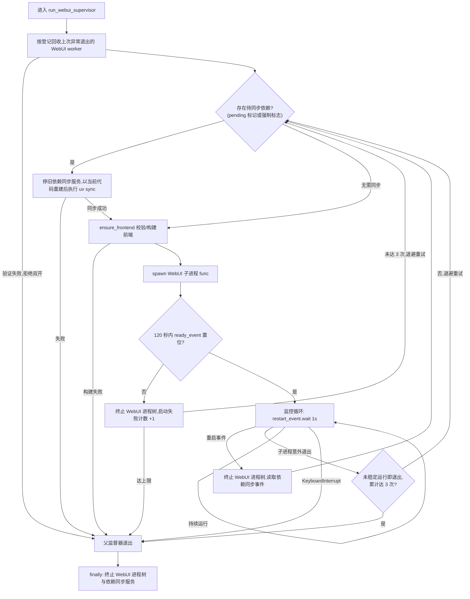
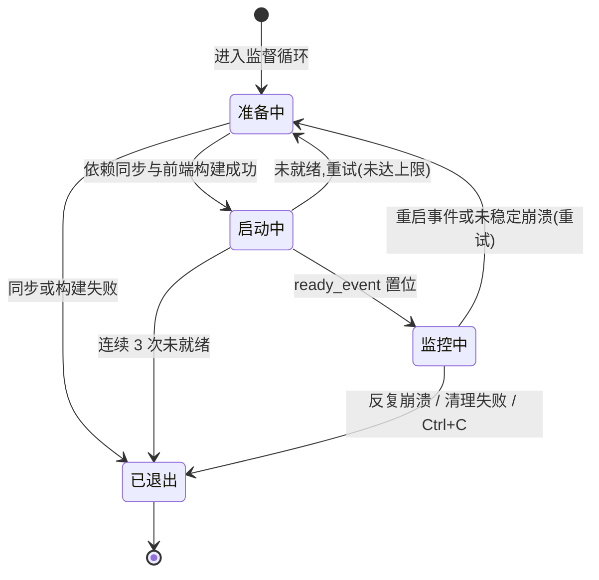

# WebUI 启动器（gui.py）

> WebUI 体系的最外层入口：以「父监督器 + 服务子进程」的结构拉起 uvicorn/Starlette，管理端口监听、热重载、孤儿进程回收与依赖同步；进程与端口归它管，业务逻辑一概不管。

## 1. 模块概述

gui.py 是用户进入系统的第一个进程。用户执行 `python gui.py`（Windows 启动器 `deploy/launcher/Alas.bat` 会以 `--electron` 调用它，Docker 镜像的 `CMD` 也是它）之后，由它完成前端构建检查、依赖同步、端口监听，直到浏览器可以打开 `http://{host}:{port}`。

它解决的核心问题是：一个按 7×24 小时运行设计的自动化框架，其控制台自身也要能**安全地自我更新**。更新会改写源码和 `.venv`，而一个正在运行的进程无法给自己换环境，也不可靠地重启自己。因此 gui.py 把职责拆成两层：真正提供 HTTP/WS 服务的代码运行在一个可以随时终止重建的**子进程**里；父进程（`run_webui_supervisor`）只持有子进程句柄、跨进程事件和一个独立的依赖同步服务，负责在「更新完成」「子进程崩溃」「上次异常退出留下残留」这几种情况下把环境收拾干净，再拉起新的服务子进程。

第二层拆分是**依赖同步服务**：`uv sync` 会替换正在被当前解释器使用的 `.venv`，运行中的 WebUI 进程绝不能自己执行它。父进程把这个操作交给一个 daemon 子进程（`deploy/uv.py` 的 `dependency_sync_service`），平时空闲等待请求，更新后先停旧服务（旧代码）、再用新代码重建一个执行同步，保证「跑同步的代码」和「被同步的环境」永远分离。

至于每个配置实例的调度器（`alas.py` 的 `AzurLaneAutoScript`），gui.py **不直接拉起**它们：worker 进程由 WebUI 子进程内的 `module/runtime/process_manager.py` 在应用 lifespan 启动时创建（见 [运行时服务](../webui/runtime.md)）。gui.py 只在两个边界上与 worker 打交道——启动前按持久化登记回收孤儿，以及终止 WebUI 子进程时确认其登记的 worker 一并退出。这个边界是刻意的：gui.py 保持极薄，不需要导入游戏模块，父进程因此可以在更新替换代码后继续存活。

整个系统因此形成三层进程模型：

| 层 | 进程 | 诞生方式 | 职责 |
| --- | --- | --- | --- |
| 监督层 | gui.py 主进程 | 用户/启动器直接运行 | 端口无关；重试、回收、依赖同步、热重载 |
| 服务层 | 名为 `gui` 的子进程 | 父进程 `multiprocessing.Process(target=func)` | uvicorn + `module.api` 的全部 HTTP/WS 服务 |
| 工作层 | 每个配置实例一个 worker | 服务层内的 `ProcessManager` | 运行 `AzurLaneAutoScript`，控制设备 |

## 2. 模块职责

### 负责

- 解析命令行参数（`--host`/`-p`/`--key`/`--ssl-key`/`--ssl-cert`/`--electron`/`--run` 等），与 `config/deploy.yaml` 的 `Webui*`、`EnableReload` 等设置合并出最终监听配置。
- 创建 IPv4/IPv6 双栈监听 socket，并在 IPv6 不可用时按策略降级。
- 以 uvicorn 运行 ASGI 应用工厂 `module.api.app:create_app`，并通过 `ready_event` 向父进程报告「端口已实际监听」。
- 热重载模式下的监督循环：启动重试、运行期崩溃重试、响应重启事件、重建子进程。
- 启动前孤儿 worker 回收与「第二个 WebUI」拒绝逻辑（基于 `worker_registry` 的持久化身份）。
- 依赖同步服务的创建、请求调度（`_sync_dependencies`）与回收，以及「更新后强制先同步再启动」的保障。
- 调用 `deploy.frontend.ensure_frontend` 在创建 WebUI 前校验/构建 React 静态资源。
- 进程树终止（`_stop_webui_process_tree` 及其辅助函数），保证不留重复控制设备的残留进程。

### 不负责

- HTTP/WS 协议、认证、路由等 API 语义：全部在 `module/api`（见 [API 服务](../webui/api.md)）。
- worker（Alas 实例进程）的日常生命周期：启动、停止、状态机、日志转发由 `ProcessManager` 在 WebUI 服务进程内完成，gui.py 只做「兜底回收」。
- 更新的检查与执行（git、恢复计划、等待实例退出）：`module/runtime/updater.py` 负责，gui.py 只消费它发出的重启/同步事件。
- 前端页面逻辑与构建细节：`frontend/`（构建触发见 [前端](../webui/frontend.md)）。
- 游戏识别、调度等一切业务逻辑：属于 `module/` 各模块与 [调度器](alas.md)。
- MCP SSE 服务的实现（服务进程内以 `/mcp` 挂载，见 [MCP SSE 服务器](mcp-server.md)）。

## 3. 模块位置

```text
AzurPilot/
├── gui.py                       本模块：监督循环 + WebUI 服务子进程入口
├── deploy/
│   ├── frontend.py              ensure_frontend：前端指纹校验与 npm 构建
│   ├── uv.py                    dependency_sync_service：依赖同步服务进程体
│   └── launcher/Alas.bat        以 pythonw gui.py --electron 启动的桌面入口
├── module/api/app.py            uvicorn 通过工厂字符串加载的 create_app
├── module/runtime/
│   ├── setting.py               State 跨进程状态、依赖同步 pending 标记
│   ├── process_control.py       进程身份验证（PID + 创建时间）与进程树终止
│   ├── worker_registry.py       worker 持久化登记（cache/webui-workers.json）
│   └── updater.py               热重载事务的发起方（置位重启/同步事件）
└── config/deploy.yaml           WebuiHost/WebuiPort/EnableReload 等设置来源
```

| 文件/符号 | 作用 |
| --- | --- |
| `func()` | 服务子进程入口：环境配置、参数解析、创建 socket、运行 uvicorn |
| `run_webui_supervisor()` | 热重载模式的父进程监督循环（本模块的核心） |
| `_create_dual_stack_sockets()` | 同端口创建 IPv4+IPv6 两个监听 socket，支持降级 |
| `_run_uvicorn_server()` / `_watch_server_started()` | 运行 uvicorn 并在 `server.started` 后置位就绪事件 |
| `_recover_orphaned_workers()` | 启动前回收上次异常退出的 WebUI 及其 worker |
| `_prepare_dependency_sync_before_webui_start()` | 创建 WebUI 前完成待处理的依赖同步 |
| `_stop_webui_process_tree()` / `_stop_registered_workers()` | 按进程树与持久化登记回收 WebUI 及 worker |
| `State`（`module/runtime/setting.py`） | 父子进程共享的事件与部署配置载体 |

## 4. 核心入口

| 入口 | 用途 |
| --- | --- |
| `python gui.py`（`__main__`） | 主入口：强制 `spawn` 启动方式后按 `EnableReload` 分流 |
| `run_webui_supervisor()` | 热重载模式的父进程监督循环，`EnableReload=true` 时由主入口调用 |
| `func(ev, dependency_sync_event, ready_event)` | 服务子进程入口，由监督器 `spawn`（进程名 `gui`）；非重载模式直接调用 `func(None, None)` |
| `func` 内的 uvicorn 工厂字符串 `"module.api.app:create_app"` | ASGI 应用实际创建点，服务重启后以新代码重新 import |

追代码建议：先读 `__main__` 看分流，再读 `run_webui_supervisor` 看监督循环主干，`func` 与各 `_prepare/_stop/_recover` 辅助函数按需展开。

## 5. 核心组件

### 监督循环常量

| 常量 | 值 | 说明 |
| --- | --- | --- |
| `WEBUI_READY_TIMEOUT` | 120 秒 | 等待子进程完成 socket 监听的期限 |
| `WEBUI_START_RETRY_LIMIT` | 3 | 启动失败连续重试上限，超限父进程退出 |
| `WEBUI_RUNTIME_RETRY_LIMIT` | 3 | 未稳定运行即崩溃的容忍次数，超限退出以防无限崩溃循环 |
| `WEBUI_STABLE_RUNTIME` | 60 秒 | 子进程存活超过该时长后重置「不稳定退出」计数 |
| `DEPENDENCY_SYNC_START_RETRY_LIMIT` | 3 | 依赖同步服务进程创建重试次数 |
| `DEPENDENCY_SYNC_RESPONSE_TIMEOUT` | 30 分钟 + 60 秒 | 依赖同步响应总预算（`DEPENDENCY_SYNC_TIMEOUT` 加通信余量） |

### 关键函数分组

| 函数 | 分组 | 说明 |
| --- | --- | --- |
| `func` | 服务子进程 | 设置事件循环策略、绑定 `State.restart_event` 等事件、构建 uvicorn 配置并运行 |
| `_create_dual_stack_sockets` | 网络 | 见「工作流程」的双栈细节 |
| `_wait_for_webui_ready` | 监督 | 轮询就绪事件与子进程存活，任一失败即返回 |
| `_stop_webui_process_tree` / `_stop_registered_workers` | 终止 | 先杀根进程树，再按登记逐个回收 worker |
| `_recover_orphaned_workers` | 恢复 | 验证旧所有者身份后回收其 worker |
| `_prepare_dependency_sync_before_webui_start` / `_sync_dependencies` / `_complete_pending_dependency_sync` | 依赖同步 | 与同步服务进程的完整请求-响应事务 |

### 依赖同步服务（`deploy/uv.py`）

一个常驻 daemon 子进程，通过两个 `multiprocessing.Queue` 与父进程通信：父进程投入 `"sync"` 或 `"shutdown"`，服务执行 `sync_project_venv`（uv 准备解释器、建 venv、`uv sync --frozen`）并把 `{success, command, output, error}` 作为响应返回。它存在的原因：**运行中的 WebUI 进程不能修改自己脚下的 Python 环境**——`.venv` 被替换时当前进程的已加载模块与新磁盘状态会立刻不一致。

### 跨进程状态（`State`，见 [运行时服务](../webui/runtime.md)）

gui.py 通过 `State` 与子进程/更新器交换信息：

| 字段 | 类型 | 说明 |
| --- | --- | --- |
| `State.deploy_config` | `DeployConfig` | 读 `config/deploy.yaml`（`WebuiHost`、`WebuiPort`、`EnableReload` 等） |
| `State.restart_event` | `multiprocessing.Event` | 子进程置位 → 父进程终止并重建 WebUI（热重载信号） |
| `State.dependency_sync_event` | `multiprocessing.Event` | 子进程置位 → 父进程在重建前强制执行依赖同步 |
| `State.electron` / `State.webui_host` | `bool` / `str` | 供 `module/api` 判断日志输出与密码生成策略 |

### worker 登记记录（`worker_registry`）

`cache/webui-workers.json` 中的每条记录形如 `{"pid": int, "created_at": float}`，外层附 `owner_pid`/`owner_created_at`。**创建时间与 PID 组成进程身份**：仅凭 PID 终止进程在 PID 复用后可能误杀无关进程，所以所有终止动作前都要用 psutil 比对 `create_time`。

## 6. 工作流程

### 两种启动模式

主入口按 `State.deploy_config.EnableReload` 分流：

- **热重载模式（默认）**：`run_webui_supervisor()`，父进程常驻，子进程可反复重建。
- **直连模式**：`func(None, None)`，当前进程直接当服务跑；此模式下 `State.restart_event` 为 `None`，更新器会拒绝执行需要重载的更新（无法安全恢复）。

### 监督循环（热重载模式）



循环每轮的顺序有讲究：依赖同步先于前端构建、前端构建先于 spawn 子进程。首次 `npm ci` 可能远超 120 秒，若放进子进程的「等待监听」计时内，正常安装也会被误判为启动失败——因此这两步必须在父进程、计时开始之前完成。

### 服务子进程内部（`func`）

1. 设置平台 asyncio 策略（Windows 用 Proactor，macOS 关闭 fork 安全检查）。
2. 把传入事件挂到 `State`，再次执行 `ensure_frontend()`（覆盖直连模式）。
3. 解析参数并与部署设置合并：`host = args.host or WebuiHost or "0.0.0.0"`，端口同理，代码默认 `25548`。
4. 通配地址（`0.0.0.0`、`::`、`[::]`）时显式创建双栈 socket 后交给 uvicorn；具体主机则由 uvicorn 自行监听。
5. 运行 `uvicorn.Server`；`_watch_server_started` 线程轮询 `server.started`，监听成功即向父进程置位 `ready_event`。
6. 应用创建（`create_app`）发生在 uvicorn 导入工厂字符串时，此时 `--key`/`--run` 参数与密码策略由 `module/api` 处理（见 [API 服务](../webui/api.md)）。

### 双栈监听的设计

`_create_dual_stack_sockets` 对 `0.0.0.0`/`::` 显式绑定 `0.0.0.0` 与 `::` 两个 socket，并为 IPv6 socket 设置 `IPV6_V6ONLY=1`。原因有二：一是 Windows 会把 IPv6 通配地址当作「仅 IPv6」监听，依赖内核双栈行为不可移植；二是显式分洞后可以精确降级——host 为 `0.0.0.0` 时 IPv6 建立失败（地址族不可用等错误）仅告警并退回 IPv4；host 为 `::` 时则要求两个族都必须成功。非 Windows 平台额外设置 `SO_REUSEADDR`；任一 socket 建立失败时已创建的全部关闭后再抛出。

### 热重载事务（与更新器的协作）

更新由子进程内的更新器驱动（细节见 [运行时服务](../webui/runtime.md)），gui.py 只是事务的收尾者：

1. 更新器停止全部 worker，**先写盘持久化恢复计划**：`config/webui-dependency-sync-pending`（同步待办标记）与 `config/reloadalas`（待恢复实例名单）。
2. 执行 git 更新（成败与否都不回滚计划——reset/pull 可能已部分完成，环境只能以「同步后重启」收场）。
3. 置位 `State.dependency_sync_event`（请求同步）与 `State.restart_event`（请求重启）。
4. 父监督循环观察到重启事件，终止旧 WebUI 进程树，读取依赖同步事件：已置位则下一轮先停旧同步服务、以**更新后的代码**重建服务并执行 `uv sync`，成功后清除 pending 标记。
5. 重建前端、spawn 新子进程；`create_app` 的 lifespan 启动逻辑读取 `reloadalas`，把更新前运行的实例全部拉回（恢复逻辑属于 `ProcessManager.restart_processes`）。

### 孤儿恢复

父进程启动第一步是 `_recover_orphaned_workers`：读取登记文件中的旧 `owner` 身份——仍在运行则拒绝启动第二个 WebUI（防止双实例争抢设备）；身份无法验证时宁可拒绝启动也不冒险；已退出或 PID 已复用则按登记逐个回收 worker（每条记录发信号前重新验证创建时间）。之所以需要这套机制：子进程被强杀时 `finally` 不会执行，其 worker（每个配置实例一个进程，仍在控制模拟器）会变成孤儿残留；没有登记与回收，下次启动就会出现两个进程同时操作同一台模拟器。

### 停止路径

`_stop_webui_process_tree` 的顺序不可颠倒：先停根 WebUI 进程（含其下 uvicorn、SyncManager 等整棵树），根确认退出后才按登记回收 worker。反过来会留下竞态——根进程还活着就可能再次创建 worker。根无法停止时**保留登记**供下次重试，绝不清空登记后带着活 worker 重启。依赖同步服务则通过队列发送 `shutdown` 优雅退出，超时后按进程树强杀。

## 7. 调用关系

### 上游

| 模块 | 关系 |
| --- | --- |
| 用户终端 / `deploy/launcher/Alas.bat` / Dockerfile | 以命令行（可带 `--electron`）启动 gui.py |
| `module/runtime/updater.py` | 更新事务中置位 `State.restart_event`/`dependency_sync_event`，是热重载的触发方 |
| `tests/test_webui_worker_registry.py` | 直接导入 gui 模块测试孤儿回收与登记逻辑 |

### 下游

| 模块 | 用途 |
| --- | --- |
| `deploy/frontend.py` | `ensure_frontend` 按内容指纹校验并构建 React 静态资源 |
| `deploy/uv.py` | `dependency_sync_service` 作为依赖同步服务进程体；`sync_project_venv` 执行实际同步 |
| `module.api.app`（`create_app` 工厂） | uvicorn 加载的 ASGI 应用（服务子进程内） |
| `module/runtime/setting.py` | `State` 共享状态、依赖同步 pending 标记的读写 |
| `module/runtime/process_control.py` | 进程身份验证与 terminate/kill 分级终止 |
| `module/runtime/worker_registry.py` | 读取/清除 `cache/webui-workers.json` 中的登记 |
| `module/logger` | `[GUI]` 前缀日志与 `exception_context` 结构化错误 |

## 8. 数据流

```text
命令行参数 + config/deploy.yaml
    └─> func() 合并解析 ─> uvicorn.Config(host, port, ssl, ws 限制)
                            └─> Starlette 应用（module/api，见 webui/api.md）

就绪信号:  uvicorn server.started ─> ready_event ─> 父监督器继续
重启请求:  子进程 updater ─> State.restart_event ─> 父监督器终止并重建子进程
同步请求:  子进程置位 dependency_sync_event ─> 父读取 ─> 下一轮强制同步

依赖同步:  父进程 ─"sync"─> request_queue ─> 依赖同步服务进程
           服务进程执行 uv（输出捕获） ─response_queue─> 父进程 logger（脱敏后写入 ./log/gui.txt）

worker 回收:  cache/webui-workers.json（登记） ─> 父进程按身份验证后逐树终止
```

浏览器 → uvicorn → Starlette → Gateway/Router → `ProcessManager` → worker 进程的业务数据流不属于本模块，见 [WebUI 总览](../webui/index.md)。

## 9. 状态模型

监督器视角下，WebUI 子进程的生命周期如下（监督循环本身没有显式状态机，此图表达其隐含状态）：



| 状态 | 含义 |
| --- | --- |
| 准备中 | 依赖同步、前端构建等启动前置条件检查 |
| 启动中 | 子进程已 spawn，等待 uvicorn 实际监听（≤120 秒） |
| 监控中 | WebUI 正常服务，父进程每秒轮询重启事件与子进程存活 |
| 已退出 | 父进程执行 finally 清理后退出 |

worker 进程自身的状态（运行中/停止/错误/更新）由 `ProcessManager.state` 表达，属于 [运行时服务](../webui/runtime.md) 的状态模型。

## 10. 配置

gui.py 读取的是**部署配置**（`config/deploy.yaml`，经 `deploy/config.py` 的 `DeployConfig` 模板合并），不是 `Task.Group.Argument` 格式的任务配置；写入由 `DeployConfig.__setattr__` 自动落盘（见 `module/runtime/config.py`）。

| 配置 | 类型 | 默认值 | 说明 |
| --- | --- | --- | --- |
| `Webui.WebuiHost` | str | `"0.0.0.0"` | 监听地址；`0.0.0.0` 与 `::` 均触发双栈逻辑 |
| `Webui.WebuiPort` | int | 25548 | 监听端口；CLI `-p/--port` 优先 |
| `Webui.WebuiSSLKey` / `WebuiSSLCert` | str\|null | null | HTTPS 密钥/证书，两者齐全才启用 |
| `Update.EnableReload` | bool | true | 热重载监督模式开关，决定主入口走哪条分支 |
| `Update.CheckUpdateInterval` / `AutoRestartTime` | int/str | 5 / 08:00 | 更新检查节奏（更新器使用） |
| `Webui.Run` | str\|null | null | 启动时自动运行的实例列表（`create_app` 的 lifespan 消费） |
| `Python.InstallDependencies` | bool | true | 关闭时依赖同步跳过 `uv sync` |
| `Python.PypiMirror`、`Git.SSLVerify` | str/bool | null / false | 传递给 uv 的镜像与安全选项 |
| `Misc.Password` | str\|null | null | WebUI 密码（认证在 `module/api`，可能被回写） |

命令行参数（`func()` 内解析）：

| 参数 | 作用 |
| --- | --- |
| `--host` / `-p --port` | 覆盖 `WebuiHost` / `WebuiPort` |
| `-k` / `--key` | WebUI 密码；由 `create_app` 二次解析消费 |
| `--ssl-key` / `--ssl-cert` | HTTPS 证书与密钥路径 |
| `--run` | 启动时自动运行的配置实例列表（同 `Webui.Run`，CLI 优先） |
| `--electron` | 标记 Electron 客户端环境；移除控制台日志 handler（其 stdout 无处显示） |
| `--cdn` | 已废弃，仅为兼容保留；React 静态资源始终由本地提供 |

关联关系：端口来源优先级为 CLI > `deploy.yaml` > 代码默认 `25548`。`frontend/README.md` 与开发文档中的 `22267` 只是启动示例端口（Vite 开发代理默认指向它），**不是**程序默认值。`EnableReload=false` 会同时改变两处行为：无监督器、且更新器拒绝执行热重载更新。

## 11. 异常与错误处理

| 异常/场景 | 原因 | 处理 |
| --- | --- | --- |
| WebUI 启动失败（端口占用、SSL 不匹配） | socket bind 失败等 | 子进程记录 `exception_context` 后退出；父监督器按启动失败重试，最多 3 次 |
| 子进程未在期限内监听 | 依赖导入慢、端口冲突、前端阻塞 | 停止进程树后重试；终止失败则直接退出（避免端口冲突） |
| 运行期意外退出（未稳定 60 秒） | 子进程崩溃 | 退避重试最多 3 次；稳定运行后计数清零；反复崩溃则父进程退出，防无限崩溃循环 |
| 前端构建失败 | 缺 Node.js、npm 报错 | 记录后不再创建 WebUI 子进程，监督器退出 |
| 依赖同步失败/超时（约 30 分钟预算） | 网络、磁盘、环境问题 | **拒绝启动/重启 WebUI**，避免以不匹配的依赖运行；pending 标记保留待下次恢复 |
| 旧 owner 存活 | 已有 WebUI 在运行 | 拒绝启动第二个 WebUI（防双实例） |
| 登记 PID 已复用 | 操作系统复用 PID | 拒绝向该进程发信号；`discard_reused` 场景下仅丢弃陈旧登记 |
| 依赖同步服务无法停止 | uv 子进程卡死 | 视为环境不安全，拒绝创建 WebUI |
| `KeyboardInterrupt` | Ctrl+C | 停止子进程树后正常退出 |

恢复语义总览：启动失败与未稳定崩溃**有限重试**；依赖同步失败、前端构建失败、无法终止旧进程等一律**拒绝继续启动**而非带病运行——核心原则是不以不匹配的 Python 环境或不干净的进程状态启动 WebUI。错误统一通过 `logger.exception_context`/`error_context` 输出 title/impact/action 三段式信息。

### 退出状态与退出码表

#### 进程退出码表

| 进程实体 | 退出码 | 常量/触发源 | 场景说明 |
| :--- | :---: | :--- | :--- |
| **gui.py 父监督主进程** | `0` | 正常退出 | 用户触发 `KeyboardInterrupt` (Ctrl+C) 或直连模式服务正常结束 |
| **gui.py 父监督主进程** | `70` | `EXIT_STARTUP_FAILURE` | 启动前清场、依赖同步、前端构建、子进程监听超时、热重载或崩溃超限等致命失败（触发 `FatalStartupError`） |
| **WebUI 服务子进程 (`gui`)** | `0` | 正常关闭 | uvicorn 正常关闭退出（如 `server.should_exit`） |
| **WebUI 服务子进程 (`gui`)** | 非 0 / 负值 | 异常崩溃 / 信号杀灭 | 端口绑定失败 (OSError)、未捕获致命异常、被父进程在超时/热重载时发送 terminate/kill 信号强制终止 |
| **依赖同步守护进程 (`deploy/uv.py`)** | `0` | 正常下线 | 收到父进程队列 `"shutdown"` 命令后正常退出 |
| **依赖同步守护进程 (`deploy/uv.py`)** | 强杀回收 | 超时 / 异常 | `_stop_dependency_sync_service` 退出时若 5 秒未退出则升级为 `stop_process_tree` 强杀 |

#### 父监督器致命退出（退出码 70）场景详表

所有触发 `FatalStartupError` 并导致 `run_webui_supervisor()` 返回 `70`（`EXIT_STARTUP_FAILURE`）的分支如下：

| 触发阶段 | 异常原因字符串 (`reason`) | 触发条件与根本原因 | 影响与恢复建议 |
| :--- | :--- | :--- | :--- |
| **启动前清场** | `残留 worker 未能回收，无法保证设备控制任务唯一` | `_recover_orphaned_workers()` 失败，检测到旧 WebUI 或其管理的 worker 仍在运行且无法回收 | 阻止启动以避免多个进程同时控制同一模拟器；需检查任务管理器结束残留 Python 进程 |
| **启动前准备** | `依赖同步未就绪，WebUI 无法启动` | `_prepare_dependency_sync_before_webui_start` 返回失败，依赖同步服务无法启动或同步执行失败/超时 | 阻止启动以防以不匹配的 `.venv` 运行；检查网络、磁盘空间与 uv 状态 |
| **前端校验** | `React 前端构建失败` | `ensure_frontend()` 抛出异常，Node.js 缺失或 npm 构建失败 | 静态资源不可用；检查 Node.js 环境与 `frontend/` 目录日志 |
| **子进程启动** | `WebUI 子进程连续启动失败` | `Process.start()` 连续抛出异常达到上限（`WEBUI_START_RETRY_LIMIT=3`） | 权限受限或操作系统进程耗尽；检查进程配额与环境权限 |
| **端口就绪** | `WebUI 子进程未就绪且无法停止` | 子进程在 120 秒内未就绪，且父进程执行 `_stop_webui_process_tree()` 后子进程依然存活 | 无法终止旧进程，继续启动会导致端口冲突；需手动杀掉卡死子进程 |
| **端口就绪** | `连续 3 次未在 120 秒内完成监听` | 子进程正常被杀并重试，但连续 3 次未能在 `WEBUI_READY_TIMEOUT=120s` 内触发 `ready_event` | 端口冲突、模块加载死锁或严重系统卡顿；查看 `log/gui.txt` 排查 |
| **热重载监听** | `WebUI 重启事件处理失败` | `event.wait(1)` 等待重启信号时抛出系统级意外异常 | 进程间通信（IPC）机制损坏；检查操作系统信号与内存状态 |
| **热重载执行** | `重启时旧 WebUI 子进程未能停止` | 收到重启信号后，父进程向旧子进程发送 terminate/kill 仍未能确认其死亡 | 避免新旧 WebUI 争夺监听端口，停止后续重启循环 |
| **依赖状态** | `无法读取依赖同步状态` | 尝试读取 `dependency_sync_event.is_set()` 时抛出 `OSError` | IPC 共享内存损坏；检查跨进程句柄权限 |
| **运行监控** | `WebUI 反复意外退出` | 子进程启动就绪后未满 60 秒（`WEBUI_STABLE_RUNTIME`）即退出，且连续达到 3 次（`WEBUI_RUNTIME_RETRY_LIMIT`） | 避免无限崩溃重启循环；稳定运行超过 60 秒后计数会自动清零 |
| **循环清理** | `WebUI 子进程清理失败，关联 worker 未能回收` | 退出或重启阶段执行 `_stop_webui_process_tree()` 确认残留 worker 失败 | 避免留下孤儿 worker 持续操作设备；需排查 psutil 终止权限 |

## 12. 并发与线程模型

| 执行体 | 创建者 | 生命周期 |
| --- | --- | --- |
| 父监督循环 | `python gui.py` 主线程 | 常驻；`should_exit` 置位后经 finally 退出 |
| WebUI 子进程（名 `gui`） | 父进程 `Process(target=func, name="gui")` | 就绪后受监控；重启/崩溃/退出时被 `_stop_webui_process_tree` 回收 |
| 依赖同步服务进程（daemon） | 父监督器 | 空闲等待队列请求；每秒检查父进程存活，父被强杀时自行退出 |
| `SyncManager` 子进程 | `State.init()`（服务子进程内调用） | 承载跨进程 Queue/Event/dict 代理；`State.clearup()` 时关闭 |
| worker 进程 ×实例 | `ProcessManager`（服务子进程内） | 见 [运行时服务](../webui/runtime.md)；gui.py 仅按登记回收 |
| `webui-ready-watcher` 线程 | `func` 内 | daemon，轮询 `server.started` 后置位就绪事件 |

同步原语与所有权：

- 三个 `multiprocessing.Event`（重启、依赖同步、就绪）由父进程创建、随 `spawn` 传给子进程；父进程只读重启事件与依赖同步事件，写方在子进程。
- `State.restart_lock`/`cleanup_lock`（子进程内）阻止更新事务与清理期间启动新 worker，与父监督器的重建动作互斥。
- 进程终止统一走 `module/runtime/process_control.py`：**terminate → kill 分级升级，且每次发信号前都重新验证 pid+create_time 身份**；multiprocessing 句柄负责 `join` 回收，psutil 只负责枚举与终止非本进程子树。
- 登记文件（`cache/webui-workers.json`）以跨进程文件锁 + 进程内锁保护读改写事务，父进程（回收）与子进程（注册/注销）并发访问安全。

## 13. 缓存与持久化

| 文件 | 写入者 | 读取者 | 说明 |
| --- | --- | --- | --- |
| `cache/webui-workers.json` | 服务子进程（注册/注销 worker） | 父监督器（回收）、启动认领 | worker 身份登记；原子写 + 文件锁；损坏时按空登记自愈 |
| `config/webui-workers.json` | 旧版本 | 迁移逻辑 | 旧登记文件，owner 退出后迁移至 `cache/` 路径 |
| `config/webui-dependency-sync-pending` | 更新器（子进程） | 父监督器 | 存在即表示「必须在启动 WebUI 前完成依赖同步」；仅同步成功后清除 |
| `config/reloadalas` | 更新器 | `ProcessManager.restart_processes` | 热重载后待恢复的实例名列表，恢复后删除 |
| `config/deploy.yaml` | `DeployConfig.__setattr__` | 双方 | 监听与更新设置；子进程内写回（如生成的 Password） |
| `frontend/dist/.source-fingerprint` | `ensure_frontend` | `ensure_frontend` | 前端源码内容摘要，命中则跳过构建 |
| `log/gui.txt` | 子进程 logger（午夜轮转） | 排障 | WebUI 侧日志；父监督进程在 Windows 上不写独立文件 |

## 14. 生命周期

- **创建**：用户/启动器运行 gui.py；强制 `spawn` 启动方式（macOS 兼容要求）。
- **监督器初始化**：读取部署配置 → `_recover_orphaned_workers` 清场（失败即拒绝启动）。
- **每轮循环**：完成依赖同步 → 构建前端 → spawn 服务子进程 → 等待就绪 → 监控（重启事件 / 存活状态）→ 终止并清理。
- **子进程内**：`func` 延迟导入 uvicorn → `ensure_frontend` 兜底校验 → uvicorn 运行；应用 lifespan 内再初始化 `State`（Manager、worker 认领）并拉起实例 worker。
- **销毁**：监督器 finally 中先 `_stop_webui_process_tree`（此时 `process` 可能为 None，函数直接返回）、再停依赖同步服务，保证不遗留任何后端进程。直连模式（非热重载）则随进程退出，无监督清理——这是它只建议用于开发的另一个原因。

延迟初始化点：uvicorn、argparse、前端构建全部推迟到子进程或确有需要时；父进程顶层仅导入进程控制与登记模块，保持监督进程精简，也让更新替换源码/`.venv` 不影响它。

## 15. 扩展方式

- **新增命令行参数**：在 `func` 内的 argparse 定义处添加；若参数要影响 ASGI 应用，注意 `create_app` 会用 `parse_known_args` 独立二次解析（`--key`/`--run` 即如此），需要在两处保持一致。
- **新增启动前置检查**：插入 `run_webui_supervisor` 中 `ensure_frontend` 之前，失败时 `break`（而非抛异常），让 finally 统一清理。
- **调整监听行为**：修改 `_create_dual_stack_sockets` 的降级策略时，注意 `_is_ipv6_unavailable_error` 覆盖的 errno/winerror 集合是按各平台实测整理的。
- **新增 WebUI 能力**（路由、方法、服务）：不属于本模块，走 `module/api`（见 [API 服务](../webui/api.md)）；gui.py 无需改动，因为应用以工厂字符串延迟创建。

## 16. 修改注意事项

- **不要把业务逻辑搬进 gui.py**。它的全部价值在于「薄」：父进程不导入 uvicorn 和游戏模块，更新才能安全替换环境。任何在 `func` 的 uvicorn 启动之前加入的耗时初始化，都会直接吃掉 120 秒就绪预算。
- **终止顺序是安全约束，不是风格**：先根后 worker、身份验证后才发信号、清理失败不清登记。绕过这些检查会在 PID 复用或强杀场景下误杀无关进程，或留下重复控制设备的 worker。
- **双栈 socket 代码的平台细节**（Windows 不设 `SO_REUSEADDR`、`IPV6_V6ONLY`、winerror 判定表）来自实测兼容性问题，勿凭感觉简化。
- `set_start_method("spawn", force=True)` 是 macOS 兼容性要求；改回 fork 会破坏子进程语义。
- `ensure_frontend` 在父监督器与子进程各调用一次是有意冗余（分别覆盖热重载模式与直连模式），构建本身有内容指纹防重复，删掉任一处都会让另一条路径退化。
- 更新后的依赖同步服务**必须重建**（先停旧进程再以新代码创建），复用旧服务进程会用旧代码执行同步，可能把环境恢复到过期状态。
- 依赖同步服务有自守逻辑（父进程死亡即退出），因启动器强杀 gui.py 时父进程 `finally` 不会执行——不要用「在 finally 里多写清理」的思路覆盖这个场景。

## 17. 已知限制

- 父监督进程被外部强杀（如任务管理器结束进程树）时，worker 依赖下一次启动时的孤儿回收兜底，期间残留 worker 仍占用模拟器。
- 监督器与子进程间的重启协议只覆盖「更新重载」场景；子进程在直连模式下无任何重启通道，更新器会直接拒绝更新。
- 就绪判定只确认「uvicorn 已监听」，不覆盖应用 lifespan 内部的失败；lifespan 阶段的错误表现为子进程在监听后很快退出，由运行期重试逻辑兜底。
- Windows 上父监督进程自身不产生独立文件日志（logger 按进程名过滤），排障依赖子进程的 `log/gui.txt` 与控制台输出。

## 18. 示例

```bash
# 默认启动：读取 config/deploy.yaml 的 WebuiHost/WebuiPort（默认 0.0.0.0:25548）
uv run python gui.py

# 指定监听（22267 仅为文档示例端口）
uv run python gui.py --host 127.0.0.1 --port 22267

# HTTPS（key/cert 也可写入 deploy.yaml 的 WebuiSSLKey/WebuiSSLCert）
uv run python gui.py --ssl-key key.pem --ssl-cert cert.pem

# 启动即运行指定配置实例（等价于 Webui.Run）
uv run python gui.py --run alas

# Electron 桌面壳（deploy/launcher/Alas.bat 即如此调用）
pythonw.exe gui.py --electron
```

验证服务是否就绪：访问 `/healthz` 返回 `{"status": "ok"}` 即表示 uvicorn 已完成监听。

## 19. 调试方法

- 日志入口：`log/gui.txt`（WebUI 子进程，午夜轮转；worker 各自写 `log/{配置名}.txt`）。父监督器日志以 `[GUI]` 前缀输出到控制台。
- 启动横幅：`logger.hr("Launcher config")` 会打印 Host/Port/SSL/Electron/Reload 五项，先确认它们符合预期。
- 结构化错误：`exception_context`/`error_context` 输出的 title/impact/action 三段直接给出影响与建议动作。
- 遇到「拒绝启动第二个 WebUI」或孤儿回收告警，先看 `cache/webui-workers.json` 中的 owner/worker 登记与对应 PID 是否存活；确认无残留后可手工删除该文件（损坏时系统也会按空登记自愈）。
- 「WebUI 未启动，父进程退出」且日志提示依赖同步：查看 `[uv]` 前缀的输出定位 uv 失败原因；`config/webui-dependency-sync-pending` 存在表示上次更新后同步未完成。
- 单测覆盖：`tests/test_webui_worker_registry.py`（登记、认领、孤儿回收语义）。

## 20. 相关模块

- [调度器（alas.py）](alas.md)：被本体系拉起的 worker 内部运行的调度循环。
- [WebUI 总览](../webui/index.md)：三层进程与请求路径的全景。
- [API 服务](../webui/api.md)：`create_app` 组装的 Starlette 应用与 WebSocket 协议。
- [运行时服务](../webui/runtime.md)：`ProcessManager`/`updater`/`worker_registry` 等进程管理与更新逻辑。
- [MCP SSE 服务器](mcp-server.md)：同进程挂载于 `/mcp` 的独立入口。
- [前端](../webui/frontend.md)：`ensure_frontend` 构建产物的消费者。
