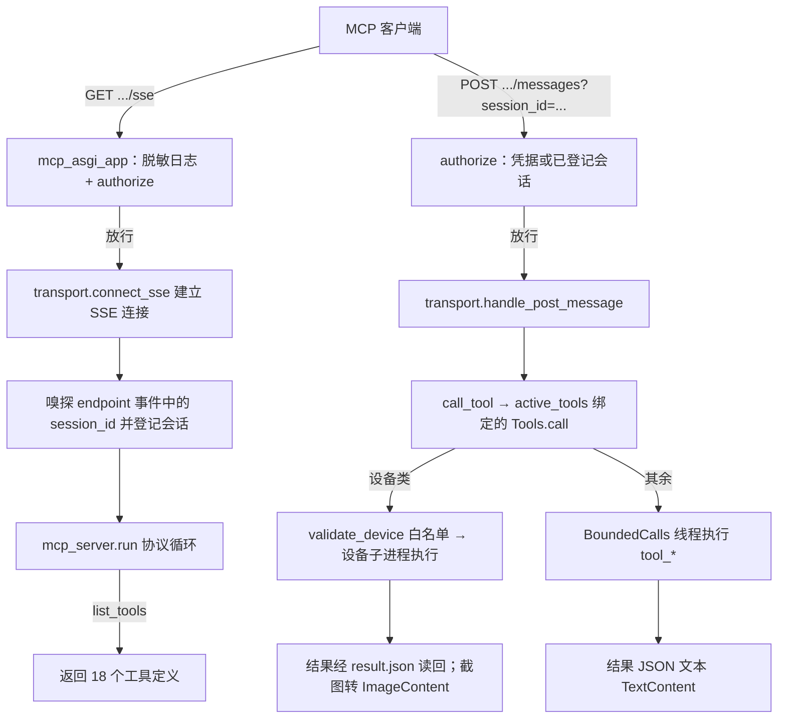
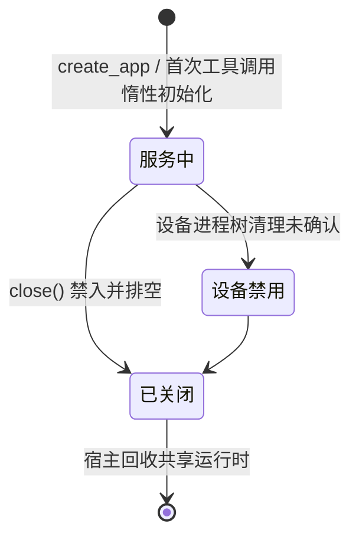
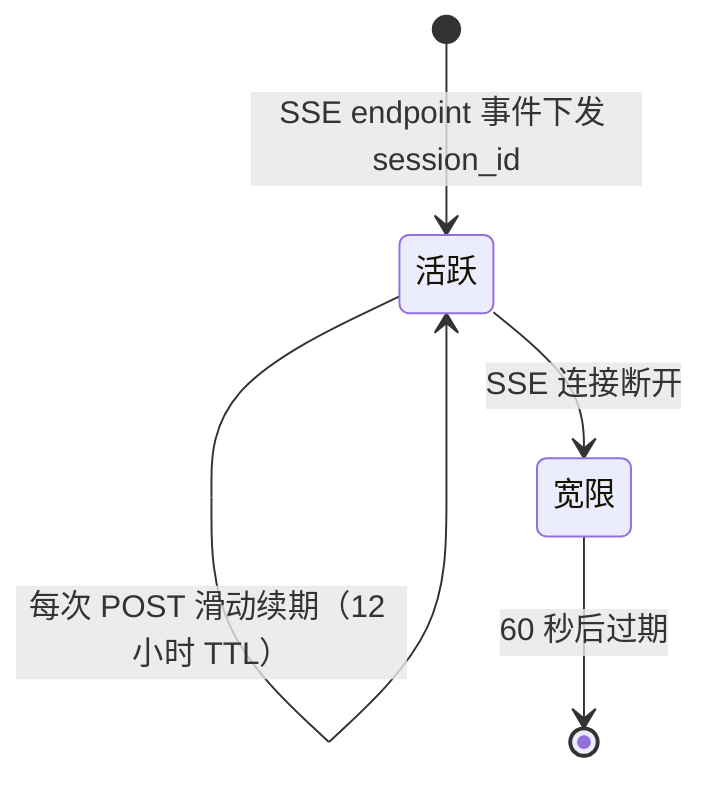

# MCP SSE 服务器（mcp_server_sse.py）

> 把实例查询、配置修改、调度控制与设备操作共 18 个工具通过 MCP 协议（SSE 传输）暴露给外部 AI 助手，支持独立进程与挂载进 WebUI 两种运行方式。

## 1. 模块概述

AzurPilot 的常规操作界面是 WebUI，但用户越来越倾向于让 AI 助手（如 Claude）代替自己观察和操作自动化框架。MCP（Model Context Protocol）是这类助手的标准接入协议，本模块就是协议适配层：对外提供一个标准 MCP 服务器，对内把工具调用翻译成对配置服务、运行时服务的读写。

这个模块存在三个设计动因：

- **AI 需要的是「语义级」接口，不是 HTTP 接口的翻译**。WebUI 的 REST/WS 接口面向前端（revision、schema、会话状态），而 MCP 客户端需要「当前在跑什么任务」「帮我立刻触发一次日常」这类以实例为中心的高层操作。18 个工具是按 AI 使用场景重新设计的门面，不是 API 的镜像。
- **破坏性操作直接暴露在 HTTP 上**：`stop_instance`、`update_config`、`update_alas`（git pull + 依赖同步）都含在工具集里。WebUI 的密码校验发生在 PyWebIO/网关会话内部，管不到挂载进来的 ASGI 子应用，所以鉴权单独做了一层（`module/runtime/mcp_auth.py`），密码复用 WebUI 密码而不引入第二把密钥。
- **进程要轻**：独立 MCP 进程只做协议、鉴权与分发，OCR、界面等重依赖被 CI 守卫禁止进入该进程（见 `tests/test_ci_import.py` 的进程隔离守卫）；设备操作连设备库都不在服务进程加载，而是 spawn 到子进程执行。

在系统中的位置：MCP 是与 WebUI 并列的第二个对外服务。挂载模式下它是 `module/api/app.py` 创建的 Starlette 应用挂在 `/mcp` 路径下的子应用，与 WebUI 共享同一份 `ConfigService`/`RuntimeService`；独立模式下（`uv run python mcp_server_sse.py`）它自己监听 22268 端口并拥有共享状态。两种模式最终都作用于同一批实例进程（`module/runtime`）。

## 2. 模块职责

### 负责

- MCP 工具的声明（名称、描述、参数 schema）与调用分发。
- SSE 传输：`/sse` 长连接建立、`/messages` POST 投递、会话 ID 嗅探与登记。
- 鉴权挂接：从 WebUI 密码体系取得凭据，交由 `module/runtime/mcp_auth.py` 判定；请求日志脱敏。
- 工具执行的并发控制（执行槽）、超时控制、设备操作的子进程隔离与进程树回收。
- 独立模式下的密码解析（复用 WebUI 自动生成规则）与共享状态（`State`）的创建/回收。
- 服务关闭时排空在途调用、清理失败设备进程。

### 不负责

- 配置读写与校验规则：全部委托 `module/api/config_service.py`（白名单、类型校验、事务写盘均在彼处）。
- 实例进程的创建与管理：经 `RuntimeService` → `ProcessManager` 完成，MCP 不直接 fork worker。
- 更新的实际执行：`update_alas` 只触发 `module/api/update_service.py`，git 操作与重启编排属于 `module/runtime/updater.py`。
- 设备操作的具体实现：`module/mcp/device_worker.py` 在子进程内加载 `module.device`，服务进程不碰设备库。
- 游戏逻辑、OCR、WebUI 页面与 `/api/v1/ws` 业务通信。

## 3. 模块位置

```
mcp_server_sse.py              # ASGI 应用、SSE 传输、18 个工具声明、独立模式入口
module/mcp/
├── __init__.py                # 仅声明边界：MCP 协议适配，不拥有 WebUI 业务服务
├── tools.py                   # Tools：18 个工具到配置/运行/更新服务的适配与分发
├── execution.py               # BoundedCalls 有限并发；设备子进程运行与超时回收
├── device_worker.py           # 设备子进程入口：截图 / 重启模拟器 / 重启 ADB
└── lifecycle.py               # 独立模式 lifespan：State 初始化与退出清理
module/runtime/mcp_auth.py     # 鉴权：凭据提取、常数时间比对、会话登记、日志脱敏
module/config/mcp_helper.py    # McpConfigHelper：args.json + i18n 的任务元数据读取
```

| 文件 | 作用 |
| --- | --- |
| `mcp_server_sse.py` | MCP ASGI 应用与传输层；`configure_auth` 注入密码；`__main__` 为独立入口 |
| `module/mcp/tools.py` | `Tools` 类：工具分发（`tool_<name>` 命名约定）、设备白名单校验、日志读取 |
| `module/mcp/execution.py` | `BoundedCalls` 并发槽；`run_device` spawn 子进程并按超时回收进程树 |
| `module/mcp/device_worker.py` | 子进程侧执行体：`get_screenshot` / `restart_emulator` / `restart_adb` |
| `module/mcp/lifecycle.py` | 独立模式的 `lifespan`：仅在自己创建共享状态时负责初始化与清理 |
| `module/runtime/mcp_auth.py` | 纯标准库实现：`authorize` 集中判定、会话表、日志脱敏过滤器 |
| `module/config/mcp_helper.py` | `McpConfigHelper`：从 `args.json` 与 i18n 读取任务名、参数结构、仪表盘资源 |

## 4. 核心入口

| 入口 | 用途 |
| --- | --- |
| `uv run python mcp_server_sse.py` | 独立模式：解析密码 → `configure_auth` → uvicorn 监听 `0.0.0.0:22268` |
| `module.api.app.create_app()`（`mount_mcp=True`） | 挂载模式：WebUI 工厂在挂载前调用 `configure_auth(password, public_bind=bool(password))`，再把 `create_mcp_app(configs, runtime, manage_runtime=False)` 挂到 `/mcp` |
| `mcp_server_sse.configure_auth(key, public_bind)` | 注入访问密码并安装 uvicorn access log 脱敏过滤器 |
| `GET <base>/sse` + `POST <base>/mcp/messages` | MCP 客户端的实际传输端点（`<base>` 挂载模式为 `/mcp`，独立模式为服务根） |
| `Tools.call(name, arguments)` | `call_tool` 的落点，所有工具执行从这里分发 |
| `Tools.close()` | 关闭入口：两组执行槽禁入并排空，再清理失败设备进程；挂载模式由宿主 lifespan 调用 |

追代码建议从 `mcp_asgi_app`（一次请求的完整路径）与 `module/mcp/tools.py` 的 `dispatch`（一次工具调用的路径）两处开始。

## 5. 核心组件

### Tools（module/mcp/tools.py）

工具执行的中枢。`call()` 先把设备类工具（`DEVICE_TIMEOUTS` 中的三个）路由到设备子进程，其余走 `BoundedCalls` 线程池执行 `dispatch` → `tool_<name>`；`ApiError` 与其他异常统一转成文本 `Error: ...` 响应，不让 MCP 会话因单个工具崩溃。

| 字段 | 类型 | 说明 |
| --- | --- | --- |
| `configs` | `ConfigService` | 配置读写；惰性创建，挂载模式复用宿主实例 |
| `runtime` | `RuntimeService` | 实例状态与启停；惰性创建 |
| `helper` | `McpConfigHelper` | 任务元数据；惰性创建且只读 `args.json` 与 zh-CN 翻译 |
| `calls` | `BoundedCalls(limit=4)` | 普通工具执行槽，默认 90 秒超时 |
| `devices` | `BoundedCalls(limit=2)` | 设备工具执行槽；失败后整体禁入 |
| `failed_devices` | list | 清理未确认的设备子进程句柄，关闭时兜底回收 |

`initialize()` 在执行线程里惰性构建上述服务（持锁、只做一次）：不在导入期加载用户配置，是「独立 MCP 进程保持轻量」的关键。

### BoundedCalls（module/mcp/execution.py）

有限并发执行器。同步工具在线程中执行，asyncio 侧的超时或客户端取消**不会**取消已交付线程的真实工作（`asyncio.shield` + 槽位保留到工作结束），因此超时响应的语义是「操作可能仍在完成」，客户端应查询状态而非盲目重试。关闭时先禁入再排空，保证清理共享状态后不会再有启动操作落地。

### 设备子进程（run_device / device_worker）

`get_screenshot`、`restart_emulator`、`restart_adb` 在 spawn 子进程中执行，结果经临时目录里的 JSON 文件回传。设计原因：设备库可能无限重试，只有进程级硬超时（join 后回收整棵进程树）能保证服务不被拖死；同时隔离 `ALAS_CONFIG_NAME` 等环境变量污染与重型导入。清理无法确认退出时抛 `DeviceCleanupError` 并禁用设备工具直到重启。

### mcp_auth（module/runtime/mcp_auth.py）

只依赖标准库的鉴权模块（可独立单测、不拖入 WebUI/OCR 依赖链）。所有判定集中在 `authorize()`，ASGI 层只做转发：非 MCP 端点不拦、方法不对返回 405、「公网 + 无密码」返回 503、凭据错误返回 401、`/messages` 还可用已登记的 session_id 放行。

### McpConfigHelper（module/config/mcp_helper.py）

只读 `args.json` 与 `module/config/i18n/zh-CN.json`：`get_tasks` 给任务名列表；`get_task_details` 输出扁平化的任务/组/参数结构（含显示名、帮助文本、默认值、选项翻译，跳过 Storage 组）；`get_dashboard_resources` 提取仪表盘资源的 Value/Limit/Total。它是 `list_tasks`、`get_task_help`、`get_resources` 的数据源。

### 工具清单（18 个，截至 2026-09）

| 分组 | 工具 | 用途 |
| --- | --- | --- |
| 查询类 | `list_instances` | 列出全部已配置实例名 |
| 查询类 | `get_status` | 所有实例的运行状态（`running` 布尔 + `state` 数字映射） |
| 查询类 | `get_current_running_task` | 当前正在执行的具体子任务；优先用 worker 上报的结构化事件，旧 worker 退回日志行解析 |
| 查询类 | `get_scheduler_queue` | 从配置读出已启用任务按 `NextRun` 排序（是「计划队列」，不是调度器内存队列） |
| 查询类 | `list_tasks` / `get_task_help` | 任务名列表；单个任务的参数结构、中文名与帮助（供 AI 学习如何改配置） |
| 查询类 | `get_resources` | 仪表盘资源（油、金币等）当前值 |
| 查询类 | `get_config` | 读实例配置，可按 task 过滤 |
| 查询类 | `get_recent_logs` | 当日日志尾部，默认 50 行（1–5000） |
| 操作类 | `update_config` | 按 `task.group.arg` 路径改配置，走与 WebUI 相同的白名单校验与事务 |
| 操作类 | `trigger_task` | 把 `<task>.Scheduler.Enable` 置真、`NextRun` 置当前时间，运行中的调度器热重载后立刻执行 |
| 操作类 | `clear_scheduler_queue` | 批量停用可编辑任务；`READ_ONLY` 任务保留并如实报告 |
| 操作类 | `start_instance` / `stop_instance` | 经 `RuntimeService` 启停实例的 alas 工作进程 |
| 操作类 | `update_alas` | 触发后台「git pull + 依赖更新」；需 WebUI 监督重启（见第 16 节） |
| 设备类 | `get_screenshot` | 模拟器当前画面，JPEG Base64，返回 `ImageContent` |
| 设备类 | `restart_emulator` | 重启实例对应模拟器进程（含上游退出缓冲，硬超时 150 秒） |
| 设备类 | `restart_adb` | 重启 ADB 服务（kill-server/start-server），`instance` 可选 |

### 与 module/runtime 的关系

工具「作用于实例」的路径有四条，都不直接操作进程：

1. **配置路径（热生效）**：`update_config`、`trigger_task`、`clear_scheduler_queue` 经 `ConfigService.patch` 事务写实例 JSON。运行中的 alas worker 每个任务间用 `ConfigWatcher.should_reload()` 检查配置 mtime，发现变更后热重载——所以 MCP 改配置不需要重启实例，但生效时机是「任务之间」。
2. **进程生命周期**：`start_instance`/`stop_instance` 经 `RuntimeService`（持有实例生命周期锁）驱动 `ProcessManager` 启停 alas 工作进程。
3. **更新路径**：`update_alas` 要求 `State.restart_event` 与 `State.dependency_sync_event` 非空——这两个事件只有 gui.py 以监督方式启动 WebUI 时才注入。条件不满足即拒绝（独立模式没有能安全重启它的父进程），满足则经 `update_service.start('apply')` 触发 `updater.run_update()`，由更新流程停实例、通知父进程重启。
4. **设备路径**：设备工具完全绕开服务进程的模块导入，在子进程里为该实例构造 `AzurLaneConfig` + `Device` 后操作模拟器/ADB。

## 6. 工作流程

一次典型的客户端会话：先建 SSE 长连接拿会话，再 POST 消息调工具。



要点：

- **路由用末尾匹配**（`*/sse`、`*/messages`）：同一份 ASGI 应用既能独立挂在根路径，也能挂到 `/mcp` 前缀下，兼容尾斜线。`mcp_auth.route_of` 与该规则保持一致。
- **SSE 传输**：`SseServerTransport` 的消息端点固定为 `/mcp/messages`（与 WebUI 挂载点匹配，独立模式挂根路径时同样可达）。服务端在 SSE `endpoint` 事件里下发 `POST /mcp/messages?session_id=<32位hex>`，客户端之后的所有 POST 都带这个 session_id。
- **会话嗅探**：`_sniff_session_id` 从出站字节流里捕获该 session_id（4096 字节嗅探缓冲），登记为已鉴权会话。原因是部分 MCP 客户端只能在 URL 里填一次 key，POST 地址由服务端下发、带不上请求头；session_id 本身经已鉴权的 SSE 通道下发，视为该连接的凭据。
- **断开宽限**：SSE 断开后会话再保留 60 秒，避免客户端最后一帧 POST 被误拒。
- **独立模式**：`configure_auth` + `uvicorn.run(app, host="0.0.0.0", port=22268)`；挂载模式由 WebUI 工厂完成鉴权注入并复用其事件循环。

## 7. 调用关系

### 上游

| 模块 | 关系 |
| --- | --- |
| MCP 客户端（Claude 等 AI 助手） | SSE + JSON-RPC 调用工具 |
| `module/api/app.py`（WebUI 工厂） | 挂载 `/mcp`、注入共享 configs/runtime、调用 `configure_auth`；关闭时先调 `tools.close()` |
| `mcp_server_sse.__main__` | 独立进程入口，自带密码解析与 lifespan |
| gui.py | 不直接引用本模块；它启动的 uvicorn 加载 `module.api.app:create_app` 工厂，挂载在其中完成 |
| `tests/test_mcp_*`、`tests/test_api_mcp_integration.py` | 鉴权、工具、执行与集成的单元测试；`tests/test_ci_import.py` 守护导入与进程隔离 |

### 下游

| 模块 | 用途 |
| --- | --- |
| `module/api/config_service.py` | 实例名白名单、配置读取（模板合并）、校验与事务写盘 |
| `module/api/runtime_service.py` | 实例状态、overview、启停（底层是 `module/runtime/process_manager.py`） |
| `module/config/mcp_helper.py` | 任务元数据与仪表盘资源的结构化读取 |
| `module/api/update_service.py` | `update_alas` 的后台更新触发 |
| `module/runtime/mcp_auth.py` | 全部鉴权判定、会话表、日志脱敏 |
| `module/runtime/password_utils.py` | 密码有效性判断与公网自动生成 |
| `module/runtime/setting.py`（State） | 部署配置、`restart_event` 等监督状态、独立模式的共享 Manager |
| `module/mcp/device_worker.py` | 设备操作子进程（内部才加载 `module.device.device`） |

## 8. 数据流

```text
MCP 客户端 ──JSON-RPC（SSE 事件下行 / POST 上行）──> mcp_asgi_app ──> Tools.call
查询/配置类：config/<instance>.json ──读盘 + template 合并──> JSON 文本 ──> TextContent
任务元数据：args.json + i18n/zh-CN.json ──McpConfigHelper──> 结构化任务/参数说明
日志：log/<date>_<instance>.txt（缺失回退 <date>_alas.txt）──尾部 N 行──> TextContent
设备类：spawn 子进程 ──result.json──> {text} 或 {image: base64 JPEG} ──> TextContent / ImageContent
写配置：update_config / trigger_task / clear_scheduler_queue ──ConfigService.patch（事务）──> 实例 JSON 落盘
        ──运行中的 alas worker 经 ConfigWatcher 检测 mtime──> 下个任务边界热重载生效
状态查询：ProcessManager（worker 注册表、current_task）──> get_status / get_current_running_task
更新：update_service.start('apply') ──> updater 停实例 → 重启事件 → gui 父进程重建服务
```

## 9. 状态模型

模块有两类需要理解的状态：工具服务自身的开关状态，以及会话凭据的生命周期。



| 状态 | 含义 |
| --- | --- |
| 服务中 | 正常接受调用；普通工具 4 槽、设备工具 2 槽 |
| 设备禁用 | 普通工具仍可用，设备类一律返回 `DEVICE_CLEANUP_FAILED` 提示，直到进程重启 |
| 已关闭 | `close()` 已调用，新调用返回 `SERVICE_STOPPING`；宿主 lifespan 在此之后才回收共享运行时 |

会话（仅鉴权启用时存在）：



会话登记表容量 512，超出按插入顺序淘汰；`configure` 被再次调用（热重载、测试）时整表清空。

## 10. 配置

MCP 没有自己的 `<Task>.<Group>.<Argument>` 配置，行为由部署配置与环境决定：

| 配置 | 类型 | 默认值 | 说明 |
| --- | --- | --- | --- |
| `config/deploy.yaml` 的 `Password` | str | 空 | WebUI 与 MCP 共用的访问密码；独立模式与挂载模式都从这里解析 |
| `config/deploy.yaml` 的 `WebuiHost` | str | - | 挂载模式据此判定「公网监听」并触发自动生成密码；独立模式监听地址写死 `0.0.0.0` |
| `config/deploy.yaml` 的 `AdbExecutable` | str | 空 | `restart_adb` 的 ADB 路径；缺失时回退 `.venv`、`bin/adb` 内置路径 |
| 环境变量 `DEMO` | str | 未设 | `DEMO=1` 为演示环境：不生成密码，公网监听时整体 503 |
| 根目录 `password.txt` | str | 自动生成 | 公网监听且未设密码时自动生成的密码副本，供用户查看 |

关联：密码解析统一走 `module/runtime/password_utils.ensure_password_for_host`（公网 + 未设置 + 非 demo → 生成 32 位随机密码、写 `password.txt`），因此 WebUI 与 MCP 永远是同一把密码；独立模式解析后还会回写 `State.deploy_config.Password` 落盘，避免每次重启换密码。

工具操作涉及的配置路径遵循 `<Task>.<Group>.<Argument>`，写入前经 `ConfigService.validate`：隐藏、只读、storage 类参数拒绝修改（`READ_ONLY`），类型/选项/正则/长度不符拒绝（`INVALID_PARAMS`）——与 WebUI 的约束完全一致，AI 不能绕过白名单改配置。

## 11. 异常与错误处理

| 异常/状态 | 原因 | 处理 |
| --- | --- | --- |
| HTTP 401 | 端点需要凭据但缺失/错误 | 文本说明三种传参方式；刻意不带 `WWW-Authenticate`（否则 MCP 客户端会误判为要求 OAuth） |
| HTTP 405 | 端点方法不符（/sse 须 GET、/messages 须 POST） | 直接拒绝 |
| HTTP 503 | 公网监听但无密码（demo 或自动生成失败） | `deny_all` 兜底：宁整体禁用也不开无鉴权控制端点 |
| HTTP 404 | 非 MCP 路径 | 文本 Not Found |
| `TOOL_BUSY` | 执行槽已满（普通 >4、设备 >2 并发） | 文本错误，客户端稍后重试 |
| `TOOL_TIMEOUT` | 超过槽超时（普通 90 秒，设备另计） | 报告「操作可能仍在完成」；后台线程继续跑完 |
| `DEVICE_TIMEOUT` / `DEVICE_FAILED` | 设备子进程超时/异常退出/返回错误 | 文本错误；超时后父进程回收进程树 |
| `DEVICE_CLEANUP_FAILED` | 进程树未确认退出 | 禁用设备工具（`devices.closed`），句柄留待关闭时再清理；不静默 kill |
| `SERVICE_STOPPING` | 服务关闭中收到新调用 | 文本错误 |
| `READ_ONLY` / `INVALID_PARAMS` | 配置白名单/类型校验拒绝 | 文本错误；`clear_scheduler_queue` 对只读任务改为保留并报告 |
| `UPDATE_UNAVAILABLE` / `UPDATE_BUSY` / `UPDATE_FAILED` | 独立模式、监督重启未启用、更新器忙 | 文本错误 |
| 客户端断连（BrokenPipe/BrokenResource/ClosedResource） | SSE 断开或宽限期外的 POST | 记 warning，不上抛，服务不崩 |
| 未知工具名 | `tool_<name>` 不存在 | 文本 `Unknown tool`，不抛异常 |

约定：工具层的一切失败都转成 MCP 文本错误返回（`ApiError` 附错误码），不中断 SSE 会话；只有基础设施级错误（鉴权配置、密码生成）才在启动期失败。

## 12. 并发与线程模型

- **事件循环**：独立模式由 uvicorn 驱动单事件循环；挂载模式复用 WebUI 的 uvicorn。每个 SSE 连接是循环内的一个协程，多客户端并存、互不阻塞。
- **工具执行线程**：`BoundedCalls.run` 为每次调用起 `mcp-tool` 守护线程（普通池默认 4 槽）。槽位在工作真正结束后才释放，因此超时/取消不会让真实操作变成无主任务；`close()` 先置 `closed` 再 gather 排空。
- **设备子进程**：`multiprocessing` spawn 上下文创建 `mcp-device` 进程，父进程 `join(超时)` 后对存活者 `stop_process_tree` 强制回收。设备池限 2 并发；清理失败即整体禁用设备工具（防句柄泄漏与僵尸进程树）。
- **mcp_auth**：模块级 `threading.Lock` 保护密码与会话表；会话过期用 `time.monotonic()`，不受系统时间跳变影响。`register/expire/is_authorized_session` 由事件循环调用，`configure` 可被应用工厂重复调用（幂等、清空会话）。
- **Tools 惰性初始化**：`initialize_lock` 保证 `ConfigService/RuntimeService/McpConfigHelper` 只在第一个工具调用的执行线程里创建一次。
- **生命周期归属**：挂载模式的 `tools` 由 WebUI 宿主持有并在宿主 lifespan 关闭时先 `close()`，再回收共享运行时（`module/api/app.py` 的 finally 顺序）；独立模式由本模块 lifespan 负责，且仅当 `State.manager is None`（无人初始化过共享状态）时才创建与回收。

## 13. 缓存与持久化

| 数据 | 存放 | 读取时机 | 失效 |
| --- | --- | --- | --- |
| 任务元数据（args.json + zh-CN i18n） | `McpConfigHelper` 实例内存 | 首次工具调用惰性加载一次 | 进程重启；配置定义变更后需重启 MCP 服务 |
| 实例配置 | 每次调用读 `config/<instance>.json` 并与 `template.json` 合并 | 不缓存（读操作不触发运行器写回） | — |
| 已鉴权会话 | `mcp_auth._sessions` 内存表 | 每次成功 POST 滑动续期 | TTL 12 小时 / 断开宽限 60 秒 / 表满淘汰 / 重配置清空 |
| 访问密码 | `config/deploy.yaml`；公网自动生成时另写根目录 `password.txt` | 启动时解析 | 用户修改 deploy.yaml 后重启生效 |
| 设备工具结果 | 临时目录 `result.json`，用后即删 | — | — |

## 14. 生命周期

独立模式（`python mcp_server_sse.py`）：

1. 导入期：创建模块级 `Server`、`SseServerTransport`、默认 `Tools` 与 `app = create_app()`。
2. `__main__`：`_resolve_standalone_password()`（deploy.yaml → 公网自动生成并落盘）→ `configure_auth(..., public_bind=True)` → uvicorn 监听 `0.0.0.0:22268`。
3. lifespan：若 `State.manager is None` 则初始化共享 Manager 并接管 updater 事件；不启动 WebUI 的可选后台服务（如 Discord RPC）。
4. 运行中接受任意数量客户端；`BoundedCalls` 限流。
5. 关闭：`tools.close()` 排空在途调用 → 清理失败设备进程 → 若拥有 State 则确认全部 worker 退出后 `State.clearup()`；worker 未退净时保留登记供恢复，不强行清场。

挂载模式（WebUI 内）：

1. `module.api.app.create_app()` 构建期：解析密码（含公网自动生成）→ `configure_auth(password, public_bind=bool(password))` → `create_mcp_app(configs, runtime, manage_runtime=False)` → 挂到 `/mcp`。
2. `manage_runtime=False`：不装自己的 lifespan，`configs/runtime` 复用宿主实例——因此 MCP 与 WebUI 看到同一份实例列表、同一批运行中进程。
3. 关闭顺序由宿主控制：先 `mcp_app.state.tools.close()`（禁入并排空），再回收共享运行时与 Discord RPC。

## 15. 扩展方式

新增一个 MCP 工具的固定步骤：

1. 在 `mcp_server_sse.py` 的 `list_tools()` 中登记 `Tool`：名称、面向 AI 的描述（描述质量直接影响模型是否正确使用）、`inputSchema`。
2. 在 `module/mcp/tools.py` 的 `Tools` 上添加同名 `tool_<name>(self, arguments)` 方法；`dispatch` 按 `tool_` 前缀反射分发，无需注册表。
3. 实现内只用 `self.configs` / `self.runtime` / `self.helper` 提供的能力，需要新数据访问时扩展对应服务而不是绕过它们；错误用 `ApiError(code, message)` 抛出。
4. 若是设备类操作：在 `DEVICE_TIMEOUTS` 登记（执行时限）并实现 `module/mcp/device_worker.py` 的 `perform` 分支；注意它会自动获得「白名单校验 + 子进程隔离 + 进程树回收」路径。
5. 补 `tests/test_mcp_tools.py` 等对应用例；若工具改变进程导入面（新增重型依赖），先跑 `tests/test_ci_import.py` 确认隔离守卫。

## 16. 修改注意事项

- **导入期必须保持轻量**。`mcp_server_sse` 在 CI 中被断言为不加载 `pywebio`、`module.ocr.al_ocr`、`rapidocr`（WebUI 挂载它，OCR 模型只允许出现在工作进程）。往模块级加导入前先想清楚它会被拖进哪个进程。
- **`mcp_auth` 只依赖标准库**是刻意约束（独立进程轻量化 + 可独立单测），不要往上加项目内依赖。
- **不要给 401 响应加 `WWW-Authenticate`**：MCP 客户端见到它会转向 OAuth metadata 流程，导致无法用静态密码接入。
- **`configure` 幂等并清空会话表**是有意设计：WebUI 应用工厂可能因热重载/测试多次调用，残留会话表会把旧凭据当有效。改动鉴权初始化时保持该语义。
- **会话嗅探依赖传输层实现细节**：`SESSION_ID_PATTERN` 假定 endpoint 事件中出现 32 位十六进制 session_id 且出现在前 4096 字节内。升级 MCP SDK 改动 SSE 帧格式时必须重验 `tests/test_mcp_auth.py` 与嗅探逻辑；`?key=` 与 Bearer 两种方式不受影响。
- **凭据提取取「第一个」而非「任一匹配」**：同名多个凭据不做宽松匹配，避免放大试探面；修改 `extract_credential` 时保持。
- **`update_alas` 的守卫不要拆**：`State.restart_event is None` 说明没有能安全重启本进程的监督者（独立模式），此时执行更新会留下无法恢复的服务，必须继续拒绝。
- **设备超时链路不要调松**：`DEVICE_TIMEOUTS` + 30 秒的槽超时 + join 硬超时三层是配合设计的；设备库内部可能无限重试，唯一的兜底是父进程回收进程树。
- **密码永远复用 WebUI 体系**（`ensure_password_for_host` / `is_webui_password_set`），不要引入第二把密钥或独立生成规则。
- 工具列表同时存在于 `list_tools()` 声明与 `Tools.tool_*` 方法两处，还有文档与测试中的「18 个」计数，增删时同步维护。

## 17. 已知限制

- SSE 是旧版 MCP 传输（未用 streamable HTTP）；端点路径 `/mcp/messages` 写死在传输层构造里，与 `/mcp` 挂载点耦合，改挂载路径需同步改 `SseServerTransport` 参数。
- `?key=` 方式把密码暴露在 URL 中，会进入各类访问日志与浏览器历史；服务端已做日志脱敏，但传输链路上的代理/客户端历史不在控制范围内。
- 单一共享密码，无按客户端的权限分级：任何持密码者可改配置、停实例、触发 git 更新。
- `get_scheduler_queue` 读的是配置文件中的计划（Enable + NextRun），不是调度器内存里的实时队列；实例未运行时它反映的是「下次会跑什么」。
- `get_current_running_task` 的日志解析回退依赖中文日志行（`调度器: 开始任务`），旧 worker + 非中文环境可能解析不出。
- `McpConfigHelper` 语言固定 zh-CN：`get_task_help` 返回的中文名称与帮助不随客户端语言变化。
- 挂载模式下 `public_bind=bool(password)`：只有设置了密码才视为公网暴露；若有人绕过应用工厂自行 `configure_auth`，可能构造出无密码的公开监听（正常入口不受影响，独立模式的 `deny_all` 会兜底）。
- `update_alas` 在独立模式必然拒绝（无监督重启），这是有意为之的安全行为而非缺陷。

## 18. 示例

独立模式启动与客户端接入：

```bash
uv run python mcp_server_sse.py
# [MCP] 启动 AzurPilot MCP 服务 (Port: 22268)
# [MCP] 鉴权已启用，监听公网=True
```

MCP 客户端配置（密码可放查询参数，也可以改用请求头）：

```json
{
  "mcpServers": {
    "azurpilot": { "url": "http://127.0.0.1:22268/sse?key=<WebUI密码>" }
  }
}
```

挂载模式（随 WebUI 自动可用，无需单独启动）：SSE 端点为 `http://<webui主机>:<端口>/mcp/sse`，凭据传法相同；`?key=` 之外的等价写法是 `Authorization: Bearer <密码>` 或 `X-API-Key: <密码>`。

一次 `trigger_task` 的完整链路：客户端 POST `messages` → 鉴权 → `call_tool` → `tool_trigger_task` 写 `{task}.Scheduler.Enable=true` 与 `NextRun=当前时间` → 运行中的 alas worker 在任务边界热重载配置 → 该任务被立即调度执行。

## 19. 调试方法

- **服务日志**：以 `[MCP]` 前缀输出——启动端口、鉴权启用状态、每次请求的方法与路径（已脱敏）、拒绝原因（401/405/503）与来源 IP。uvicorn access log 由 `_RedactFilter` 脱敏，`?key=` 不会落盘。
- **常见问题排查顺序**：
  - 401：确认密码取自根目录 `password.txt` 或 `config/deploy.yaml` 的 `Password`；检查凭据位置（Bearer/X-API-Key/?key=）与拼写。
  - 503：处于「公网监听 + 无密码」状态——检查 `DEMO` 环境变量与密码自动生成是否失败（日志有 `[MCP] 自动生成密码失败`）。
  - 设备工具报 `DEVICE_CLEANUP_FAILED`：查服务日志中「MCP 设备操作」的进程树回收记录；该状态持续到服务重启。
  - 实例操作无效果：确认实例进程状态（`get_status`）、配置是否真的落盘、worker 是否支持配置热重载。
- **测试**：`tests/test_mcp_auth.py`（鉴权与脱敏）、`tests/test_mcp_tools.py`（工具分发）、`tests/test_mcp_execution.py`（并发槽与设备子进程）、`tests/test_mcp_lifecycle.py`、`tests/test_api_mcp_integration.py`（挂载集成）、`tests/test_ci_import.py`（导入与进程隔离守卫）。
- **导入问题**：`uv run python -m dev_tools.import_smoke_test` 与 `tests.test_ci_import` 会先暴露进程隔离被破坏的情况。

## 20. 相关模块

- [WebUI 启动器](gui.md)——独立服务进程的启动方式与 uvicorn 配置
- [API 服务](../webui/api.md)——挂载 `/mcp` 的宿主应用工厂、共享的 `ConfigService`/`RuntimeService`
- [运行时服务](../webui/runtime.md)——`State`、`ProcessManager`、更新与密码工具的运行时基础
- [调度器（alas.py）](alas.md)——`start_instance`/`trigger_task` 最终作用于的调度循环与配置热重载
- [配置系统](../config.md)——`ConfigService` 校验与事务写盘背后的配置定义体系
- [设备层](../device.md)——设备工具子进程内实际执行截图与模拟器控制的层
