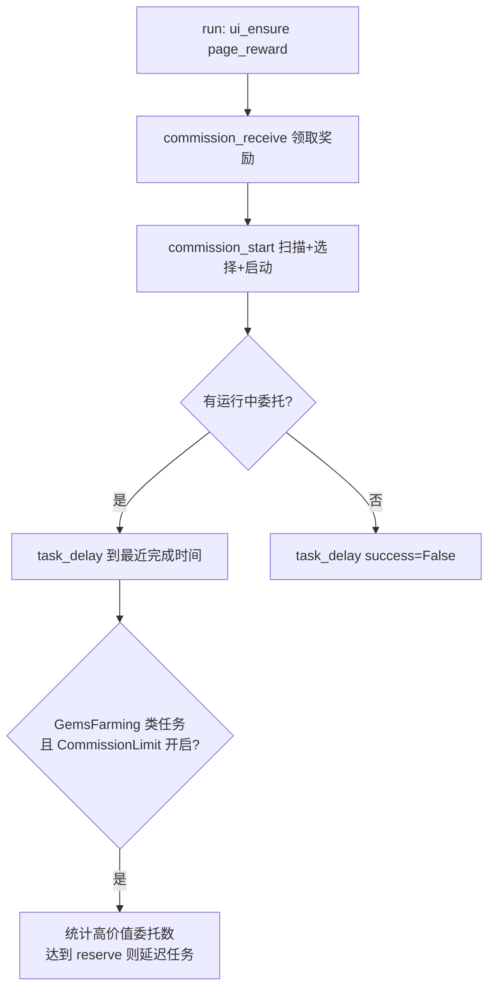
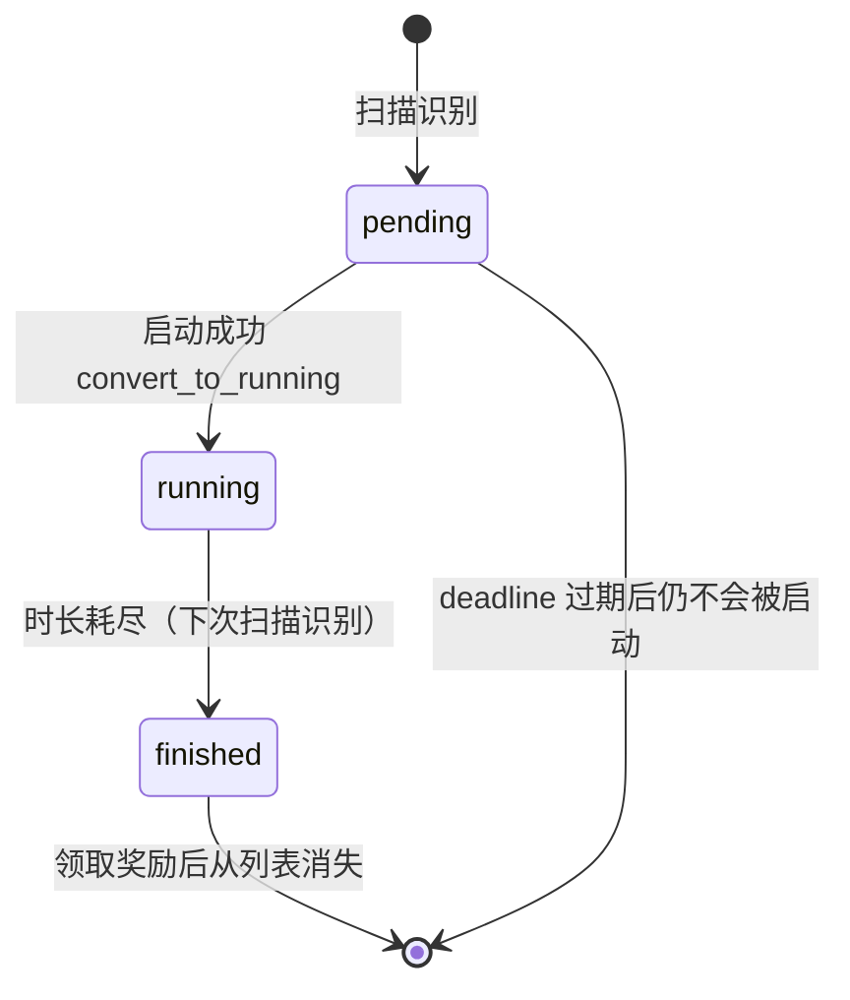

# 委托系统

> 自动化管理碧蓝航线委托的完整闭环：领取已完成委托的奖励、OCR 识别全部可接委托、按过滤器或折现价值模型选出最优组合并逐一启动，最后按运行中委托的完成时间回报调度器。

## 1. 模块概述

委托是游戏内最重要的被动收益来源：玩家把舰船派去执行有时长的任务，到期后领取钻石、魔方、石油、心智芯片等资源。其中每日委托每天刷新、紧急委托随机出现且有过期倒计时，而委托槽位有限（通常 4 个，活动期间 5 个），因此「何时启动哪条委托」是一个真实的调度决策问题。

`module/commission` 解决三件事：

- **识别**：从 1280×720 截图中分割委托条目，用 OCR 读出名称、时长、状态和剩余可启动时间，映射为内部委托类型。四个服务器（CN/EN/JP/TW）的名称字典与 OCR 参数各不相同，通过 `@Config.when` 分发。
- **决策**：传统策略按用户过滤器顺序贪心选择；实验性规划器把委托建模为「价值随启动等待衰减」的调度问题，用带最优性证书的束搜索求全局最优，允许为了高价值委托推迟甚至放弃低价值委托。
- **结算与统计**：领取奖励时识别物品数量，写入本地统计数据库（`module/statistics/cl1_database.py`），并对钻石委托做「运行记录 → 按收益结算」的全生命周期跟踪。

在调度器视角，`Commission` 是一个由 `Scheduler.NextRun` 驱动的普通任务；它的特殊之处在于 run() 结束时会用运行中委托的完成时间**主动安排自己的下次运行**，实现「委托完成后立即回来领奖」的节奏。

## 2. 模块职责

### 负责

- 委托页面导航（`page_reward` ⇄ `page_commission`）与列表模式切换（每日/紧急）。
- 委托检测：分割线定位 + 单条委托 OCR 解析 + 相似度去重。
- 委托选择：预设/自定义过滤器、黑名单、传统贪心与动态规划两种算法。
- 委托启动：查找目标委托、进入详情、点推荐、校验所选委托一致。
- 奖励领取：经验/物品/舰船弹窗循环处理，石油溢出时转宿舍喂食。
- 收入统计：识别奖励物品、持久化收益、结算钻石委托、推送通知。
- 调度回报：按完成时间 `task_delay`，并为 GemsFarming 类任务做高价值委托保留判断。
- T 类科研的委托计数联动（扣减 `Research.Research.RemainingCommissions`）。

### 不负责

- 不处理委托刷新弹窗本身：设备层 `handle_night_commission()` 与处理器层 `handle_urgent_commission()` 负责在任意页面点击委托弹窗，本模块只在委托页面内工作。
- 不实现委托战斗：委托启动后立即返回，无需出击操作。
- 不决定统计口径：数据库结构与结算规则由统计模块（`module/statistics/cl1_database.py`）负责，本模块只是调用方。
- 不管理委托槽位以外的资源（情绪、石油上限的消耗策略在宿舍/出击模块）。

## 3. 模块位置

```text
module/commission/
├── commission.py    # 主流程：RewardCommission 主类，领奖/扫描/选择/启动/调度
├── project.py       # Commission 委托数据模型 + COMMISSION_FILTER 过滤器，按服务器分派解析
├── project_data.py  # CN/EN/JP/TW 委托名称关键字字典（genre 识别依据）
├── planner.py       # 折现价值模型与束搜索规划器（纯算法，无游戏依赖）
├── preset.py        # 内置过滤器预设（cube/chip/oil 及夜间、24h 变体）
└── assets.py        # 按钮资源（生成文件，勿手改）
assets/stats_commission_items/   # 委托收益物品模板（约 49 个，用于奖励识别）
```

| 文件 | 作用 |
| --- | --- |
| `commission.py` | `RewardCommission` 主类与全部游戏交互；模块级 `COMMISSION_SWITCH`、`COMMISSION_SCROLL` |
| `project.py` | `Commission` 单条委托模型；`CommissionFilter`（在通用 Filter 上加 `apply_first`/`apply_tiers`）；`COMMISSION_FILTER` 实例 |
| `project_data.py` | 四个服务器的委托名称→类型字典，新增委托类型时在此登记 |
| `planner.py` | `CommissionValueModel`、`optimize_commission_plan`、`delay_threshold_seconds`；只依赖标准库，可独立单测 |
| `preset.py` | `DICT_FILTER_PRESET` 预设与 `SHORTEST_FILTER` 兜底排序 |

## 4. 核心入口

| 入口 | 用途 |
| --- | --- |
| `RewardCommission(config, device).run()` | 唯一主入口，由 `alas.py` 的 `AzurLaneAutoScript.commission()` 调用 |
| `RewardCommission._save_commission_reward_screenshots` | 静态方法，`tests/test_drop_cleanup.py` 直接驱动验证保留策略 |
| `optimize_commission_plan` / `delay_threshold_seconds` | 规划器纯函数入口，单测与 `dev_tools/commission_value_table.py` 直接调用 |

## 5. 核心组件

### RewardCommission（commission.py）

| 字段/成员 | 类型 | 说明 |
| --- | --- | --- |
| `daily` / `urgent` | `SelectedGrids` | 本次扫描到的每日/紧急委托全量列表 |
| `daily_choose` / `urgent_choose` | `SelectedGrids` | 选择算法输出的待启动委托 |
| `comm_choose` | `SelectedGrids` | 过滤器命中的全部候选（含未启动的），供日志与高价值统计 |
| `max_commission` | `int` | 委托槽位，默认 4；扫描到 `daily_event` 时提升为 5 |

### Commission（project.py）

单条委托的不可变快照（每次截图重新解析，`__eq__` 判断「同一条委托」）：

| 字段 | 说明 |
| --- | --- |
| `genre` | 形如 `urgent_gem` 的类型标识，由名称字典匹配得到 |
| `category_str` / `genre_str` | genre 按下划线拆分的两部分，即过滤器的前两段 |
| `status` | `pending`（待启动）/ `running`（进行中）/ `finished`（可领取） |
| `duration` | 执行时长（OCR），为 0 时整条委托标记 `valid=False` |
| `available_time` / `deadline_time` | 紧急委托的剩余可启动时间与最晚启动时刻；其他委托为 0 / `None` |
| `suffix_image` / `suffix_hash` | 名称右侧罗马数字后缀的裁剪图与哈希，用于区分同名委托（Ⅰ~Ⅵ） |
| `finish_time` | 运行中委托的预计完成时间（`create_time + duration`），调度回报的数据源 |

`__eq__` 是跨截图身份判断的核心：genre、status 必须一致，daily 委托需后缀图像匹配，`urgent_box` 需阵营标签（NYB/BIW）一致，时长与 deadline 各允许 120 秒 OCR 误差。扫描去重、启动校验、`SelectedGrids.add_by_eq` 全部依赖它。

### 价值模型（planner.py）

| 参数 | 配置键 | 默认值 | 含义 |
| --- | --- | --- | --- |
| `tier_value_ratio` | `Commission_TierValueRatio` | 2.0 | 相邻 tier 的基础价值倍率 |
| `delay_half_life` | `Commission_DelayHalfLife` | 100.0（小时） | 等待价值减半所需秒数，公式中的 H |
| `deadline_future_horizon` | `Commission_DeadlineFutureHorizon` | 0.5（小时） | deadline 相对窗口折现的基准时间 T |
| `filter_value_floor` | `Commission_FilterValueFloor` | 0.6 | 同 tier 内靠后规则保留的最低价值比例 |
| `filter_value_half_life` | `Commission_FilterValueHalfLife` | 4.0 | 层内编号修正向价值下限衰减一半的规则数 |

委托价值 = `tier_value_ratio^(max_tier - tier) × filter_factor(r) × delay_factor(s, d)`，其中折现因子 `delay_factor(s, d) = (1 - s/d)^((T/d)²) × 2^(-s/H)`（`s` 为预计等待秒数，`d` 为距最晚启动的总秒数，`s ≥ d` 时为 0）。所有因子先舍入为 `10^9` 缩放的定点整数，之后目标比较全部是整数运算。

### COMMISSION_FILTER（project.py）

继承通用 `Filter` 的正则过滤器，规则形如 `UrgentCube-1:30`，四段捕获组依次对应 `category_str`、`genre_str`、`duration_hm`、`duration_hour`。`tier` 与 `shortest` 是**策略控制标记**而非委托类型：`tier` 在规划算法中分隔价值层级；`shortest` 把未匹配的可用委托按耗时排序后放入对应层级（传统策略则用它把剩余槽位全部填满）。

## 6. 工作流程



run() 先处理一个已知 bug：卡在战术课堂界面（`TACTICAL_CLASS_START` 误检测）时先点取消，否则 A* 导航无法到达 `page_reward`。

**领奖**（`commission_receive`，最多重试 3 次）：在奖励页与委托页之间循环，点击 `REWARD_1`/`REWARD_1_WHITE` 小红点、`REWARD_GOTO_COMMISSION` 跳转、`EXP_INFO_S_REWARD`（经验弹窗，一次代表一条委托完成）与 `GET_ITEMS_1/2/3`（物品弹窗）。物品弹窗出现时复制截图到本地队列；下一次经验弹窗出现即认为上一组物品弹窗结束，触发收入识别与持久化。CN 服遇到 `OIL_MAXED` 抛 `OilMaxed`，外层转宿舍喂食消耗石油后重试。每次经验弹窗计数会进入 `finally` 块更新 T 类科研剩余委托数。

**扫描**（`_commission_scan_all`）：紧急列表是懒加载的，先切到 urgent 强制刷新；再分别切到 daily/urgent，滚动条翻页（上限 15 页）逐屏 `commission_detect`。检测用 `lines_detect` 找委托卡片底部白色分割线（scipy `find_peaks`），对每条分割线裁剪出 `(188, y-119, 1199, y)` 区域交给 `Commission` 解析；发现无效委托（通常 info_bar 未消失）时重试。紧急列表中的 `extra_*` 委托统一 `convert_to_night` 归类为 `night_*`，与 21:00~次日 02:00 生效的 `_night` 过滤预设对应。

**选择**（`_commission_choose`，按 `Commission_DynamicProgramming` 分派）：

- 传统贪心 `_commission_choose_legacy`：加载过滤器字符串，按规则顺序对全部委托做可用性检查（`_commission_check`：pending 状态 + 不在黑名单 + major 受 `Commission_DoMajorCommission` 控制），得到排序结果；数量不足槽位时再按 `SHORTEST_FILTER` 用耗时最短的委托补足。取前 `max_commission - running_count` 条作为本次启动目标。
- 动态规划 `_commission_choose_dynamic`（默认开启）：`apply_tiers` 把过滤器按 `tier` 分成价值层级，构造 `CommissionPlanJob` 列表（时长、deadline、层内编号），交给 `optimize_commission_plan` 求折现价值最优计划。**只启动计划中 `start == 0` 的委托**；计划中「预计稍后启动」的动作只写入日志时间线，等委托完成释放槽位后由下次运行重新扫描决策。规划视野（horizon）取下次 `Scheduler_ServerUpdate`，无游戏内 deadline 的委托以该时刻作为最晚启动时间。

**启动**（`commission_start`）：对每个选中委托，切到对应列表模式、回到顶部后进入 `_commission_find_and_start`（最多 3 轮，每轮重新翻页扫描并用 `__eq__` 找到同一条委托——不同扫描中同一条委托位置可能不同）。`_commission_start_click` 是点击状态循环：点委托卡片 → `COMMISSION_START` → 弹确认框 → 出现推荐界面 `COMMISSION_ADVICE` 时先重新识别顶部委托并校验与目标一致（不一致直接放弃本次启动），再点推荐确认。启动成功后本地 `convert_to_running`；若是钻石委托（`genre == 'urgent_gem'`）则写入数据库运行列表并按 `Commission_GemNotify` 推送。

## 7. 调用关系

### 上游

| 模块 | 关系 |
| --- | --- |
| `alas.py` | 调度器按 `Commission` 任务的 `Scheduler.NextRun` 调用 `commission()` → `RewardCommission.run()` |
| 科研（`module/research/`） | 间接协作：本模块扣减 `Research.Research.RemainingCommissions`，归零后 `task_call('Research')` 唤醒科研任务 |
| GemsFarming / ThreeOilLowCost | 本模块 run() 末尾按高价值委托保留量决定是否延迟这两个任务（见第 10 节） |

### 下游

| 模块 | 用途 |
| --- | --- |
| `module/ui` | 页面导航（`page_reward`/`page_commission`）、`Switch`/`Scroll` 列表控件 |
| `module/handler` | `InfoHandler`：info_bar、确认弹窗、`DOCK_CHECK` 误入船坞恢复 |
| `module/ocr` | `Ocr` 名称识别、`Duration` 时长/倒计时识别 |
| `module/dorm` | 石油溢出时 `RewardDorm.dorm_food_run` 喂食消耗石油 |
| `module/statistics` | `AzurStats.stat.new('commission')` 掉落记录；`cl1_database` 收益与钻石委托持久化；`drop_cleanup` 截图清理 |
| `module/notify` | `handle_notify`（OnePush）与 `notify_webui` 推送奖励与钻石委托通知 |

## 8. 数据流

```text
截图 ──lines_detect 分割──> Commission 解析（OCR 名称/时长/状态/倒计时）
    ──SelectedGrids 聚合──> daily / urgent
    ──COMMISSION_FILTER + 价值模型──> daily_choose / urgent_choose
    ──查找+启动──> 游戏内运行中委托（convert_to_running）
    ──finish_time──> config.task_delay（调度回报）

奖励弹窗截图 ──ItemGrid + CommissionAmount OCR──> merged_items {Gem/Cube/Chip/Oil/Coin}
    ──cl1_db.add_commission_income──> commission_income_entries（同一事务结算钻石委托）
    ──handle_notify / notify_webui──> 用户推送
```

## 9. 状态模型

单条委托的生命周期由 `status` 表达，状态转换始终由本模块驱动：



`convert_to_running` 会把 `available_time` 清零、`deadline_time` 置空——运行中的委托不再有「最晚启动时刻」概念，后续规划只关心它的 `finish_time`。

## 10. 配置

配置组 `Commission`（`module/config/argument/argument.yaml`），运行时经 `self.config.Commission_*` 访问：

| 配置 | 类型 | 默认值 | 说明 |
| --- | --- | --- | --- |
| `Commission_PresetFilter` | option | `cube` | 内置预设 `cube/cube_24h/chip/chip_24h/oil` 或 `custom`；21:00~次日 02:00 自动切换到同名 `_night` 变体（夜间委托优先） |
| `Commission_DynamicProgramming` | checkbox | `true` | 启用动态规划选择算法；关闭回退传统贪心 |
| `Commission_TierValueRatio` | input | `2.0` | 相邻 tier 价值倍率，必须大于 1 |
| `Commission_DelayHalfLife` | input | `100.0` | 基础等待半衰期（小时），越小等待惩罚越强 |
| `Commission_DeadlineFutureHorizon` | input | `0.5` | Deadline 折现基准时间（小时），越大越不愿接近 deadline 才启动 |
| `Commission_FilterValueFloor` | input | `0.6` | 层内价值下限（0~1），越小层内顺序影响越强 |
| `Commission_FilterValueHalfLife` | input | `4.0` | 层内编号半衰期（规则数） |
| `Commission_CustomFilter` | textarea | 预填示例 | 自定义过滤器，`PresetFilter=custom` 时生效；支持 `tier`/`shortest` 关键字 |
| `Commission_Blacklist` | textarea | 空 | 逗号分隔的黑名单，每条规则复用过滤器语法（如 `ExtraBook, UrgentOil-8, Major`），两种算法都生效 |
| `Commission_DoMajorCommission` | checkbox | `false` | 是否做 major 委托（1200/1000 油委托，收益低默认关闭） |
| `Commission_CommissionNotifyReward` / `...RewardStatistics` | checkbox | `false` / `true` | 委托奖励推送及其统计附件 |
| `Commission_DetectShipDrop` | checkbox | `false` | 领奖时检测并关闭「获得舰船」画面；不做掉船委托可关闭避免误识别 |
| `Commission_GemNotify` / `GemStatistics` / `GemStatisticsPeriod` | checkbox/option | `true` / `false` / `month` | 钻石委托执行推送与统计详情 |

关联配置：

- `DropRecord_CommissionRecord`（do_not/save/upload/save_and_upload）控制委托掉落图的保存与上传；`DropRecord_CommissionIncomeScreenshot` 控制收益截图落盘；`DropRecord_RetentionDays` 大于 0 时截图按天数由掉落清理模块统一处理（按 `DropRecord_BackUpMethod` 删除 / 拷贝备份 / 压缩备份到 `bak/`），否则保留最近 50 张（与统计页记录上限对应，`bak/` 内的备份不计入这 50 张）。
- `<task>.GemsFarming.CommissionLimit`、`HighValueCommissionFilterCount`（默认 32）、`HighValueCommissionReserve`（默认 2）：GemsFarming 与 ThreeOilLowCost 任务共用 GemsFarming 配置组。run() 末尾用过滤器前 N 条规则统计 pending 的高价值委托，数量达到保留量时说明「抢委托的时机未到」，把这两个任务延迟到最近的委托完成时刻（无运行中委托则延迟 120 分钟）。

## 11. 异常与错误处理

| 异常 | 原因 | 处理 |
| --- | --- | --- |
| `OilMaxed` | CN 服石油溢出（`OIL_MAXED`） | `commission_receive` 捕获后调用宿舍喂食消耗石油，重试 3 次；仍失败抛 `RequestHumanTakeover` 请求人工接管 |
| `GameStuckError` | 委托推荐后舰船列表闪烁 bug（连续 3 次校验不通过） | 主动抛出，交给调度器按卡死恢复（重启游戏） |
| 委托校验失败 | 启动时发现所选委托与目标不一致 | 返回 False，重置列表模式后重试或放弃，不抛异常 |
| 收入识别/持久化失败 | 模板缺失、数据库异常等 | 捕获并警告；`income_recorded` 为 False 时跳过本轮「到期未获钻石」的失败结算，避免把实际成功误记为失败 |
| 通知失败 | OnePush/WebUI 推送异常 | 仅告警，不影响已提交的收益数据 |
| 跨数据库异常 | 统计库写入失败 | 全部 try/except 包裹并告警；委托主流程不因统计失败中断 |

自动恢复的边界：本模块抛出的 `GameStuckError`、`RequestHumanTakeover` 由调度器统一分级处理（见[调度器](../entry/alas.md)）；`OilMaxed` 是唯一在模块内自处理的业务异常。

## 13. 缓存与持久化

- **收益数据**：`module/statistics/cl1_database.py` 的模块级单例 `db`（SQLite，`./stats/cl1_data.db`）。收益（`commission_income_entries`）与钻石委托结算（`gem_commission_entries`）在同一事务提交，跨月运行记录回写上月，失败整体回滚。
- **钻石委托运行列表**（`running_gem_commissions`）：启动时写入、`_sync_running_gem_commissions` 补录跨会话遗漏、收益到达时按「最早到期的同时长委托」匹配结算、`settle_expired_gem_commissions` 把到期未获钻石的记录按失败归档。
- **收益截图**：`./log/commission_rewards/<instance>/<YYYY-MM>/`，毫秒时间戳命名；`DropRecord_CommissionIncomeScreenshot=do_not` 时不落盘；每次保存后按张数（50）或天数清理。
- **无跨运行内存状态**：扫描结果、选择结果都是 run() 内的临时变量；重复出现的同名委托靠数据库同名检查去重，而不是内存缓存。

## 14. 生命周期

`alas.py` 每次调度 `Commission` 任务时新建 `RewardCommission` 实例，run() 结束即丢弃；无常驻状态、无后台线程，跨运行共享的只有配置与统计数据库。规划器内部使用 `lru_cache` 缓存折现因子，但缓存绑定在单次 `optimize_commission_plan` 调用的闭包内，不会跨规划持有模型实例（有专门的弱引用测试保证）。

## 15. 扩展方式

- **新增委托类型**：在 `project_data.py` 对应服务器字典登记名称关键词，genre 命名遵循 `<category>_<genre>`；过滤器正则与预设无需改动即可按新类型书写规则。
- **新增过滤预设**：在 `preset.py` 的 `DICT_FILTER_PRESET` 添加条目（可含 `_night` 变体），在 `argument.yaml` 的 `PresetFilter` 选项中登记，然后运行 `uv run -m module.config.config_updater` 重新生成。
- **新增价值模型参数**：在 `CommissionValueModel` 加字段并在 `from_config` 读取配置键，`dev_tools/commission_value_table.py` 的参数表同步补充；运行 `tests/test_commission_planner.py` 验证与暴力枚举一致。

## 16. 修改注意事项

- **`@Config.when(SERVER=...)` 四份解析成对出现**：`commission_parse` 与 `commission_name_parse` 各有 EN/JP/TW/CN 四个变体，坐标、OCR 语言与纠错替换各不相同。改字段布局或新增解析步骤时必须同步全部变体，否则只在单一服务器生效。
- **活动委托识别依赖颜色**：`is_event_commission` 用固定颜色 `(235, 173, 161)`（度假村复刻渐变）判断，游戏活动更换视觉风格时需要更新颜色基准，否则活动委托会被当作未知名称。
- **`tier`/`shortest` 不是委托**：过滤器结果里可能出现这两个字符串，传统策略显式 `delete(['tier', 'shortest'])`；高价值统计 `apply_first` 则跳过预设 token。新增选择逻辑时同样要区分规则与控制标记。
- **规划 deadline 语义**：`deadline_time` 是「最晚可启动时刻」，仅在扫描时有效；`convert_to_running` 后必须清空。规划层把无 deadline 的委托统一设为服务器刷新时刻，且使用委托自身 deadline（而非搜索边界）计算折现——两者混淆会错误惩罚紧急委托。
- **`__eq__` 的 120 秒阈值**是跨截图 OCR 误差的容忍度，收紧会导致扫描去重失败、同一条委托被重复计数；放宽会让不同委托互相混淆。
- **列表切换后必须等滚动动画结束**：`_commission_ensure_mode` 通过对比两次 `lines_detect` 的首个峰值确认列表静止；跳过该步骤会系统性漏检顶部委托。
- **启动后校验**：`_commission_start_click` 在推荐界面重新检测并比较委托对象，防止点错行；`count >= 3` 触发的 `GameStuckError` 是有意为之（触发游戏闪烁 bug 时重启游戏是唯一恢复手段），不要改成静默重试。

## 17. 已知限制

- 名称字典是枚举式的：游戏新增委托类型时，在字典更新前该委托会被标记 `valid=False` 并触发检测重试。
- `is_event_commission` 的颜色基准来自历史活动，需随活动视觉变更维护。
- 动态规划只对「当前时刻」做决策：计划中延迟启动的动作不会真正被执行（无法在游戏内定时），依赖调度器在委托完成时重新运行完整流程逼近计划。
- 委托槽位上限硬编码为 4/5；游戏若调整槽位机制需同步修改。
- 奖励识别依赖 `assets/stats_commission_items` 模板目录，未收录的物品会被忽略并记日志。

## 18. 示例

自定义过滤器语法（`PresetFilter=custom` 时生效）：

```text
DailyEvent > Gem-8 > Gem-4 > Gem-2      # 活动委托最优先，钻石按时长降序
> tier                                  # 分隔价值层级：以下整体价值降一档
> Major > DailyChip > DailyResource     # 第二层：主要/每日委托
> tier
> UrgentCube-1:30 > UrgentCube-3        # 第三层：紧急魔方
> shortest                              # 兜底：未匹配委托按耗时升序垫底
```

规划器把 `tier` 之间的规则视为同一价值层级，层内按规则先后给有限价值修正；`shortest` 收容的委托被视作最低层级的等价价值。因此高价值规则必须写在 `tier` 之前，不要混进 `shortest`。

## 19. 调试方法

- **规划决策**：看日志 `委托最优策略` 一段——层级价值倍率、等待半衰期、每层候选、`折现价值/等待损失`、束搜索状态数与最优性证书，最后按时间轴输出全部「启动/完成/截止放弃」事件。对参数不确定时运行 `uv run python dev_tools/commission_value_table.py` 生成价值模型评估表（含低层推迟高层的临界等待秒数）。
- **识别问题**：`[委托-检测] 发现N个无效委托` 通常是 info_bar 干扰；`未知类型的名称` 说明字典缺条目或 OCR 纠错缺失，结合 `委托` 日志里的 suffix_hash 定位。
- **统计问题**：委托收益相关日志带 `[委托-收入]` 前缀；钻石委托链路（写入→同步→结算）可用 `module/debug/commission_debug.py` 的调试处理器在不进游戏的情况下注入伪造收益验证。
- **单测**：`uv run python -m unittest tests.test_commission_planner`（规划器与过滤器，含与暴力枚举的对拍）、`tests.test_commission_settlement`（统计库事务边界）。

## 20. 相关模块

- [科研系统](research.md) — T 类科研的委托计数联动（`Research.Research.RemainingCommissions`）
- [日常维护模块合集](daily-maintenance.md) — 同类的定时奖励领取任务族
- [统计与数据提交](../infra/statistics.md) — 委托收益统计、掉落记录与 `cl1_database` 持久化
- [调度器（alas.py）](../entry/alas.md) — 上游调度与异常恢复
- [配置系统](../config.md) — `Commission_*` 配置定义与生成
- [UI 导航](../ui.md) — 页面跳转、`Switch`/`Scroll` 控件
- [处理器层](../handler.md) — 弹窗与 info_bar 处理
- [OCR 系统](../ocr.md) — 名称/时长/数量识别的底层实现
- [设备层](../device.md) — 夜间委托刷新弹窗的全局处理
