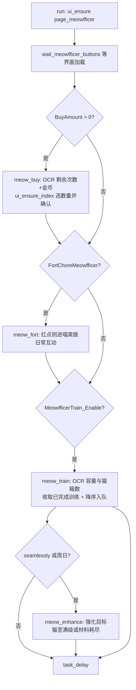

# 日常维护模块合集（reward / tactical / dorm / meowfficer / guild）

> 五个高频日常任务的合集：收获、战术学院、后宅、指挥喵与大舰队。它们共享「进入页面 → 逐项收取/操作 → 退出 → 安排下次运行」的循环骨架，差异只在页面内的识别与操作细节。

## 1. 模块概述

「自动收获」菜单（`task.yaml` 中 `menu: Reward`）下挂着一整批玩家每天都要手动点一遍的页面：领石油物资经验、战术学院学技能、后宅喂食收爱心、指挥喵买箱训练、大舰队后勤与作战。本文合并其中五个最日常的模块；同菜单下的委托（Commission）与科研（Research）流程复杂得多，各有独立文档（[委托系统](commission.md)、[科研系统](research.md)）。

这五个模块的共性大于个性：

- **入口统一**：调度器按优先级 `Commission > Tactical > Research > ... > Dorm > Meowfficer > Guild > ... > Reward` 唤起任务，`alas.py` 上的同名任务方法惰性导入处理器并调用 `run()`。
- **结构一致**：全部继承 `UI`（战术学院经 `Dock` 间接继承），以「截图 → 正向状态识别 → 点击 → continue」的状态循环推进，用 `Timer` 做 confirm/interval 控制；页面跳转复用 `ui_ensure()`/`ui_goto()`，弹窗交给 `InfoHandler` 与 `ui_additional()`。
- **自排程**：`run()` 末尾按资源再生节奏调用 `config.task_delay()`——多数延迟到服务器刷新点（`server_update=True`），宿舍按饱食度消耗推算、指挥喵按训练时长推算、战术学院直接使用 OCR 出的课程剩余时间。
- **功能可独立关闭**：各子功能配置全关时，`run()` 会置 `Scheduler_Enable=False` 并 `task_stop()`，让调度器不再空跑（收获、后宅、指挥喵、大舰队均如此）。

把这一批页面合并为一个「日常维护」层的原因是它们面对同一类问题：低价值、高频次、状态简单的收取循环，且彼此共享识别设施（Navbar 侧边栏、`Filter` 优先级串、OCR 数字识别）。独立成模块是按游戏页面切分的，而它们的工程形态几乎是同一个模板的五次实例化。

## 2. 模块职责

### 负责

- 收获：主界面资源（石油/物资/经验）一键领取，「全部」与「每周」任务页奖励收取。
- 战术学院：领取已完成的技能学习奖励、按过滤器选教材开新课、满级切技能、自动添加学员、急速训练。
- 后宅：喂食（含长按）、一键收爱心与家具币、限时家具购买、按宿舍人数计算任务延迟。
- 指挥喵：每日买猫箱（含金币溢出购买）、喵窝互动、训练入队与收取、特殊天赋猫锁定、多余猫强化、可选的天赋识别评分。
- 大舰队：大厅报告领取、后勤（补给/每周任务/资源兑换）、作战派遣与 Boss 战。
- 各任务结束后的 `task_delay()` 自排程与调度器配置回写。

### 不负责

- 委托与科研的收取（同菜单但流程独立，见 [委托系统](commission.md)、[科研系统](research.md)）。
- 商店购买与金币溢出消费策略（[商店系统](shop.md)；商店反过来会调用本合集的 `meow_overflow_buy`）。
- 页面导航图谱与 Navbar/Scroll 组件本身（`module/ui`）。
- 通用弹窗、登录、悬起床的识别逻辑（`module/handler`）。
- 大舰队战斗的通用战斗流程（复用 [战斗系统](../combat.md)，`GuildCombat` 只适配结算画面）。

## 3. 模块位置

```text
module/
├── reward/
│   ├── reward.py             # Reward：资源领取 + 任务奖励收取
│   └── assets.py
├── tactical/
│   └── tactical_class.py     # RewardTacticalClass（单文件模块，继承 Dock）
├── dorm/
│   ├── dorm.py               # RewardDorm：喂食/收取/延迟计算
│   └── buy_furniture.py      # BuyFurniture：限时家具（6 天间隔）
├── meowfficer/
│   ├── meowfficer.py         # RewardMeowfficer：任务编排
│   ├── base.py               # MeowfficerBase：界面等待/弹窗/周日判断
│   ├── buy.py / fort.py / train.py / collect.py / enhance.py  # 四大子能力
│   ├── collect_score.py      # 收集时评分混入（默认关）
│   ├── score.py / score_ocr.py / score_report.py / advice.py   # 评分引擎与报告
│   ├── score_task.py / scan.py / scan_utils.py                 # 工具Plus 评分任务与猫窝扫描
│   └── cat_data.py / talent_data.py   # 自动生成的静态资料
└── guild/
    ├── guild_reward.py       # RewardGuild：编排三个子任务
    ├── base.py               # GuildBase：侧边导航
    ├── lobby.py              # 大厅报告
    ├── logistics.py          # 后勤（补给/周任务/兑换）
    ├── operations.py         # 作战（派遣/Boss）
    └── guild_combat.py       # GuildCombat 战斗适配
```

## 4. 核心入口

| 任务（task.yaml） | 入口 | 说明 |
| --- | --- | --- |
| `Reward` | `Reward(config, device).run()` | 收获资源与任务奖励 |
| `Tactical` | `RewardTacticalClass(config, device).run()` | 战术学院，`tactical_class_receive()` 为内部主流程 |
| `Dorm` | `RewardDorm(config, device).run()` | 喂食、收取、买家具 |
| `Meowfficer` | `RewardMeowfficer(config, device).run()` | 编排 Buy/Fort/Train/Enhance |
| `Guild` | `RewardGuild(config, device).run()` | 编排大厅/后勤/作战 |
| `MeowfficerScore`（工具Plus） | `run_meowfficer_score(config, device)` | 手动评分工具，无 Scheduler 组，不参与调度 |

## 5. 核心组件

### 收获（module/reward）

| 组件 | 说明 |
| --- | --- |
| `Reward(UI)` | 处理器本体；`reward_receive()` 轮询点击 OIL/COIN/EXP 三按钮（各设 60s interval），`confirm_timer` 确认无可点后结束 |
| `_reward_get_state()` | 任务页四态判定：`MISSION_MULTI`（多选领取）、`MISSION_SINGLE`（需 `match_template_color` 颜色校验）、`MISSION_EMPTY`、`MISSION_UNFINISH` |
| `_reward_side_navbar` | 任务页侧边栏 `Navbar`（全部/主线/支线/每日/每周/活动六项，激活色 `(247, 255, 173)`） |

### 战术学院（module/tactical）

| 组件 | 说明 |
| --- | --- |
| `RewardTacticalClass(Dock)` | 单文件处理器；继承 `Dock` 复用船坞选择（收藏过滤、等级 OCR、META 规避） |
| `Book` | 教材识别：颜色定 genre（红/蓝/黄）与 tier（T1~T4），绿色像素判定「同色 1.5 倍」经验加成（T4 加成书为 2 倍） |
| `BOOK_FILTER` | `Filter` 实例，正则 `(same)?(red|blue|yellow)?-?(t[1234])?`，preset `first` 兜底 |
| `ExpOnBookSelect` / `ExpOnSkillSelect` | `NEXT:1900+500/5800` 格式经验 OCR，`after_process` 修正 OCR 粘连（如 `10005800 → 1000/5800`） |
| `tactical_finish` | 各槽位课程完成时间（OCR `Duration` 所得），直接喂给 `task_delay(target=...)` |

### 后宅（module/dorm）

| 组件 | 说明 |
| --- | --- |
| `RewardDorm(UI)` | 喂食/收取/延迟计算本体 |
| `FOOD_FEED_AMOUNT` + `Food` | 六种食物的单次喂食量（1000~20000）与库存，`FOOD_FILTER` 按 `Dorm_FeedFilter` 排序 |
| `OcrDormFood`（`OCR_FILL`） | 饱食度 `1000/5800` 格式 OCR |
| `_dorm_feed_long_tap` | 长按喂食，按 `DEVICE_CONTROL_METHOD` 用 `Config.when` 分派 minitouch/MaaTouch/uiautomator2/nemu_ipc 四实现；不支持时退化为 `multi_click` |
| `BuyFurniture(UI)` | 限时家具购买：OCR 家具币与价格，`coin >= price > 0` 才买 |

### 指挥喵（module/meowfficer）

| 组件 | 说明 |
| --- | --- |
| `RewardMeowfficer(MeowfficerBuy, MeowfficerFort, MeowfficerTrain)` | 任务入口，按配置顺序编排子模块 |
| `MeowfficerBuy` | 猫箱购买：OCR 剩余/已购/金币，`BUY_MAX=15`、`BUY_PRIZE=1500`、首抽免费；`meow_overflow_buy` 供通用商店金币溢出复用 |
| `MeowfficerFort` | 喵窝互动（红点才进入，颜色检测日常按钮） |
| `MeowfficerTrain(MeowfficerCollect, MeowfficerEnhance)` | 训练入队（降序自动排队）、收取、锁定；`Collect` 内混入 `MeowfficerCollectScore` 做天赋评分 |
| `SWITCH_LOCK` | 锁定/解锁开关（`Switch` 组件），用于保留带特殊天赋的猫 |
| `score.py` + `talent_data/cat_data` | 纯逻辑评分引擎：天赋库白名单匹配 + 四套攻略口径（水面/潜艇/低耗/雷暴），不依赖设备，可单测 |
| `MeowfficerScore` / `MeowfficerScanner` | 工具Plus 评分任务（screenshot/device/scan 三种取图）与猫窝遍历器 |

### 大舰队（module/guild）

| 组件 | 说明 |
| --- | --- |
| `RewardGuild(GuildLobby, GuildLogistics, GuildOperations)` | 任务入口，三子任务顺序执行 |
| `GuildBase` | 侧边导航；`Navbar.get_total()` 动态区分司令（6 项）与普通成员（5 项） |
| `GuildLogistics` | 补给/周任务/兑换三路状态循环；`_guild_logistics_mission_available` 按服务器分三版颜色判定 |
| `GuildOperations` | 作战三模式判定（无作战/派遣/Boss）、红点定位派遣入口、舰队切换与派遣执行 |
| `GuildCombat(Combat)` | 独立创建的战斗对象，适配大舰队的 `BATTLE_STATUS_CF`/`EXP_INFO_CF` 结算画面 |

## 6. 工作流程

### 收获

`ui_ensure(page_reward)` → `reward_receive()`（三个资源按钮各设 60 秒 interval 轮询点击，1 秒 × 3 次确认无变化即结束）→ 回 `page_main` → `reward_mission()`：先 `reward_mission_notice()` 检测主界面任务红点（模板 + 白色版颜色计数），无红点直接跳过；进 `page_mission` 后「全部」页必收，「每周」页先查 `MISSION_WEEKLY_RED_DOT` 颜色再切侧边栏。收取状态循环里：`MISSION_MULTI/SINGLE` 状态逐个点领取，`_reward_mission_claim_receive()` 处理 GET_ITEMS、GET_SHIP、`handle_mission_popup_ack()` 等弹窗；`MISSION_EMPTY/UNFINISH` 即结束。最后 `task_delay(server_update=True)`。

### 战术学院

`run()` 进 `page_reward` 后进入 `tactical_class_receive()` 的单一状态循环，每帧依次尝试一组处理器：添加学员（`ADD_NEW_STUDENT`）→ 急速训练（`RAPID_TRAINING`，按 `Tactical_RapidTrainingSlot` 槽位偏移匹配）→ 完成时间 OCR 与退出 → 各类弹窗 → 教材选择（`TACTICAL_CLASS_START`）→ 船坞 → 技能确认 → META 技能退出 → 教材空弹窗。

选教材是核心决策点：`_tactical_books_get()` 轮询至教材数量稳定（15 次失败抛 `ScriptError`）→ 先选中第一本 → 按当前技能进度做**经验溢出过滤**（OCR `current/total`，10 级满级总经验 5800，`current + 教材经验 > total + 允许溢出量` 的教材被剔除）→ `BOOK_FILTER` 按配置排序 → 点击最优教材开课；过滤器无命中则取消本次课程。技能满级时（OCR 结果含 `MA`，即 `NEXT:MAX`），`Tactical_SkillAutoSwitch` 开启则自动切到下一个未满级技能；`AddNewStudent_Enable` 开启时从船坞选一名等级 ≥ `AddNewStudent_MinLevel` 的舰娘（阵营过滤自然跳过 META 舰）开始新课程。

排程：OCR 各槽位剩余时间得 `tactical_finish`，`task_delay(target=...)` 精确到课程完成时刻；教材耗尽则延迟到次日服务器刷新。

### 后宅

`ui_ensure(page_dormmenu)` → `ui_goto(page_dorm)`，随后按「先喂食、再收取、最后买家具」的固定顺序执行——喂食在前是因为 `DORM_INFO` 弹窗会遮挡金币与爱心。喂食循环（最多 10 轮 `dorm_feed_once`）：OCR 六种食物库存与饱食度 → `FOOD_FILTER` 按 `Dorm_FeedFilter`（默认大份优先）排序 → 取第一个「有库存且单次喂食量 < 剩余饱食度」的食物，按 `count = min(饱食度/单次量, 库存)` 决定连点还是长按。收取用 `DORM_QUICK_COLLECT` 一键按钮，info_bar 出现即完成。买家具（`BuyFurniture.run()`）先比对 `BuyFurniture_LastRun + 6 天`，再进家具店详情页按 `DORM_FURNITURE_COUNTDOWN` 识别限时家具，OCR 比对家具币与价格后按 `BuyFurniture_BuyOption`（set/all）购买并回写 `LastRun`。

排程是本模块特色：OCR 宿舍栏位得到舰船数 0~6，查表得 278~1000 分钟的任务延迟（舰船越多吃粮越快，下次喂食越近），`task_delay(minute=delay)`。

### 指挥喵



收取（`meow_get`）逐只进行：颜色检测三个天赋格判断「特殊天赋」，金猫默认只有在「开启保留 + 有特殊天赋 + 评分达标」时才 `_meow_apply_lock`，否则 `_meow_skip_lock` 跳过；紫猫同理受 `RetainTalentedPurple` 控制。评分（`MeowfficerCollectScore` 混入，`MeowfficerTrain_ScoreTalents` 开启时）复用本来就要展开的天赋详情面板 OCR 天赋名，经 `score.py` 四口径评分，`ScoreThreshold > 0` 时评分参与锁定判断。强化（`meow_enhance`）按 `MeowfficerTrain_EnhanceIndex`（1~12）选目标猫，OCR 等级满 30 则索引自增换下一只（第 12 只满级会禁用训练功能）；材料按 `MaxFeedLevel` 过滤，单次最多 10 只，循环至金币不足 1000。训练模式两分支（`seamlessly` / `once_a_day`）当前排队逻辑相同，差别只在收取范围：前者全收，后者平日收一只、周日全收并触发强化。

排程：训练开启时延迟 150~210 分钟（训练时长蓝 2~2.5h / 紫 5.5~6.5h / 金 9.5~10.5h，取最短档上浮），否则延迟到服务器刷新。

### 大舰队

`ui_ensure(page_guild)` 后顺序执行三个子任务：

- **大厅**（无条件执行）：在 `GUILD_REPORT_AVAILABLE` 区域找红色点定位报告入口 → 点击 → `GUILD_REPORT_CLAIM` 领取 → 处理 GET_ITEMS 弹窗。
- **后勤**（`GuildLogistics_Enable`）：切侧边栏到后勤页，单循环内并发推进三路——补给领取（点击后等待结果，重试上限 2 次）、周任务（按服务器版本判定按钮可用性后点击，司令/副司令可开启 `SelectNewMission` 选新任务）、资源兑换（OCR 次数 > 0 时用 `ItemGrid` 识别物品、红字标记库存不足，按 `ExchangeFilter` 点第一个可兑项）。
- **作战**（`GuildOperation_Enable`）：先判定模式——无进行中作战（司令/军官可按 `SelectNewOperation` 开新作战，硬编码选所罗门海空战，且日期早于 `NewOperationMaxDate`）、有作战（红点定位派遣入口 → 切到最右舰队 → 推荐填充 → 确认派遣）、Boss 已激活（`GuildOperation_AttackBoss` 开启时用 `GuildCombat` 打 Boss）。

后勤返回「三路全部确认」才算当日完成；全部结束后回 `page_main`，`task_delay(server_update=True)`（该任务的服务器刷新点为每天 4 个时段）。

## 7. 调用关系

### 上游

| 模块 | 关系 |
| --- | --- |
| `alas.py` 任务方法 `reward/tactical/dorm/meowfficer/guild` | 唯一调度入口，惰性导入后调 `run()` |
| `module/config`（优先级表） | 日常任务在 `_DEFAULT_SCHEDULER_PRIORITY` 中的相对顺序决定了执行批次 |
| `module/shop`（通用商店） | 金币溢出时导航到指挥喵页调用 `MeowfficerBuy.meow_overflow_buy()` |
| `module/commission` | 石油溢出（`OilMaxed`）时调用 `RewardDorm.dorm_food_run(amount=10)` 购粮烧石油 |
| `module/api` | `meowfficer.scoreReport` 接口与 `/reports/meowfficer_score` 路由读取评分任务产物 |

### 下游

| 模块 | 用途 |
| --- | --- |
| `module/ui` | `ui_ensure`/`ui_goto`、`Navbar` 侧边栏、`Switch`（指挥喵锁定）、`Page` 图谱 |
| `module/handler` | `handle_popup_confirm/cancel`、`handle_urgent_commission`、`ui_additional` 等弹窗 |
| `module/ocr` | `Digit`/`DigitCounter`（次数、金币、饱食度）、`Duration`（课程剩余）、`LevelOcr`（舰船等级） |
| `module/base` | `Filter`（教材/食物/兑换优先级串）、`Timer`、`ButtonGrid`、`Config.when` |
| `module/retire` | 战术学院继承 `Dock` 复用船坞筛选与选择 |
| `module/combat` | `GuildCombat` 复用战斗流程；GET_ITEMS 等结算资源 |
| `module/statistics` | `stat.new(genre=...)` 掉落截图记录（`DropRecord_MeowfficerBuy/Talent`） |
| `module/config/utils` | `get_server_next_update` 驱动自排程与周日判定 |

## 8. 数据流

```text
调度器 bind 任务 → self.config.<Group>_<Argument> 可读
  → run()：截图 → 识别（模板/颜色/OCR）→ 点击 → 循环
  → 识别出的运行时状态（课程剩余时间、宿舍人数、金币余额）
      → config.task_delay(...) 写回 <Task>.Scheduler.NextRun（持久化到 JSON）
  → 部分结果回写配置：BuyFurniture_LastRun、MeowfficerTrain_EnhanceIndex
  → 可选旁路：掉落截图（DropRecord）、指挥喵评分报告（log/meowfficer_score.*）
```

## 10. 配置

配置路径 `<Task>.<Group>.<Argument>`，代码经 `self.config.Group_Argument` 访问。五个任务同属「自动收获」菜单，各自的 `Scheduler.ServerUpdate` 由 `override.yaml` 固定（多数为 `00:00`，收获与大舰队为 `00:00, 06:00, 12:00, 18:00`）。

### 收获（任务 Reward，组 Reward）

| 配置 | 类型 | 默认值 | 说明 |
| --- | --- | --- | --- |
| `Reward_CollectOil` / `CollectCoin` / `CollectExp` | checkbox | true | 领取石油/物资/经验 |
| `Reward_CollectMission` | checkbox | true | 领取每日任务奖励 |
| `Reward_CollectWeeklyMission` | checkbox | false | 领取每周任务奖励 |

### 战术学院（任务 Tactical，组 Tactical / ControlExpOverflow / AddNewStudent）

| 配置 | 类型 | 默认值 | 说明 |
| --- | --- | --- | --- |
| `Tactical_TacticalFilter` | textarea | `SameT4 > ... > first` | 教材优先级：`same`=同色 1.5 倍加成、颜色（Red/Blue/Yellow）、`T1~T4`，`first` 兜底 |
| `Tactical_RapidTrainingSlot` | select | do_not_use | 急速训练槽位（活动期间每天限次） |
| `Tactical_SkillAutoSwitch` | checkbox | true | 技能满级自动切换下一个 |
| `ControlExpOverflow_Enable` + `T1~T4Allow` | checkbox/int | true / 100~200 | 满级前（总 5800）允许各档教材溢出的经验量 |
| `AddNewStudent_Enable` / `Favorite` / `MinLevel` | checkbox/bool/int | false / false / 50 | 自动添加学员、仅收藏舰娘、最低等级 |

### 后宅（任务 Dorm，组 Dorm / BuyFurniture）

| 配置 | 类型 | 默认值 | 说明 |
| --- | --- | --- | --- |
| `Dorm_Collect` | checkbox | true | 一键收取爱心与家具币 |
| `Dorm_Feed` | checkbox | true | 喂食 |
| `Dorm_FeedFilter` | textarea | `20000 > ... > 1000` | 喂食优先级（按单次喂食量） |
| `Dorm_BuyFood` | 隐藏 | false | 已停用（`display: disabled`），仅作状态显示；购粮由委托模块在石油溢出时自动触发 |
| `BuyFurniture_Enable` / `BuyOption` / `LastRun` | checkbox/select/datetime | false / all / 2020-01-01 | 限时家具购买，检查间隔 6 天由代码常量 `CHECK_INTERVAL` 决定 |

### 指挥喵（任务 Meowfficer，组 Meowfficer / MeowfficerTrain；工具任务 MeowfficerScore）

| 配置 | 类型 | 默认值 | 说明 |
| --- | --- | --- | --- |
| `Meowfficer_BuyAmount` | int | 1 | 每日买猫箱数（每日上限 15，首抽免费） |
| `Meowfficer_FortChoreMeowfficer` | checkbox | true | 喵窝互动 |
| `MeowfficerTrain_Enable` / `Mode` | checkbox/select | false / seamlessly | 训练开关与模式 |
| `MeowfficerTrain_RetainTalentedGold` / `RetainTalentedPurple` | checkbox | true | 锁定带特殊天赋的金/紫猫 |
| `MeowfficerTrain_ScoreTalents` / `ScoreThreshold` | checkbox/int | false / 0 | 收集时 OCR 天赋并评分；门槛参与锁定判断 |
| `MeowfficerTrain_EnhanceIndex` / `MaxFeedLevel` | int | 1 / 5 | 强化目标槽位（1~12）/ 材料等级上限（1~30），越界会被代码修正 |
| `MeowfficerScore_Source` 等 | 见 argument.yaml | screenshot | 评分工具：来源、截图目录、报告路径、跟拍与扫描参数 |

### 大舰队（任务 Guild，组 GuildLogistics / GuildOperation）

| 配置 | 类型 | 默认值 | 说明 |
| --- | --- | --- | --- |
| `GuildLogistics_Enable` | checkbox | true | 后勤三件事 |
| `GuildLogistics_SelectNewMission` | checkbox | false | 司令/副司令选择每周舰队任务 |
| `GuildLogistics_ExchangeFilter` | textarea | `PlateTorpedoT1 > ... > Oil` | 兑换优先级 |
| `GuildOperation_Enable` | checkbox | true | 作战 |
| `GuildOperation_SelectNewOperation` / `NewOperationMaxDate` | checkbox/int | false / 15 | 开新作战及每月日期上限 |
| `GuildOperation_JoinThreshold` | float | 1 | 仅当 `当前进度 <= 总进度 × 阈值` 时加入作战 |
| `GuildOperation_AttackBoss` / `BossFleetRecommend` | checkbox | true / false | 打 Boss / Boss 舰队推荐 |

## 11. 异常与错误处理

| 异常 | 原因 | 处理 |
| --- | --- | --- |
| `ScriptError` | 战术学院 15 次未识别到教材（持续加载） | 上抛，由调度器按分级恢复重启游戏 |
| `GameBugError` | 大舰队兑换连续 5 次未成功（跨天游戏内计时 bug，重启无法修复）；无法开启/加入作战（已被其他军官开启） | 上抛，重启游戏恢复 |
| `RequestHumanTakeover` | 指挥喵评分 scan 模式无法进入猫窝页面 | 上抛；调度器仍会尝试自动恢复 |
| `TaskEnd`（`task_stop()`） | 任务的所有子功能开关均关闭 | 正常结束任务并禁用调度，避免空跑 |
| OCR 结果异常 | 购买上限非 15、宿舍栏位非法、猫等级 > 30 等 | 就地打 warning 并修正/重读，不中断任务 |
| `GameStuckError` / `GameTooManyClickError` 等 | 页面卡死、连点循环 | 统一上抛，见 [调度器](../entry/alas.md) 的异常分级 |

各模块普遍用「confirm_timer 稳定期 + interval 点击间隔」防抖：状态无变化持续约 1.5~3 秒才判定为完成，避免在动画/加载中途误退出。

## 13. 缓存与持久化

- **cached_property**：侧边导航栏（收获、大舰队）、食物网格与 OCR（后宅）、兑换物品网格（大舰队）随实例缓存，任务结束随实例销毁。
- **配置回写**：`task_delay()` 写各任务的 `Scheduler.NextRun`；`BuyFurniture_LastRun` 与 `MeowfficerTrain_EnhanceIndex` 由模块直接赋值写回用户配置 JSON。
- **内存态**：`tactical_finish`（每次 run 重新 OCR）、`_box_count`（指挥喵猫箱库存）、后勤的 supply/mission/exchange checked 标志都只存活于单次任务。
- **落盘产物**：指挥喵评分任务写 `log/meowfficer_score.{md,html,json}`，WebUI 经 `/reports/meowfficer_score`（HTML）与 `meowfficer.scoreReport` 接口（JSON）只读展示，清空接口会三份一起删。

## 14. 生命周期

调度器每轮任务用当次 `config`/`device` 构造新处理器实例，`run()` 返回即丢弃；模块无退出清理，识别资源（模板、OCR 模型）由全局资源管理在任务切换时统一释放。唯一的「自毁」路径是第 11 节的全关停：`Scheduler_Enable=False` + `task_stop()`。

## 15. 扩展方式

新增一个同形态的日常收取任务：

1. 在 `task.yaml` 的 `Reward` 菜单组下注册任务（或在 `argument.yaml` 定义参数组），运行 `uv run -m module.config.config_updater`。
2. 在 `module/<功能>/` 实现处理器：继承 `UI`，提供 `run()`，末尾按资源再生节奏调用 `config.task_delay()`。
3. 在 `alas.py` 添加同名任务方法（惰性导入），必要时在 `config_manual.py` 的默认优先级表中插入位置。
4. 补 `i18n/*.json` 五语言的名称与说明翻译。

在现有模块上加子功能时，优先用 `Config.when` 分派或混入类（指挥喵的 `MeowfficerCollectScore` 是范本），而不是往主循环里塞新分支。

## 16. 修改注意事项

- **指挥喵的能力是继承链拼装**：`RewardMeowfficer(Buy, Fort, Train)`、`MeowfficerTrain(Collect, Enhance)`、`Collect(CollectScore, Base)`。方法名在各层唯一，新增方法前先查全链避免覆盖；独立战斗类场景（`GuildOperations` 的 Boss）也刻意新建 `GuildCombat` 实例而非复用 self，理由相同。
- **两种训练模式当前排队逻辑相同**：`meow_train` 两个分支都调 `meow_queue(ascending=False)`（系统自动、金>紫>蓝）；升序手动排队的 `_meow_rqueue` 保留但未启用。改排队策略时先确认这一点，不要假设升序分支在线上生效。
- **大舰队的任务可用性判定按服务器分三版**（`@Config.when(SERVER='en'/'jp'/None)`），颜色阈值互不通用；JP 版的任务选择逻辑被注释禁用，恢复前需截图验证。
- **战术学院的经验 OCR 含大量修正式补丁**：`ExpOnBookSelect.after_process` 把 `10005800` 修成 `1000/5800`、`…580` 修成 `…5800`，并按服务器区分左侧 `Next:` 留白宽度；调整 OCR 预处理前先理解这些修正针对的真实误读形态。
- **后宅先喂食后收取的顺序不能反**（`DORM_INFO` 弹窗遮挡）；喂食长按按 `DEVICE_CONTROL_METHOD` 分派，新增控制方式必须补对应分支，否则静默退化为多次点击（慢但可用）。
- **收获的每周页先查 `MISSION_WEEKLY_RED_DOT` 颜色再翻页**，`MISSION_SINGLE` 用 `match_template_color` 而非 `appear`——这些是针对误识别的补丁，改动前先看注释中的历史原因。
- **宿舍延迟表 `cal_dorm_delay` 与游戏饱食度消耗强耦合**，0 船时回落到 `Scheduler_SuccessInterval`；调整喂食策略时需同步验证该表。
- **大舰队开新作战硬编码所罗门海空战**（`GUILD_OPERATIONS_SOLOMON`），游戏调整奖励后需同步更新；司令与成员的侧边栏项数不同（6/5），导航用 `Navbar.get_total()` 动态判断，不要写死索引。

## 17. 已知限制

- `dorm._dorm_receive_click()`（模板匹配逐个点爱心/金币）当前已无调用方，被 `DORM_QUICK_COLLECT` 一键收取取代，属遗留代码。
- 后宅延迟表按「食物充足」推导；食物耗尽后任务仍按表延迟，会空跑一次才发现无事可做。
- 指挥喵评分口径来自公开攻略（`score.py` 头注列明出处），不是游戏官方数值；scan 模式的天赋白名单是中文，仅适用于国服中文客户端。
- 大舰队后勤要求「补给/任务/兑换三路全部确认」才返回完成，任一路识别抖动会导致整组重试。
- 大舰队兑换次数 OCR（`ExchangeLimitOcr`）依赖反色预处理，界面改版后需重新校准。
- 收获模块无法处理「任务页但不在全部/每周页」的中间态，会等待超时并把收取留给下次运行（奖励会排队，不丢失）。

## 18. 示例

五个任务 `run()` 的统一形态（以收获为例）：

```python
def run(self):
    self.ui_ensure(page_reward)                 # 进入目标页面
    self.reward_receive(oil=..., coin=..., exp=...)   # 逐项收取
    self.ui_goto(page_main)
    self.reward_mission(daily=..., weekly=...)        # 可选子流程
    self.config.task_delay(server_update=True)        # 自排程
```

模块内的典型状态循环（收获任务页）：

```python
for _ in self.loop():
    if state in [MISSION_EMPTY, MISSION_UNFINISH]:
        break                                   # 正向状态确认退出
    if self.appear_then_click(MISSION_MULTI, interval=3):
        continue                                # 操作 + interval 防连点
    if self.appear_then_click(GET_ITEMS_1, interval=1):
        continue                                # 弹窗交给处理器链
```

## 19. 调试方法

- **日志前缀**：`[奖励-领取]`、`[战术-教材/技能/船坞]`、`[宿舍-喂食/收取/调度]`、`[指挥喵-购买/训练/收集/强化/评分]`、`[大舰队-大厅/后勤/作战]`；`logger.attr` 输出的中间状态（教材列表、兑换排序、舰队切换）是定位误识别的第一手材料。
- **WebUI 单任务运行**：在对应任务页点「立即执行」，观察 `task_delay` 日志确认排程是否符合预期。
- **指挥喵评分**：先跑一次「工具Plus → 指挥喵评分」，产物在 `log/` 下；HTML 版可在 WebUI `/reports/meowfficer_score` 直接打开；识别率问题先看 `[指挥喵-评分] OCR 原始命中` 调试日志。
- **常见问题**：战术卡在选教材 → 查 `[战术-教材] 尝试15次` 是否伴随加载动画；指挥喵没买箱 → 查「剩余次数/金币」OCR 值与每日上限修正日志；大舰队反复重启 → 是否命中 `GameBugError` 的两个已知场景。

## 20. 相关模块

- [商店系统](shop.md) —— 通用商店金币溢出时调用本合集的指挥喵溢出购买
- [委托系统](commission.md) —— 石油溢出时调用后宅的 `dorm_food_run` 购粮
- [科研系统](research.md) / [其他游戏功能模块](misc.md) —— 同属「自动收获」菜单的姊妹任务
- [UI 导航](../ui.md) —— `Page` 图谱、`Navbar`/`Switch` 组件，五个模块的导航地基
- [处理器层](../handler.md) —— 弹窗、info_bar 与紧急委托的统一处理
- [OCR 系统](../ocr.md) —— 数字、时长与多行文本识别
- [战斗系统](../combat.md) —— `GuildCombat` 复用的战斗状态机
- [调度器（alas.py）](../entry/alas.md) —— 任务优先级、`task_delay` 自排程的消费方
