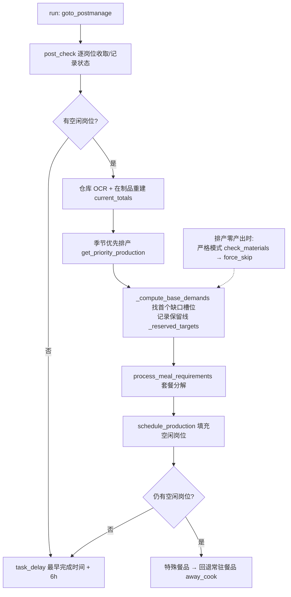
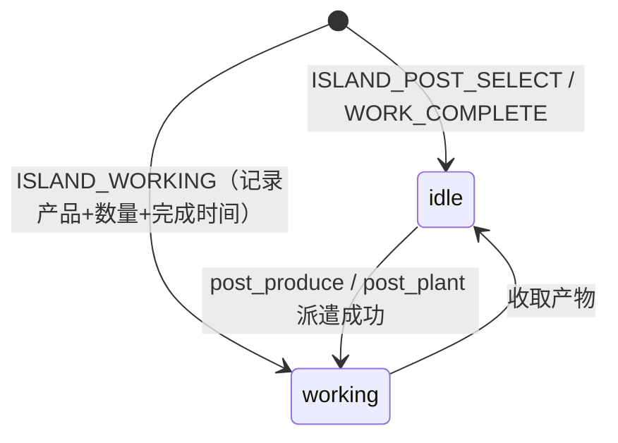

# 岛屿系统（module/island）

> 碧蓝航线「离岛」生活玩法的自动化：四大生产区派遣、六类店铺生产、商区经营与每日/每周任务（采集、订单、空投、互动、货运、珍珠交易）。

## 1. 模块概述

离岛是游戏内的常驻生活玩法：玩家在岛上经营农田、果园、苗圃、牧场、渔场、矿山、林场，把产出加工成菜品饮品，再通过岗位派遣、商区经营、货运委托与珍珠交易换取资源。玩法画面是自由视角的 3D 岛屿（长按移动视角），内部大量同构 UI（岗位详情、产品选择、角色选择、购买弹窗）在十几个子玩法间重复出现。

本模块把这些玩法拆成一个厚基类 `Island` 加约 20 个任务类：基类负责所有子玩法共享的「岛屿导航、岗位管理、产品/角色选择、仓库筛选与 OCR、商店补货」原语；每个任务类只描述自己玩法的岗位布局、产品配置和调度规则。店铺类玩法（餐馆、饮品、烧烤、简餐、咖啡、制造业）再共享一层 `IslandShopBase`，统一「库存 → 需求 → 套餐分解 → 排产」的算法。另一个贯穿全局的维度是**季节**：全局配置 `IslandPlan.Season` 决定四季限定物品是否参与补种与生产，由 `island_season.py` 统一管理。

调度上，`alas.py` 尾部的 `island_*` 任务方法惰性导入对应模块；任务之间有一条显式联动链：牧场任务执行完后内联执行渔场任务并合并两者计时器，商区经营开始后会触发对应餐馆类生产任务。

## 2. 模块职责

### 负责

- 岛屿页面导航与地图移动：进入管理/岗位管理/仓库/好友岛页面，岛屿地图目的地跳转（矿山林场、农场、苗圃、集会、港口），长按视角移动（`island_up/down/left/right`）。
- 岗位管理原语：遍历岗位、打开/关闭岗位详情、收取产物、追加派遣、页签切换（生产/经营/采集）。
- 派遣两要素：角色选择（网格识别 + 体力 OCR + 优先级回退）与产品选择（模板匹配 + 滑动搜索 + 材料数量 OCR + 商店即时补货）。
- 仓库能力：种类/来源双维度筛选，网格模板匹配 + 数字 OCR 读库存。
- 各生产玩法（农田/果园/苗圃、牧场+磨坊、渔场、矿山林场）与六类店铺（烧烤、白熊饮品、有鱼餐馆、啾啾简餐、啾咖啡、制造工坊）的自动运营。
- 商区经营（5 家商店的按钮状态机、季节/加成商品替换、分批经营）。
- 每日每周任务：采集派遣、每日订单与紧急委托、空投与好友岛补给、摸猫/速运/外送/每周照相、货物筹备运输、珍珠每周采购售卖。

### 不负责

- 季节数据的提取（`dev_tools/island_extractor.py` 是独立开发工具，运行时不参与）。
- 岛屿商店金币/货币的 Dashboard 上报、常规游戏商店（`module/shop`）。
- 页面跳转图谱本身的维护（`module/ui`，本模块只新增岛屿页面节点）。
- 调度恢复与异常重试策略（`module/runtime`，本模块只通过 `task_delay` 与异常语义对接）。

## 3. 模块位置

```
module/island/                  # 全部逻辑所在的主包
├── island.py                   # Island 基类：导航、岗位、选品、仓库筛选、商店购买
├── island_select_character.py  # SelectCharacter：角色网格识别、体力、滚动查找
├── warehouse.py                # WarehouseOCR：仓库网格模板定位 + 数量 OCR
├── island_shop_base.py         # IslandShopBase：店铺通用排产框架
├── island_season.py            # SeasonConfig：季节常量与全局单例
├── ui.py                       # IslandUI：运输/管理页导航，岛屿弹窗处理
├── assets.py                   # button_extract 生成的公共岛屿按钮
├── island_farm.py / island_rancher.py / island_fishery.py / island_mine_forest.py
├── island_grill.py / island_teahouse.py / island_restaurant.py
├── island_juu_coffee.py / island_juu_eatery.py / island_manufacture.py
├── island_business.py          # 商区经营（最大的单文件，含按钮状态机与批次逻辑）
├── island_daily_gather.py / island_daily_interact.py / island_daily_order.py
├── island_air_drop.py / island_pearl_sell.py / island_cargo_preparation.py
└── island_shop_base.py 所在的生产链各店无独立 run 以外的入口

module/island_farm/ 等 16 个目录  # 薄壳：仅 button_extract 生成的 assets.py
```

**薄壳目录设计**（本模块最容易误解的结构）：`dev_tools/button_extract.py` 扫描 `assets/{cn,en,jp,tw}/` 下所有子目录，为每个目录机械生成同名 `module/<目录>/assets.py`。岛屿团队把按钮截图按子玩法拆到了 `assets/cn/island_farm/`、`assets/cn/island_restaurant/` 等 16 个目录（每个玩法几十到上百个 `POST_XXX`/`SELECT_XXX`/`TEMPLATE_XXX` 资源），生成器便机械地产出了 16 个只含 `assets.py` 的「薄壳」目录。这些薄壳**不承载任何逻辑，也没有被 alas.py 导入**——`alas.py` 的 17 个 `island_*` 任务方法全部 `from module.island.island_xxx import Xxx`（主包），薄壳只作为资源文件被主包逻辑 `from module.island_farm.assets import *` 反向引用。其真实价值是**资源隔离**：单一 `island/` 资产目录已超百个文件，按玩法拆分让模板/按钮按玩法成组维护，跨玩法复用（如牧场复用农田的作物模板、渔场复用牧场的按钮）直接 import 对方薄壳即可。`island_fishery.py` 中「重新导入鱼苗商店专用按钮（覆盖 island.assets 中的同名旧定义）」的注释佐证了资源在逐步从 `island/` 迁出到玩法目录，旧同名定义靠后置 import 覆盖。

## 4. 核心入口

| 入口 | 用途 |
| --- | --- |
| `alas.py` 的 `island_farm`/`island_rancher`/`island_fishery`/`island_mine_forest` 等方法 | 调度器按任务名进入各玩法，惰性导入并 `run()` |
| `IslandShopBase.run()` | 六类店铺（含制造业覆盖版）的统一生产主流程 |
| `IslandBusiness.run()` | 商区经营状态机（分批/传统两种模式） |
| `IslandDailyGather/Interact/Order/AirDrop/PearlSell.run()` | 每日每周任务的独立入口 |
| `IslandCargoPreparation.run()` | 货运委托入口（唯一基于 `IslandUI` 而非 `Island` 的主流程） |
| `Island`（基类本身） | 无 `run()`，不作为任务运行；alas 的 `island()` 方法仅为导入基类存在 |
| `tests/test_island_shop_production.py` | 离线验证店铺排产逻辑（假 UI，不连游戏） |

## 5. 核心组件

| 组件 | 基类 | 职责 |
| --- | --- | --- |
| `Island` | `SelectCharacter` | 岛屿全局基类：`goto_management`/`goto_postmanage`/`island_map_goto`、岗位详情状态机（`post_open`/`post_get_and_add`/`confirm_post_add_order`）、`select_product`（滑动选品）、材料 OCR 与商店补货（`ensure_select_product_material`）、`warehouse_filter`、`buy_shop_item` |
| `SelectCharacter` | `UI` | 角色网格（前两行）身份/工作/选中状态识别，`WorkerJuu` 体力无限兜底，滚动列表严格查找 |
| `WarehouseOCR` | — | 6x2 仓库网格上按模板定位物品并 OCR 数量（`ocr_item_quantity`） |
| `IslandShopBase` | `Island, WarehouseOCR` | 店铺框架：`Meal1~8` 槽位需求、套餐分解、保留线排产、循环填岗 |
| `IslandUI` | `UI` | 岛屿手机页的运输/管理入口，覆盖 `ui_additional` 处理维护公告与信息弹窗 |
| `SeasonConfig` | — | 读取 `IslandPlan.Season`，提供按模块键查询当季限定物品；进程级单例 |
| `CargoPreparationTransport` | — | 单个货运栏位的解析模型（状态/货物/时长） |

各任务类一览（玩法见第 6 节）：

| 任务类 | 组合的父类 | 玩法 |
| --- | --- | --- |
| `IslandFarm` | Island + WarehouseOCR + LoginHandler | 农田/果园/苗圃补种 |
| `IslandRancher` | 同上 | 磨坊加工 + 牧场养殖，完成后串联渔场 |
| `IslandFishery` | 同上 | 鱼苗购买与养殖，合并牧场计时器 |
| `IslandMineForest` | Island + LoginHandler | 矿山/林场派遣 |
| `IslandGrill/Teahouse/Restaurant/JuuCoffee/JuuEatery` | IslandShopBase | 餐饮店铺生产 |
| `IslandManufacture` | IslandShopBase（重度覆盖） | 工坊四产线 |
| `IslandBusiness` | Island | 商区经营 |
| `IslandDailyGather/Interact/Order/AirDrop/PearlSell` | Island | 每日每周玩法 |
| `IslandCargoPreparation` | IslandUI | 货运委托 |

## 6. 工作流程

### 生产派遣的公共骨架

农田、渔场、矿山林场等生产类任务的流程同构：

1. `ui_ensure(page_island)` 进入岛屿，必要时 `goto_management()` 经手机页/季节页纠偏；
2. 进入仓库，`warehouse_filter` 筛选品类，模板 + OCR 统计各产品库存；
3. 库存与阈值比较生成补种/补产列表（季节限定产品按当季过滤），扣除在产岗位需求；
4. `goto_postmanage()` 进入岗位管理，`post_manage_mode` 切到生产页签（必要时按 `post_manage_swipe_count` 上下滑动定位岗位列表）；
5. 逐岗位 `post_open` 打开详情：完成→收取，工作中→记录产品与 `Duration` OCR 的剩余时间，空闲→进入派遣流程；
6. 派遣走固定顺序：点空岗 → `ISLAND_SELECT_CHARACTER_CHECK` 时按角色筛选器 `select_character`（体力不足时自动切「工作速度」排序并回退 `WorkerJuu`）→ `ISLAND_SELECT_PRODUCT_CHECK` 时 `select_product` 选中产品，`ensure_select_product_material` 发现种子/鱼苗/饲料不足则跳转对应商店页签补买后重来 → `POST_MAX` + `POST_ADD_ORDER` 确认；
7. 全部安排完成后，把所有岗位完成时间与 6 小时兜底值取最小，`config.task_delay(target=...)` 预约下次运行。

### 店铺排产（IslandShopBase）



排产的核心约束：每个岗位单次最多生产 `POST_PRODUCE_LIMIT`（约 7）个；填岗循环最多 `_MAX_FILL_LOOP`（10）轮；套餐（`meal_compositions`）下单时实时 `deduct_materials` 扣减原料账目；「保留线」记录已处理槽位的最高目标，防止套餐把尚未达标产品的保底库存当原料吃掉。排产多次失败时先切严格模式（真零库存才跳过），仍失败则把缺口产品加入 `force_skip` 本轮不再停留。

### 子玩法速览

| 子模块 | 玩法 | 入口类 | 特殊机制 |
| --- | --- | --- | --- |
| `island_farm.py` | 农田、果园、苗圃播种 | `IslandFarm` | 三区域独立阈值/默认作物；未达标作物每类最多占一岗；果园秋季限定（秋月梨/柿子）按 4x1 计种子；牛油果/菠萝可忽略；小天城（Amagi_chan）橡胶优先开关 |
| `island_rancher.py` | 磨坊 + 牧场 | `IslandRancher` | 按岗位固定饲料种类补磨坊加工（小麦→鸡饲料等）；`run()` 末尾内联 `IslandFishery(...).run(ranch_finish_times=...)` 合并计时器 |
| `island_fishery.py` | 渔场养殖 | `IslandFishery` | 鱼苗商店分淡水/海水/其他页签；按每苗产量反推购买数；体力门槛 98 |
| `island_mine_forest.py` | 矿山/林场 | `IslandMineForest` | 仓库顺序不固定，自实现「OCR 中文品名 → 读数字」库存扫描；每岗产 4 个、各产物有最大连续次数；体力门槛 80 |
| `island_grill.py` | 乌鱼烤肉店 | `IslandGrill` | 最薄的店铺：仅声明 8 菜品、2 套餐、2 岗位，全部逻辑走基类 |
| `island_teahouse.py` | 白熊饮品 | `IslandTeahouse` | 季节高优先级饮品走固定坐标（不滑动不比色）；「迎春花茶优先生产」开关；为手动配置的季节饮品补注册防止 KeyError |
| `island_restaurant.py` | 有鱼餐馆 | `IslandRestaurant` | 季节菜品自动切换槽位；覆盖 `select_product` 支持固定坐标季节菜 |
| `island_juu_coffee.py` | 啾咖啡 | `IslandJuuCoffee` | 牛奶为特殊材料，扩展仓库读取与 `deduct_materials`；Friedrich 特殊角色开关 |
| `island_juu_eatery.py` | 啾啾简餐 | `IslandJuuEatery` | 芝士/牛奶特殊材料约束；海鲜饭等无套餐产品 |
| `island_manufacture.py` | 制造工坊 | `IslandManufacture` | 四产线（木工/电子/工业/手工）各按配置启用岗位；完全覆盖 `run()` 与排产规则（数量由材料检查决定）；滑动 2 次 |
| `island_business.py` | 商区经营 | `IslandBusiness` | 5 商店 × 蓝/黄/深蓝/灰按钮状态机；分批经营（默认批 1=简餐/餐馆/咖啡，批 2=饮品/烤肉）；季节商品库存 <7 时替换 fallback；加成（30/20/10%）档位替换；开始经营后 `task_delay` 触发对应餐馆生产任务补货 |
| `island_daily_gather.py` | 每日采集 | `IslandDailyGather` | 每日 03:10 / 18:00 两次；三槽位派角色，体力阈值 100，忽略 WorkerJuu |
| `island_daily_interact.py` | 摸猫、JUU 速运、商区外送、每周照相 | `IslandDailyInteract` | 以「开发计划」任务图标模板判断任务是否可做；地点交互共用 `delivery_location_flow`；失败 60 分钟重试 |
| `island_daily_order.py` | 每日订单 | `IslandDailyOrder` | 紧急委托周配额 15（OCR 检测 + 周一刷新）；订单驳回按 `RejectFilter`；冷却 OCR 失败回退 8 小时 |
| `island_air_drop.py` | 每日空投 + 好友岛偷补给 | `IslandAirDrop` | 以服务器 0 点为每日边界；5 小时偷取冷却（`LastSteal` 落配置）；拜访次数 OCR 复检 |
| `island_pearl_sell.py` | 珍珠每周采购售卖 | `IslandPearlSell` | 周一 01:00 交易窗口；本岛价不达标时按排行榜拜访好友岛比价（买 1.1 折算）；每日 03:00 可选价格刷新 |
| `island_cargo_preparation.py` | 货运委托 | `IslandCargoPreparation` | 3 栏位状态机（locked/pending/running/finished/refreshing/empty）；牛奶黑名单触发换货；默认 2 小时重跑 |

## 7. 调用关系

### 上游

| 模块 | 关系 |
| --- | --- |
| `alas.py` | 17 个 `island_*` 任务方法的唯一调度入口，惰性导入各任务类 |
| `IslandRancher.run()` | 运行结束后直接实例化 `IslandFishery` 并传入牧场计时器 |
| `IslandBusiness` | 通过 `config.task_delay(task=...)` 调度 `IslandRestaurant` 等生产任务（SHOP_REFILL_TASK_MAP） |

### 下游

| 模块 | 用途 |
| --- | --- |
| `module/ui` | `page_island*` 页面图谱、`Navbar`/`Scroll`/`ui_goto`/`ui_ensure` |
| `module/handler` | `InfoHandler.loop()` 状态循环、`LoginHandler` 掉线重连 |
| `module/ocr` | `Digit`/`DigitCounter`（体力、库存、次数）与 `Duration`（剩余时间） |
| `module/base` | `Button`/`Template`/`ButtonGrid`、`Timer`、`match_template_color` |
| `module/device` | `island_swipe_hold`（长按视角移动）、`swipe_vector`、点击记录 |
| `module/config` | 参数读写、`task_delay`、`cross_get('IslandPlan.IslandPlan.Season')` |
| `module/exception` | `GameStuckError` 上抛、`GameBugError` 请求重启客户端 |

## 8. 数据流

```
游戏截图
  → 模板/颜色匹配（岗位、菜品图标、季节图标、按钮颜色态）
  → OCR（材料数量 150/2、体力 26/110、剩余时长、订单冷却）
  → 决策（库存阈值比对、需求缺口计算、角色优先级）
  → 操作（点击/滑动/长按视角移动）
  → 产出落配置：任务计时（task_delay）、状态字段（LastSteal、RejectCount、BuyNextRun）
```

排产相关的核心内存结构是 `IslandShopBase` 的三本账：`warehouse_counts`（仓库实际库存）、`post_check_meal`（在制品，来自岗位 OCR）、`current_totals`（两者加本轮已下单未收获量）。套餐下单即扣原料，`produced_pass` 跨排产轮次累计，保证同一轮内被套餐消耗的原料不会在下一轮被重复计入。

## 9. 状态模型

岗位是本系统最核心的状态载体，两个层级的循环都围绕它展开：



| 状态 | 识别依据 | 处理 |
| --- | --- | --- |
| idle | `ISLAND_POST_SELECT` 或 `ISLAND_WORK_COMPLETE` | 进入补种/补产队列 |
| working | `ISLAND_WORKING` + `ISLAND_WORKING_TIME` | OCR 记产品与完成时间，从需求列表剔除 |
| locked | `TEMPLATE_POST_LOCK`（岗位未解锁） | 跳过 |

货运栏位（`IslandCargoPreparation`）另有六态：`locked/pending/running/finished/refreshing/empty`，由模板颜色逐栏判定，驱动领取、换货、装载三种动作。

## 10. 配置

配置路径 `<Task>.<Group>.<Argument>`，代码经 `self.config.Group_Argument` 访问；以下为关键项（完整定义见 `module/config/argument/`）：

| 配置 | 类型 | 默认值 | 说明 |
| --- | --- | --- | --- |
| `IslandPlan.Season` | select | spring | 全局季节，驱动所有限定物品过滤（选项仅四季，冬季限定为空表） |
| `IslandFarm.Positions` / `MinFarm` / `PlantPotatoes` / `WorkerFilter` | 数值/文本 | 3 / 660 / 4 / WorkerJuu | 农田岗位数、补种阈值、默认作物岗位数、工人优先级 |
| `IslandOrchard.AmagiChanRubber` | checkbox | false | 小天城优先种橡胶 |
| `IslandRancher.MinChicken` / `MinPork` | 数值 | — | 畜牧产品阈值 |
| `IslandFishery.PlantYellowfinTuna` / `Min*` | 数值 | — | 默认金枪鱼岗位数与各鱼种阈值 |
| `IslandTeahouse.Seasonal` | checkbox | false | 迎春花茶/季节饮品优先生产开关（与全局季节叠加） |
| `IslandJuuCoffee.Friedrich` | checkbox | false | 特殊角色（腓特烈）派遣开关 |
| `IslandBusiness.BatchEnabled` / `Batch1Shops` / `Batch2Shops` | checkbox/multiselect | true / [3,1,5] / [2,4] | 分批经营与批次划分 |
| `IslandBusinessShop1~5.Product1~5` / `Char1~2` / `SeasonalFallback` / `BoostReplaceFilter` | select/文本 | — | 每商店餐品、角色、季节备选与加成档位 |
| `IslandAirDrop.VisitOtherIsland` / `LastSteal` | checkbox/datetime | true / 2020-01-01 | 好友岛偷补给开关与冷却锚点（运行时写回） |
| `IslandDailyOrder.RejectFilter` / `RejectCount` | 文本/数值 | "Cheese > Tofu" / 0 | 订单驳回条件与运行时计数 |
| `IslandPearlSell.BuyPrice` / `SellPrice` / `DailyPriceRefresh` | 数值/checkbox | 200 / 1000 / false | 珍珠交易价格阈值与每日刷新开关 |
| `IslandCargoPreparation.Blacklist` | 文件串 | "Milk" | 货物黑名单（当前仅支持 Milk） |

关联关系：季节是唯一贯穿所有模块的横切配置，由 `SeasonConfig` 在各任务 `__init__` 时读取并缓存；店铺类任务的 `Meal{i}`+`MealNumber{i}` 成对声明 8 个排产槽位；`WorkerFilter`/`ChefFilter` 均为 `>` 分隔的角色优先级串，`WorkerJuu`（工作啾）作为通用回退。

## 11. 异常与错误处理

| 异常 | 原因 | 处理 |
| --- | --- | --- |
| `GameStuckError` | 导航（进入管理/地图/页签）、`post_open` 反复重试、仓库筛选超时、选品连续失败超限 | 直接上抛，交给调度器按卡死流程恢复 |
| `GameBugError` | 每轮结束检测到 `ERROR1` 弹窗（置 `island_error` 标志）、拜访卡死 | 各任务 `run()` 尾部统一抛出，调度器重启游戏客户端后重试 |
| `GameTooManyClickError`（预防） | 同一按钮高频点击触发保护 | 代码主动规避：`select_product` 前清理 `click_record`、滑动后点安全区域且 `control_check=False`、地图确认按钮只在前 10 秒内补点 |
| 阶段级失败（返回 False/0） | 拜访超时、角色无可用、材料不足、按钮状态未知 | 记录警告后跳过该岗位/地点，不打断整轮任务；`IslandDailyInteract` 失败时延时 60 分钟重试 |

错误处理的设计取向是「局部失败不拖垮全局」：单个岗位无角色、单个菜品原料不足、单个好友不可访问都只影响自身，循环继续处理其余岗位；只有 UI 导航层面无法回到已知状态才升级为异常。`GameBugError` 与 `GameStuckError` 的分工来自 `module/exception.py`：前者明确表示客户端 bug（重启可恢复），后者表示操作卡死。

## 13. 缓存与持久化

- 持久化全部经由配置系统：`IslandAirDrop_LastSteal`（空投冷却）、`IslandDailyOrder_RejectCount`/`UrgentDetectRefreshTime`、`IslandPearlSell_BuyNextRun`/`NextPearlTradeTime` 等字段在任务运行中写入并随 `config.save()` 持久化，作为下次调度的锚点。
- `island_season.py` 维护进程级单例 `_global_season_config`：首个任务创建后，后续任务传入新 config 时仅刷新季节值。同一调度进程内多次任务共享一个实例。
- 内存账目（`warehouse_counts`、`post_check_meal`、`_reserved_targets`、`unavailable_characters`）每轮 `run()` 开头清空重建，不跨轮累计，避免上一轮的识别残留污染本轮决策。

## 14. 生命周期

每个调度周期实例化一个任务类 → `__init__` 读取配置并构建产品/岗位表（`initialize_shop`、`name_to_config`）→ `run()` 执行完整玩法循环 → `task_delay` 预约下次运行后实例销毁。没有跨任务复用的重对象；模板图像按需从磁盘读取。唯一常驻的是季节配置单例，随进程存活。

## 15. 扩展方式

新增一个岛屿店铺类玩法的固定步骤：

1. 在 `assets/{cn,...}/island_<name>/` 放置按钮/模板 PNG（岗位按钮、`SELECT_*`/`SELECT_*_CHECK` 选品对、`POST_<产品>` 图标、`TEMPLATE_<产品>` 仓库模板），运行 `uv run -m dev_tools.button_extract` 生成薄壳 `module/island_<name>/assets.py`；
2. 在 `module/island/island_<name>.py` 声明 `IslandShopBase` 子类：`shop_type`（需与 `SEASONAL_ITEMS` 的模块键一致以接入季节）、`shop_items`（模板/选品/仓库模板四件套）、`meal_compositions`（套餐）、`post_buttons`、`filter_asset`（仓库来源筛选）、`setup_config(前缀...)`；
3. 在 `task.yaml` 的 Island 段注册任务与参数组，在 `argument.yaml` 增加对应配置组（`PostNumber`/`ChefFilter`/`Meal*`），运行 `uv run -m module.config.config_updater`；
4. 在 `alas.py` 增加 `def island_<name>()` 方法（惰性导入 + `run()`）；
5. 若有季节限定或特殊材料，参考 `IslandTeahouse`（固定坐标季节菜）或 `IslandJuuCoffee`（`special_materials` + `deduct_materials` 覆盖）补写钩子，并在 `tests/test_island_shop_production.py` 用假 UI 验证排产。

新增非店铺玩法（如新的采集点）则直接继承 `Island`，复用 `island_map_goto` 与 `island_up/down/left/right` 的移动原语编写 `run()`。

## 16. 修改注意事项

- **季节表是手写常量**：`SEASONAL_ITEMS`、`SEASONAL_FOOD_MAP`、`SEASONAL_DRINK_CONFIG` 等随游戏季节更新需要改代码，不在配置生成体系内。新季节上线时需同步季节表、对应模块的固定坐标按钮与 `ISLAND_ITEM_CN_NAMES` 日志映射。
- **按钮资源 area/button 可能交叉**：生产/经营页签按钮（`POST_MANAGE_PRODUCTION/BUSINESS`）的 area 是选中态颜色检测区、button 记录的是对侧页签点击坐标，`post_manage_mode` 靠「点击对侧资源的 button」实现切换。调整这类资源前先核对此约定。
- **选品滑动的点击预算**：`select_product` 的滑动与惯性消除点击共用 `click_record`，改动滑动次数或名称可能触发单按钮 12 次阈值保护；两次调用间靠 `click_record_remove` 防累积。
- **OCR 兜底链是有意设计**：材料 `150/(2+6)`、体力 `26/110` 都存在斜杠被误识别的已知问题，`island.py`/`island_select_character.py` 中多组候选区域、前缀读取、颜色条估算是踩坑后的补偿，勿简化为单区域 OCR。
- **季节单例**：`get_global_season_config` 在进程内缓存，单测中需像 `tests/test_island_shop_production.py` 那样 patch 掉它，否则配置泄漏到其他测试。
- **渔场与牧场共享资产**：`island_fishery.py` 同时导入 `island_fishery` 与 `island_rancher` 的 assets，且后置导入覆盖 `island.assets` 的旧同名定义——调整资源目录时保持导入顺序。
- **岛屿内禁用舰船获取弹窗**：`IslandUI.ui_additional` 固定 `get_ship=False`，岛屿流程的状态循环必须带 `get_ship=False` 的导航调用，否则可能误点宿舍相关弹窗。

## 17. 已知限制

- 所有坐标、路线（`island_up(3000)` 等长按序列）与固定坐标选品均按 1280×720 实测写死，游戏改版需重新校准。
- `SEASONAL_ITEMS` 中冬季为空、代码保留的 `'none'` 季节分支在当前配置选项下不可达；赛季迭代（新季节物品上线）完全依赖手动维护代码。
- 制造业部分季节物品（夏季茉莉精油、秋季花束）在季节表中保留但有意不配置制作；`filter_element` 复用了 `TEMPLATE_FILE_CABINET` 模板（资源未单独提取），为已知的临时妥协。
- 货物黑名单目前只实现了 Milk 一种识别模板。
- 各生产玩法每轮固定追加 6 小时兜底延时，依赖 `Duration` OCR 读取剩余时间，极端字体渲染下可能识别失败退化为兜底值。

## 19. 调试方法

- 日志：阶段用 `logger.hr`（如「岛屿-农田」「珍珠购买阶段」），状态用 `[岛屿-xxx]` 前缀行；库存与生产计划均经 `_inv_cn`/`_products_cn` 翻译为中文输出，直接对照配置选项。
- 离线测试：`uv run python -m unittest tests.test_island_shop_production` 用假 UI 驱动六类店铺的真实排产/配方逻辑，改 `island_shop_base.py` 后应先跑它。
- 单玩法冒烟：多数模块文件底部保留 `if __name__ == '__main__'` 块（如 `IslandFarm.test()` 只跑仓库 OCR），可在模拟器在线时定点复现。
- 卡死排查顺序：先看最后一行 `[岛屿-xxx]` 警告（提示哪个超时分支），再查对应按钮资源在当前服务器 `assets/<server>/island*/` 是否存在、坐标是否漂移。

## 20. 相关模块

- [其他游戏功能模块](misc.md) —— 岛屿之外的常驻玩法合集（月历、签到、比绍滑稽剧场等）。
- [UI 导航](../ui.md) —— 岛屿页面在全局图谱中的位置与 `Navbar`/`Scroll` 组件。
- [配置系统](../config.md) —— `<Task>.<Group>.<Argument>` 路径、`task_delay` 与配置热重载。
- [处理器层](../handler.md) —— `InfoHandler.loop()` 状态循环与 `LoginHandler` 掉线恢复。
- [OCR 系统](../ocr.md) —— `Digit`/`DigitCounter`/`Duration` 与字母表白名单机制。
