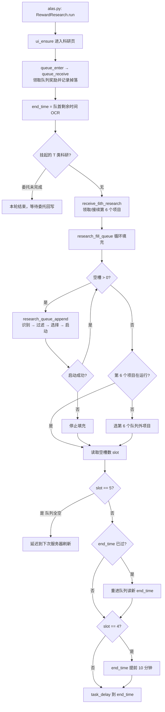

# 科研系统（module/research）

> 军部科研室的自动化：识别科研项目、按过滤器选项目、启动并入队、处理 E/T 类前置条件、领取奖励并按队列完成时间调度下次运行。

## 1. 模块概述

科研（研究学院）是碧蓝航线中产出舰船蓝图与装备设计图的常驻系统。玩家在项目列表中从 5 个随机刷新的项目中选择启动，最多 5 个排队项目 FIFO 运行，另有 1 个「第 6 个」项目在队列外直接运行。手工玩法需要反复刷项目、对比收益、计算资源消耗，且队列完成时间分散，适合自动化。

`module/research` 实现这一闭环：进入科研页 → 领取队列奖励 → 扫描项目列表 → 按用户配置的过滤器排序选择 → 启动并填满队列 → 按队首项目完成时间设置下次调度。项目选择的质量直接决定蓝图收益，因此模块将近半的代码投入在「准确识别项目」与「按策略筛选」上：识别侧针对 OCR 误识别做了大量名称修正，筛选侧由离线优化器（`dev_tools/research_optimizer.py`）按掉落概率预先生成最优过滤器顺序。

设计上，模块用多重继承把能力拆到四个基类：`ResearchUI`（页面操作）、`ResearchSelector`（识别与筛选）、`ResearchQueue`（队列管理）、`StorageHandler`（装备拆解），最终汇聚到 `RewardResearch`。每个基类只依赖 `UI` 基类，可独立测试；`RewardResearch` 本身几乎没有状态机之外的逻辑，主要是流程编排。T 类科研需要完成委托才能领取，与委托系统通过配置键 `Research_RemainingCommissions` 跨任务协作。

## 2. 模块职责

### 负责

- 科研页与队列页的导航、稳定性等待、弹窗处理。
- 项目识别：CN/EN/TW 用 OCR 项目名 + 模板匹配系列号；JP 无可 OCR 的名称，逐个进详情页用模板匹配拼出项目身份。
- 项目解析：按名称 + 系列号查静态数据库，还原类型、时长、资源消耗、产出舰船、特殊要求（拆装备/做委托）。
- 过滤选择：解析 `S9-DR0.5` 形式的优先级串（预设或自定义），叠加资源门控（魔方/金币/部件）与类型黑名单，输出候选顺序；结果为空时进入强制（enforce）模式兜底。
- 启动执行：点击项目 → 处理确认弹窗 → 入队；E 类先拆解装备、T 类先登记委托数。
- 队列管理：入队、按状态灯颜色检测 5 个槽位、批量领取奖励、OCR 队首剩余时间。
- 掉落记录（`DropRecord_ResearchRecord`）与调度时间计算。

### 不负责

- 科研船坞（UR 研发/天运拟合消耗蓝图，`module/shipyard` 等），本模块只产出蓝图。
- 委托的执行：T 类项目要求的委托由委托系统完成，本模块只写入剩余计数。
- 装备拆解的具体实现（继承自 `module/storage`，本模块只是调用方）。
- 过滤器字符串的配置定义与生成（`module/config`）；预设内容本身由 `preset_generator.py` 离线生成。

## 3. 模块位置

```
module/research/
├── research.py          # RewardResearch：任务主流程 run()、启动/领取/延迟/调度
├── selector.py          # ResearchSelector：项目检测（分服务器）、FILTER 过滤链、资源门控
├── project.py           # ResearchProject / ResearchProjectJp：项目模型与识别函数
├── project_data.py      # LIST_RESEARCH_PROJECT 静态项目数据库（自动生成）
├── series.py            # 系列编号 S1-S9 的模板匹配（含透视缩放补偿）
├── rqueue.py            # ResearchQueue：入队、槽位状态检测、队列奖励、剩余时间 OCR
├── preset.py            # 预设过滤器字符串表 DICT_FILTER_PRESET（自动生成）
├── preset_generator.py  # preset.py 的生成器（从四期模板翻译到各期）
├── ui.py                # ResearchUI：页面检测、稳定等待、队列导航、状态检测
└── assets.py            # 按钮/模板资源（button_extract 生成）
```

| 文件 | 作用 |
| --- | --- |
| `research.py` | 唯一的任务入口 `RewardResearch`，流程编排与调度 |
| `selector.py` | `FILTER` 正则与 `ResearchSelector`；JP 与其他服务器的 `research_detect` 分支 |
| `project.py` | `ResearchProject`（查表解析）、`ResearchProjectJp`（模板拼合）、已完成检测 |
| `project_data.py` | `LIST_RESEARCH_PROJECT` 全量项目数据，由 `dev_tools/research_extractor.py` 生成 |
| `series.py` | `match_series`：S9→S1 顺序匹配罗马数字模板，`RESEARCH_SCALING` 补偿两侧卡片的透视缩小 |
| `rqueue.py` | 队列页操作；`queue_status_grids` 按服务器用 `@Config.when` 定义坐标 |
| `preset.py` | `DICT_FILTER_PRESET`：约 40 个按「目标蓝图/是否用魔方」组合的预设过滤器 |
| `ui.py` | `ResearchUI` 基类：页面判断、动画等待、详情页退出/取消、奖励物品识别 |

## 4. 核心入口

| 入口 | 用途 |
| --- | --- |
| `RewardResearch.run()` | `Research` 任务入口，`alas.py` 的 `research()` 方法惰性导入后调用 |
| `research_detect()` | 项目列表识别（`ResearchSelector`，JP 与其他服务器两个 `@Config.when` 分支） |
| `research_sort_filter()` | 过滤链入口：加载预设/自定义串 → `FILTER.apply` → 输出优先级列表 |
| `research_project_start_with_requirements()` | 带 E/T 前置条件的启动入口 |
| `queue_receive()` / `research_receive()` | 队列奖励与第 6 个项目奖励的领取 |

## 5. 核心组件

| 组件 | 职责 |
| --- | --- |
| `RewardResearch` | 主处理器，`ResearchSelector + ResearchQueue + StorageHandler` 多重继承组合；持有 `enforce`、`end_time`、`research_project_started`、`_research_project_offset` 等会话状态 |
| `ResearchSelector` | 检测 5 个项目、加载过滤器、`_research_check` 资源/类型门控 |
| `ResearchQueue` | `research_queue_add`（按按钮颜色判断可否入队）、`get_queue_slot`（空槽计数）、`get_research_ended`（队首完成时间） |
| `ResearchProject` | CN/EN/TW 模型：OCR 名称 + 系列号查 `LIST_RESEARCH_PROJECT`，`check_name` 修正 OCR 错误，`get_data` 多策略兜底匹配 |
| `ResearchProjectJp` | JP 模型：详情页模板匹配系列/类型/消耗/蓝图，名称为拼合标识如 `S4-D-0.5azuma` |
| `Filter`（来自 module/base） | `>` 优先级串引擎；本模块提供 `FILTER_REGEX`，捕获 `series/ship/ship_rarity/genre/number/duration` 六个属性 |
| `DICT_FILTER_PRESET` / `FILTER_STRING_SHORTEST` / `FILTER_STRING_CHEAPEST` | 预设优先级串；`shortest`/`cheapest`/`reset` 是过滤器语言中的内置预设项 |

`ResearchProject` 的关键字段：`valid`（数据库是否命中）、`genre`（B/C/D/E/G/H/Q/T 八类）、`duration`、`need_coin/need_cube/need_part`、`ship/ship_rarity`（dr/pry）、`equipment_amount`（E 类需拆装备数，从 task 文本解析 8/15）、`commission_amount`（T 类需完成委托数 2/4/6）。`equipment_amount` 与 `commission_amount` 是 `cached_property`，来源是数据库的英文 task 描述字符串匹配。

项目识别用两条策略，源于服务器差异：CN/EN/TW 项目卡片有可 OCR 的名称（如 `D-057-UL`），一次 OCR 五张卡即可；JP 卡片无名称文本，只能逐个点进详情页，用模板匹配读系列、类型、消耗图标和蓝图头像再拼出身份——这就是 `ResearchProject` 与 `ResearchProjectJp` 并存的原因。系列号识别（`series.py`）按 S9→S1 顺序匹配以避免低编号模板误命中，并对 5 个卡位应用不同的缩放因子（`RESEARCH_SCALING`）补偿透视。

## 6. 工作流程



每次填充（`research_queue_append`）内部是一条固定的选择链：

1. `research_project_list_init`：重置偏移、等动画稳定、`research_detect` 识别 5 个项目。
2. `research_sort_filter`：加载过滤字符串（`custom` 用 `Research_CustomFilter`，否则查 `DICT_FILTER_PRESET`；`UseCube == always_use` 时自动切换到 `*_cube` 变体预设），归一化后交给 `FILTER.apply`。
3. `_research_check` 逐项目门控：无效项目丢弃；`need_cube/coin/part` 按 `Use*` 四档策略过滤（强制模式下放宽）；B 类硬性排除（收益低且刷图条件无法保证）；T 类需 `Research_AllowGenreT`；仓库无可拆装备时排除带条件的 E 类，避免「启动→拆解失败→取消」死循环。
4. `research_select` 按优先级逐个尝试：字符串 `reset` 触发刷新项目列表（`RESET_AVAILABLE` 可用时），`shortest`/`cheapest` 切换兜底排序；普通项目走 `research_project_start_with_requirements`。C/T 类在非强制模式下会被转成强制模式重选——它们只在筛选彻底无解时才被接受。
5. 筛选为空或全部启动失败时 `research_enforce` 放宽资源约束再选一轮，保证队列不空转。

启动阶段区分三类前置：E 类先启动（不入队）→ 调 `storage_disassemble_equipment` 拆够数量 → 回科研页重新识别 → 再启动并入队；T 类直接以队列外方式启动，把所需委托数写入 `Research_RemainingCommissions` 并终止本轮填充，等委托系统回写；普通项目启动后直接 `research_queue_add`（按钮变灰说明条件未满足，取消并返回失败）。

## 7. 调用关系

### 上游

| 模块 | 关系 |
| --- | --- |
| `alas.py`（`research()`） | 唯一任务入口，惰性导入 `RewardResearch` 并调用 `run()` |
| `module/commission` | 消费 `Research_RemainingCommissions`：每完成一批委托扣减计数，归零后 `task_call('Research')` 唤醒本任务 |
| `module/storage` | `StorageHandler` 作为基类被继承，提供 `storage_disassemble_equipment` 与 `storage_has_boxes` 状态 |

### 下游

| 模块 | 用途 |
| --- | --- |
| `module/ui` | `page_research` 页面导航、`ui_ensure`/`ui_click`/`BACK_ARROW` |
| `module/ocr` | `Ocr`（项目名，字母表 `0123456789BCDEGHQTMIULRF-`）、`Duration`（队列剩余时间、JP 详情页时长） |
| `module/base` | `Filter`、`Timer`、`ButtonGrid`、`cached_property`/`Config`（服务器分发） |
| `module/handler` | 弹窗确认、信息栏处理 |
| `module/storage` | E 类项目拆解装备，回写 `storage_has_boxes` |
| `module/statistics` | `AzurStats`/`DropImage` 掉落记录（`stat.new(genre='research')`），JP 消耗/蓝图模板亦复用其 `load_folder` 工具 |
| `module/combat.assets` | `GET_ITEMS_1/2/3` 奖励弹窗模板 |

## 8. 数据流

```
游戏 Lua 数据（AzurLaneLuaScripts 仓库）
  → dev_tools/research_extractor.py 离线解析
  → project_data.py 的 LIST_RESEARCH_PROJECT（静态、随游戏版本更新重新生成）

运行时：
截图 → OCR_RESEARCH（5 个名称）+ series.py 模板匹配（5 个系列号）
  → ResearchProject 查表解析（genre/duration/need_*/ship）
  → FILTER.apply + _research_check（资源与类型门控）
  → priority 列表 → research_project_start → 入队 / 刷新 / 延迟

队列页截图 → 状态灯颜色检测（finished/running/waiting/empty）
  → get_queue_slot（空槽数）+ OCR_QUEUE_REMAIN（end_time）
  → config.task_delay(target=end_time) 写回 Scheduler.NextRun

奖励界面截图 → DropImage → 本地保存 / 上传 azur-stats（DropRecord_ResearchRecord 控制）

T 类：Research_RemainingCommissions（配置持久化）
  research 写入所需委托数 → 委托任务扣减 → 归零后 task_call('Research') 回流
```

## 9. 状态模型

没有显式状态机，但有两套从画面检测出的状态值得了解：

| 检测对象 | 状态 | 检测方式 |
| --- | --- | --- |
| 项目卡片（列表页） | `detail` / `running` / `waiting` / `unknown` | `TEMPLATE_DETAIL/RUNNING/WAITING` 模板匹配 |
| 队列槽位 | `finished` / `running` / `waiting` / `empty` | 状态图标颜色计数（橙色勾/灰点/黑点） |
| 单个项目完成 | 已完成（状态灯变绿） | `get_research_finished` RGB 通道比较，扫描顺序居中优先 |

实例上的会话状态：`enforce`（强制模式，置 True 后本次任务内不回退）、`end_time`（调度目标）、`research_project_started`（本轮是否成功启动，决定掉落截图是否保存）、`_research_project_offset`（点击非中央入口后列表滑动的索引偏移，入队/退出队列时重置）。这些状态只存活于单次任务实例，跨任务只有 `Research_RemainingCommissions` 通过配置文件持久化。

## 10. 配置

配置路径 `<Task>.<Group>.<Argument>`，本模块参数挂在 `Research` 任务的 `Research` 组下（完整路径如 `Research.Research.UseCube`），代码经 `self.config.Research_UseCube` 访问。`Research_RemainingCommissions` 虽在配置表中，但主要作为运行时跨任务状态使用，用户无需手改。

| 配置 | 类型 | 默认值 | 说明 |
| --- | --- | --- | --- |
| `Research.UseCube` / `UseCoin` / `UsePart` | select | only_05_hour / always_use / always_use | 资源消耗策略：`always_use`、`only_05_hour`（仅 0.5 小时项目）、`only_no_project`（无同类项目在跑时）、`do_not_use`；强制模式下放宽 |
| `Research.AllowDelay` | bool | true | 允许资源不足且队列未空时延迟启动，把资源留给更需要的项目 |
| `Research.AllowGenreT` | bool | false | 允许 T 类委托科研参与筛选 |
| `Research.RemainingCommissions` | int | -1 | T 类剩余委托数；-1 无挂起，0 表示可入队 |
| `Research.PresetFilter` | select | series_9_blueprint_ta152 | 预设过滤器；选项表与 `DICT_FILTER_PRESET` 键对应 |
| `Research.CustomFilter` | textarea | S9-DR0.5 > ... | `PresetFilter = custom` 时的优先级串 |
| `DropRecord.ResearchRecord` | select | do_not | 掉落记录：do_not / save / upload / save_and_upload |
| `Research.Scheduler.Enable` | bool | true | 任务开关（`default.yaml` 中默认开启） |

配置间联动：`UseCube/UseCoin/UsePart` 三键同时作用于 `_research_check` 的门控与预设变体的选择；`AllowGenreT` 为 false 时即使过滤器写了 T 项也会被拦下；`AllowDelay` 与队列空槽数、`end_time` 共同决定 `research_delay_check` 的结果（空槽 ≥ 2 直接允许延迟；只剩 1 个项目时，只有队首完成时间距现在超过 10 分钟才允许）。

## 11. 异常与错误处理

| 异常 | 原因 | 处理 |
| --- | --- | --- |
| `GameTooManyClickError` | `research_project_start` 点击 3 次仍无法启动（已有科研在运行但条件未满足、或项目已完成） | 上抛；`alas.py` 重启游戏恢复 |
| `GameBugError` | `get_research_ended` 检测到队列首项目未在运行（游戏 bug） | 上抛；调度器重启游戏 |
| 启动失败（返回 False） | 资源不足（`RESEARCH_UNAVAILABLE`）或入队条件不满足 | 记录原因，填充循环终止或尝试下一候选 |
| 项目无效（`valid=False`） | OCR 误识别且多策略兜底仍无法匹配数据库 | 打 warning，`_research_check` 中被过滤；连续无效时重试截图（战令遮挡等场景） |
| T 类未就绪 | 委托未完成 | 不启动，等待委托系统回写计数并 `task_call` |

模块自身不做重试风暴式恢复，一律交给调度器的 `GameStuckError`/`GameTooManyClickError`/`GameBugError` 统一恢复链路。

## 13. 缓存与持久化

- `Research_RemainingCommissions` 是唯一跨任务持久状态，存在用户配置 JSON 中；写入走 `config.cross_set`（委托侧）与直接赋值（科研侧），配置修改会落盘并触发调度。
- `ResearchProject.equipment_amount/commission_amount` 用 `cached_property` 缓存在项目对象上，对象随任务结束销毁，无失效问题。
- 识别过程无文件缓存；掉落截图按 `DropRecord_ResearchRecord` 保存到 `./screenshots` 或上传统计平台，`total <= 0` 时丢弃本次记录避免空图。

## 14. 生命周期

调度器每轮 `research()` 调用新建 `RewardResearch` 实例（继承链上所有基类共享同一 `config`/`device`）；`run()` 结束即弃。`enforce`、`end_time`、`_research_project_offset` 等都初始化为类属性默认值，实例化即重置，无需显式清理。OCR 模型与模板资源由全局资源管理随任务切换统一释放。

## 15. 扩展方式

游戏新增科研系列（如 S10）时：

1. 用 `dev_tools/research_extractor.py` 从解包 Lua 重新生成 `project_data.py`（需 AzurLaneLuaScripts 仓库）。
2. 在 `assets/{cn,en,jp,tw}/research/` 补 `TEMPLATE_S10` 等模板，`series.py` 的 `match_series` 按高编号优先插入新分支。
3. 用 `dev_tools/research_optimizer.py` 模拟/优化出新系列的过滤器，把结果交给 `preset_generator.py` 重新生成 `preset.py`（生成器内维护各系列的舰船名映射）。
4. 同步 `argument.yaml` 中 `Research.PresetFilter` 的选项列表并运行 `uv run -m module.config.config_updater`。

新增项目类型（genre）需要同步：`selector.py` 的 `FILTER_REGEX` 类型位、`project.py` 的 `RESEARCH_DETAIL_GENRE` 模板与 `ResearchProjectJp.GENRE`、以及 `research_project_start_with_requirements` 的前置条件分支。

## 16. 修改注意事项

- **`project_data.py` 与 `preset.py` 是生成文件**，分别由 `dev_tools/research_extractor.py` 和 `module/research/preset_generator.py` 维护；改过滤器应改生成器（`translate()` 里的四期模板字符串）或优化器，不直接编辑输出。`PresetFilter` 的配置选项列表必须与 `DICT_FILTER_PRESET` 的键一致，否则回退到默认预设。
- **卡片偏移机制不要绕开**：点击非中央入口后项目列表会整体滑动，`_research_project_offset` 记录偏移量，启动时用 `(index - offset) % 5` 换算实际卡位；`research_reset`/`queue_quit` 后必须归零。JP 检测利用同机制（每次进第 4 入口列表左移一格），遍历后按 `(pos + 2) % 5` 还原顺序。
- **`enforce` 一旦置 True 在本次任务内不回退**：后续所有选择都按放宽条件执行，这是有意设计（避免反复震荡），新增逻辑不要在分支里重置它。
- **资源门控只识别魔方/金币/部件三类消耗**：E-880（消耗 283mm 主炮设计图）、E-180（消耗铁血科技箱）等特殊消耗不在门控范围内，库存不足时无法自动跳过——预设注释中已标注此风险。
- `RESEARCH_STOP` 是半透明按钮，颜色随背景变化，检测必须带 offset 且不能依赖固定颜色。
- 服务器差异集中在 `@Config.when(SERVER=...)` 分支（`research_detect` 的 JP 逐卡详情识别、`queue_status_grids` 的坐标）；新增分支要记得写 `SERVER=None` 回退，否则其他服务器会错误回落到 EN 实现。
- 时间统一取 `module.config.time_source.now` 而非 `datetime.now()`，便于测试注入时钟。
- 不要从 `page_reward` 导航到 `page_research`（`module/ui/page.py` 有明确注释），页面跳转交给 `ui_ensure` 自动规划路径。

## 17. 已知限制

- OCR 名称修正（`check_name`）是枚举式补丁，覆盖已知误识别模式；新服务器、新字体渲染或新项目编号出现时需要人工补充规则，失败项目当天不会被选择（只能靠 enforce 兜底刷新）。
- `get_research_series`（Sobel 边缘检测）、`get_research_series_old`、`parse_time` 与 `research.py` 顶部的 `OCR_DURATION` 在当前主流程中已无调用方，属遗留代码；现役系列识别走 `series.py` 的模板匹配。
- JP 服务器无法区分 E-031（拆 8 件）与 E-315（拆 15 件），统一按 15 件处理（拆 15 可同时满足两者要求，但可能多拆）。
- 队列状态与项目状态检测依赖固定颜色阈值和 1280×720 截图，游戏调色或 UI 改版时需重新校准。
- 0.5 小时项目的收益波动大，过滤器实际效果依赖 `research_optimizer.py` 中硬编码的掉落概率数据（采样自 2022 年初约 5.6 万样本），版本更新后未重新拟合。

## 18. 示例

自定义过滤器（`Research.CustomFilter`）的最小结构与语义：

```text
S9-DR0.5 > S9-Q1 > 0.5 > reset > S9-E-315 > G1.5 > shortest
```

- 每段是 `S<系列>-<舰船|dr|pry>-<类型>-<编号>-<时长>` 的任意组合，如 `S9-DR0.5` 表示「九期 DR 舰 0.5 小时项目」，`Q1` 表示「任意系列的 Q 类 1 小时」。
- `reset` 表示前面的候选都不在时刷新项目列表；`shortest`/`cheapest` 是兜底排序，通常放最后。
- 落到具体执行：5 个候选里先找 `S9-DR0.5`，没有就找任意 `S9-Q1`，依次类推；全不满足则刷新列表重刷，刷完仍没有则按 `shortest` 强制选一个。

## 19. 调试方法

- 日志前缀 `[科研-*]`：`logger.attr('科研项目', ...)` 输出识别结果，`过滤排序` 输出过滤器命中顺序，`科研队列` 输出 5 个槽位状态数组；调度时长看 `task_delay` 日志。
- 离线识别验证：对已有截图直接调用 `module.research.project` 的 `research_detect(image)`（CN/EN/TW）或 `research_jp_detect(image)`（JP）；注意先设置 `module.config.server.server` 再导入游戏模块，避免资源按错误服务器加载。
- 过滤器问题先用 `FILTER_REGEX` 手动匹配调试（`module/research/selector.py` 顶部），再确认预设键名与 `argument.yaml` 选项一致。
- T 类流程异常先查 `Research_RemainingCommissions` 的当前值：-1/0/正数分别对应无挂起、可入队、等委托三种状态，委托侧扣减逻辑见 `module/commission` 的 `_handle_research_genre_t_update`。

## 20. 相关模块

- [调度器（alas.py）](../entry/alas.md) —— `research()` 任务方法的挂载点与异常恢复链路。
- [委托系统](commission.md) —— T 类科研的委托计数协作方。
- [配置系统](../config.md) —— `Research_*` 参数定义、`cross_set` 跨任务写配置与任务调度。
- [UI 导航](../ui.md) —— `page_research` 页面图谱与 `ui_ensure` 导航。
- [OCR 系统](../ocr.md) —— 项目名 OCR 与 `Duration` 时长识别。
- [基础层 module/base](../base/index.md) —— `Filter` 优先级串引擎、`Config` 服务器分发装饰器。
- [商店系统](shop.md) —— 同样基于 `Filter` 优先级串的选品模式，可对照理解过滤器语言。
