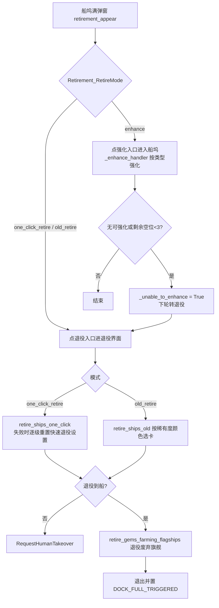

# 退役与装备（retire / equipment / auto_equip / storage）

> 船坞满载时的舰船退役与强化、舰船装备装卸与装备码配装、仓库开箱与装备拆解，以及面向独立任务的自动换装。

## 1. 模块概述

四个子模块共同覆盖「船坞与装备仓库」这一游戏界面的自动化操作，但分工不同：

- `module/retire`：退役与强化。核心类 `Retirement` 是 `Combat` 的 mixin（`module/combat/combat.py` 中 `Combat(Level, HPBalancer, Retirement, ...)`），因为「船坞已满」弹窗会在出击准备、战斗结算、地图行走等任意战斗流程中随机出现，以 mixin 挂入后所有战斗类无需额外接线即可处理。它同时是 `GemsFarming`/`Ambush11` 等换船任务的基座（保留普通航母、退役废弃旗舰）。
- `module/equipment`：装备管理。舰船详情页的装备装卸、按图像模板在仓库中找回装备、Base64 装备码（配装码）的导出与导入。被 `GemsFarming`（换旗舰时装回原配装）、演习（`EXERCISE_FLEET_EQUIPMENT`）等复用。
- `module/auto_equip`：独立任务「自动换装」（`AutoEquip`）。遍历船坞，为每艘舰船的空装备槽从仓库填充装备，与 `module/equipment` 互不依赖（只共享 `Dock` 与滑动常量）。
- `module/storage`：装备仓库。开装备箱、拆解装备、处理「装备仓库已满」弹窗。`StorageHandler` 同时被科研模块（E 系列科研需先拆装备）和装备码处理器继承，因此任意装备操作遇到仓库满弹窗都能自动拆解腾位。

这些能力串成一条继承链 `Retirement → Enhancement → Dock → Equipment → EquipmentCodeHandler → StorageHandler → StorageUI → UI`，是项目中层级最深的 mixin 链。这样设计的原因：船坞、舰船详情、装备编辑、仓库是互相嵌套的同一批页面——退役要拆装备、拆装备会遇仓库满、装备码应用也要处理仓库满、强化要反选 GemsFarming 要保留的普通航母，扁平拆分会造成大量跨模块调用。

## 2. 模块职责

### 负责

- 船坞满载时的退役/强化决策（`handle_retirement()`）与一键退役、旧退役两种执行模式，含快速退役设置的自动兜底重置。
- 船坞页面通用操作：卡片加载等待、排序/收藏/筛选器设置、舰船选择、卡片网格与属性扫描（等级/情绪/稀有度/舰队/状态，`scanner.py`）。
- 舰队扫描任务（`FleetScan`）：扫描编入舰队的舰船并写入 `FleetInfo.FleetInfo.Result`。
- 舰船装备装卸（按舰队记录逐件）、装备模板记录与找回、装备码剪贴板导出/导入。
- 自动换装任务：快速换装面板填充空装备槽。
- 装备箱开启（数量 OCR + +/- 调节）、装备拆解（按稀有度筛选、翻页）、仓库满弹窗处理。

### 不负责

- 战斗流程本身；退役弹窗的触发时机由战斗/地图模块决定，本模块只提供 `handle_retirement()`。
- 大世界仓库（`module/os_handler/storage.py` 是独立同名类，服务大世界开箱/修理，与本模块无关）。
- 舰船强化材料之外的养成功能（觉醒 `module/awaken` 复用 `Dock` 但自行实现）。
- 页面跳转图谱（`module/ui`）与配置定义（`module/config`）。

## 3. 模块位置

```
module/retire/
├── retirement.py      # Retirement 主处理器：一键/旧退役、船坞满决策、保留普通航母
├── enhancement.py     # Enhancement：DFA 状态机驱动的按类型强化，强化后回退退役
├── dock.py            # Dock：船坞界面操作（排序/收藏/筛选/选择），卡片网格常量
├── setting.py         # QuickRetireSettingHandler：游戏内快速退役设置项（filter_1..5）
├── scanner.py         # ShipScanner/DockScanner 及子扫描器、DHash 去重、FleetManagementScanner
├── ship_name.py       # ShipNameMatcher：舰队 OCR 结果对舰船名的纠错
├── fleet_management.py# FleetManagement：FleetScan 任务，扫描结果持久化到配置
└── assets.py          # 退役/船坞按钮与模板（assets/{cn,en,jp,tw}/retire）

module/equipment/
├── equipment.py       # Equipment：舰船详情页导航、滑动换船、装备装卸（舰队记录编码）
├── equipment_change.py# EquipmentChange：记录装备图像→仓库模板匹配找回→穿上
├── equipment_code.py  # EquipmentCodeHandler：装备码导出（剪贴板）与导入（ADB/u2 输入）
├── fleet_equipment.py # FleetEquipment：舰队页面批量进入详情、按舰队装卸
└── assets.py          # assets/{server}/equipment

module/auto_equip/
├── auto_equip.py      # AutoEquip：自动换装任务；快速换装面板操作
├── empty_slot_plus.png # 空槽「+」识别模板（模块内私有，不经 dev_tools.button_extract）
└── no_equipment.png   # 仓库「无可用装备」识别模板

module/storage/
├── storage.py         # StorageHandler：开箱、拆解、仓库满处理；StorageFull 异常
├── box_disassemble.py # StorageBox：BoxDisassemble 任务，按稀有度拆箱并保留阈值
├── ui.py              # StorageUI：仓库三栏（材料/装备/拆解）切换与装备筛选
└── assets.py          # assets/{server}/storage
```

## 4. 核心入口

| 入口 | 用途 |
| --- | --- |
| `Retirement.handle_retirement()` | 战斗流程中检测到船坞满弹窗时调用，按配置执行退役或强化 |
| `Retirement.retire_ships_one_click()` / `retire_ships_old()` | 退役执行；换船任务（GemsFarming 等）经 `_retire_handler()` 进入 |
| `StorageHandler.handle_storage_full()` | 任意流程遇到 `EQUIPMENT_FULL` 弹窗时的通用处理（拆解腾位后返回原页面） |
| `StorageHandler.storage_disassemble_equipment()` / `storage_use_box()` | 科研等模块按数量拆解装备/开箱的组合入口 |
| `StorageBox.run()` | `BoxDisassemble` 独立任务（alas.py `box_disassemble`） |
| `AutoEquip.run()` | `AutoEquip` 独立任务（alas.py `auto_equip`，亦列于 submodule 可用功能） |
| `FleetManagement.run()` | `FleetScan` 独立任务 |
| `Equipment.equipment_take_on/off()` | 演习、困难模式等按 `fleet` 记录装卸装备的底层入口 |
| `EquipmentCodeHandler.code_apply()` / `code_clear()` | GemsFarming/Ambush11 换船时回装/卸下配装 |

## 6. 工作流程

### 退役（module/retire）

战斗流程循环中调用 `handle_retirement()`，其返回 `True` 表示已操作完一轮（需 continue），`False` 表示刚点了入口等弹窗出现：



- **一键退役**：不需加载船坞，直接点 `ONE_CLICK_RETIREMENT`，客户端一次退完，一轮结束。关键风险是游戏内「快速退役」设置不当导致退不出船，因此有四级兜底：重置船坞筛选器 → 重置前 4 个快速退役设置 → 第五项改为「保留突破」→（仅当配置为 `do_not_keep`）改为「全部」；每级都重新执行一轮。支持兜底的服务器为 cn/en/jp。
- **旧退役**：`dock_filter_set` 按等级排序 + 目标稀有度过滤，然后每轮用 `CARD_RARITY_GRIDS` 采样卡牌顶边颜色判稀有度、选最多 10 张、确认，循环到目标数量；结束时恢复筛选器。
- 两条路径都汇入 `_retirement_confirm()`：按显示层级处理 SR/SSR 确认、舰船确认（一键/旧两套按钮）、装备拆解确认、获得物资弹窗，并以 10 秒超时兜底（GemsFarming 的船无装备可拆，弹窗可能永不出齐）；退出后还要补一次截图，防止拆解的「获得物资」弹窗延迟弹出卡死后续流程（#838 #418）。
- `retire_keep_common_cv` 为真（GemsFarming 或 ThreeOilLowCost 任务启用）时，确认前调用 `keep_one_common_cv()` 滚动查找并反选一艘普通航母，供换船任务持续获得新旗舰。
- 全程无一船可退时抛 `RequestHumanTakeover` 并提示用户配置游戏内一键退役；成功后置 `config.DOCK_FULL_TRIGGERED = True`。

### 强化（Enhancement）

`enhance_ships()` 按 `General.Enhance.Filter` 的舰种顺序（`>` 分隔，非法项随机替换）依次进入船坞，每类内用 DFA 状态机（check/ready/recommend/attempt/confirm/fail/success/exit 八态）驱动「推荐材料 → 确认 → 失败滑动到下一艘」。状态机循环超 30 次抛 `GameStuckError`；对战斗中舰船与无材料两种卡死路径，主动剔除点击记录避免 `GameTooManyClickError`。GemsFarming 启用时强化前会反选材料槽中的普通航母（`_enhance_deselect_cv`），误入船坞页面时点返回并最多重试 3 次。

### 装备（module/equipment）

`Equipment.equipment_take_on/off(enter, out, fleet)` 用 `'9'.join` 把舰队记录 `[3,1,1,1,1,1]` 编码为槽位序列：`9` 表示滑动到下一艘船，其余数字表示在预设栏穿/脱第 N 套。`EquipmentChange` 走另一条路：先把舰船当前装备截为模板（`ship_equipment_record_image`），再在仓库页滚动做模板匹配找回并穿上，适合「原装备可能已被换下」的场景。`EquipmentCodeHandler` 处理 Base64 装备码：导出走剪贴板（先 ADB `cmd clipboard`，失败再 uiautomator2），输入优先 ADB `input text`（需 FastInputIME），失败回退 u2 `send_keys`；应用前先清空预览，仓库满时调 `handle_storage_full()`。装备码存放在任务配置的 YAML 文本字段（如 `GemsFarming.GemsFarming.EquipmentCode`），`GemsEquipmentHandler` 通过覆写 `equipment_code_config_key` 把存储位置指向该键。

### 自动换装（module/auto_equip）

`AutoEquip.run()` 进船坞 → 进入第一艘非 NPC 舰船，循环：打开快速换装面板 → 模板匹配找出空槽（`empty_slot_plus.png`）→ 逐槽点开仓库，优先选第一件，灰色不可用时选第二件（`no_equipment.png` 判定无可用装备则跳过）→ 滑动到下一艘。`AutoEquip_ShipLimit` 限制舰船数（0 为一直换到手动停止），运行中持续检查 `config.stop_event`，置位即抛 `TaskEnd`。

### 仓库（module/storage）

- 开箱 `_storage_use_one_box`：点箱子 → 设数量（OCR + +/-）→ 确认 → 处理获得物品/装备确认 → 遇 `EQUIPMENT_FULL` 关弹窗后抛 `StorageFull`。`StorageBox`（拆箱任务）在其上增加保留阈值：某稀有度箱子存量 ≤ 阈值（`BoxDisassemble_*BoxLimit`）就跳过。
- 拆解 `_storage_disassemble_equipment_execute`：按稀有度筛选装备，用 `ItemGrid` 点选并累计数量（OCR 校验），逐次最多 40 件，翻页直到达标或列表空。
- `storage_disassemble_equipment` 组合两者：先开箱（2025.05 起开箱装备自动拆解），`StorageFull` 时转拆解腾位；`handle_storage_full` 则是给外部的通用弹窗处理器，处理完返回原页面。

## 10. 配置

| 配置 | 类型 | 默认值 | 说明 |
| --- | --- | --- | --- |
| `General.Retirement.RetireMode` | select | `one_click_retire` | `one_click_retire` / `enhance` / `old_retire`；`enhance` 失败时以一键退役兜底 |
| `General.OneClickRetire.KeepLimitBreak` | select | `keep_limit_break` | 一键退役对未满破重复船的保留策略；`do_not_keep` 时兜底链最后一步可重置为「全部」 |
| `General.OldRetire.N / R / SR / SSR` | checkbox | True / True / False / False | 旧退役的目标稀有度 |
| `General.OldRetire.RetireAmount` | select | `retire_all` | `retire_all` / `retire_10`，映射为数量上限 3000 / 10 |
| `General.Enhance.Filter` | textarea | None | 强化顺序，`>` 分隔舰种（dd>cl>…），非法项从剩余类型随机补 |
| `General.Enhance.ShipToEnhance` | select | `all` | `all` / `favourite` |
| `General.Enhance.CheckPerCategory` | input | 5 | 每类检查的舰船数 |
| `AutoEquip.AutoEquip.ShipLimit` | input | 0 | 换装舰船上限，0 为不设限 |
| `AutoEquip.AutoEquip.EnableSlot1..5` | checkbox | True | 参与自动换装的装备槽 |
| `BoxDisassemble.BoxDisassemble.UseWhiteBox / UseBlueBox / UsePurpleBox` | checkbox | True / False / False | 是否拆解对应稀有度箱子 |
| `BoxDisassemble.BoxDisassemble.*BoxLimit` | input | 2000 / 1000 / 100 | 各稀有度保留数量阈值 |
| `GemsFarming.GemsFarming.CommonCV / CommonCVFilter / CommonDD / CommonDDFilter` | select / textarea | `any` / 预设串 | 保留航母驱逐的筛选，过滤器无效时写回默认值（`cross_set`） |

另有两类跨任务状态写入配置（`module/config/config_manual.py` 定义）：`DOCK_FULL_TRIGGERED`（本轮退役已完成）与 GemsFarming 的 `EquipmentCode` YAML 文本（装备码存取目标）。`config_updater` 会为每个任务自动生成隐藏的 `Storage.Storage` 组，供任务运行期保存状态（如大世界商店的已购标记）。

## 11. 异常与错误处理

| 异常 | 原因 | 处理 |
| --- | --- | --- |
| `RequestHumanTakeover` | 一键/旧退役在多级兜底后仍无船可退 | 上抛终止任务，日志提示用户配置游戏内快速退役设置或开启对应稀有度 |
| `StorageFull` | 开箱时装备仓库无空间 | `storage_use_box` / `storage_disassemble_equipment` 内部捕获并转入拆解流程，不外泄 |
| `GameStuckError` | 强化状态机循环超 30 次 | 上抛，由调度器恢复机制处理 |
| `ScriptError` | 未知退役模式/状态函数/箱子稀有度，快速换装面板 10 秒内打不开 | 上抛，属编程错误 |
| `TaskEnd` | AutoEquip 响应 `stop_event` | 调度器按任务正常结束处理 |

退役确认循环以 `Timer(10)` 超时兜底（假设完成）而非无限等待；`handle_retirement` 内部捕获退役/强化异常并复位 `_unable_to_enhance`，防止同一弹窗反复触发造成死循环。

## 16. 修改注意事项

- **继承链顺序不可随意调整**：`Retirement → … → StorageHandler → UI` 的 MRO 决定了弹窗处理的可见性（例如装备码应用遇仓库满直接调 `handle_storage_full()`）。新增能力优先写为新 mixin 组合进任务类，而非加深这条链。
- **退役确认弹窗的层级是硬约束**：`EQUIP_CONFIRM` 可能无黑背景、`GET_ITEMS_1` 可能与 `IN_RETIREMENT_CHECK` 同屏，处理顺序（SR/SSR → 舰船确认 → 拆解确认 → 获得物资）经多个 issue（#838 #418）打磨，改动前先查历史。
- **快速退役设置只动 filter_5**：前 4 项被强制为 R/E/N/不留重复船，兜底重置时先保留用户已有 filter_5，逐级放宽；`server_support_quick_retire_setting_fallback()` 限 cn/en/jp，TW 不支持。
- **普通航母保留的状态位**：`_have_kept_cv` 在退役入口重置、确认前消费；`retire_gems_farming_flagships` 用保存/恢复现场的方式避免污染外层状态，且扫描时显式关闭稀有度子扫描器（颜色采样异常的 'unknown' 卡不能被漏掉）。
- **服务器差异**：JP 的船坞等级/情绪网格与 OCR 颜色不同（`dock.py`、`enhancement.py` 按服务器分支）；TW 的船坞筛选按钮布局不同（`@Config.when(SERVER='tw')`）；`SR_SSR_CONFIRM` 直点仅限 cn/jp/tw。资产按 `assets/{cn,en,jp,tw}/` 分服维护，改按钮后须跑 `uv run -m dev_tools.button_extract`。
- **auto_equip 的两张模板是模块私有资源**（`cv2.imread` + `lru_cache`），不进 `assets.py`，不走按钮提取流程。
- **拆解行为随游戏版本变化**：2025.05 起开箱装备自动拆解、拆解不再弹 `GET_ITEMS`，流程里的注释标注了版本节点；调整时注意兼容旧弹窗路径的注释依据。
- `FleetEquipment.fleet_equipment_take_on_preset()` 会调用父类中不存在的方法（当前无调用方），启用前需先补实现。

## 20. 相关模块

- [战斗系统](../combat.md)——`Combat` 组合 `Retirement`，船坞满弹窗由战斗流程触发。
- [其他游戏功能模块](misc.md)——科研（拆装备）、Awaken 等复用 `Dock`/`StorageHandler` 的模块。
- [基础层](../base/index.md)——`Filter`、`ButtonGrid`、`Scroll`、`Switch`、`Setting` 等本模块大量使用的基础组件。
- [UI 导航](../ui.md)——页面跳转与 `ui_ensure`/`ui_back`；仓库页 `page_storage` 注册于此。
- [OCR 系统](../ocr.md)——船坞数量、箱子数量、拆解计数、舰队名纠错均依赖 `Digit`/`Ocr`。
