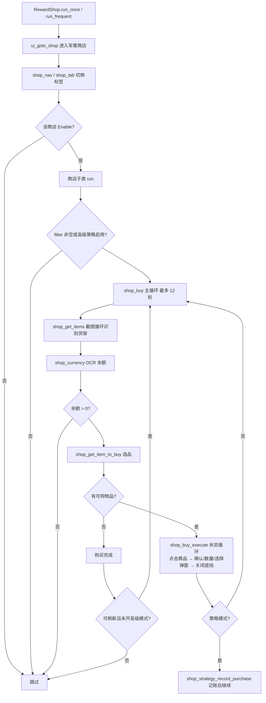

# 商店系统（shop / shop_event / shop_strategy）

> 各类游戏商店的自动化购买：常规商店（通用/功勋/舰队/核心/勋章/代币）的货架识别与按优先级购买、活动商店的 PT/URpt 货币规划，以及受限 Lua 高级购买策略。

## 1. 模块概述

商店系统由三个协作子模块构成：

- `module/shop`：常规商店框架与六个具体商店（通用、功勋、舰队、核心、勋章、代币/白票）。它们共享「识别货架 → 过滤排序 → 逐个购买」的流程，差异只在网格布局、货币类型和购买弹窗形态，因此以 `ShopBase` + `ShopClerk` 抽象公共流程，每个商店一个子类只覆盖差异点。
- `module/shop_event`：活动商店。其货架随活动动态变化（无固定模板网格）、货币是活动点数 pt/URpt 且存在「UR 舰船用 URpt、URpt 用 pt 兑换」的换算链，购买策略（保船、保留点数、活动结束前清货架）与常规商店完全不同，故独立成模块。
- `module/shop_strategy`：高级购买策略。用户以受限 Lua 风格脚本描述「买什么、买多少、预算多少」，由「编译白名单校验 → AST 解释规划 → 适配器二次校验」三层执行。脚本永远接触不到设备、配置或原始商品对象，只能看到基本类型的商品投影。

在系统中，调度器 `alas.py` 的 `ShopFrequent`/`ShopOnce`/`EventShop` 任务分别进入 `RewardShop.run_frequent()`、`RewardShop.run_once()` 和 `EventShop.run()`；大世界白票商店（`OpsiVoucher`）与档案任务（`OpsiArchive`）直接实例化 `VoucherShop`。大世界港口/明石商店（`module/os_shop`）与私人休息室商店（`module/private_quarters`）是独立模块，只复用本系统的策略适配层与基类模式。

## 2. 模块职责

### 负责

- 常规商店的货架物品识别（模板匹配 + 价格/成本 OCR）、售罄检测、遮挡弹窗处理。
- 商品过滤：`>` 分隔的优先级字符串（`Filter` 正则三级匹配 group/sub_genre/tier），以及模板无法覆盖的自定义商品判定（装备外观箱、未获得舰船）。
- 购买执行：选择式（装备箱/教材/图纸的选择网格）与数量式（数量输入框）两条确认路径，含库存 OCR 与防超买。
- 货币余额 OCR 并同步至 Dashboard（`LogRes`）。
- 商店刷新、金币溢出购买猫箱、活动商店 URpt 规划与多标签页遍历。
- 受限 Lua 高级策略：编译校验、购买规划、预算/配额约束与安全适配。

### 不负责

- 大世界港口商店与明石商店的识别购买（`module/os_shop`），本系统仅通过 `module/shop_strategy` 适配层向其提供策略能力。
- 私人休息室商店（`module/private_quarters`，复用本系统模式但独立实现）。
- 页面跳转图谱与导航路径（`module/ui`），本模块只调用 `ui_ensure()`/`ui_goto()`。
- 过滤字符串的配置定义、迁移与生成（`module/config`）。

## 3. 模块位置

```
module/shop/
├── base.py                 # ShopBase：物品识别/过滤/选品框架；ShopItemGrid(_250814)、FILTER 正则
├── clerk.py                # ShopClerk：购买执行器（选择式/数量式）、StockCounter 库存 OCR、shop_buy 主循环
├── shop_status.py          # ShopStatus：各商店货币 OCR 并同步 LogRes
├── ui.py                   # ShopUI：标签切换（Switch）、刷新、ui_goto_shop 导航
├── shop_reward.py          # RewardShop：调度各商店的任务入口（run_frequent/run_once）
├── shop_general.py         # GeneralShop_250814：通用商店（金币+钻石）
├── shop_guild.py           # GuildShop_250814：舰队商店（舰队币）
├── shop_medal.py           # MedalShop2_250814：勋章商店（动态网格+滚动翻页）
├── shop_merit.py           # MeritShop_250814：功勋商店（未获得舰船识别）
├── shop_core.py            # CoreShop_250814：核心数据商店
├── shop_voucher.py         # VoucherShop：大世界白票商店（被 os 任务复用）
├── shop_select_globals.py  # 选择弹窗网格与 SELECT_ITEM_INFO_MAP（book/box/retrofit/plate/pr/dr）
└── shop_reward.py          # 见上，RewardShop

module/shop_event/
├── shop_event.py           # EventShop：活动商店控制器（URpt 规划、过滤、高级策略）
├── clerk.py                # EventShopClerk：动态货架检测、商品定位与购买执行
├── item.py                 # EventShopItem/Grid：库存计数 OCR、按价格推断商品身份
├── selector.py             # 活动商店 FILTER 正则、数量后缀（Cube:5）解析与预设过滤器
└── ui.py                   # EventShopUI：多标签导航、截止时间 OCR、PT/URpt 读取

module/shop_strategy/
├── compiler.py             # luaparser AST 白名单校验（不加载 Lua VM）
├── runtime.py              # AST 解释器与有界购买规划（贪心/评分枚举）
├── evaluator.py            # 受限表达式解释（数值范围、Lua 真值）
├── adapter.py              # Item ↔ ShopCandidate 投影与计划二次校验（无状态适配层）
├── models.py               # ShopCandidate/ShopContext/ShopPlan 等纯数据模型
└── errors.py               # StrategyDiagnostic 与异常类型
```

## 4. 核心入口

| 入口 | 用途 |
| --- | --- |
| `RewardShop.run_frequent()` | `ShopFrequent` 任务：仅通用商店，`task_delay(server_update=True)` 后结束 |
| `RewardShop.run_once()` | `ShopOnce` 任务：依次功勋 → 舰队 → 核心（月度页）→ 勋章商店 |
| `EventShop.run()` | `EventShop` 任务：遍历所有活动商店标签页执行购买 |
| `VoucherShop.run()` / `run_once()` | `OpsiVoucher` 任务购买白票商品；`OpsiArchive` 用 `run_once()` 单买一个日志档案 |
| `ShopBase.shop_get_item_to_buy(items)` | 选品决策入口：高级策略或旧过滤器，集成测试的主要接触点 |
| `run_shop_strategy(...)` | 其他商店（大世界/私人休息室）接入高级策略的唯一函数 |

## 5. 核心组件

| 组件 | 位置 | 职责 |
| --- | --- | --- |
| `ShopBase` | shop/base.py | 货架识别循环 `shop_get_items`、选品 `shop_get_item_to_buy`、策略会话状态管理 |
| `ShopItemGrid_250814` | shop/base.py | 网格识别，为每个物品附加 group/sub_genre/tier 三属性；`ShopItem_250814` 按像素亮度判定售罄 |
| `FILTER` | shop/base.py | `Filter` 实例；正则捕获 group/sub_genre/tier 三级，如 `PlateGeneralT3`、`BookRedT3` |
| `ShopClerk` | shop/clerk.py | 购买执行：选择式 `shop_buy_select_execute`、数量式 `shop_buy_amount_execute`、主循环 `shop_buy` |
| `ShopStatus` | shop/shop_status.py | 各货币 OCR（`status_get_*`），读数同步写入 LogRes 仪表盘 |
| `ShopUI` | shop/ui.py | 250814 版顶部导航（通用/月度）与 9 个分类标签的 `Switch`；`shop_refresh()` |
| `RewardShop` | shop/shop_reward.py | 按配置 `*Shop_Enable` 调度各商店实例 |
| `EventShop` | shop_event/shop_event.py | 活动商店全流程：URpt 规划、未获取物品、过滤与高级策略 |
| `ShopCandidate` / `ShopContext` / `ShopPlan` | shop_strategy/models.py | 策略脚本能看到的一切：冻结 dataclass，只含基本类型字段 |

过滤器与 `module/base/filter.py` 的关系：`Filter` 是通用的「`>` 优先级串 + 正则捕获组」引擎；商店侧只提供 `FILTER_REGEX` 与属性名 `('group', 'sub_genre', 'tier')`。`ShopItemGrid.predict` 用同一正则从模板名解析出三属性挂到物品上，`FILTER.apply(items, self.shop_check_item)` 按配置顺序输出排序后的可购列表。书籍类商品的色/级误识别由 `Book` 类二次模板匹配修正。

## 6. 工作流程



每轮 `shop_buy` 的选品有两条互斥路径：

1. **旧过滤器（legacy）**：先扫 `shop_check_custom_item`（外观箱、未获得舰船等模板无法识别的商品），再 `FILTER.load(self.shop_filter)` 应用优先级串，`shop_check_item` 以余额为准过滤。
2. **高级策略（advanced）**：`shop_strategy_select_item` 将商品投影为 `ShopCandidate` DTO 交给 `run_shop_strategy`，脚本余额、库存等业务硬规则在 Python 侧先执行；只取返回计划的第一项执行，购买成功后记录实际消耗供下一轮重算。

高级策略内部流水线：`project_shop_items`（投影 + 资格检查）→ `compile_strategy`（AST 白名单）→ `evaluate_strategy`（贪心或评分枚举规划）→ `resolve_shop_plan`（对不可信计划二次校验：数量 ≤ 库存、金额 = 单价×数量、不超 reserve/max_spend/配额）→ 绑定回原商品交给既有购买流程。

活动商店（`EventShop._run`）另有一条独立流程：扫描全部货架（滚动去重）→ 高级模式只投喂普通 pt 商品并用 PT 实际变化确认购买量；旧模式先处理 URpt 相关物品（UR 舰船 200/300 URpt，必要时保留 PT 兑换 URpt）、再买 `unobtained` 标记物品，最后按预设/自定义过滤器批量购买。活动临近结束（剩余不足 7 天）才允许消耗预留 PT 清货架。

## 7. 调用关系

### 上游

| 模块 | 关系 |
| --- | --- |
| `alas.py`（ShopFrequent/ShopOnce/EventShop 任务） | 调用 `RewardShop` 与 `EventShop` |
| `module/os/tasks/voucher.py`、`archive.py` | 导航到白票兑换界面后调用 `VoucherShop.run()/run_once()` |
| `module/os_shop`、`module/private_quarters` | 仅调用 `run_shop_strategy` 适配层获取策略计划 |

### 下游

| 模块 | 用途 |
| --- | --- |
| `module/base` | `Filter`、`ButtonGrid`、`cached_property`/`Config`、`Timer` |
| `module/statistics/item.py` | `Item`/`ItemGrid` 物品识别基类 |
| `module/ocr` | 价格、库存（X/Y）、货币余额等数字识别 |
| `module/ui` | 页面导航、`Navbar`、`Scroll`、`Switch` |
| `module/retire` | `Retirement.handle_retirement()` 处理购买触发的退役弹窗 |
| `module/tactical` | `Book` 类修正技能书颜色/等级识别 |
| `module/log_res` | 货币余额上报仪表盘 |
| `module/meowfficer` | 金币溢出时跳转指挥喵购买猫箱 |
| `module/config/redirect_utils/shop_filter.py` | 白票过滤器禁用词重定向（`voucher_redirect`） |

## 8. 数据流

```
设备截图
  → ShopItemGrid.predict（模板匹配 + OCR）
      → Item（name/cost/price + group/sub_genre/tier/售罄）
  → 旧路径：FILTER.apply + shop_check_item（余额）
    或 高级路径：project_shop_items → ShopCandidate DTO → Lua 策略 → ShopPlan
  → ResolvedShopAction（绑定回原 Item）
  → shop_buy_execute 状态循环点击购买
  → ShopStatus OCR 余额 → LogRes 仪表盘 → config.update()
  → 策略会话状态（spent/purchased/cap_usage）回流下一轮规划
```

## 10. 配置

配置路径 `<Task>.<Group>.<Argument>`，代码经 `self.config.Group_Argument` 访问。商店相关任务分组（`task.yaml`）：`ShopFrequent`（GeneralShop + ShopAdvanced）、`ShopOnce`（GuildShop/MedalShop2/MeritShop/CoreShop + ShopAdvanced）、`EventShop`、`OpsiVoucher`/`OpsiShop`/`PrivateQuarters`（+ ShopAdvanced）。

| 配置 | 类型 | 默认值 | 说明 |
| --- | --- | --- | --- |
| `GeneralShop.Enable / UseGems / Refresh / BuySkinBox / ConsumeCoins / OverflowCoins` | bool/int | false / 0 | 钻石购买、刷新、外观箱、金币阈值功能 |
| `GeneralShop.Filter` | string | BookRedT3 > ... > FoodT5 | 优先级串 |
| `GuildShop.Filter` 及 `BOX_T3/T4`、`BOOK_T2/T3`、`RETROFIT_T2/T3`、`PLATE_T2/T3/T4`、`PR1~3` | string/enum | 见 argument.yaml | 选择式商品的「买哪个」由这些键决定 |
| `MedalShop2.Enable/Filter` 及 `RETROFIT_T1~3`、`PLATE_T1~3` | 同上 | `DR > PR > ...` | 勋章商店选择配置 |
| `MeritShop.Enable/Refresh/BuyUnobtainedShip/Filter` | bool/string | false/Cube | 未获得舰船购买开关 |
| `CoreShop.Enable/Filter` | bool/string | true/Array | 核心数据商店 |
| `EventShop.UnlockSSRShip/BuyURShip/PresetFilter/CustomFilter` | bool/int/enum | true/2/all | UR 舰船购买数量、未获取 SSR、过滤器 |
| `ShopAdvanced.Mode/Script` | enum/textarea | legacy/空 | 高级模式开关与受限 Lua 脚本 |
| `OpsiVoucher.Filter` | string | LoggerAbyssal > ... | 经 `voucher_redirect` 重定向 |

关键关联：选择式购买（舰队/勋章商店的箱子、教材、图纸）的配置键由 `shop_get_choice` 动态拼接——`类名前缀（截取 "_" 之前）_GROUP大写_TIER大写`，如 `GuildShop_BOX_T4`、`MedalShop2_PLATE_T3`；PR 系列则按界面上检测到的 `SHOP_SELECT_PR1/2/3` 图标确定系列号后读 `GuildShop_PR2`。因此**类名与配置组名必须保持对应**。

`ShopAdvanced.Mode = advanced` 是全局开关，但 `shop_strategy_enabled()` 还要求当前任务在 `SHOP_STRATEGY_TASKS`（`ShopFrequent`/`ShopOnce`/`PrivateQuarters`/`OpsiVoucher`）内——因为配置绑定会残留前一任务的属性，仅读 `ShopAdvanced_Mode` 会让复用商店代码的任务（如 OpsiArchive）误继承策略。`EventShop` 有独立的等价判断。手动配置 `SHOP_EXTRACT_TEMPLATE`（模板提取）与 `EVENT_SHOP_IGNORE_DEADLINE`（忽略活动截止）位于 `config_manual.py`。

## 11. 异常与错误处理

| 异常 | 原因 | 处理 |
| --- | --- | --- |
| `ScriptError` | 选择式商品配置键不存在、`SELECT_ITEM_INFO_MAP` 无该组、库存/数量 OCR 为 0 | 上抛终止任务，不静默重试 |
| `ItemNotFoundError`（活动商店） | 滚动位置上未找回目标商品 | `run()` 捕获后切换/刷新标签页重扫，最多 7 次 |
| `GameStuckError` | 活动商店加载超时 | 上抛，由调度器统一恢复 |
| `ShopStrategyError`（编译/运行） | 策略脚本语法或白名单违规、规划超限 | 转为 `result.success=False`，记录诊断（行列号）后本轮不购买；**不回退旧过滤器** |
| 适配校验失败（价格伪造、超预算、超配额等） | 策略计划与真实上下文不符 | 同上，结构性失败，本轮跳过 |
| 物品加载超时 | 商店加载慢 | `shop_get_items` 超时后带当前结果继续，打 warning |

购买弹窗识别失败不会无限重试：`shop_buy` 以 12 轮为上限；余额耗尽（含策略货币投影）提前停止。

## 13. 缓存与持久化

- `cached_property` 缓存网格与物品网格对象；勋章/白票商店翻页、货架刷新后用 `del_cached_property` 强制重建（勋章商店网格随勋章图标位置变化，必须重算）。
- 策略会话状态（`spent`/`purchased`/`inventory_purchased`/`cap_usage`）是实例上的普通字典，仅存活于一次商店会话；货架刷新或翻页调用 `shop_strategy_reset_inventory()` 清空货架已购记录但保留预算与配额累计。
- 活动商店自定义过滤器带数量后缀（`Cube:5`），购买后按实际消耗扣减并**写回配置**；完全消耗时置 `Scheduler_Enable=False` 并 `task_stop()`，避免空跑。
- `ShopStatus` 每次读取货币即通过 `LogRes` 写入仪表盘并 `config.update()`。

## 14. 生命周期

调度器每轮任务创建新实例（如 `GeneralShop_250814(self.config, self.device)`），识别资源（模板、OCR 模型）由全局 Resource 注册表在任务切换时统一释放；商店自身无退出清理逻辑。活动商店在每个标签页开始时重置策略会话，全部标签页结束后 `task_delay(server_update=True)`。

## 15. 扩展方式

新增一个常规商店：

1. 在 `module/shop/` 新建子类继承 `ShopClerk`（需要导航/刷新则加 `ShopUI`），实现 `shop_filter`（读配置）、`shop_items()`、`shop_currency()`、`run()`；购买弹窗形态不同则重写 `shop_buy_handle` 与 `shop_interval_clear`。
2. 模板放入 `assets/shop/<name>/`，运行 `uv run -m dev_tools.button_extract` 核对 `assets.py`。
3. 在 `argument.yaml`/`task.yaml`/`default.yaml` 增加配置组（`Enable`、`Filter` 及选择项），运行 `uv run -m module.config.config_updater`。
4. 在 `shop_reward.py` 的 `run_frequent`/`run_once` 中按导航标签挂接。

扩展策略能力（新管道方法、新上下文字段）必须同时修改 `compiler.py` 白名单与 `runtime.py`/`evaluator.py`，并在 `tests/test_shop_strategy*.py` 补充用例；安全边界测试（脚本不可绕过 Python 硬规则）是刻意的回归防线。

## 16. 修改注意事项

- **类名日期后缀是配置契约**：`shop_get_choice` 用 `self.__class__.__name__.split("_")[0]` 拼配置键，重命名 `_250814` 类会直接破坏选择式购买。
- **高级模式必须完全由脚本预算控制**：旧刷新、猫箱溢出购买、UR 阶段流程都会绕过 `reserve`/`max_spend`，因此 advanced 模式下被强制跳过（有集成测试锁定此行为）。
- **余额是每轮重新 OCR 的**：策略上下文的 `currency` 是当前实际余额，不能再扣 `spent`；`spent` 只用于 `max_spend` 会话上限。`purchased`（脚本可见历史）与 `inventory_purchased`（当前货架库存扣减）必须分开，否则刷新后会重复扣减。
- **脚本沙箱边界不可放松**：`ShopCandidate` 只含基本类型字段是安全设计；`resolve_shop_plan` 对引擎输出做全量二次校验（数量、货币、总价、配额、预算），即使运行时回归也不会买到预算外商品。
- 勋章商店货架上价格为 5000 的商品表示**尚未加载完成**（`shop_has_loaded` 据此等待）；售罄商品会自动排到货架后方，`get_soldout_count` 非零即提前终止翻页。
- 价格为 0 的候选在投影阶段直接丢弃——那是 OCR 未稳定的信号，后续按价格算可购数量会除零。
- `FILTER_REGEX`（`module/shop/base.py`）与活动商店 `FILTER_REGEX`（`module/shop_event/selector.py`）是两套独立正则，新商品类型需分别维护。
- 服务器差异集中在 `shop_status.py`（OCR 字色）、`shop_voucher.py`（网格坐标）与 `shop_event/item.py`（计数器裁剪），改识别前先确认目标服务器。

## 17. 已知限制

- 通用商店货币识别存在历史 bug，`shop_currency` 中的复检循环目前实际只执行一次即退出（`currency_rechecked` 逻辑近似空转）。
- 网格识别依赖固定 5 列布局与 1280×720 截图；勋章/白票商店靠图标模板动态定行，图标缺失时退回硬编码布局并告警。
- 无评分的贪心规划严格按管道顺序购买，不做全局最优；评分规划受 `MAX_PLANNER_STATES`（约 5 万）限制，超出即安全失败而非降级。
- 高级策略失败时本轮完全不购买（不回退旧过滤器），策略脚本写错等于商店停摆，需要用户在 WebUI 中根据诊断修正。
- 活动商店商品名主要靠价格+库存数推断（`correct_name_and_cost`），未识别商品会保存截图等待人工补模板，不会自动购买。

## 18. 示例

高级策略脚本（配置 `ShopAdvanced.Script`，事件域按预算评分选购）：

```lua
if context.domain == 'event' then
    return shop.plan {
        reserve = { pt = 2 },          -- 保留 2 pt
        candidates = candidates
            :where(function(item) return item.tier == 't4' end)
            :score(function(item) return 100 - item.price end)
            :cap('key', 'Cube', 1)     -- Cube 全场最多 1 个
            :take(20),                 -- 评分规划必须有界 take
    }
end
return shop.plan { candidates = candidates:take(0) }
```

旧过滤器等价形式（`GeneralShop.Filter`）：`BookRedT3 > Cube > FoodT6`，脚本按此顺序逐个买至余额不足。

## 19. 调试方法

- 打开 `config_manual.py` 的 `SHOP_EXTRACT_TEMPLATE` 可将识别到的商品图存入对应 `assets/shop/*/` 模板目录，用于补模板。
- 日志关键字：`[商店-通用]`、`[商店-购买]`、`[商店-勋章]`、`[活动商店-...]`、`[高级商店策略]`；`logger.attr('物品排序', ...)` 输出过滤器命中顺序。
- 策略问题先跑 `uv run python -m unittest tests.test_shop_strategy`（语言/规划器）、`tests.test_shop_strategy_adapter`（安全边界）、`tests.test_shop_strategy_integration`（与各商店集成）；脚本错误诊断带行列号，可对照 WebUI 编辑器。
- 离线识别验证：先用隔离配置和假设备准备商店实例，再调用 `shop_detect_items(image)`。传入图片不代表正常构造商店子类不会连接设备；该方法还依赖 `shop_items()` 和配置，启用 `SHOP_EXTRACT_TEMPLATE` 时会提取模板，纯识别测试应关闭此选项。
- `module/shop/shop_reward.py` 末尾有 `__main__` 直跑入口（连真实设备）。

## 20. 相关模块

- [基础层 module/base](../base/index.md) —— `Filter`、`ButtonGrid`、`cached_property` 等公共设施。
- [大世界辅助模块](../os/auxiliary.md) —— `os_shop` 港口/明石商店，复用策略适配层。
- [日常维护模块合集](daily-maintenance.md) —— 商店任务在每日/每周任务流中的位置。
- [UI 导航](../ui.md) —— 页面图谱、`Switch`/`Navbar`/`Scroll` 组件。
- [OCR 系统](../ocr.md) —— 价格、库存与货币数字识别。
