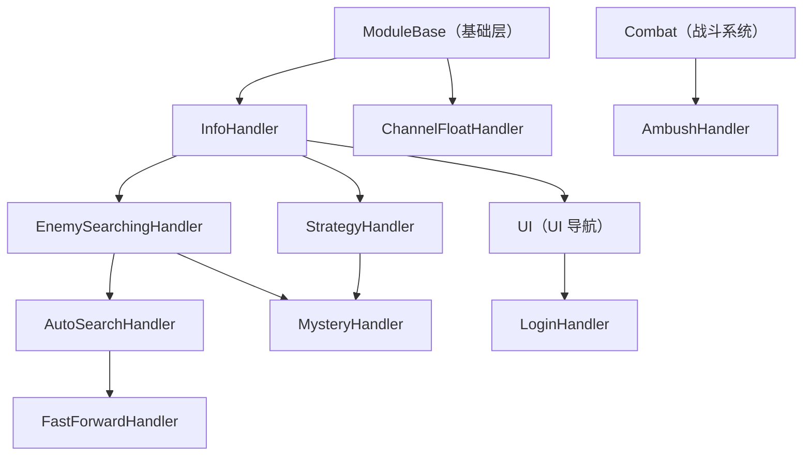
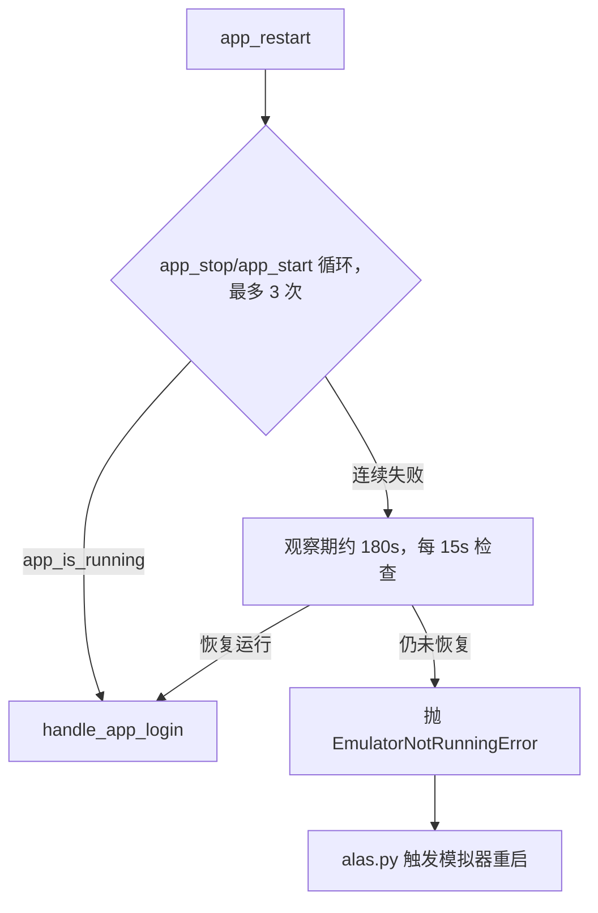

# 处理器层（module/handler）

> 游戏内弹窗、登录重启与地图事件的公共处理器层，以继承组合的方式向所有业务模块提供「预期外画面」的统一处理能力。

## 1. 模块概述

AzurPilot 的游戏流程是持续的「截图 → 识别 → 操作」状态循环。任何任务在任意时刻都可能被游戏打断：顶部信息栏、确认弹窗、紧急委托、剧情对话、伏击、加载动画等。这些「预期外画面」的处理逻辑与具体任务无关，却必须被所有任务复用——处理器层（`module/handler`）就是把这类横向关注点抽成的公共层。

设计上有两个特点：

- **继承即组装**。处理器以「最小职责类 + 继承链」组织，业务类按需叠加：地图操作 `MapOperation` 同时继承 `MysteryHandler` 与 `FastForwardHandler`，从而在同一个状态循环里直接调用两边的 `handle_*` 方法。相比独立的弹窗服务，继承让所有识别方法共享 `ModuleBase` 的截图缓存与识别原语，避免重复截图。
- **两条链汇合于 InfoHandler**。一条链 `InfoHandler → UI → LoginHandler` 服务于登录与页面导航；另一条 `InfoHandler → EnemySearchingHandler → AutoSearchHandler → FastForwardHandler` 服务于地图与战斗准备。`StrategyHandler`、`MysteryHandler`、`AmbushHandler` 是地图侧的旁支。

处理器层是全项目 `handle_*` 返回值契约（见第 6 节）的定义处，也是理解任何游戏任务代码时最先回溯的依赖。

## 2. 模块职责

### 负责

- 信息栏（info bar）检测与等待、通用弹窗确认/取消、紧急委托、剧情跳过与选项选择、加载动画等待（InfoHandler）
- 应用启动、登录画面、热更新检测、崩溃后的应用重启与观察恢复（LoginHandler）
- 4399 渠道服 SDK 悬浮球的定位、拖拽与隐藏（channel_float）
- 地图内事件：敌人搜索动画等待、伏击/空袭、神秘格子、策略面板、通关模式与自动搜索开关（EnemySearching/AutoSearch/FastForward/Strategy/Mystery/Ambush）
- 截图与日志的敏感信息脱敏（sensitive_info）

### 不负责

- 页面间导航（`module/ui/ui.py` 的 `UI` 负责，本层被它调用）
- 地图检测、寻路与格子推理（`module/map`）
- 战斗流程本身（`module/combat`；`AmbushHandler` 继承 `Combat` 以复用其 `combat()`）
- 识别原语与开关框架（`module/base` 的 `appear/click/Template/Switch`）
- 配置定义与校验（`module/config`）

## 3. 模块位置

```
module/handler/
├── info_handler.py       # InfoHandler：弹窗/信息栏/剧情处理基类
├── login.py              # LoginHandler：登录与重启恢复（继承 UI）
├── enemy_searching.py    # EnemySearchingHandler：敌人搜索动画
├── auto_search.py        # AutoSearchHandler：自动搜索设置与菜单
├── fast_forward.py       # FastForwardHandler：通关模式/舰队锁定/地图状态
├── strategy.py           # StrategyHandler：策略面板与潜艇/舰队移动
├── mystery.py            # MysteryHandler：神秘格子事件
├── ambush.py             # AmbushHandler：伏击与空袭（继承 Combat）
├── channel_float.py      # 渠道服悬浮球（函数 + ChannelFloatHandler）
├── sensitive_info.py     # 敏感信息遮罩（模块级函数）
└── assets.py             # 识别资源（button_extract 生成，勿手改）
```

| 文件 | 导出 | 一句话职责 |
| --- | --- | --- |
| info_handler.py | `InfoHandler`、`info_letter_preprocess()` | 弹窗/信息栏/剧情的识别与操作 |
| login.py | `LoginHandler`、`XPS` | 登录状态机、应用重启、国服 SDK 协议 |
| enemy_searching.py | `EnemySearchingHandler` | 等待搜索动画、检测回到关卡页面 |
| auto_search.py | `AutoSearchHandler` | 舰队准备侧边栏、自动搜索 6 项设置 |
| fast_forward.py | `FastForwardHandler`、`Switch` 子类、地图名转换函数 | 快进/自动搜索开关、地图状态、停止条件 |
| strategy.py | `StrategyHandler` | 阵型/潜艇开关、潜艇与舰队移动、空袭 |
| mystery.py | `MysteryHandler` | 道具/弹药/航母支援三种神秘事件 |
| ambush.py | `AmbushHandler` | 伏击回避/迎击、空袭等待、步数不足 |
| channel_float.py | `ChannelFloatHandler`、`channel_float_position()`、`hide_button()` | 4399 悬浮球动态定位与消除；新版对话框用白区定位 + 底部绿块过滤，关闭后二次确认防模态卡死 |
| sensitive_info.py | `handle_sensitive_image/text/logs()` | 隐私遮罩与路径脱敏 |

## 4. 核心入口

| 入口 | 用途 |
| --- | --- |
| `InfoHandler.handle_*` 系列 | 各业务状态循环内直接调用的弹窗/事件处理，本层最主要的使用方式 |
| `UI.ui_additional()`（module/ui/ui.py） | 导航与登录循环的「弹窗巡检」入口，聚合调用 InfoHandler 的多数方法 |
| `LoginHandler.app_start() / app_restart() / handle_app_login()` | 调度器 `alas.py` 的 `start/restart/goto_main` 动作入口 |
| `ChannelFloatHandler.run()` | 调度器每个会话（调度器启动或游戏重启后）调用一次 |
| `handle_sensitive_image / handle_sensitive_logs` | `alas.py` 保存错误现场时调用 |
| `FastForwardHandler.map_get_info() / handle_fast_forward()` 等 | `MapOperation.enter_map` 序列调用 |

追代码建议：看某个弹窗为何被处理，先查 `ui_additional`；看某次重启为何触发，从 `alas.py` 的异常分支到 `app_restart`。

## 5. 核心组件

### 类组成与继承



| 类 | 继承自 | 职责 |
| --- | --- | --- |
| `InfoHandler` | `ModuleBase` | 弹窗、信息栏、剧情、加载动画的统一检测与处理 |
| `LoginHandler` | `UI` | 登录循环、应用停止/启动/重启、国服协议与渠道悬浮球 |
| `EnemySearchingHandler` | `InfoHandler` | 敌人搜索动画等待、`is_in_stage` 检测、回关卡页抛 `CampaignEnd` |
| `AutoSearchHandler` | `EnemySearchingHandler` | 舰队准备侧边栏切换、自动搜索设置项确保 |
| `FastForwardHandler` | `AutoSearchHandler` | 通关模式/舰队锁定/自动搜索/二倍书开关、地图状态、停止条件 |
| `StrategyHandler` | `InfoHandler` | 策略面板：阵型、潜艇视图/狩猎、潜艇与舰队移动、空袭 |
| `MysteryHandler` | `StrategyHandler` + `EnemySearchingHandler` | 神秘格子的道具/弹药/航母事件 |
| `AmbushHandler` | `Combat` | 伏击回避/迎击与空袭，红色覆盖层透明度检测 |
| `ChannelFloatHandler` | `ModuleBase` | 会话级悬浮球检查入口（拖拽与隐藏） |

关键状态字段：

| 字段 | 归属 | 说明 |
| --- | --- | --- |
| `_popup_offset = (3, 30)` | `InfoHandler` | 通用弹窗按钮的匹配偏移；确认/取消需同时出现才点击，避免误判 |
| `story_popup_timeout`、`_story_option_*` | `InfoHandler` | 剧情跳过的多级计时器；`_story_option_click` 上限约 12 次，超出抛 `GameTooManyClickError` |
| `map_*`（如 `map_is_clear_mode`、`map_is_auto_search`） | `FastForwardHandler` | **类属性**形式的地图状态，由 `map_get_info()`/`handle_fast_forward()` 每次进图刷新 |
| `AUTO_SEARCH_SETTINGS` + `dic_setting_name_to_index` | auto_search.py | 6 个设置按钮与配置名的双向映射 |
| `MAP_AMBUSH`/`MAP_AIR_RAID` 颜色 | `AmbushHandler` | 首次检测时从截图 `load_color`，此后按透明度阈值判断（伏击 0.40 / 空袭 0.35） |

## 6. 工作流程

### 6.1 handle_* 返回值契约（全项目通用）

**所有 `handle_*()` 返回 `bool`：`True` 表示已对画面做了操作（点击/等待），调用方必须重新截图；`False` 表示未操作，当前截图仍有效。** 调用方在状态循环中据此决定 `continue`。配套约定：

- 退出检测用 `appear()` 且不设 `interval`；操作用 `appear_then_click()` / `handle_*()`，通常带 2–5 秒 `interval` 防连击。
- 只有已有可用截图时才允许 `skip_first_screenshot=True`。
- `ensure_no_*`（如 `ensure_no_info_bar`、`ensure_no_story`）是「在限时内反复处理直到干净」的复合变体，返回是否处理过。
- 例外：`MysteryHandler.handle_mystery()` 返回事件名字符串（`'get_item'/'get_ammo'/'get_carrier'`）或 `False`，调用方用它区分掉落类型——这是有意的信息增强而非违约。

### 6.2 ui_additional 弹窗巡检链

`UI` 继承 `InfoHandler`，其 `ui_additional()` 是导航/登录循环的统一兜底：按「大世界弹窗 → 通用确认/紧急委托 → 主界面弹窗（`ui_page_main_popups`）→ 剧情跳过 → 游戏提示 → 后宅/指挥喵/准备界面撤退 → 登录相关」的固定优先级逐个尝试，任一返回 `True` 即消费一次循环。`ui_get_current_page()` 与 `ui_goto()` 在识别不到已知页面或需要处理遮挡弹窗时都会调用它。新增「任意页面都可能出现」的弹窗时挂进这条链；只属于特定页面的则留在该任务的循环里。

### 6.3 登录与重启

`_handle_app_login()` 是单一状态循环：截图 → 检测 `LOGIN_CHECK`（点击并标记登录成功）→ 依次处理安卓无响应、公告、维护、更新、国服协议、回归玩家、通用弹窗、主界面弹窗 → 直到 `is_in_main()` 持续确认（`confirm_timer`）后退出。`handle_app_login()` 在外层把截图间隔放宽到 1 秒，并用 `Restart.LoginWaitTimeout`（跨任务读取，默认 30 秒、上限 3600）覆盖卡死检测阈值，避免慢启动的后台模拟器被误判卡死。

`app_restart()` 是带恢复梯度的重启状态机：



启用 `Error.RestartOperationTimeoutEnable` 时，`app_stop/app_start` 经 `_call_with_restart_deadline` 在 daemon 线程中执行：超时（默认 120 秒）判定模拟器或 atx-agent 卡死，立即抛 `EmulatorNotRunningError`。之所以需要它，是因为 atx-agent 自恢复可能让 u2 调用无限挂起，而此时截图循环不运行、既有的卡死保护全部失效。

### 6.4 地图内事件

进入地图后 `MapOperation`（module/map）按序调用本层：`map_get_info()` 读取通关率/星级/威胁安全并写入 `map_*` 状态、覆盖部分 `MAP_HAS_*` 配置 → `handle_fast_forward()` 切通关模式开关 → `handle_auto_search()`、`handle_auto_search_setting()` → 出击后 `Fleet` 的移动循环中依次调用 `handle_ambush()`、`handle_mystery()`、`handle_walk_out_of_step()`。战斗结束后 `handle_in_map_with_enemy_searching()` / `handle_in_map_no_enemy_searching()` 在等待动画的同时兜底各类弹窗，`handle_in_stage()` 确认回到关卡页面后抛 `CampaignEnd` 终结本次关卡。

### 6.5 剧情跳过

`story_skip()` 按优先级处理四类画面：剧情确认弹窗（`story_popup_timeout` 窗口内）、黑底纯文字对话（`STORY_LETTERS_ONLY`）、剧情选项（三套峰值检测适配旧版/新版大白色/右侧白色三种样式）、关闭按钮。选项选择支持 `STORY_OPTION` 指定序号；大世界塞壬装置由 `_identify_siren_device_option()` 按选项数量与跨任务配置识别。每次剧情点击后清空设备点击记录，防止不同剧情段复用同一按钮名触发 `GameTooManyClickError`，卡死改由 `_story_option_click` 连续计数兜底。

## 7. 调用关系

### 上游

| 模块 | 关系 |
| --- | --- |
| module/ui（UI） | 继承 `InfoHandler` 并在 `ui_additional` 中调用其方法；`LoginHandler` 反向继承 `UI` |
| module/combat（Combat） | 继承 `AutoSearchHandler`；调用 `handle_combat_low_emotion`、`handle_in_map_*_enemy_searching` 等 |
| module/map（MapOperation、Fleet） | 继承 `MysteryHandler`/`FastForwardHandler`/`AmbushHandler`，在移动与出击循环中调用 |
| alas.py（调度器） | `restart/start/goto_main` 用 `LoginHandler`；`handle_channel_float` 用 `ChannelFloatHandler`；`save_error_log` 用 sensitive_info |
| module/os_handler | 子类化 `EnemySearchingHandler` 覆盖大世界的 `is_in_map` 等 |
| 各奖励类任务（dorm、shop、tactical 等） | 直接调用 `handle_info_bar`、`handle_game_tips`、`handle_mission_popup_ack` 等通用方法 |

### 下游

| 模块 | 用途 |
| --- | --- |
| module/base | `appear/appear_then_click/click`、`Switch`、`Timer`、`loop()`、`Mask` 等全部识别与操作原语 |
| module/device | 截图、点击、拖拽、`app_stop/app_start`、`app_is_running`、卡死记录 |
| module/combat | `AmbushHandler` 回头调用 `self.combat()` 打伏击 |
| module/statistics | `self.stat.new(...)` 获得 `DropImage`，掉落截图经 `drop.add/handle_add` 收集提交 |
| module/config | 读用户配置、写运行期覆盖（`MAP_HAS_*`）、跨任务读 `cross_get`、`task_delay/task_stop` |
| module/notify | GemsFarming 无法设置自动搜索时的失败通知 |

## 8. 数据流

```
device.screenshot()
  → 识别（模板匹配 / image_color_count / find_peaks / red_overlay_transparency）
  → device.click / drag（部分先 drop.add 记录掉落图）
  → 循环，直至正向退出条件成立

掉落记录：识别到奖励画面 → drop.add(截图) → with 块退出时 AzurStats.commit 保存/入库
错误现场：device.screenshot_deque → handle_sensitive_image 遮罩 → log/error/
日志脱敏：log 文本 → handle_sensitive_logs（真实路径 → C:\fakepath\AzurLaneAutoScript）
```

## 9. 状态模型

`app_restart()` 的恢复梯度：

| 状态 | 行为 | 迁移 |
| --- | --- | --- |
| 重启尝试（至多 3 次） | `app_stop`（可选清缓存）→ `app_start` → 等 30/20 秒 → `app_is_running_bounded` 检查 | 成功 → 登录；全败 → 观察期 |
| 观察期（约 180 秒） | 每 15 秒探测一次进程，容忍慢启动/游戏更新 | 恢复 → 登录；超时 → `EmulatorNotRunningError` |
| 硬超时（可选开关） | `app_stop/app_start` 在 daemon 线程执行，超时判定模拟器或 atx-agent 卡死 | 直接 → `EmulatorNotRunningError` |

`FastForwardHandler` 的 `map_*` 布尔族（通关率、三星、威胁安全、通关模式、自动搜索、二倍书）构成地图快照状态，每次 `map_get_info()` 重建，供 `triggered_map_stop()` 判定停止条件。

## 10. 配置

配置路径 `<Task>.<Group>.<Argument>`，代码经 `self.config.Group_Argument` 访问。本层涉及：

| 配置 | 类型 | 默认值 | 说明 |
| --- | --- | --- | --- |
| `Campaign.UseClearMode` / `UseAutoSearch` / `UseFleetLock` / `Use2xBook` | checkbox | true/true/true/false | 分别控制通关模式、自动搜索、舰队锁定、二倍经验书开关 |
| `Campaign.AmbushEvade` | checkbox | true | 伏击选择回避（false 为迎击） |
| `Fleet.FleetOrder` | option | fleet1_mob_fleet2_boss | 自动搜索编队顺序，对应 6 个设置按钮中的 4 个 |
| `Submarine.AutoSearchMode` / `Submarine.Mode` / `Submarine.Fleet` | option | sub_standby / do_not_use / 0 | 潜艇在自动搜索设置中的同步与呼叫策略 |
| `Emotion.Mode` | option | calculate | `handle_combat_low_emotion` 的 ignore/计算模式分支 |
| `StopCondition.MapAchievement` / `StopCondition.StageIncrease` | option/checkbox | non_stop/false | `triggered_map_stop`/`handle_map_stop` 的成就与关卡推进 |
| `Restart.LoginWaitTimeout` | 数值（1–3600） | 30 | 登录等待阶段卡死检测宽容秒数 |
| `Restart.Restart.MoveChannelFloat` | checkbox | false | 4399 悬浮球开关（仅渠道服包名+服务器同时匹配才生效） |
| `Alas.Error.RestartOperationTimeoutEnable` / `RestartOperationTimeout` | checkbox/数值 | false/120 | 重启操作硬超时保护 |
| `STORY_OPTION`、`STORY_ALLOW_SKIP`、`USE_DATA_KEY`、`MAP_HAS_AMBUSH`、`MAP_MYSTERY_*` 等 | 代码内默认（config_manual） | 见 config_manual | 由各活动地图与任务覆盖的内部旗标，不属于用户配置 |

注意两处**跨任务读取**：登录等待与悬浮球开关用 `deep_get(self.config.data, 'Restart.Restart.LoginWaitTimeout')` 等路径直读，因为触发登录的可能是任意任务（大世界恢复、未知页面），不能依赖当前绑定任务；塞壬装置选项读取 `OpsiHazard1Leveling.OpsiSirenBug.*` 也基于同样原因。

## 11. 异常与错误处理

| 异常 | 原因 | 处理 |
| --- | --- | --- |
| `CampaignEnd` | `handle_in_stage` 确认回到关卡页面（含短暂页面切换的计时器防误判） | 由战役流程捕获，结束当前关卡；`_emotion_emergency_exit` 内部会捕获 |
| `ScriptEnd` | calculate 模式出现红脸弹窗的保底（清心情、延时任务）；达到地图成就停止条件 | 上层调度器结束当前任务 |
| `GameTooManyClickError` | 剧情选项连续点击超限、登录中模拟器无响应累计 | 设备层记录，`alas.run` 决定重启 |
| `GameNotRunningError` | 紧急委托点击后 3–6 秒热更新检测发现进程退出；重启流程 | 调度器触发 Restart 任务 |
| `EmulatorNotRunningError` | 应用重启 3 次失败且观察期未恢复；重启操作硬超时 | 调度器 `_try_restart_emulator` 重启模拟器 |
| `AutoSearchSetError` | 自动搜索设置失败且 OnePush 通知也失败（GemsFarming） | 任务终止并关闭该任务调度 |
| `MapWalkError` | `handle_walk_out_of_step` 识别步数不足后由 `Fleet` 抛出 | 地图流程重试 |

信息栏、剧情、弹窗等常规卡死依赖设备层的 `stuck_record`/`click_record` 机制统一兜底，处理器层只负责在点击后 `click_record_clear` 等配合动作，不自行吞异常。

## 12. 并发与线程模型

处理器默认单线程使用：调度器对单个配置串行执行任务，handler 实例不跨线程共享。唯一的多线程点是 `LoginHandler._call_with_restart_deadline`——为每次 `app_stop/app_start` 创建 daemon 线程，主线程到时抛 `EmulatorNotRunningError`；超时后残留线程的 HTTP 连接会随模拟器重启被重置并自然失败退出。`Timer` 与 interval 状态都挂在实例上，不可跨实例共享；`Switch` 定义在模块级、被所有实例共享，因此其状态检测只依赖传入的 `main` 而不保存可变状态。

## 14. 生命周期

处理器是**无状态壳**：由调度器或任务按需构造（`Handler(config, device)`），随任务结束丢弃，无销毁逻辑。所有跨调用的可变状态集中在两类位置——`self` 实例属性（剧情计时器、`carrier_count` 等）与 `FastForwardHandler` 的类属性地图状态。`MapOperation` 在每次进入地图时调用 `map_get_info()` 刷新快照；`handle_use_data_key` 成功后把 `USE_DATA_KEY` 写回 `False`，防止任务中断后重复消耗。

## 15. 扩展方式

新增一种弹窗处理的固定步骤：

1. 用 `dev_tools.button_extract` 在 `assets/<server>/handler/` 提取按钮资源（`assets.py` 自动生成）。
2. 在 `InfoHandler`（全局弹窗）或对应子类中新增 `handle_xxx()`，遵守 bool 契约，操作用 `appear_then_click(..., interval=2~5)`。
3. 若该弹窗可能出现在任意页面，把调用挂进 `UI.ui_additional()` 的合适优先级（通用弹窗在前、页面特有在后）；否则由所属任务的状态循环调用。
4. 需要开关语义时参照 `SwitchAutoSearch`：继承 `Switch` 覆写 `get()`（通常基于标题模板 + `load_offset` 动态定位检测区 + 颜色计数），再 `add_state` 注册状态。

新增处理器类时优先复用现有链：地图事件挂 `InfoHandler` 之下，需要战斗的挂 `Combat`（如 `AmbushHandler`）。

## 16. 修改注意事项

- **返回值契约不可破坏**。新增 `handle_*` 必须遵守 True=已操作需新截图；改坏会让所有调用方在旧截图上做判断。
- **弹窗双按钮交叉验证**：`handle_popup_confirm` 要求 `POPUP_CANCEL` 与 `POPUP_CONFIRM` 同时出现才点击，单侧出现不动作；白色主题弹窗用独立按钮（`POPUP_CONFIRM_WHITE` 等）单独判定。改动偏移或阈值需同时考虑两套。
- **点击记录改名技巧**：点击前把 `POPUP_CONFIRM.name` 临时拼上业务名（`POPUP_CONFIRM_XXX`）再还原，让设备层的防连点统计能区分不同来源对同一按钮的点击。新增弹窗处理时沿用该模式，否则可能触发 `GameTooManyClickError` 误报。
- **类属性地图状态**：`map_*` 是类属性，同一进程内跨任务保留旧值，正确性依赖每次进图时 `map_get_info()`/`handle_fast_forward()` 重置。新增字段必须在 `handle_fast_forward` 的重置分支里覆盖。
- **剧情与点击记录**：`story_skip` 的 `click_record_clear()` 与 `_story_option_click` 兜底是为绕开「按钮名复用导致防连点误判」而设计的成对机制，单独改动任一侧会重新引入卡死误报。
- **重启相关常量与配置回退**成对出现（如 `RESTART_OPERATION_TIMEOUT` 仅是配置读取失败的兜底），调整时保持「配置优先、非法回退默认并告警」的行为。
- **assets.py 与 `Mask` 遮罩图**由生成器/资源流程维护，手改会被 CI 差异检查打回。
- 伏击类模板依赖 `info_letter_preprocess()` 提升信息栏文字对比度，替换识别方式时需保留预处理。

## 17. 已知限制

- 继承链最深约五层（`ModuleBase → InfoHandler → EnemySearchingHandler → AutoSearchHandler → FastForwardHandler`），且 `MysteryHandler` 多继承两条链；修改链上方法签名需检查 MRO 中被覆盖的实现（如 `handle_auto_search_continue`、`handle_auto_search_exit`）。
- `handle_vote_popup()` 因投票弹窗下线恒返回 `False`，保留是为兼容调用方。
- `EnemySearchingHandler.is_event_animation()` 与 `handle_auto_search_exit()` 是占位实现，依赖子类（大世界、AutoSearchHandler）覆盖。
- 悬浮球处理存在两条入口：`ChannelFloatHandler.run()`（alas 会话级，等待进主界面）与 `LoginHandler` 内嵌的轻量版（登录循环内拖拽），共享 channel_float.py 的定位函数；两处行为需保持同步。
- 剧情选项三套检测依赖写死的画面区域与颜色，游戏改版时是首要失效点。

## 18. 示例

在任务状态循环中处理通用弹窗的最小形态：

```python
def run(self):
    while 1:
        self.device.screenshot()

        if self.appear(TASK_END_CHECK):      # 正向退出条件
            break
        if self.handle_popup_confirm('MY_TASK'):
            continue
        if self.handle_urgent_commission():
            continue
        if self.handle_info_bar():
            continue

        # ... 任务自身的分支
```

`handle_popup_confirm` 命中时返回 `True`，调用方 `continue` 触发新一轮截图——这正是第 6.1 节契约的直接体现。

## 19. 调试方法

- 离线复现：使用隔离配置和假设备，或针对仅依赖图片的方法跳过构造并补齐必要状态，再用 `image_file` 注入截图。正常构造 handler 会初始化真实设备；离线场景应在导入游戏模块前设置 `module.config.server.server`，不要依赖会访问设备的 `set_server()`。示例见[编码规范第 11 节](overview/conventions.md#11-调试方法)。
- 日志锚点：识别状态统一经 `logger.attr` 输出（`地图信息`、`自动搜索`、`剧情选项数量`、`舰队侧边栏` 等），登录/重启用 `[登录]`/`[重启]` 前缀。
- 错误现场：`log/error/<config>/<时间戳>/` 下的截图与日志已脱敏，可直接回放。
- 单元测试：`tests/test_story_option_click.py`、`tests/test_siren_device_story_option.py` 覆盖剧情选项与塞壬装置识别，可用作回归基线。
- 登录/重启问题先看 `[重启]` 日志中的尝试次数与观察期输出，再确认 `Restart.LoginWaitTimeout`、`Error.RestartOperationTimeout*` 配置是否被改。

## 20. 相关模块

- [UI 导航](ui.md)：`ui_additional` 巡检链与页面导航，`LoginHandler` 的直接基类
- [基础层](base/index.md)：`ModuleBase`、`Switch`、`Template/Mask` 等识别原语
- [战斗系统](combat.md)：`Combat` 组合 `AutoSearchHandler`；`AmbushHandler` 反向继承战斗系统
- [地图系统与检测](map.md)：`MapOperation`/`Fleet` 是本层处理器最大的组合方
- [大世界核心](os/index.md)：`os_handler` 子类化 `EnemySearchingHandler` 适配大世界
- [配置系统](config.md)：`cross_get/cross_set`、任务延时与停止的语义
- [编码规范](overview/conventions.md)：handle_* 返回值约定与状态循环写法的完整规范
