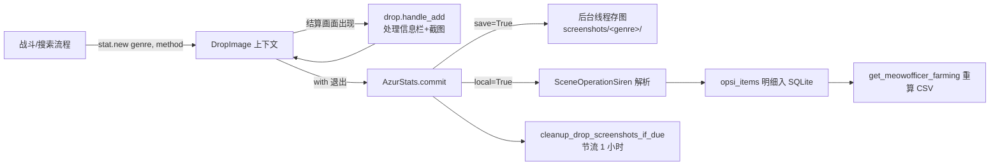
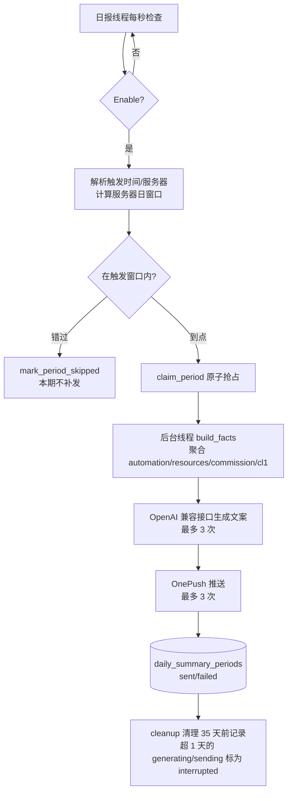
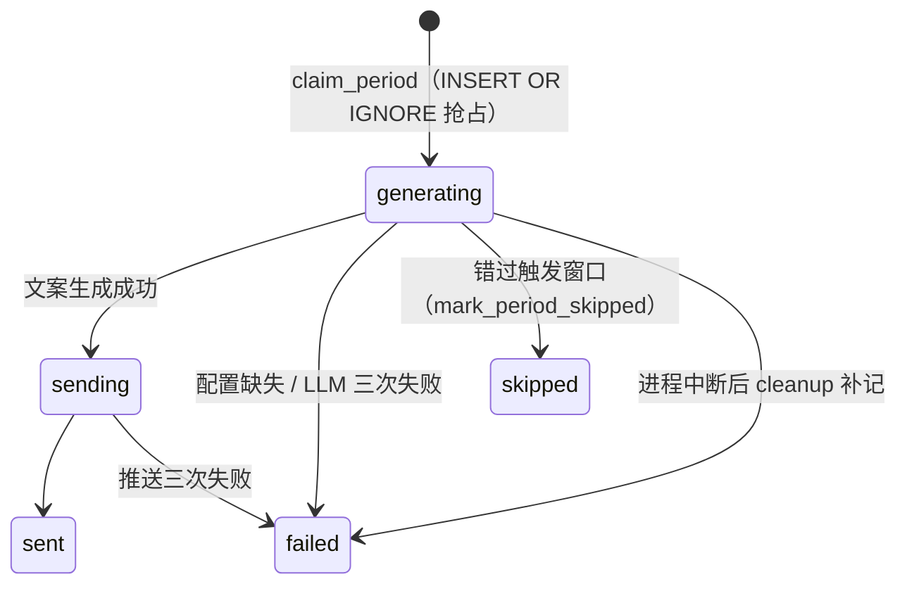

# 统计与数据提交（module/statistics、module/azur_stats、module/log_res）

> 把游戏运行期产生的掉落、战斗、资源与委托数据落成本地统计库，供 WebUI 统计页、LLM 日报与遥测提交消费。

## 1. 模块概述

AzurPilot 在执行任务时天然经过大量战斗结算与资源画面。这些画面里藏着用户关心的数字：打到了什么掉落、练级效率多少、行动力循环是否为正、委托攒了多少钻石。`module/statistics` 及其两个伴生目录就是把这些瞬时画面沉淀为可查数据的统计层。

这一层由三条相对独立的链路组成：

- **掉落统计链路**：战斗结算截图经 `AzurStats` 保存或解析入库。实时侧（`azurstats.py`）在战斗结束的上下文里收集截图；离线侧（`drop_statistics.py`）对历史截图文件夹做批量模板匹配与 OCR，导出 CSV。
- **CL1 统计链路**：`Cl1Database` 按「实例 × 月份」记录大世界侵蚀 1（CL1）与耄耋相接的战斗、明石、行动力等指标；`Cl1DataSubmitter` 把当月汇总匿名化后提交到官方遥测端点。
- **日报链路**：`DailySummaryStore` 持续采集任务运行与侵蚀 1 战斗事件，`DailySummaryService` 在触发窗口聚合事实、调用 LLM 生成文案并经 OnePush 推送。

`module/azur_stats/` 是掉落解析的场景层（原远程 AzurStats 上传的遗留名），复用 `module/statistics` 的物品识别原语；`module/log_res/` 则是资源变动的写入口，游戏代码通过属性赋值声明「资源变了」，由它决定写配置还是写快照库。

统计层与调度器共享一个设计前提：**统计永远不能影响游戏调度**。所有落库调用要么被吞异常、要么走异步执行器，写入失败的周期在日报中被标为「数据不完整」而不是让任务中断。

## 2. 模块职责

### 负责

- 战斗/搜索结算截图的保存（`DropRecord_SaveFolder`）与本地解析入库（SQLite `config/azurstats_local.db`）
- 物品识别原语：`Item`/`ItemGrid`/`AmountOcr`（模板匹配 + 带上限验证的数量 OCR）——商店、委托、仓库等模块都复用这一层
- CL1 月度统计库（`config/cl1_data.db`）的读写与旧加密数据迁移
- 侵蚀 1 遥测提交（`Cl1DataSubmitter` → `ApiClient`）
- 日报运行时事件采集、周期去重、LLM 文案生成与推送
- 资源快照记录（`resource_stats`）与资源变动入口（`LogRes`）
- 掉落截图按保留天数清理，过期后删除或备份到 `bak/`（`drop_cleanup`）
- 大世界运行期统计事件的统一落库入口（`opsi_runtime`）
- 离线批量掉落分析工具（`DropStatistics`，独立运行）

### 不负责

- 掉落截图的实时采集时机——由战斗/地图流程决定（`drop.handle_add()`），统计层只被动接收
- WebUI 的图表渲染与 API 编排——`module/api/statistics_service.py` 只是聚合查询本层导出的函数
- 推送通道实现——OnePush 由 `module/notify` 承担，日报只调用 `handle_notify()`
- 经验表数据本身——`LIST_SHIP_EXP` 来自 `module/os/ship_exp_data.py`
- 设备识别——`get_device_id()` 属于 `module/base/device_id.py`

## 3. 模块位置

```
module/statistics/
├── azurstats.py              # AzurStats：掉落记录提交、指挥喵 farming 汇总
├── cl1_database.py           # Cl1Database：月度统计库（单例 db）
├── cl1_data_submitter.py     # CL1 遥测提交器
├── daily_summary.py          # DailySummaryService：日报触发与生成
├── daily_summary_store.py    # DailySummaryStore：日报事件库
├── daily_summary_text.py     # 日报 system prompt
├── commission_income_stats.py# 委托收益聚合（day/week/month/interval）
├── resource_stats.py         # resource_snapshots 快照与区间摘要
├── ship_exp_stats.py         # ShipExpStats：战斗计时与经验效率
├── opsi_month.py             # OpsiMonthStats：月度大世界汇总与时间线
├── opsi_runtime.py           # 大世界运行期事件 → 落库的集中入口
├── drop_statistics.py        # 离线批量掉落分析（可独立运行）
├── drop_cleanup.py           # 掉落截图保留天数清理与备份
├── get_items.py / item.py / battle_status.py / campaign_bonus.py
│                             # 物品/敌人识别器（被 azur_stats 与离线分析复用）
├── utils.py                  # pack/unpack、ImageError、load_folder
└── assets.py                 # 识别资源（button_extract 生成，勿手改）

module/azur_stats/
├── scene/base.py             # SceneBase：加载截图、parse_scene 骨架
├── scene/operation_siren.py  # SceneOperationSiren：大世界完整场景解析
├── image/base.py             # ImageBase：classify_server 多服务器识别
├── image/get_items.py        # 战斗结算「获得物品」识别
├── image/auto_search_reward.py # 自律寻敌奖励页识别（AutoSearchItemGrid）
├── image/opsi_reward.py / opsi_zone.py # 大世界奖励/区域识别
└── assets.py                 # 识别资源（生成文件）

module/log_res/
└── log_res.py                # LogRes：Dashboard 资源赋值入口
```

模板资源：`assets/stats_basic/`（基础物品模板，掉落统计启动时复制到用户目录）、`assets/stats/`（opsi_items、opsi_reward_items 等场景模板）。

## 4. 核心入口

| 入口 | 用途 |
| --- | --- |
| `ModuleBase.stat`（`module/base/base.py` 的 cached_property） | 游戏任务获得 `AzurStats` 实例的唯一途径；`stat.new(genre, method=...)` 开启一次掉落记录 |
| `AzurStats.new()` → `DropImage` | 上下文管理器：战斗流程内 `drop.add()`/`drop.handle_add()` 收集截图，退出时自动 `commit()` |
| `Cl1Database.db`（模块级单例） | 各任务写入月度统计；同步方法 + `async_*` 系列（走 `async_executor`） |
| `opsi_runtime.record_*` / `start_/finish_battle_timer` | 大世界任务上报战斗、明石、吊机等事件的规范入口，避免任务代码直接写库 |
| `LogRes(config).<Res> = value` | 资源变动的声明式入口：写 `Dashboard.<Res>` 配置 + 触发资源快照 |
| `alas.py _start_daily_summary_scheduler` | 日报独立检查线程（启用时随调度器启动） |
| `statistics.report` / `statistics.refreshLoot` / `statistics.resources`（API 方法） | WebUI 统计页读取本层数据 |
| `python -m module.statistics.drop_statistics` | 离线批量掉落分析脚本 |

## 5. 核心组件

### 掉落识别（module/statistics）

| 组件 | 职责 |
| --- | --- |
| `Item` | 单个物品：模板匹配名 + 数量。名称 setter 自动剥离数字后缀（`Javelin_2` → `Javelin`）；`__eq__`/`__hash__` 基于名称，支撑两页掉落的去重合并 |
| `ItemGrid` | 物品网格：按 ButtonGrid 定位槽位，模板匹配（优先命中频率高的模板，未命中自动建数字编号新模板）+ 数量/价格 OCR + 标签颜色识别 |
| `AmountOcr` | 带验证的数量 OCR：读数超过 `ITEM_AMOUNT_MAX` 上限时重试（可选碎片过滤抹灰版），仍超限截断末位；`remove_small_fragments` 剔除图标残影连通域，防「3 被读成 73」类误读 |
| `GetItemsStatistics` / `CampaignBonusStatistics` / `BattleStatusStatistics` | 三个离线统计器：获得物品页（1/2/3 行网格自动判断奇偶布局）、战役加成弹窗（金币数量校验截图有效性）、敌方舰队名 OCR |
| `DropStatistics` | 离线批量处理器：两步工作流（`extract_template` 提模板 → 手动重命名 → `extract_drop` 导出 CSV） |

### 实时掉落记录（azurstats.py）

| 组件 | 字段/方法 | 说明 |
| --- | --- | --- |
| `DropImage` | `save` / `local` | 两个布尔决定退出时是否存图 / 是否解析入库；`__bool__` 为 False 时整个上下文零开销 |
| `DropImage` | `handle_add(main, before)` | 处理信息栏遮挡后等待 `WAIT_BEFORE_SAVING_SCREEN_SHOT` 秒再截图加入 |
| `AzurStats` | `commit(images, genre, save, local, combat_count)` | 垂直拼接截图，save 走后台线程，local 持 `_record_lock` 同步解析 |
| `AzurStats` | `LOCAL_DB = './config/azurstats_local.db'` | 掉落明细库（opsi_items 表，带 device_id/genre/hazard_level 维度） |
| `AzurStats` | `get_meowofficer_farming()` | 从明细库重算 6 侵蚀等级的「平均黄币/轮、平均金菜/轮……」写入 `log/azurstat_meowofficer_farming.csv`，WebUI「短猫掉落收益」表直接读取 |

### CL1 月度库（cl1_database.py）

`cl1_data` 表以 `(instance, month)` 为主键，`data_json` 存整月快照。快照内的关键字段：

| 字段 | 说明 |
| --- | --- |
| `battle_count` / `akashi_encounters` / `akashi_ap` | CL1 战斗次数、明石遭遇、明石购得行动力 |
| `ap_snapshots` / `asset` | 行动力快照；资产 = 总体力 × 56.67（CL5 效率）+ 黄币 |
| `yellow_coin_snapshots` / `coins_snapshots` | 凭证分时快照（后者上限 500 条） |
| `meow_battle_raw_count` / `meow_battle_count` | 耄耋真实战斗场次 / 有效轮数（侵蚀 2-3 每轮 2 场、4-6 每轮 3 场折算） |
| `meow_hazard_stats` | 按侵蚀等级拆分的桶（次数、耗时样本、明石） |
| `siren_research_devices` | 塞壬研究装置（吊机）计数，cl1 与 meow 分源 |
| `commission_income_entries` / `running_gem_commissions` | 委托收益明细（上限 5000）与运行中钻石委托（跨月合并） |

关键机制：`_stats_transaction()` 用 `BEGIN IMMEDIATE` 取写锁，跨线程/进程串行化整个「读-改-写」，避免并发覆盖；`save_stats` 只做整体替换，增量修改必须走事务内方法。旧版 AES-GCM 密文（密钥由 device_id 派生）在初始化时自动解密迁移为明文 JSON。

### 日报（daily_summary*.py）

| 组件 | 说明 |
| --- | --- |
| `DailySummaryService.check_due()` | 校验触发时间格式与服务器归属，计算最近一个服务器日窗口；错过宽限期（5 分钟）则 `mark_period_skipped` 防补发，到点则 `claim_period` 原子抢占后起后台线程 |
| `build_facts()` | 聚合任务运行、资源首末值、委托收益、侵蚀 1 事件四类事实；任何读取失败降级为 `data_quality.unavailable` 的明确缺失项，模型只拿可信数据 |
| `DailySummaryStore` | SQLite `config/daily_summary.db`；`busy_timeout=50ms`——写不进就放弃，宁可在日报里标「未采集」也不让调度等锁 |
| `daily_summary_periods` | 周期状态：`generating → sending → sent / failed(配置/LLM/推送/中断)`；`skipped` 表示已错过不补发 |
| `DAILY_SUMMARY_SYSTEM_PROMPT` | 猫娘角色设定 + 术语表，要求只使用 facts 中明确的数据 |

## 6. 工作流程

### 掉落记录链路（以一次大世界自动搜索为例）



关键分叉在 `new()` 的 `method` 参数：配置值 `do_not` 产生空的 DropImage（零开销）；`save` 只存图；`upload` 对 `LOCAL_GENRES`（目前仅 `opsi_meowfficer_farming`）触发本地解析——`upload` 这个名字是远程 AzurStats 时代的遗留，现在的「上传」就是解析入本地库。解析中发现只有数字代号的未识别物品时，把结算截图画上红框另存到 `screenshots/unknown_items/`，供人工补模板。

### 日报流程



事实聚合的四个来源各自独立降级：任务运行摘要来自日报库自身（调度器在任务前后打点）、资源变化来自 `resource_stats` 的窗口首末快照、委托收益来自 `cl1_db` 的按月条目、侵蚀 1 事件来自 `record_cl1_battle_event` 逐场打点。LLM 配置不完整或 OnePush 无 provider 时直接置 `failed(error_kind='configuration')`，不调用模型。

## 7. 调用关系

### 上游

| 模块 | 关系 |
| --- | --- |
| `module/base/base.py`（ModuleBase） | 持有 `stat`（AzurStats），战斗、委托、科研、喵箱、大世界各流程用 `stat.new()` 包住结算段 |
| `module/combat`、`module/os`、`module/os_combat`、`module/meowfficer`、`module/research` | 掉落记录的主要产生方；大世界战斗还调用 `opsi_runtime` 的计时器 |
| `module/commission` | 委托结算时调 `cl1_db.add_commission_income`（含钻石委托的事务内结算）与收益截图落盘 |
| `module/shop_status` / `os_status` / `campaign_status` 等 | 通过 `LogRes` 属性赋值上报资源变化 |
| `alas.py` | 日报调度线程 + 任务运行打点 |
| `module/api/statistics_service.py` / `runtime_service.py` | WebUI 统计页的聚合查询层 |

### 下游

| 模块 | 用途 |
| --- | --- |
| `module/ocr` | `AlOcr`/`Ocr`/`Digit` 数量与地名识别 |
| `module/os/globe_zone.ZoneManager` | OCR 地图名 → 标准区域（zone_id/hazard_level）映射 |
| `module/base/api_client.py` | CL1 遥测 POST（双端点故障转移，仅含哈希 device_id） |
| `module/base/async_executor` | 所有 `async_*` 统计写入的执行器 |
| `module/notify` | 日报与委托收益推送（`handle_notify`） |
| `openai` SDK | 日报文案生成（复用 Error 任务组的 LLM 配置） |

## 8. 数据流

```
战斗结算画面
  → DropImage.add()（截图缓存）
  → commit()：pack 成长图，文件名 = 13 位毫秒时间戳
      ├─ save → {DropRecord_SaveFolder}/{genre}/{ts}.png（后台线程）
      └─ local → SceneOperationSiren.parse_scene() → DataOpsiItems
              → opsi_items 表（azurstats_local.db）→ 重算 farming CSV
              └─ 有未识别物品 → unknown_items/ 红框标注图

任务事件（alas.py 打点）          → daily_summary_task_runs
侵蚀1战斗（ShipExpStats.on_battle_end）
  ├─ source=cl1 → ship_exp_data.json 日效率 + daily_summary_cl1_events
  └─ meow 来源只进 cl1_db 耙耋桶
资源 OCR（LogRes 赋值）
  ├─ Dashboard.<Res>.Value/Record → 配置文件（WebUI 仪表盘）
  └─ 全量快照 → resource_snapshots（azurstats_local.db）

查询侧：
  statistics.report → opsi_month / commission_income_stats / ship_exp_stats
                    / azurstats / resource_stats → metrics + series + tables
  日报窗口 → 日报库 + resource_stats + cl1_db → facts JSON → LLM
```

## 9. 状态模型

日报周期是本层唯一显式的状态机（`daily_summary_periods.status`）：



| 状态 | 含义 |
| --- | --- |
| generating / sending | 生成中 / 推送中；进程意外退出后由 `cleanup()` 在次日改判 `failed(error_kind='interrupted')`，不补发 |
| sent / failed | 终态；`error_kind` 区分 configuration / llm / notify / internal / interrupted |
| skipped | 已错过窗口，防止进程恢复后补发旧日报 |

## 10. 配置

| 配置 | 类型 | 默认值 | 说明 |
| --- | --- | --- | --- |
| `Alas.DailySummary.Enable` | checkbox | false | 日报开关；关闭时调度器不创建任何日报线程与存储 |
| `Alas.DailySummary.TriggerTime` | str | "20:00" | 触发时刻（服务器时区，24 小时制 HH:MM），由 `parse_daily_summary_trigger` 校验 |
| `Alas.DropRecord.SaveFolder` | str | ./screenshots | 掉落截图根目录（按 genre 分子目录） |
| `Alas.DropRecord.RetentionDays` | int | 0 | 截图保留天数，0 = 不清理 |
| `Alas.DropRecord.BackUpMethod` / `ZipMethod` | option | zip / zip | 过期截图的处理方式（delete / zip / copy）与压缩格式（bz2 / gzip / xz / zip）；备份落在各来源目录下的 `bak/` |
| `Alas.DropRecord.CombatRecord` / `OpsiRecord` / `ResearchRecord` / `CommissionRecord` | option | do_not / upload | 各场景掉落记录方式（do_not / save / upload / save_and_upload） |
| `Alas.DropRecord.CommissionIncomeScreenshot` | option | save | 委托收益截图开关 |
| `Alas.DropRecord.TelemetryReport` | bool | true | CL1 遥测提交开关（hazard_leveling 里检查） |
| `Alas.Error.LlmApiKey/LlmApiBase/LlmModel` | str | "" | 日报 LLM 配置（与错误上报共用） |
| `Alas.Error.OnePushConfig` | str | "" | 推送通道配置 |

关联关系：日报的 LLM 与推送配置刻意复用 `Error` 组，避免两套密钥；掉落记录各场景开关决定 `DropImage.save/local`，而 `LOCAL_GENRES` 判定让 `OpsiRecord` 的 `upload` 档位对接本地解析。日报线程不持有完整配置对象——`alas.py` 只传 `SimpleNamespace` 快照并按配置文件 mtime 热读，避免与任务线程争用配置对象。

## 11. 异常与错误处理

| 异常/失败 | 原因 | 处理 |
| --- | --- | --- |
| `ImageError` 族（GetItemsInvalid、OpsiZoneInvalid、ZeroAmountError…） | 截图不是预期结算页 / 信息栏遮挡 / 数量为 0 | `commit`/离线解析捕获后记 warning 跳过该截图，不影响战斗流程 |
| OCR 读数超上限 | 图标残影被拼进数字 | `AmountOcr` 重试 + 抹灰兜底 + 末位截断，仍失败则返回原值 |
| SQLite 锁竞争 | WebUI 线程与调度线程并发写 | 日报库 `busy_timeout=50ms` 快速失败 + 内存暂存降级事件；CL1 库用 `BEGIN IMMEDIATE` 串行化 |
| 日报数据库写失败 | 磁盘/锁异常 | 记入 `daily_summary_collection_gaps`，该周期日报标「数据不完整」 |
| LLM 空响应 / 调用失败 | 网络、配额 | 最多 3 次重试，仍失败置 `failed(error_kind='llm')`，本期不发送 |
| OnePush 失败 | 配置错误、服务不可达 | 同一文案重发 3 次，仍失败置 `failed`，不重试整期 |
| 遥测提交失败 | 网络不通 | 仅 debug 日志，下个 10 分钟窗口再试 |

原则：**统计链路的异常一律不向游戏调度传播**。`record_task_start/finish`、资源快照、战斗计时等都有 try/except 包裹；只有 `Cl1Database.save_stats` 这类显式写接口会把异常传给调用方（由调用方决定回滚语义）。

## 12. 并发与线程模型

统计层被至少四类线程同时访问：游戏任务线程（同步写）、`async_executor` 工作线程（异步写）、日报后台线程（生成与推送）、WebUI 工作线程（查询）。

| 对象 | 保护方式 |
| --- | --- |
| `Cl1Database` | 每次读改写都在 `_stats_transaction()`（`BEGIN IMMEDIATE`）内完成，跨线程与跨进程串行化；不依赖调用方持锁。跨月结算在一个事务里同时写来源月与归档月 |
| `AzurStats` | `_record_lock` 串行化本地解析（解析是 CPU 密集的 OCR），`_local_lock` 串行化 SQLite 插入；save 单独开短命线程避免阻塞战斗 |
| `DailySummaryStore` | `RLock` + 每次操作新建短连接（`_ClosingConnection` 立即释放，防 Windows 文件锁残留）；采集失败先缓存内存、下次可写时补记 |
| `DailySummaryService` | `_lock` 保护 `_active/_processed_periods` 集合；周期幂等性主要靠数据库 `claim_period` 的 INSERT OR IGNORE，进程内集合只是去重快路径 |
| `resource_stats` / `_loot_lock` | 模块级锁串行化快照写入与 farming 重算 |
| 日报线程生命周期 | 由 `alas.py` 的调度器 loop 启停；`check_due` 里启动的生成线程是 daemon，异常全部隔离在 `_generate_and_send` 内 |

## 13. 缓存与持久化

| 存储 | 内容 | 写入时机 | 清理 |
| --- | --- | --- | --- |
| `config/azurstats_local.db` | `opsi_items` 掉落明细 + `resource_snapshots` 资源快照 | 每次 commit / LogRes 资源变化 | 不自动清理明细 |
| `config/cl1_data.db` | CL1 月度统计（instance×month） | 各 `async_*` 方法即时写 | 快照列表内部截断（500/5000 条） |
| `config/daily_summary.db` | 日报任务事件、周期状态、采集缺口 | 任务前后、战斗结束、日报流程 | `cleanup()` 保留 35 天 |
| `log/azurstat_meowofficer_farming.csv` | farming 汇总（可被 dev_tools 直接读取） | 每次本地解析成功后重算 | 覆写 |
| `log/cl1/<instance>/ship_exp_data.json` | 战斗耗时样本、每日经验、升级进度 | 每场战斗结束 | 样本 100 条 / 日统计 30 天 |
| `screenshots/<genre>/`、`log/commission_rewards/<instance>/<月份>/` | 掉落与委托截图 | commit / 委托结算 | `DropRecord_RetentionDays` 天数清理（节流 1 小时），过期后按 `DropRecord_BackUpMethod` 删除 / 拷贝备份 / 压缩备份到 `bak/` |

CL1 库的兼容性迁移是自动的：启动时把旧位置 `log/cl1/cl1_data.db` 移入 `config/`，AES-GCM 旧密文行（密钥由新旧 device_id 派生尝试）解密为明文 JSON，旧 JSON 月度文件经 `migrate_from_json` 归档后重命名为 `.bak`。

## 14. 生命周期

`Cl1Database.db`、日报 `DailySummaryStore`、遥测提交器 `_submitters` 都是进程级单例，随首次 import 惰性创建，无显式销毁。`AzurStats` 不是单例——每个 `ModuleBase` 持有自己的实例（只封装 config），共享的锁在类属性上。日报线程随调度器 `loop()` 启动、更新事件或进程退出时通过 `_stop_daily_summary_scheduler` 停止；日报关闭的实例从初始化起就不创建任何线程与数据库连接。

## 15. 扩展方式

新增一项月度统计（以「塞壬研究装置」为参照）：

1. 在 `cl1_database.py` 的 `_empty_data()` 加默认字段，新增 `add_xxx`/`get_xxx` 方法——读改写必须包在 `_stats_transaction()` 里，并按需提供 `async_` 包装。
2. 在 `opsi_runtime.py` 加运行期入口（或在对应任务里直接调用），任务代码只上报领域事件。
3. 在 `module/api/statistics_service.py` 的对应 category 里把指标加进 `report()` 输出；API 模型变更后运行 `uv run python -m dev_tools.export_api_schema`。
4. 需要进日报时，在 `DailySummaryService.build_facts()` 的 facts 里补字段并在 prompt 术语表加映射。

新增掉落识别模板：把结算截图交给 `DropStatistics.extract_template()` 提取，人工重命名后放回模板目录；白纸类物品（设计图/测试报告）的稀有度由 `AutoSearchItemGrid.match_candidates` 按底色限定，新等级需要同时补 `TIER_BY_COLOR` 可识别的底色。

## 16. 修改注意事项

- **不要在任务代码里直接写 `cl1_db`**。大世界事件的落库口径（侵蚀等级折算、轮次闭合、来源判定）集中在 `opsi_runtime.py`，绕过它会产生口径分裂的统计。
- **`ItemGrid` 是被多处共享的单例状态**（`get_items.ITEM_GROUP` 是模块级实例）：`GetItemsStatistics`、`CampaignBonusStatistics`、`azur_stats.GetItems`、商店与仓库都改它的 `grids/item_class/similarity`。新增使用方时必须在使用前完整设置这些属性，如同 `_stats_get_items_load` 所做的那样，否则会带着上一场景的网格布局去匹配。
- **删除是不可逆的**：`drop_cleanup` 只处理文件名匹配 `^\d{13}(_.+)?\.png$` 的文件，配置异常时按 0 处理（不清理）；`bak/` 内的备份不参与扫描（拷贝备份保留原修改时间，只看时间会被反复处理），压缩或拷贝失败时保留原文件。改清理逻辑时保持这些保守默认。
- **日报的 `period_key` 含服务器与时区信息**，改动 `get_daily_summary_window` 的窗口语义会让已存在库里的 period_key 失配，导致重复推送。
- **OCR 数量的修正逻辑是按具体误读样本反复校准的**（`remove_small_fragments`、`revise_item`、`AmountOcr` 截断），注释里记录了每个阈值的来源案例；调整阈值前先用真实截图回归验证，不要「顺手简化」。
- **遥测提交只发聚合指标**（battle_count/明石次数 + MD5 前缀 instance_id），不要往 `calculate_metrics` 里加可识别个人的字段。
- `module/statistics/assets.py` 与 `module/azur_stats/assets.py` 是 `dev_tools.button_extract` 的生成物，改按钮资源后重新生成，不要手改。

## 17. 已知限制

- `AzurStats` 的远程上传路径已废弃（类 docstring 自述），`upload` 语义名不副实，仅对 `opsi_meowfficer_farming` 表示本地解析。
- `AzurStats.get_meow_loot_monthly_totals` / `get_meow_loot_available_months` 目前在仓库内没有调用方，属于预留接口。
- 委托收益条目没有「已检查但零结算」的心跳记录，日报侧只能把空列表标为 `available=False` 而非零收益（`commission_income_stats` 有注释说明）。
- 遥测域名 `ApiClient.PRIMARY_DOMAIN` 与 `FALLBACK_DOMAIN` 当前相同，故障转移实际未生效。
- farming CSV（`azurstat_meowofficer_farming.csv`）是全量重算而非增量，明细库很大时刷新会变慢。
- `drop_statistics.py` 离线分析依赖手动重命名模板与改脚本常量，没有命令行参数化。

## 18. 示例

最小掉落记录路径（任务代码侧的全部参与方式）：

```python
# ModuleBase 子类里，用配置开关包住一次自动搜索
with self.stat.new(
    genre=inflection.underscore(self.config.task.command),
    method=self.config.DropRecord_OpsiRecord,
) as drop:
    combat = self.os_auto_search_run(drop)   # 结算画面出现时 drop.handle_add(main=self)
    drop.set_combat_count(combat)
```

写入一条月度统计（运行期入口模式）：

```python
# 任务代码只声明事件
record_siren_research_device(self)          # opsi_runtime 内部决定来源与等级并异步落库
```

## 19. 调试方法

- 日志前缀：`[统计-物品]`（识别修正）、`[统计-资源]`、`[统计-经验]`、`[统计-大世界]`（运行期事件）、`[日报]`（日报全链路）、`[掉落记录]`（清理）、`[基础-API]`（遥测提交）。`logger.attr('CL1单轮耗时', ...)` 等属性行适合 grep 单轮耗时。
- 本地调试服务：`ALAS_DEBUG_SERVER=1` 启动调度器后，`module/debug/commission_debug.py` 可以不开游戏注入伪造委托收益并触发推送，验证统计口径与推送链路。
- 测试：`tests/test_statistics_transactions.py`（CL1 事务与并发）、`tests/test_daily_summary*.py`（日报窗口与聚合）、`tests/test_drop_cleanup.py`（清理与 `AzurStats.new` 节流）、`tests/test_archive.py`（删除/拷贝/压缩三种过期处理方式）、`tests/test_commission_settlement.py`。
- 数据核查入口：直接用 sqlite3 打开 `config/cl1_data.db`（明文 JSON）、`config/azurstats_local.db`、`config/daily_summary.db`； farming 汇总看 `log/azurstat_meowofficer_farming.csv`。
- 未识别物品：检查 `screenshots/unknown_items/` 下的红框标注图，补模板后重跑 `DropStatistics.extract_template`。

## 20. 相关模块

- [调度器（alas.py）](../entry/alas.md)——日报调度线程、任务运行打点的宿主
- [API 服务](../webui/api.md)——`statistics_service` 的 6 类报表与 `statistics.refreshLoot`
- [通知、LLM 与日志](notify-llm-logger.md)——`handle_notify` 推送通道与 LLM 配置复用
- [战斗系统](../combat.md)——`combat()` 是掉落截图最主要的产生方
- [大世界核心](../os/index.md)——CL1/耄耋相接任务与 `opsi_runtime` 事件的来源
- [委托系统](../game/commission.md)——委托收益识别、截图落盘与钻石委托结算的调用方
- [异步执行器与工具](../base/decorator-utils.md)——`async_executor` 的行为
