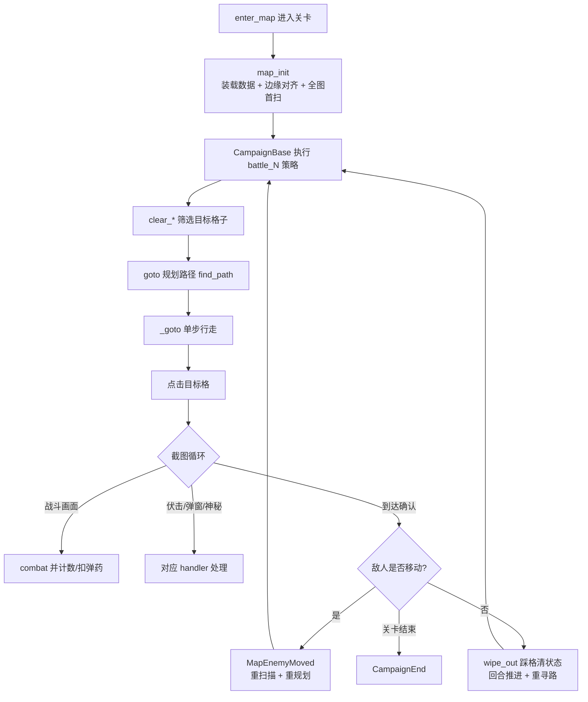

# 地图系统与检测（module/map、module/map_detection）

> 碧蓝航线棋盘式地图的两层引擎：`module/map_detection` 从截图还原「视野内有哪些格子、每个格子上是什么」，`module/map` 在全局地图模型上寻路、走格并编排战斗。

## 1. 模块概述

碧蓝航线的出击地图是一张带透视的伪 3D 棋盘：玩家看到的是斜 45° 视角的网格海面，舰队在格间行走，敌人、弹药、Boss 以图标形式散布在格子上。自动化框架必须把「屏幕上的像素」还原成「坐标系里的格子」才能做任何决策。这个问题被拆成两个正交的子问题，对应两个包：

- **module/map_detection（感知层）**：纯粹回答「这张截图里有什么」。通过透视/单应性变换把梯形网格还原为几何上规整的四角坐标，再对每个格子做模板与颜色识别，产出带坐标的格子对象。它不关心游戏规则，同一套代码同时服务主线地图与大世界。
- **module/map（决策层）**：回答「接下来去哪个格子、怎么走、到了做什么」。它维护一张由地图定义文件（`campaign/` 下的 Python 文件）描述的全局地图 `CampaignMap`，用 Dijkstra 寻路，控制相机滑动扫描全图，把局部视野合并进全局模型，最后按活动地图作者编写的策略函数逐个清除敌人、触发机关、挑战 Boss。

两层的设计动机来自耦合度的差异：感知层必须适应所有地图的通用视觉规律（网格透视、图标模板），因此被压到最底层、只依赖配置参数；决策层的知识则高度地图相关（哪条路是必经之路、Boss 会刷在哪里），全部外置到 `campaign/` 的地图定义文件中，模块本身只提供通用策略（`clear_roadblocks`、`clear_boss` 等）。

决策层采用一条很深的继承链而非组合：`Map → Fleet → Camera → MapOperation → AmbushHandler → Combat → …`。这是历史演进的产物——相机、舰队、进图操作、伏击处理逐层叠加，最终 `CampaignBase(CampaignUI, Map, AutoSearchCombat)` 一步到位拿到全部能力。链条中每一层只增加一类职责（地图操作、相机、舰队行走、战斗策略），但代价是新读者必须理解 MRO 才能确定 `self.xxx` 究竟落在哪一层。

感知层则是组合式设计：`View` 持有一个检测后端（`Homography` 或 `Perspective`）和一组 `Grid`；每个 `Grid` 是 `GridInfo`（静态属性）与 `GridPredictor`（图像识别）的多重继承产物。大世界只需换用 `OSGrid` 子类即可复用整条管线。

## 2. 模块职责

### 负责

- **map_detection**：
  - 从截图检测网格四角（透视检测 Perspective / 单应性变换 Homography 两种后端）。
  - 网格内容识别：敌人规模与类型、Boss、舰队、潜艇、问号、大世界目标等。
  - 屏幕坐标与网格坐标的双向变换、滑动偏移预测（`View.predict_swipe`）。
  - UI 区域遮罩（识别前抹掉界面元素）与检测资源缓存（`utils_assets.py`）。
- **module/map**：
  - 全局地图数据结构与文本解析：地图符号、权重、墙壁、传送门、迷宫、堡垒、陆基、弹跳敌人（`CampaignMap`）。
  - 格子集合运算与路障建模（`SelectedGrids`、`RoadGrids`）。
  - 相机控制：滑动、聚焦、全图扫描、边缘定位、坐标转换（`Camera`）。
  - 舰队行走与事件处理：点击、战斗、伏击、神秘格、回合制移动敌人（`Fleet`）。
  - 敌人清除策略：按规模/类型/距离选目标、清路障、清 Boss、双舰队协作（`Map`）。
  - 进图与舰队准备界面操作（`MapOperation`、`FleetPreparation`）、潜艇出击规划（`SubmarineAdvanced`）。

### 不负责

- 战斗内部的技能/装备/结算逻辑——属于战斗系统（`module/combat`），本模块只在走到敌格时调起 `self.combat()`。
- 关卡选择页导航、进图入口点击的页面级路由——属于战役执行层（`module/campaign`）与 UI 导航（`module/ui`）。
- 伏击/弹窗的具体处理流程——`Fleet` 继承 `AmbushHandler`（module/handler）复用其实现，本模块不重复实现。
- 模板图片与按钮坐标资源——由 `assets/` 生成器维护，本模块只引用常量。
- 大世界的雷达小地图识别与任务逻辑——雷达识别在 `module/os/radar.py`（其结果经 `OSGridInfo.merge` 合并），任务编排属于大世界模块。

## 3. 模块位置

```
module/
├── map/                        # 决策层：地图数据、寻路、相机、舰队
│   ├── map_base.py             # CampaignMap：全局地图模型 + Dijkstra 寻路
│   ├── map_grids.py            # SelectedGrids / RoadGrids 集合运算
│   ├── map.py                  # Map：敌人清除策略（clear_* 系列）
│   ├── fleet.py                # Fleet：行走、回合、舰队追踪、双舰队协作
│   ├── camera.py               # Camera：滑动、扫描、边缘定位、坐标转换
│   ├── map_operation.py        # MapOperation：进图/撤退/模式切换
│   ├── map_fleet_preparation.py# 舰队准备界面（下拉选队、困难校验）
│   ├── submarine.py            # 潜艇高级出击规划
│   ├── utils.py                # 坐标转换、相机位计算、移动敌人匹配
│   └── assets.py               # 进图/编队界面按钮（生成产物）
└── map_detection/              # 感知层：网格几何与内容识别
    ├── detector.py             # MapDetector：后端选择器（homography/perspective）
    ├── homography.py           # Homography：单应性变换后端（默认）
    ├── perspective.py          # Perspective：透视检测后端（用于标定）
    ├── view.py                 # View：局部视野网格集合 + 滑动预测
    ├── grid.py                 # Grid = GridInfo + GridPredictor
    ├── grid_info.py            # GridInfo：格子静态属性与合并规则
    ├── grid_predictor.py       # GridPredictor：单格图像识别
    ├── os_grid.py              # OSGridInfo/OSGridPredictor/OSGrid：大世界变体
    ├── utils.py                # Points/Lines 几何工具、透视变换
    ├── utils_assets.py         # UI 遮罩、瓦片模板等检测资源
    └── detector_example.py     # 自定义后端的接口示例
```

| 文件 | 作用 |
| --- | --- |
| `map_base.py` | 地图唯一的事实来源：格子字典、寻路代价、机制数据、预测合并 |
| `camera.py` | 决策层与感知层的桥梁：持有 `View`，维护相机全局坐标 |
| `fleet.py` | 最厚的一层：单步行走状态循环、可移动敌人回合系统 |
| `map.py` | 活动地图作者调用的策略 API（`clear_roadblocks` 等） |
| `homography.py` | 运行时默认检测后端：先标定一次，之后每帧廉价检测 |
| `perspective.py` | 从零恢复网格几何的完整透视求解器，用于首次标定与离线校准 |
| `grid_predictor.py` | 单格识别的全部实现：相对裁剪消除透视变形后做模板/颜色匹配 |

## 4. 核心入口

| 入口 | 用途 |
| --- | --- |
| `Map.map_init(map_)` | 进入地图后的总初始化：装载数据、首扫、定位舰队与潜艇、初始寻路。由 `CampaignBase.run()` 调用 |
| `Map.goto(location, expected)` | 走到指定格子并处理沿途事件，是策略层最核心的操作原语 |
| `Map.clear_*()` 系列 | 策略方法：清敌人/路障/神秘点/塞壬/Boss，由活动地图的 `battle_N` 函数按优先级调用 |
| `Camera.update()` | 截图并更新视野与相机位置；所有需要新感知的流程都以它为感知原语 |
| `Camera.full_scan()` | 按相机位序列扫全图，把局部识别合并进 `CampaignMap` |
| `View(config, mode, grid_class)` | 直接构造视野对象；大世界 `OSCamera` 以 `mode='os', grid_class=OSGrid` 复用 |
| `MapDetector.load(image)` / `backend.generate()` | 感知层对外接口：加载截图、产出「格子坐标 + 四角点」 |

追代码建议从两条线入手：感知线看 `View.load()`（一帧截图如何变成网格字典），决策线看 `Fleet._goto()`（一次点击如何覆盖战斗/伏击/神秘/超时全部分支）。

## 5. 核心组件

### CampaignMap（map_base.py）

| 字段/能力 | 说明 |
| --- | --- |
| `grids` | `dict[(x, y), GridInfo]`，全局地图所有格子；坐标 `(0, 0)` 对应 A1 |
| `map_data` / `map_data_loop` | 文本地图；loop 变体用于清_mode（快进）时敌人分布不同的地图 |
| `spawn_data` | 按战斗次数的敌人刷新表（enemy/mystery/siren/boss），驱动缺失预测与提前停扫 |
| `weight_data` | 格子权重，`select_grids` 排序的第一优先级（值小的格子优先走） |
| `wall_data` / `portal_data` | 墙壁断开格子连接；传送门把两格加入彼此的连接表 |
| `grid_connection` | 每格四邻接表，寻路的图结构；`grid_connection_initial()` 按墙/门重建 |
| `camera_data` | 覆盖全图所需的最少相机位集合（由 `camera_2d()` 按视野 sight 生成） |
| `_ignore_prediction` | 已知的「误报格子」登记表，合并时跳过，容忍识别器的系统性错误 |

### GridInfo / GridPredictor / Grid（grid.py / grid_info.py / grid_predictor.py）

三层各司其职，是感知层的骨架：

| 类 | 职责 | 依赖截图 |
| --- | --- | --- |
| `GridInfo` | 纯数据：静态属性（`is_land`、`may_enemy`…来自地图定义）+ 动态状态（`is_enemy`、`cost`…来自扫描），以及最重要的 `merge()` 合并规则 | 否 |
| `GridPredictor` | 纯识别：持有截图引用与四角坐标，`predict()` 用相对裁剪 + 颜色统计 + 模板匹配填充实例属性 | 是 |
| `Grid(GridInfo, GridPredictor)` | 组合二者，附加 `inner`/`outer`/`button`（梯形内接矩形，即可点击区域） | 是 |

`GridPredictor` 的关键设计是**每格自带透视矩阵**：构造时用四角点算出「该格梯形 → 140×140 正方形」的单应性，`relative_crop(area)` 因此能用与屏幕位置无关的相对坐标（如 `(-0.5, -1, 0.5, 0)` 表示格子中上区域）裁剪并缩放，模板匹配得以跨屏幕位置复用。`screen2grid()`/`grid2screen()` 提供任意点在屏幕与海面网格坐标间的往返。

### OSGrid（os_grid.py）

大世界格子是三重继承的组合：`OSGrid(OSGridInfo, OSGridPredictor, Grid)`。

| 差异点 | 普通 Grid | OSGrid |
| --- | --- | --- |
| 目标类型 | 敌人/神秘/Boss/弹药 | 红枪敌人、资源箱、问号、明石、扫描装置、伐木塔、探索物资、舰队机关等 |
| 识别来源 | 地面图标模板（MAP_ENEMY_TEMPLATE 等） | 固定的 OS 专属模板集（Akashi/ScanningDevice 等），`direct_match` 直方图匹配 |
| 合并来源 | 局部视野扫描 | 局部扫描 + `RadarGrid`（雷达小地图识别结果，只置 `is_radar_scanned` 与目标类型） |
| `is_sea` 判定 | 图标模板匹配 | 先检查海面颜色（绿蓝分量显著高于红）再匹配模板 |

大世界是固定 45° 俯视角、格子恒定大小，因此 `OSCamera` 直接内置一份标定好的 `HOMO_STORAGE`（单应性参数），跳过动态标定；普通地图的格子随章节透视不同，需要标定流程。

### SelectedGrids / RoadGrids（map_grids.py)

`SelectedGrids` 是格子集合的函数式工具箱：`select(**属性)` 过滤、`sort(*属性)` 排序、`add/intersect/delete` 集合运算、`sort_by_camera_distance` 按曼哈顿距离排序。几乎所有策略代码都以链式调用表达「筛选→排序→取第一个」。

`RoadGrids` 把一条路线上的「障碍组」建模为候选格子集合的列表（如 `[C3, B4, C5]` 表示三选一的敌人位），提供三级路障判定：

| 方法 | 判定条件 |
| --- | --- |
| `roadblocks()` | 障碍组内全部是敌人——确定的路障 |
| `potential_roadblocks()` | 只差一个就能打通，且组内没有舰队或已清格——提前清掉避免来回 |
| `first_roadblocks()` | 组内还有未清敌人——首个需要处理的目标 |

### 决策层继承链

| 类 | 增加的职责 |
| --- | --- |
| `MapOperation` | 进图（`enter_map`）、舰队切换与反转、撤退、快进/自动搜索设置 |
| `Camera` | 视野更新、滑动执行与预测、全图扫描、全局/局部坐标转换 |
| `Fleet` | 行走循环、回合系统、多舰队追踪、潜艇走位、路障暴力搜索 |
| `Map` | 面向地图作者的策略层：各种 `clear_*` 与格子筛选 |

## 6. 工作流程

### 一次完整的出击循环



### 感知流程：一帧截图 → 网格

`Camera.update()` → `View.load()` 的内部步骤：

1. **UI 清理**：按模式选择 `ui_mask` 或 `ui_mask_os` 遮罩，把截图中的界面元素（小地图、按钮）涂黑，只留海面。
2. **网格几何**：交给检测后端 `generate()`，产出「每个格子的坐标与四角点」。
3. **实例化**：四角完全落在检测区域内的格子实例化为 `Grid`；整体平移使最小坐标为 `(0, 0)`，消除视野漂移。
4. **定位视野中心**：用第一个格子的 `screen2grid(SCREEN_CENTER)` 求出屏幕中心落在哪个海面坐标上（`center_loca`/`center_offset`），并得到 `swipe_base`（屏幕上横/竖半格的像素距离，滑动换算的基准）。
5. **内容识别**：`predict()` 逐格填充实例属性。

### 两种检测后端

**Homography（默认）** 的思路是「标定一次，之后每帧只做便宜操作」：

- 首帧若配置中无 `HOMO_STORAGE`，先用 Perspective 完整求解一次，把「视野四角 → 虚拟俯视大图」的变换存起来。
- 之后每帧：`warpPerspective` 把截图拉平成以 140×140 像素为一格的正交瓦片图，Canny 提边，然后在正交图上**模板匹配空闲瓦片**（海水纹理），三级降级：匹配瓦片中心 `search_tile_center` → 匹配瓦片角点 `search_tile_corner` → 匹配瓦片矩形 `search_tile_rectangle`。匹配结果对 `HOMO_TILE` 取模得到 `homo_loca`——当前视野在虚拟大图上的偏移。
- `generate()` 按等距点阵（边缘线约束范围内）重建所有格子的屏幕四角。正交网格中一条线即一格，无需再解透视。

**Perspective** 是不依赖任何先验的完整求解器，设计思想分四步：

1. **找线**：灰度化后用 `scipy.signal.find_peaks` 沿行/列找网格线的亮边（峰值图），再用霍夫变换把峰值连成直线，得到内部线与边缘线两组（参数不同：内部线要求中等亮度，边缘线要求接近全白）。
2. **求灭点**：透视下所有纵向线汇聚于灭点。在配置的搜索区间内暴力搜索使「所有线到该点距离的 log10 和」最小的点——取对数意味着一条错线的代价远小于多对真线的收益，天然鲁棒。横向的远点由「交叉点行间距均匀性」同理求出。
3. **清洗与重建**：`mid_cleanse` 把检测到的线按「重合点 + 等间距」模型拟合，剔除错线、内插缺失线（网格必然等距，这是最强的先验）；`line_cleanse` 再用内部线校验边缘线，分离出上下左右四条地图边界。
4. **产出**：水平线 × 垂直线交叉成点阵，`generate()` 切成梯形格子。

Perspective 单次耗时约 0.1–0.2 秒，因此运行时只负责「第一帧标定」；但它不依赖任何模板，是活动地图适配与离线分析的基础工具。

### 摄像机定位与误差修正

相机位置 `self.camera` 是全局地图坐标，它由三路信息互相校验：

- **滑动积分**：`map_swipe()` 记录滑动前的视图快照与期望向量；滑动后 `_update_view_data()` 用 `View.predict_swipe()` 对比前后两帧（优先用「当前舰队绿箭头」配对，退化到海面格子相似度投票），得到**实际**滑动的格子数，修正相机坐标。模拟器滑动可能中途截断，这一步把「实际发生」与「命令发出」解耦。
- **边缘锚定**：视野内出现地图边界线时，相机坐标可由「地图尺寸 − 视野尺寸」唯一算出，直接覆盖积分结果。`ensure_edge_insight()` 就是主动滑到角落让边界入镜的校准动作；若滑动后 `homo_loca` 位移不足半格，说明该方向已到头，回退相机积分防止发散。
- **合并校验**：`CampaignMap.update()` 把局部格子按相机偏移映射到全局坐标逐格 `merge()`，错误预测 ≥2 时拒绝合并，触发重新边缘对齐——相机错位的最终防线。

### 走格循环（Fleet._goto）

点击目标格后进入内层截图循环，每帧用 `view.update()` 仅刷新图像（相机未动，跳过昂贵的重新检测），依次处理：战斗出现（`combat()` 并按 expected 决定结算方式）、伏击、神秘格、猫猫攻击动画、大舰队弹窗；到达判定依赖格子上的舰队图标预测，配合 `arrive_timer` 防止动画误判。可移动敌人的回合制由 `round_*` 属性族计算：玩家每走 N 步敌人动一次，敌人动过则 `full_scan_movable()` 重扫、`match_movable()` 按距离矩阵把移动前后位置配对、跟踪丢失时用「敌人可达 ∩ 被遮挡」交集预测藏身处，最后抛 `MapEnemyMoved` 让上层重新走策略函数。

## 7. 调用关系

### 上游

| 模块 | 关系 |
| --- | --- |
| [战役执行](campaign.md) | `CampaignBase` 继承 `Map`，`run()` 调 `map_init` 与 `battle_N` 策略；活动地图文件直接操作 `MAP` 对象 |
| [大世界核心](os/index.md) | `OSCamera`/`OSMap` 复用 Camera/View，换用 OSGrid 与雷达；`module/os/map_base.py` 用 `OSGridInfo` 建图 |
| 自动搜索（AutoSearchCombat） | 自动搜索模式下跳过手工走格，但仍用本模块进图与计数 |

### 下游

| 模块 | 用途 |
| --- | --- |
| [战斗系统](combat.md) | 走到敌人格时调用 `self.combat()`；潜艇高级出击读取其 `SubmarineAdvancedConfig` |
| [设备层](device.md) | 截图、点击、`swipe_vector` 滑动（乘数与控制后端相关） |
| [处理器层](handler.md) | 继承并调用伏击、神秘、信息栏、退役、快进等 handler |
| [UI 导航](ui.md) | `is_in_map()` 等页面判断、`ui_click` 处理弹窗退出 |
| [基础层](base/index.md) | `Timer` 节流、`Filter` 敌人过滤、模板/遮罩资源、`cached_property` 缓存 |

## 8. 数据流

```
地图定义文件 campaign/xxx.py
    └─ MAP = CampaignMap(...) ── map_data/weight_data/spawn_data 文本解析
         └─ grids 字典（GridInfo 静态属性）

截图 (1280×720)
    └─ View.load：UI 遮罩 → 检测后端 → generate 四角点
         └─ Grid 实例化（GridPredictor.predict 填充 is_enemy/enemy_genre/...）
              └─ GridInfo.encode → 局部字符串视图（view.show）

局部格子 + 相机坐标
    └─ CampaignMap.update：坐标平移 → merge 校验合并 → 缺失预测
         └─ 全局地图状态（is_enemy/cost/weight）

策略层
    └─ select(**属性) → SelectedGrids → select_grids 过滤排序 → grids[0]
         └─ goto → find_path（Dijkstra 路径 → 行走节点）
              └─ device.click(grid.button)   # grid.inner，梯形内接矩形
```

流向可概括为三层转换：**像素 → 格子**（感知层），**局部 → 全局**（相机积分 + 边缘锚定 + 合并校验），**状态 → 决策**（集合查询 + 策略函数）。

## 10. 配置

地图系统大量参数定义在 `module/config/config_manual.py`（非用户界面配置），由各活动地图的 `Config` 类按需覆盖。

**地图机制开关**（由活动地图作者设置，决定行为分支）：

| 配置 | 默认值 | 说明 |
| --- | --- | --- |
| `MAP_HAS_AMBUSH` | True | 有伏击，启用转向优化 |
| `MAP_HAS_MOVABLE_ENEMY` / `MOVABLE_ENEMY_TURN` | False / (2,) | 可移动塞壬及其步频 |
| `MAP_HAS_SIREN` + `MAP_SIREN_TEMPLATE` | False / `['DD',...]` | 塞壬模板识别 |
| `MAP_HAS_WALL` / `MAP_HAS_PORTAL` / `MAP_HAS_MAZE` / `MAP_HAS_FORTRESS` / `MAP_HAS_LAND_BASED` / `MAP_HAS_BOUNCING_ENEMY` / `MAP_HAS_DECOY_ENEMY` | False | 各机制开关，对应 `load_mechanism()` 的分支 |
| `MAP_HAS_FLEET_STEP` + `Fleet_Fleet1Step/2` | False / 1 | 舰队分步行走（活动限制） |
| `POOR_MAP_DATA` | False | 地图数据不全：禁用缺失预测、放宽舰队定位 |
| `FLEET_2` / `FLEET_BOSS` | 0 / 1 | 双舰队与 Boss 舰队分工 |
| `EnemyPriority_EnemyScaleBalanceWeight` | default_mode | 用户可选 S3/S1 优先，覆盖敌人过滤器 |

**滑动校准**：

| 配置 | 默认值 | 说明 |
| --- | --- | --- |
| `MAP_SWIPE_MULTIPLY` 及 `_MINITOUCH` / `_MAATOUCH` | (1.064, 1.084) 等 | 格子距离 → 滑动像素的换算系数，按控制后端取不同值 |
| `MAP_SWIPE_DROP` | 0.25 | 位移小于约 1/4 格的滑动会被游戏当作点击，直接丢弃 |
| `MAP_SWIPE_PREDICT` (+ `..._WITH_CURRENT_FLEET` / `..._WITH_SEA_GRIDS`) | True / True / False | 滑动后用画面实测修正相机积分 |
| `MAP_SWIPE_OPTIMIZE` | True | 滑动路径避开敌人/Boss 格（白名单/黑名单区域） |
| `MAP_GRID_CENTER_TOLERANCE` | 0.2 | 相机聚焦格子中心的容差 |

**检测后端**：

| 配置 | 默认值 | 说明 |
| --- | --- | --- |
| `DETECTION_BACKEND` | 'homography' | 也可选 'perspective' |
| `DETECTING_AREA` | (123, 55, 1280, 720) | 参与检测的屏幕区域（避开 UI） |
| `HOMO_TILE` | (140, 140) | 正交化后单格像素尺寸 |
| `HOMO_STORAGE` | None | 预标定的单应性参数；为 None 时首帧用 Perspective 现场标定 |
| `GRID_IMAGE_A_MULTIPLY` | 1.0 | 个别活动格子宽度异常时的裁剪补偿 |
| Perspective 参数组 | — | 峰值检测、霍夫阈值、灭点搜索区间、线距容差等 |

## 11. 异常与错误处理

| 异常 | 原因 | 处理 |
| --- | --- | --- |
| `MapDetectionError` | 网格检测失败：信息栏/弹窗遮挡、画面不在地图、相机飘出地图 | `_update_view()` 内部按优先级自愈：关信息栏/点掉奖励弹窗/跳剧情/退出自动搜索菜单等；`Camera outside map` 时按报错偏移直接滑动；`update()` 对持续错误有约 5 秒容忍期后上抛，由调用方（如 `ensure_edge_insight` 或大世界任务）决定重试或撤退 |
| `MapEnemyMoved` | 可移动敌人/迷宫回合切换，路径作废 | **控制流异常**：由 `CampaignBase.execute_a_battle` 捕获，重跑当前 `battle_N`；机关触发（`clear_mechanism`）也主动抛出以强制重规划 |
| `MapWalkError` | 点击格子后游戏提示步数不足 | `goto()` 内捕获：重新感知 + 边缘对齐，按 step=1 逐格重走 |
| `CampaignEnd` | 回到关卡选择页 / 触发撤退 | 上抛到 `CampaignBase.run()` 结束本次出击 |
| `GameNotRunningError` | 更新相机时发现游戏已退出 | 上抛，设备层负责重启恢复 |
| `ScriptError` | 敌人识别模板缺失（活动未适配）、潜艇策略确认失败等 | 上抛触发模拟器重启恢复 |

设计要点：`MapEnemyMoved` 把「世界变了」建模为异常而非返回值，使策略函数（`battle_N`）可以写成无状态的顺序判断，敌人一动就从头再来；感知失败则尽量在 Camera 层消化掉（弹窗、信息栏都有对应恢复分支），只有真正无法定位时才上抛。

## 13. 缓存与持久化

- **无磁盘持久化**：地图系统的所有状态（CampaignMap、View、Grid、相机坐标）都是运行时对象，每次出击重建；这是刻意设计——游戏地图状态只能靠扫描获得，缓存反而危险。
- **检测资源缓存**（`utils_assets.py` 的全局 `ASSETS`）：UI 遮罩、瓦片中心/角点模板按 `cached_property` 惰性加载；属于基础层 `release_resources()` 的「每次释放」类别，任务切换后下次访问自动重载。
- **格内图像缓存**：`Grid.image_trans`（正交化小图）、`image_homo`（边缘图）为 cached_property；`View.update()` 在相机未动时只替换 `grid.image` 并 `reset()` 状态，复用几何信息跳过重新检测。
- **单应性标定缓存**：`Homography.homo_loaded` 保证每张地图只做一次 Perspective 标定；`OSCamera` 则把标定结果硬编码在 `_view_init()`，永不重算。
- **SelectedGrids 索引**：`create_index()`/`left_join()` 提供按属性分组的查询缓存，用于大批量格子关联（大世界用途为主）。

## 14. 生命周期

- **CampaignMap**：地图定义文件在导入时构造模块级 `MAP` 常量；`map_data_init()` 每次出击调用 `map.reset()` 清除全部动态状态后重新装载数据——同一对象跨出击复用，静态解析（文本 → 属性）只在首次发生。
- **View/Grid**：`View.load()` 每帧重建网格字典（相机移动后格子四角全变）；相机不动时走 `update()` 仅换图。Grid 对象短命，识别结果合并进 CampaignMap 后即弃。
- **Fleet 状态**：`map_data_init()` 重置战斗/神秘/塞壬/弹药计数与舰队位置；`round_reset()` 重置回合系统。跨出击不保留任何状态。
- **Homography**：随 View 生命周期；`OSCamera` 的后端与 View 同为实例属性，OS 任务全程复用。

## 15. 扩展方式

**新增活动地图**（最常见）：在 `campaign/event_YYYYMMDD_cn/` 下新建地图文件——构造 `CampaignMap` 并设置 `shape`、`map_data`、`weight_data`、`spawn_data`、按需设置机制数据（wall/portal/maze 等）；编写 `Config` 类覆盖机制开关与模板；继承 `CampaignBase` 写 `battle_0..N` 策略函数（按 `battle_count` 查表分发，找不到则回退 `battle_default`）。参考 `campaign/campaign_main/campaign_7_2.py` 与 `campaign/Readme.md`（需登记并跑 `config_updater`）。

**新增敌人/塞壬识别**：用 `dev_tools/relative_record.py` 采集模板放入 `assets/<server>/template/`，在地图 `Config` 中把名字加入 `MAP_SIREN_TEMPLATE`；大世界目标在 `OSGridPredictor._os_template_enemy` 中登记。

**新增检测后端**：实现 `load(image)` + 四条边缘标志 + `generate()` 生成器（见 `detector_example.py` 的接口契约），在 `MapDetector.detector_set_backend()` 注册，配置 `DETECTION_BACKEND` 指向即可，View 与 Grid 层无需改动。

**大世界新目标类型**：在 `OSGridInfo` 加属性与 encode 码，`OSGridPredictor` 加识别方法并在 `predict()` 接线，`merge()` 放行该类型。

## 16. 修改注意事项

- **继承链是最大的隐形约定**。`Map/Fleet/Camera/MapOperation` 及其 handler 父类共享大量同名属性（`self.map`、`self.view`、`self.camera`、`self.battle_count`），子类覆盖属性或方法时必须确认 MRO 上没有其他实现依赖旧语义。在链中新增状态时优先放 `Fleet`（行走相关）或 `Camera`（感知相关），并在 `map_data_init()`/`map_control_init()` 中重置。
- **格子属性是动态鸭子类型**。`SelectedGrids.select()`/`CampaignMap.select()`/`missing_get()` 全部用 `__getattribute__` 按名字取属性，新增 GridInfo 字段会自动参与筛选与合并统计，无需改集合类；但这也意味着拼写错误不会报错而是筛选为空。
- **merge() 规则与地图知识强耦合**。`GridInfo.merge()` 编码了「什么可以出现在什么格子上」（如敌人只能落在 `may_enemy`、塞壬无视 movable 限制、潜艇合并无失败）。修改它会影响所有地图的合并校验与缺失预测；`OSGridInfo.merge` 是独立实现，两处不要混改。
- **地图坐标 y 轴与图标遮挡**。格子图标（舰队旗帜、问号、塞壬）向 y−1（更小 y）方向延伸，`covered_grid()` 与潜艇误识别修正都依赖此约定；地图文本第一行是 y=0。修改遮挡推断时先在 `map.show()` 输出上核对方向。
- **spawn_data 必须与游戏实际刷新一致**。`missing_is_none()` 用它决定全图扫描能否提前终止，`_expected_end()` 用它决定战斗结算方式；写错会导致漏怪或 Boss 战提前结算。
- **滑动乘数是按图标定、按后端区分的**。不同活动地图透视不同，`MAP_SWIPE_MULTIPLY` 可能需要微调；adb/minitouch/MaaTouch 三组值来自同一基准换算（见第 19 节校准工具），只改一个会破坏换算关系。
- **`View.update()` 与 `Camera.update()` 语义不同**：前者只换图不重检测（便宜），后者完整重跑感知并修正相机。在行走循环内错用后者会显著拖慢节奏。
- **`clear_boss()` / `capture_clear_boss()` 已弃用**，复杂地图应使用 `brute_clear_boss()`；新代码不要参照前者。
- **`View.load()` 会把网格坐标整体平移到从 0 开始**，全局/局部坐标转换必须经 `convert_global_to_local()`/`convert_local_to_global()`，不要手工拼偏移——转换失败时会自动触发相机校准，这是恢复逻辑的一部分。

## 17. 已知限制

- 识别绑定 1280×720 截图与 `DETECTING_AREA` 固定区域；`lower_template_match_similarity()` 对非原生 720p 放宽阈值，但透视参数不随分辨率缩放。
- Perspective 标定对 UI 遮挡敏感——遮罩覆盖不到的新 UI 元素会直接破坏线检测，因此 Camera 层维护了一份较长的「检测失败 → 弹窗处理」清单，新弹窗类型需要手动补充。
- 海面相似度投票的滑动预测（`MAP_SWIPE_PREDICT_WITH_SEA_GRIDS`）存在错误率，默认关闭；仅靠当前舰队配对时，舰队图标被遮挡的帧会退化。
- `brute_find_roadblocks()` 对敌人组合做笛卡尔积重寻路，敌人数量大时开销可观（有遍历上限，但最坏情况仍是指数级）。
- 大世界格子类型识别大量依赖 `direct_match` 与固定阈值，对服务器画质/缩放差异敏感；OS 的 1 三角敌人检测被刻意禁用（灯塔误判）。
- 弹跳敌人、诱饵敌人等机制依赖单次扫描的时序假设，极端情况下需要上层 `MapEnemyMoved` 重试兜底。

## 18. 示例

最小地图定义与策略（节选自 7-2，展示核心路径）：

```python
MAP = CampaignMap('7-2')
MAP.shape = 'H5'                       # 8 列 5 行
MAP.camera_data = ['D2', 'D3']         # 全图扫描只需两个相机位
MAP.map_data = """
    ME ++ ME -- ME ME -- SP            # ME 可刷敌人 ++ 陆地 SP 出生点
    MM ++ ++ MM -- -- ME --            # MM 可刷神秘
    ME -- ME MB ME -- ME MM            # MB 可刷 Boss
    -- ME -- MM -- ME ++ ++
    SP -- ME ME -- ME ++ ++
"""
MAP.spawn_data = [
    {'battle': 0, 'enemy': 3},         # 每场战斗后的刷新表
    {'battle': 5, 'boss': 1},
]

ROAD_MAIN = RoadGrids([A3, [C3, B4, C5], [F1, G2, G3]])  # 三段路障路线

class Campaign(CampaignBase):
    MAP = MAP

    def battle_0(self):
        if self.clear_roadblocks([ROAD_MAIN], strongest=True):
            return True                # 打通了路障，本场结束
        if self.clear_enemy(scale=(3,)):
            return True                # 清掉一个大型敌人
        return self.battle_default()   # 兜底：清任意敌人
```

`battle_N` 返回 True 表示本场已消耗一个战斗次数；策略函数只声明「优先级」，实际走路、战斗、事件处理全部由 Map/Fleet 完成。

## 19. 调试方法

- **地图快照**：`map.show()` 输出编码后的全局地图（FL/1L/SI/++ 等符号），`map.show_cost()` 输出寻路代价表；`view.show()` 输出当前视野。三者是判断「感知错」还是「策略错」的第一现场。
- **检测可视化**：`Perspective.draw()` / `Homography.draw()` 把检测到的线画在截图上弹窗显示；`Perspective.show_array()` 查看峰值图。
- **相机日志**：`[地图-摄像机]` 前缀覆盖滑动、修正（`摄像机修正 D3 -> E3`）、视野中心偏移；预测失败时先看 `center_offset` 是否漂移、边缘标志 `/ _ \` 是否如期出现。
- **滑动校准**：`uv run python dev_tools/campaign_swipe.py` 在真机上模拟滑动并用 Homography 实测位移，迭代拟合出该地图的 `MAP_SWIPE_MULTIPLY`；其 `get_multiplier()` 以 minitouch 基准换算出 adb/MaaTouch 数值——不同控制后端注入滑动的方式不同（adb 一次注入 vs minitouch 分段下发的时长/插值差异），同样的坐标参数实际滚动距离不同，因此三个乘数必须成组产出、成组使用。
- **离线验证**：`module/base` 支持从本地图片注入 `device.image`，配合 `Perspective(config).load(image)` 可在无模拟器的情况下回放检测；`dev_tools/campaign_swipe.py` 的 `Config` 类展示了透视后端的推荐参数。

## 20. 相关模块

- [战斗系统](combat.md) —— 走格触发的战斗执行与结算
- [战役执行](campaign.md) —— 关卡选择、进图流程与策略函数调度
- [大世界核心](os/index.md) —— OSGrid/雷达/固定视角标定的使用方
- [设备层](device.md) —— 截图、点击与滑动注入的实现
- [处理器层](handler.md) —— 伏击、神秘、信息栏等子流程
- [基础层](base/index.md) —— 模板/遮罩资源、Timer、Filter 与资源释放
