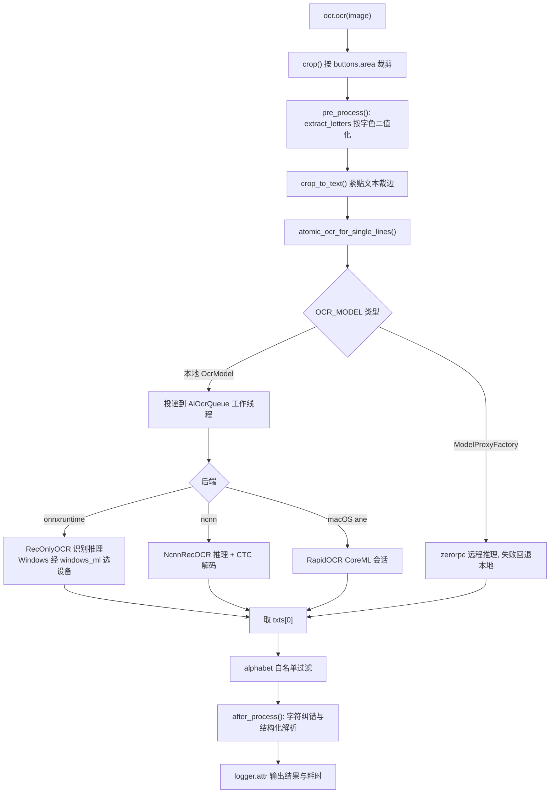

# OCR 系统

> module/ocr：从游戏截图中提取文字与数字的识别层，统一封装区域裁剪、字色预处理、多后端推理与结果纠错。

## 1. 模块概述

游戏自动化的大部分决策依据是屏幕上的文字与数字：资源数量、剩余次数、倒计时、关卡名、商品价格等。本模块把「从截图中读出这些信息」收敛为一组声明式接口：业务代码只声明**识别哪里**（Button 区域）、**是什么**（数字/计数器/时长/自由文本）和**字长什么样**（字母颜色），剩下的裁剪、二值化、推理、纠错全部由框架完成。

模块位于设备层之上、业务模块之下：输入是设备层产出的 1280×720 截图（`np.ndarray`），输出是 `str`/`int`/`tuple`/`timedelta`，供处理器层与各游戏功能模块直接消费。

设计上有三个关键决策：

1. **识别器与推理引擎分离**。`Ocr` 系列类负责「识别哪里、怎么预处理、结果怎么修正」，`AlOcr` 负责模型加载与推理，两者通过 `OCR_MODEL` 全局入口解耦。业务代码永远不接触后端细节，后端（ONNX Runtime / ncnn / 远程 RPC）可整体替换。
2. **按字色预处理而非直接灰度识别**。游戏 UI 文字带描边、渐变和复杂背景，直接识别噪声大。先用已知字色（默认白色）把文字提取为「黑字白底」二值图，再送入模型，大幅提高对比度并屏蔽背景干扰，让一套通用识别模型能覆盖所有 UI 场景。
3. **面向已知区域优化**。碧蓝航线的识别目标几乎都是位置固定的单行文本（已由 Button 定义区域），因此本地推理默认跳过文本检测模型、只加载识别模型（`RecOnlyOCR`），节省内存与加载时间；检测流水线（`det()`）作为框架能力保留但业务侧当前无调用方。

统一使用 PP-OCRv6 系列识别模型（lite/standard/pro 三档），各语言逻辑模型通过不同字典区分输出空间；旧版 AlOCR 专用模型（英文 `alocr_en_v2_6`、简中 `alocr_cn_v3`）作为 `auto` 档默认值保留。

## 2. 模块职责

### 负责

- 定义 `Ocr`、`OcrYuv`、`Digit`、`DigitCounter`、`Duration` 及对应 Yuv 变体等识别器类与结果后处理（纠错映射、计数器/时长解析）。
- 管理识别模型的懒加载、按后端+设备+版本组合的缓存，以及空闲期分级释放。
- 封装 ONNX Runtime（RapidOCR）与 NCNN 双后端，及 Windows（DirectML/QNN/OpenVINO）、macOS（CoreML ANE）、ncnn（Vulkan）的设备选择。
- 提供 zerorpc 分布式推理的客户端代理与服务器实现（可选部署）。
- 提供 OCR 基准测试所需的基础设施配合（`OcrSettings`、模型工厂）。

### 不负责

- 截图采集与设备管理（见[设备层](device.md)）。
- 识别区域的资源定义（`assets/**/OCR_*.png` 是区域资源，归[基础层](base/index.md)的 Button 体系）。
- 识别结果的业务语义判断（如「剩余次数为 0 就停止」），由调用方完成。
- OCR 模型训练与 ncnn 转换（转换工具在 `dev_tools/ocr_ncnn_convert`，属开发工具）。

## 3. 模块位置

```text
module/ocr/
├── ocr.py          # 识别器类：Ocr/OcrYuv/Digit/DigitCounter/Duration 及 Yuv 变体
├── models.py       # OCR_MODEL 全局入口：6 个逻辑模型的懒加载集合
├── al_ocr.py       # AlOcr 统一推理接口：RapidOCR/ONNX 后端、模型缓存、单线程队列
├── ncnn_ocr.py     # NCNN 识别后端：模型规格、Vulkan GPU、CTC 解码
├── windows_ml.py   # Windows 平台 ONNX Runtime 执行提供程序（EP）选择
└── rpc.py          # zerorpc 客户端代理（ModelProxyFactory）与服务器进程

bin/ocr_models/     # 模型文件（非代码）
├── ppocr-v6/       # PP-OCRv6 识别模型三档（tiny/small/medium）+ 各字典
├── det/            # PP-OCRv6 检测模型三档，仅 det() 场景使用
├── ncnn/           # 由 ONNX 识别模型转换的 ncnn 版本（param/bin 成对）
├── azur_lane/      # 旧版 AlOCR v2.6 英文模型（可选，仅 ONNX 后端）
└── zh-CN/          # 旧版 AlOCR v3 简体中文模型（可选，仅 ONNX 后端）
```

| 文件 | 作用 |
| --- | --- |
| `ocr.py` | 业务入口：识别器类定义、预处理、后处理纠错 |
| `models.py` | `OCR_MODEL` 懒加载入口，按语言上下文选择逻辑模型 |
| `al_ocr.py` | 推理核心：模型工厂与缓存、OCR 工作队列、ONNX/NCNN 分派、文本检测 |
| `ncnn_ocr.py` | NCNN 后端：模型规格、预处理、推理与 CTC 解码 |
| `windows_ml.py` | Windows 平台 ONNX Runtime 设备选择（DirectML/QNN/OpenVINO EP） |
| `rpc.py` | OCR RPC 代理（客户端）与 zerorpc 服务器 |

## 4. 核心入口

| 入口 | 用途 |
| --- | --- |
| `from module.ocr.ocr import Ocr / Digit / DigitCounter / Duration` | 业务构造识别器的唯一常规入口（含 `*Yuv` 变体） |
| `OCR_MODEL.<lang>` | 框架内获取 `AlOcr` 实例；导入时按部署配置决定本地模型或 RPC 代理 |
| `AlOcr(config=…, settings=…)` | 框架内部（models.py、ocr_benchmark）直接构造；业务代码不应使用 |
| `release_ocr_models()` / `reset_ocr_model()` | 空闲释放内存 / 配置变更后重置模型缓存 |
| `python -m module.ocr.rpc --port <port>` | 独立进程启动 OCR RPC 服务器 |
| `alas.py` 的 `benchmark/ocr_benchmark` 任务 | 全量精度与速度基准 |

追代码建议从 `module/ocr/ocr.py` 的 `Ocr.ocr()` 开始：它串起了预处理、后端调用与后处理全链路。

## 5. 核心组件

### 识别器类选择指南

| 类 | 默认 alphabet | 返回值 | 典型场景 |
| --- | --- | --- | --- |
| `Ocr` | 无限制 | `str`（多区域为列表） | 通用文本：关卡名、舰船名、海域名 |
| `Digit` | `0123456789IDSB` | `int`（空结果为 0） | 资源数量、等级、次数 |
| `DigitCounter` | `0123456789/IDSB` | `(current, remain, total)` | `14/15` 形式计数器；仅支持单区域 |
| `Duration` | `0123456789:IDSB` | `timedelta` | `01:30:00` 形式剩余时间 |
| `OcrYuv / DigitYuv / DigitCounterYuv / DurationYuv` | 同对应基类 | 同基类 | 字色非白或 RGB 色差提取不稳定的场景（如商店金色价格），改用 Y 通道亮度差 |

### Ocr 基类关键字段

| 字段 | 类型 | 说明 |
| --- | --- | --- |
| `buttons` | Button / area 元组 / 列表 | 识别区域；多区域一次返回列表 |
| `lang` | str | 逻辑模型名；`azur_lane` 在日服运行时自动切换为 `azur_lane_jp` |
| `letter` | RGB 元组 | 字母颜色，默认 `(255, 255, 255)` 白色有快速路径 |
| `threshold` | int | 色差容差与对比度放大系数（255/threshold），默认 128 |
| `alphabet` | str | 推理后的字符白名单（后置过滤），None 不过滤 |
| `SHOW_LOG` | bool | 类属性；是否用 `logger.attr` 输出每次结果与耗时 |
| `SHOW_REVISE_WARNING` | bool | 类属性；是否记录数字纠错告警，默认关闭 |

### 推理层组件

| 组件 | 职责 |
| --- | --- |
| `OCR_MODEL`（`models.py`） | 全局单例。`UseOcrServer=false` 时是 `OcrModel`（6 个 `cached_property` 懒加载 `AlOcr`），为 `true` 时替换为 `ModelProxyFactory` RPC 代理。选择发生在模块导入时 |
| `AlOcr`（`al_ocr.py`） | 统一推理接口：`ocr()` 单行识别、`det()` 检测+识别、`ocr_for_single_lines()` 批量识别；`atomic_ocr*` 系列附加字母白名单过滤 |
| `OcrSettings` | 单个逻辑模型的有效配置快照（backend/device/厂商 EP 开关/模型档位），不可变，缓存键的一部分 |
| `RecOnlyOCR` | 只加载识别模型的 RapidOCR 子类，跳过检测与分类 |
| `DetOnlyOCR` | 只加载检测模型，供 ncnn 后端的混合流水线使用 |
| `NcnnRecOCR`（`ncnn_ocr.py`） | NCNN 识别推理：输入 3×48×320，CTC 解码，支持 Vulkan GPU |
| `create_onnx_session`（`windows_ml.py`） | Windows 上按优先级选择执行提供程序（EP）并创建 ONNX Runtime 会话 |
| `ModelProxyFactory` / `ModelProxy`（`rpc.py`） | OCR 服务器的 RPC 代理与自动回退 |

### 逻辑模型与语言对应

| `lang` | 用途 | 字典 | auto 档默认模型 |
| --- | --- | --- | --- |
| `azur_lane` | 游戏 UI 数字/字母/符号的默认入口 | 受限 en 字典（过滤非英文输出） | `alocr_en_v2_6`（旧版专用，仅 ONNX） |
| `azur_lane_jp` | 日服运行时的 azur_lane 入口 | 受限 en 字典 | `standard`（PP-OCRv6 small） |
| `ppocr_v6` | 通用文本 | 全量字典 | `standard` |
| `cnocr`（实际名 `cn`） | 中文及中文 UI 的非标准字体数字 | 全量字典 | `alocr_cn_v3`（旧版专用，仅 ONNX） |
| `jp` | 日文文本 | 全量字典 | `standard` |
| `tw` | 繁体中文文本 | 全量字典 | `standard` |

所有 lite/standard/pro 档共用 PP-OCRv6 识别模型（tiny/small/medium），仅字典不同；`azur_lane` 系列使用受限 en 字典把非英文输出静默过滤，避免把装饰性文字误识别为中文。日服运行时 `Ocr.__init__` 自动把 `azur_lane` 切到 `azur_lane_jp`。

## 6. 工作流程

以 `DigitCounter.ocr(image)` 识别 `14/15` 为例的完整链路：



各阶段要点：

1. **裁剪**：`buttons` 归一化为 area 列表后逐个 `crop(image, area)`；`direct_ocr=True` 时跳过裁剪直接对整图预处理（少数整图场景使用）。
2. **字色提取**：`extract_letters(image, letter, threshold)` 输出「文字黑、背景白」的灰度图。白色字走快速路径（RGB 取最小分量再取反）；其他字色按逐通道色差计算。`threshold` 决定色差判定容差与放大倍率——色差不超过 `threshold` 的像素视为文字并线性拉伸，超出部分饱和，因此阈值越小对比度放大越强。
3. **紧贴裁剪**：`crop_to_text()` 去掉二值图四周空白，减小推理输入尺寸，同时消除区域框不精确带来的白边。
4. **推理**：本地路径把任务封装为 `_OcrJob` 投入队列，由单一工作线程（`AlOcrQueue`）串行执行，模型按 `(名称, OcrSettings)` 缓存懒加载；`RecOnlyOCR` 跳过检测/分类模型，仅加载识别模型。Windows 上 RapidOCR 自建的 CPU session 会被替换为 `windows_ml.create_onnx_session()` 选定的 DirectML/QNN/OpenVINO 设备；macOS Apple Silicon 以 `ane` 设备启用 CoreML。
5. **后处理**：先按 `alphabet` 过滤掉白名单外字符，再交给子类 `after_process()` 做纠错与结构化。

**Digit 纠错映射**：数字场景下模型常把 `1/0/5/8` 识别为形近字母，统一替换 `I→1`、`D→0`、`S→5`、`B→8`。`alphabet` 默认值特意包含 `IDSB`，让这些形近字符能通过过滤存活到纠错阶段，而不是被直接丢弃。`Digit` 将空结果安全转为 `0`。

**DigitCounter 解析**：正则 `(\d+)/(\d+)` 提取当前值与总数，`current` 截断到不超过 `total`（容忍误识别出超量数字），返回 `(current, total - current, total)`；匹配失败记 warning 并返回 `(0, 0, 0)`，由上层逻辑通过重试或状态检查消化。

**Duration 解析**：正则 `(\d{1,2}):?(\d{2}):?(\d{2})` 兼容有/无冒号的时分秒，返回 `timedelta`；解析失败返回 0 时长。

**性能量级参考**：每次 `Ocr.ocr()` 的耗时随结果以 `logger.attr`（`名称 耗时s`）输出。基准工具按 <5/10/20/40/80/150/300 ms 把单帧推理评为 Insane Fast 至 Ultra Slow 共八档，可见工程预期中单次识别处于几十毫秒（GPU/ncnn）到一二百毫秒（CPU）量级；首次调用因懒加载模型显著偏慢。

## 7. 调用关系

### 上游

| 模块 | 关系 |
| --- | --- |
| 几乎全部游戏功能模块（campaign、commission、research、shop、dorm、os、island、statistics 等） | 构造 `Ocr` 系列识别器读取界面数值与文本，多数以业务子类形式定制后处理 |
| [设备层](device.md) | 首次连接设备时运行简单 OCR 基准自动选定 `OcrDevice`，之后 `reset_ocr_model()` 重置缓存 |
| [基础层](base/index.md) | `module/base/resource.py` 在调度空闲期调用 `release_ocr_models()` 分级释放模型 |
| `module/api`（lifecycle） | WebUI 启动时按部署配置拉起/停止 OCR 服务器子进程（详见 [WebUI 运行时](webui/runtime.md)） |
| `module/daemon/ocr_benchmark.py` | 以动态 `model_name` 直接构造 `AlOcr` 跑精度/速度基准（见 [守护模式](infra/daemon.md)） |

### 下游

| 模块 | 用途 |
| --- | --- |
| `module/base/utils.py` | `extract_letters()`、`crop_to_text()`、`rgb2luma()` 等预处理算法 |
| `module/config/config.py` | 读取 `OcrBackend/OcrDevice/OcrModelVersion*` 配置并解析设备（`resolve_ocr_device`） |
| `module/runtime/setting.py` | 读取部署配置 `UseOcrServer` 等决定本地/远程模式 |
| `module/exception.py` | 依赖加载失败抛 `RequestHumanTakeover` |
| 第三方 | rapidocr（RapidOCR 流水线与 CTC 解码）、onnxruntime、ncnn、windowsml（Windows ML 运行时，仅 Windows） |

## 8. 数据流

```text
设备层截图 (np.ndarray, 1280×720 RGB)
  └─> Ocr.ocr()
        ├─ crop(image, area)                     # 按 Button 区域裁剪
        ├─ extract_letters(letter, threshold)    # 按字色二值化 → 黑字白底灰度图
        ├─ crop_to_text()                        # 紧贴文本裁边，缩小推理输入
        ├─ atomic_ocr_for_single_lines()
        │     ├─ 本地: numpy 原图 → AlOcrQueue → ONNX/ncnn 推理 → txts[0]
        │     └─ RPC:  img.dumps() pickle 序列化 → zerorpc → 服务器推理 → 结果字符串
        ├─ alphabet 白名单过滤
        ├─ after_process() 纠错与结构化
        └─> str / int / (current, remain, total) / timedelta → 业务逻辑

副产物: ocr_debug/*.png（预处理后图像 + 结果命名，保留 100 张）
```

数据在模块内的两次关键转换：一是色彩空间层面的「字色→二值」（`extract_letters` 或 Yuv 的亮度差），它决定模型看到的输入质量；二是字符串层面的「原始文本→结构化数值」（纠错映射与正则解析），它决定业务代码拿到的类型。

## 10. 配置

用户可见配置位于任务 `Optimization` 组（`config/template.json` 与 `module/config/argument/argument.yaml` 同名），代码经封装属性访问：

| 配置 | 类型 | 默认值 | 说明 |
| --- | --- | --- | --- |
| `Optimization.OcrBackend` | 选项 | auto | `auto`/`onnxruntime`/`ncnn`；auto 解析为 onnxruntime |
| `Optimization.OcrDevice` | 选项 | auto | `auto`、`qnn_npu`、`openvino_npu`、`openvino_gpu`、`gpu`（DirectML）、`openvino_cpu`、`cpu`、`ane` |
| `Optimization.OcrWindowsMlVendorEp` | checkbox | true | 允许 Windows ML 经 Windows Update 安装并注册 QNN/OpenVINO 厂商 EP |
| `Optimization.OcrModelVersionEnglish` | 选项 | auto | 英文模型档位：auto（→ alocr_en_v2_6）/lite/standard/pro/alocr_en_v2_6 |
| `Optimization.OcrModelVersionChinese` | 选项 | auto | 中文档位：auto（→ alocr_cn_v3）/lite/standard/pro/alocr_cn_v3 |
| `Optimization.OcrModelVersionJapanese` | 选项 | auto | 日文档位：auto（→ standard）/lite/standard/pro |
| `Optimization.OcrModelVersionTraditionalChinese` | 选项 | auto | 繁中档位，同上 |

访问方式：`self.config.Optimization_OcrBackend`；框架内部统一经 `AzurLaneConfig` 的封装属性 `config.ocr_backend`、`config.ocr_device`、`config.ocr_model_version(name)` 读取。

**配置关联**：

- `ocr_device` 的解析依赖 `ocr_backend`（`resolve_ocr_device`）：`auto` 在 ONNX 后端下按平台解析——macOS Apple Silicon → `ane`；Windows → 交给 Windows ML 候选链；其他平台检测显存 ≥1GB 则 `gpu` 否则 `cpu`。ncnn 后端 → 检测 Vulkan GPU 决定 `gpu`/`cpu`。
- QNN/OpenVINO 系设备值仅对 ONNX Runtime 后端有效，选 ncnn 时强制回退 `cpu`。
- ncnn 后端只有 PP-OCRv6 三档，用户选择了旧版 `alocr_*` 档位时回退 `standard`。
- `Optimization.OcrDevice == 'auto'` 时，设备实例启动会跑一次简单基准（GPU 准确率 100% 才用 GPU），结果回写配置。

部署配置（`deploy/config.py`，与任务配置不同体系）：

| 配置 | 默认值 | 说明 |
| --- | --- | --- |
| `UseOcrServer` | false | 实例改用 RPC 访问共享 OCR 服务器而非进程内推理 |
| `StartOcrServer` | false | WebUI 启动时拉起 OCR 服务器子进程 |
| `OcrServerPort` | 22268 | 服务器监听端口 |
| `OcrClientAddress` | 127.0.0.1:22268 | 实例连接地址 |

## 11. 异常与错误处理

| 异常 | 原因 | 处理 |
| --- | --- | --- |
| `RequestHumanTakeover` | RapidOCR/onnxruntime 依赖加载失败（缺 VC++ 运行库、GPU 加速不兼容） | `handle_ocr_error()` 输出排查指引（装运行库、关 GPU 加速）后上抛，调度器请求人工接管，不自动恢复 |
| `ValueError` | 逻辑模型名或 ncnn 档位不受支持 | 编码期错误，直接上抛 |
| `FileNotFoundError` | ncnn 模型文件缺失 | 构造模型时抛出，由上层按启动失败处理 |
| `RuntimeError` | ncnn 加载/推理返回码非 0、请求 Vulkan 但无 GPU | 上抛终止当前任务 |
| OCR 结果解析失败 | `DigitCounter` 未匹配 `x/y`、`Duration` 无法解析时间 | 记 warning 并返回安全默认值 `(0,0,0)` / `timedelta(0)`，由上层状态循环自然重试 |
| RPC 调用异常 | OCR 服务器不可达 | `ModelProxy.online` 置 False，本次及之后永久回退进程内本地推理 |
| 调试图保存失败 | 磁盘写入异常 | 仅 warning，不影响识别流程 |

## 12. 并发与线程模型

OCR 推理的线程模型围绕「模型实例非线程安全」这一前提设计：

- **AlOcrQueue 工作线程**：进程级单例守护线程（`_ensure_ocr_worker` 首次使用时创建，受 `_ocr_worker_lock` 保护），串行消费 `queue.Queue` 中的 `_OcrJob`。所有本地推理（模型创建、使用、释放）都经 `_run_ocr_queued()` 排队执行；工作线程内的调用直接执行以避免自死锁。调用方线程阻塞在 `job.done` 上等待结果，异常带原 traceback 在调用方重抛。
- 之所以强制单线程：同一 ONNX/ncnn 会话并发推理不安全，且模型缓存必须在同一线程内「获取—使用—释放」才能与 `reset_ocr_model()` 保持一致；重置后实例上的旧模型引用会被 `_ensure_loaded()` 刷新，杜绝使用已释放模型。
- **多实例隔离**：每个调度实例是独立进程，拥有各自的队列与模型缓存，互不影响。显式传入 `config`/`settings` 的 `AlOcr`（如基准测试）可绕过全局默认配置。
- **ncnn GPU 全局实例**：Vulkan GPU 实例由 `_gpu_lock` 保护创建，`atexit` 时销毁。
- **Windows ML EP 注册**：`windows_ml.py` 用 `_provider_lock` 保证厂商 EP 只初始化与注册一次。
- **RPC 模式**：`ModelProxy.client` 与 `online` 为类属性，全进程共享一条 zerorpc 连接；`ModelProxyFactory` 在首次属性访问时惰性建连。RPC 模式下不使用 AlOcrQueue（推理在服务器进程）。
- **生命周期**：工作线程为 daemon 线程随主进程退出；OCR 服务器子进程由 WebUI 生命周期（`module/api/lifecycle.py`）统一停止。

## 13. 缓存与持久化

| 缓存 | 位置 | 生命周期 |
| --- | --- | --- |
| 逻辑模型属性 | `OcrModel` 的 `cached_property`（进程内存） | 首次访问创建；空闲期由 `release_resources()` 按下一任务用 `del_cached_property` 删除 |
| 推理模型缓存 | `al_ocr._model_cache` / `_det_model_cache`，键为 `(模型名, OcrSettings)` | 按后端/设备/档位组合缓存；`release_ocr_models(names)` 定向释放，`reset_ocr_model()` 全量释放并重读配置 |
| 默认配置快照 | `_default_config` | 按 `ALAS_CONFIG_NAME` 环境变量或默认配置名惰性读取；reset 时置空以在下次使用时重读 |
| OCR 调试图 | `ocr_debug/` 目录 | 每次识别写入一张 PNG，超过 100 张按修改时间清理最旧的 |

空闲释放策略（`module/base/resource.py` 的 `release_resources`）：下一任务是大世界/委托时保留全部模型；有后续任务时仅保留 `azur_lane`；完全空闲时释放全部语言模型与独立检测缓存，并触发一次 `gc.collect(2)`。`UseOcrServer` 模式下空闲时改为断开 RPC 连接。

## 14. 生命周期

1. **导入期**：`module/ocr/ocr.py` 被导入时，按 `State.deploy_config.UseOcrServer` 把 `OCR_MODEL` 绑定为本地 `OcrModel` 或 `ModelProxyFactory`，此后不再切换。
2. **构造期**：业务模块构造 `Ocr` 子类实例（轻量对象，仅记录区域与参数）；`AlOcr` 实例由 `OCR_MODEL` 创建但尚不加载模型。
3. **首次识别**：第一次 `.ocr()` 触发——启动 AlOcrQueue 线程、读取有效配置（显式 config > 环境变量指定的默认配置）、按配置快照创建并缓存推理模型。Windows 上此时完成 EP 选择与（可选的）厂商 EP 下载注册。
4. **运行期**：识别请求全部串行经过队列；配置热重载或设备重连后调用 `reset_ocr_model()`，下次识别按新配置重建。
5. **释放与退出**：调度空闲期分级释放；进程退出时 daemon 工作线程随之结束，ncnn Vulkan 实例由 atexit 销毁，OCR 服务器子进程由 WebUI clearup 终止。

## 15. 扩展方式

**新增业务识别器**（最常见）：继承 `Ocr`/`Digit`/`DigitCounter`/`Duration`，按需覆盖 `pre_process`（特殊底色）或 `after_process`（结果修正），必要时改 `letter`/`threshold`/`alphabet`。仓库已有大量范例，如 `OcrDataKey`（修正 `1560`→`15/60`）、`PercentageOcr`（百分比文本）、`PriceOcr`（Yuv 金色价格）。

**新增逻辑模型/语言**，需同步多处：

1. `al_ocr.py` 的 `ONNX_MODEL_PARAMS` 增加条目（各档模型路径+字典），并在 `DEFAULT_ONNX_MODEL_VERSION` 设默认档。
2. `ncnn_ocr.py` 的 `MODEL_SPECS` 增加映射（复用现有 ncnn 文件时只需加键）。
3. `models.py` 的 `OcrModel` 增加 `cached_property`。
4. `rpc.py` 中 `ModelProxyFactory` 的白名单列表加入同名条目。
5. 视需要在 `module/base/resource.py` 的释放名单中登记。

**新增识别模型文件**：ONNX 模型与字典放 `bin/ocr_models/ppocr-v6/`；ncnn 版本用 `uv run python -m dev_tools.ocr_ncnn_convert` 从 ONNX 转换生成。注意字典类别数必须与模型档位对齐。

**新增推理后端**：在 `OcrSettings.from_config`/`_create_ocr` 增加分支，并在 `resolve_ocr_device` 中定义该后端的设备解析规则。

## 16. 修改注意事项

- **字典与模型档位必须对齐**：PP-OCRv6 tiny（lite）类别数与 small/medium（standard/pro）不同，字典文件分别配套；受限 en 字典是「把非英文类别清空」的技巧，模型不变、仅字典变。改动任一侧都要两侧同时核对。
- **不要绕过 OCR 队列**：模型的使用与释放必须经 `_run_ocr_queued`，直接调用 `_ocr_direct` 或长期持有 `.model` 引用会与 `reset_ocr_model()` 产生竞态。
- **Windows 上禁止启用 RapidOCR 自带 DirectML**（代码固定 `use_dml=False`）：设备必须经 `windows_ml.py` 精确选择，否则可能绑定到会热插拔的虚拟显示器适配器（远程屏/模拟器虚拟屏），运行中会话失效导致任务崩溃。
- **`alphabet` 是推理后的字符过滤**，不能提升模型输出上限；真正的输出空间由字典文件决定。数字识别保留 `IDSB` 字符再纠错是刻意设计，收紧 alphabet 到纯数字反而会让形近字母被过滤成空结果。
- **`lang='azur_lane'` 在日服自动切 `azur_lane_jp`**：按服务器语言写死 lang 的代码要意识到这个隐式切换。
- **解析失败返回安全默认值是契约**：`Digit` 空结果返回 `0`、`DigitCounter` 返回 `(0,0,0)`、`Duration` 返回 0 时长，上层逻辑（如循环重试）依赖这些行为，不要改成抛异常。
- **`OCR_MODEL` 的本地/RPC 选择发生在导入期**，切换 `UseOcrServer` 需要重启进程。
- 文档性注释与实现可能漂移：`models.py` 的模块注释称所有逻辑模型统一 PP-OCRv6，而 `al_ocr.py` 的 `DEFAULT_ONNX_MODEL_VERSION` 实际让英文/简中的 auto 档默认使用旧版专用模型。以 `al_ocr.py` 与 `bin/ocr_models/README.md` 为准。

## 17. 已知限制

- **调试图无条件写盘**：本地推理的每次识别都会向 `ocr_debug/` 写一张 PNG（保留 100 张），7×24 运行下是持续的磁盘 IO；文本检测有 `DET_DEBUG` 开关而单行识别没有对应开关。
- **RPC 单向回退**：`ModelProxy` 一旦连接失败即永久 `online=False` 回退本地，不会自动重试服务器；服务器恢复需重建代理。
- **pickle 传输**：RPC 图像序列化用 pickle，仅适合本机或可信内网。
- **首次调用延迟高**：模型懒加载意味着进程启动后的第一次 OCR 需承担模型初始化耗时。
- **ncnn 后端功能面窄**：仅支持识别推理（检测走 ONNX 混合流水线），不支持旧版 `alocr_*` 模型档位；厂商 NPU/GPU 设备值对 ncnn 无效。
- **检测模型冗余**：`det/` 目录有 tiny/small/medium 三档检测模型，代码当前只引用 tiny；`AlOcr.det()` 无业务调用方，属保留能力。
- **依赖崩溃不可自愈**：OCR 依赖（onnxruntime/rapidocr/ncnn 等）导入失败直接 `RequestHumanTakeover`，需要用户安装运行库或调整加速配置后手动恢复。

## 18. 示例

业务侧最小用法（识别商店库存 `12/30` 与体力恢复倒计时）：

```python
from module.ocr.ocr import DigitCounter, Duration

# 单区域计数器：返回 (current, remain, total)
STOCK = DigitCounter(STOCK_COUNTER, name='Stock')
current, remain, total = STOCK.ocr(image)

# 时长：返回 timedelta
TIMER = Duration(OCR_TIMER, name='Timer')
remaining = TIMER.ocr(image)  # timedelta 对象

# 特殊字色：YUV 通道提取，适配深色背景上的金色数字（参考 os_shop 的 PriceOcr）
from module.ocr.ocr import DigitYuv
PRICE = DigitYuv(PRICE_AREA, letter=(255, 223, 57), threshold=32, name='Price')
price = PRICE.ocr(image)
```

框架侧后处理扩展（业务子类修正常见误识别）：

```python
class OcrDataKey(DigitCounter):
    def after_process(self, result):
        # 模型偶发把 15/60 连读成 1560，在末尾补回斜杠
        result = super().after_process(result)
        return re.sub(r'(\d{1,2})60$', r'\1/60', result)
```

## 19. 调试方法

- **识别结果与耗时**：每次 `ocr()` 经 `logger.attr` 输出 `名称 耗时 结果`，是排查识别异常的第一入口；将识别器 `SHOW_LOG = False` 可降噪。
- **送入模型的图像**：本地推理自动把预处理后的图像存入 `ocr_debug/`（保留最新 100 张），文件名含模型名与识别结果，可直接核对预处理质量。
- **纠错可视化**：`Ocr.SHOW_REVISE_WARNING = True` 会记录每次数字纠错的前后值。
- **基准测试**：`alas.py` 的 `benchmark/ocr_benchmark` 任务对 azur_lane/azur_lane_jp/cn 三个模型跑数据集精度与平均耗时（Rich 表格输出）；首次连接设备时 `Optimization_OcrDevice=auto` 会自动跑单模型基准并回写 `OcrDevice`（见[守护模式](infra/daemon.md)）。
- **模型与设备问题**：日志中 `[OCR] Windows ML 选择 …`、`[OCR-NCNN] 已加载ncnnOCR模型 …` 说明实际选用的设备；加载失败按提示安装 VC++ 运行库或关闭 GPU 加速。
- **设置缓存行为**：`tests/test_ocr_settings.py` 覆盖模型缓存的懒加载、按配置隔离与线程串行化，改动 `al_ocr.py` 后先跑 `uv run python -m unittest tests.test_ocr_settings`。

## 20. 相关模块

- [设备层](device.md)：提供 OCR 的输入截图；首启基准自动选定 OCR 设备并重置模型。
- [基础层](base/index.md)：`extract_letters`/`crop_to_text` 等预处理工具与 `cached_property`/资源释放机制。
- [处理器层](handler.md)：弹窗与界面处理中大量依赖 `Digit/DigitCounter` 读取状态数值。
- [配置系统](config.md)：`Optimization` 组的 OCR 后端/设备/模型版本配置及其解析。
- [调度器（alas.py）](entry/alas.md)：空闲期调用资源释放，保留或回收 OCR 模型。
- [守护模式](infra/daemon.md)：`OcrBenchmark` 全量基准所在位置。
- [UI 导航](ui.md)：页签索引确认等场景通过 OCR 读取界面索引。
