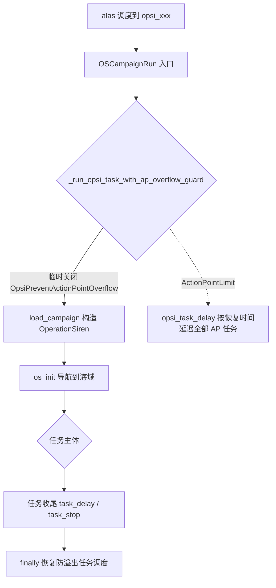

# 大世界核心 module/os

> Operation Siren（大世界）的任务编排与地图引擎：球面/海域双视图导航、行动力与硬币经济、智能调度+ 的统一实现。

## 1. 模块概述

大世界是碧蓝航线中的开放世界模式：一张由约 22 个区域组成的全球地图（globe），每个区域是一张独立的网格海域（map）。它在技术上同时具备两套系统的复杂度——既要像战役模块那样做网格地图识别与舰队行走，又要管理一套独有的资源系统（行动力 AP、黄币/紫币、侵蚀等级、隐秘/深渊/要塞等特殊海域），还要应对每月重置带来的周期性任务循环。

`module/os` 是这套机制的核心：它把「海域地图」与「球面地图」统一成一个可编程的导航空间（`globe_goto(zone)` 即可跨区域移动），把行动力/硬币的检查、购买、保留策略收敛到 `ActionPointHandler` 与 `CoinTaskMixin`，并实现了一个面向 7×24 运行的任务协调器——**智能调度+**（`OpsiScheduling`）：黄币不足时代理执行补币任务、行动力接近上限时提前消耗、月末清理行动力，全部在一个决策循环里完成。

架构上有三个显著特征：

- **浅包深链**。`module/os` 顶层文件各自是一个能力层（相机、球面、舰队、雷达），通过多继承组合成 `OSMap`；17 个具体玩法任务放在 `tasks/` 子目录，全部继承 `OSMap` 获得完整导航能力。
- **一切任务可被代理**。任意 os 任务都能以 `opsi_task_context` 临时身份由 `OpsiScheduling`（或防溢出任务）代跑一轮，配置归属与统计数据仍记到子任务名下——这是智能调度+ 能统一「侵蚀 1 练级、耄耋相接、隐秘海域……」而不破坏各自调度记录的机制基础。
- **与战役模块共享底座**。`OSMap` 继承 `Map`（寻路）与 `Combat`（战斗），用 `OSGrid` 替换感知格子、用固定单应性参数替代动态标定，因此地图/战斗系统的改进自动惠及大世界。

## 2. 模块职责

### 负责

- 大世界初始化 `os_init()`：进入海域视图、识别当前区域、健康状态重置、决定是否执行首次自律寻敌。
- 海域间导航 `globe_goto(zone, types)`：球面图选区、类型筛选（SAFE/DANGEROUS/OBSCURE/ABYSSAL/STRONGHOLD/ARCHIVE）、进入目标海域。
- 自律寻敌 `run_auto_search()` 与全图重扫 `map_rescan()`：清理当前海域敌人、问号、扫描装置、明石商店、双舰队机关。
- 舰队维护：血量监控与撤退判定、港口修理 `fleet_repair`、士气恢复、EMP 处理、`limit_walk` 曼哈顿步数约束。
- 行动力（AP）机制：检查、油箱购买、`ActionPointLimit` 语义、自然恢复防溢出。
- 黄币/紫币读取与保留策略（`CoinTaskMixin`），补黄币任务的选派与代理执行。
- 智能调度+ `OpsiScheduling`：决策循环、月末清理、代理上下文 `task_context`。
- 17 个玩法任务的编排：日常、商店、兑换、耄耋相接、侵蚀 1 练级、隐秘、深渊、要塞、档案、月度 Boss、每月开荒、跨月重置等。

### 不负责

- 战斗内部的技能/结算细节——由[战斗系统](../combat.md)与本包 `OSFleet` 的覆写配合完成。
- 网格感知与雷达小地图的像素级识别——`OSGrid`/`Radar` 的实现见[地图系统与检测](../map.md)，本包只消费。
- 余烬信标/META 页面流程（`os_ash`）、商店货架策略（`os_shop`）、弹窗事件处理（`os_handler`）——见[大世界辅助模块](auxiliary.md)。
- 任务调度的「何时运行」决策——`Scheduler.*` 与[调度器](../entry/alas.md)负责，本包只负责任务内的延迟申请。
- 岛屿系统、主线战役等其他玩法。

## 3. 模块位置

```
module/os/
├── operation_siren.py   # OperationSiren：全部任务类的最终组合体
├── map.py               # OSMap：主控类（导航/寻敌/维修/重扫）
├── fleet.py             # OSFleet：行走、血量、Boss 战
├── globe_operation.py   # GlobeOperation：球面图操作（选区/钉住/进出）
├── globe_camera.py      # GlobeCamera：球面相机与聚焦
├── globe_detection.py   # GlobeDetection：球面图模板定位
├── globe_zone.py        # Zone / ZoneManager：海域数据与查询
├── camera.py            # OSCamera：海域相机 + 雷达接线
├── radar.py             # Radar/RadarGrid：小地图识别
├── map_base.py          # OSCampaignMap：海域地图定义
├── map_operation.py     # OSMapOperation：进图/区域识别
├── map_fleet_selector.py# 大世界舰队选择
├── dock.py              # DockMixin：船坞选船
├── ocr.py               # SeaMilesOcr / ShipExp 等海里数与经验 OCR
├── config.py            # OSConfig：手动配置常量
└── tasks/               # 17 个玩法任务文件（见第 5 节）
```

| 文件 | 作用 |
| --- | --- |
| `map.py` | 大多数功能的实际宿主：`globe_goto`、`run_auto_search`、`fleet_repair`、`map_rescan` 都在这 |
| `globe_operation.py` | 球面图状态判定：钉住海域、类型选择按钮、`OSExploreError`/`RewardUncollectedError` |
| `globe_zone.py` | `Zone` 数据类（zone_id/侵蚀等级/四服名称/是否港口）与按相机坐标/名称查区 |
| `camera.py` | `OSCamera` 内置一份标定好的球面单应性参数（大世界视角固定，永不重算） |
| `radar.py` | 雷达小地图逐格识别（敌人/资源/问号/Boss/港口），结果合并进 OSGrid |
| `config.py` | `STORY_OPTION=-2`、`MAP_SWIPE_MULTIPLY=(1.174, 1.200)`、`DETECTION_BACKEND` 等覆盖值 |
| `tasks/` | 一个文件一个玩法，类名 `Opsi<Name>`，组合 `OSMap` 或互为组合 |

## 4. 核心入口

任务经[战役执行](../campaign.md)的 `OSCampaignRun` 转发进入（每个入口都套着防溢出守护，见第 6 节）：

| 入口 | 任务 | 说明 |
| --- | --- | --- |
| `OperationSiren`（组合类） | —— | 全部 `Opsi*` 能力的汇聚点，仅用于类型组合与少量通用方法（海域成就、`os_daily` 收尾） |
| `OSMap.os_init()` | 全部任务前置 | 进入海域、识别区域、决定首次自律寻敌 |
| `OpsiScheduling.run_smart_scheduling()` | OpsiScheduling | 智能调度+ 主循环（while + `check_task_switch`） |
| `OpsiHazard1Leveling.run_hazard1_leveling()` | OpsiHazard1Leveling | 侵蚀 1 练级（while + 单轮方法） |
| `OpsiPreventActionPointOverflow.run_prevent_action_point_overflow()` | OpsiPreventActionPointOverflow | 行动力防溢出 |
| `OpsiDaily.os_daily()` 等 `os_*` 方法 | 各玩法任务 | 一轮执行后按各自规则 `task_delay` |

单文件调试遵循各文件 `__main__` 块的模式：`OperationSiren('alas', task='...')` + `merge(OSConfig())` + `os_init()`，可直接脱离调度器在指定任务身份下运行。

## 5. 核心组件

### 类层次（组合关系）

```mermaid
flowchart BT
    ActionPointHandler[ActionPointHandler<br>os_handler] --> GlobeOperation
    GlobeOperation[GlobeOperation<br>球面操作] --> GlobeCamera[GlobeCamera]
    ZoneManager[ZoneManager<br>海域查询] --> GlobeCamera
    GlobeCamera --> OSMap
    Camera[Camera<br>map 模块] --> OSCamera
    OSMapOperation[OSMapOperation] --> OSCamera
    OSCamera --> OSFleet[OSFleet]
    Combat[Combat] --> OSFleet
    Fleet[Fleet] --> OSFleet
    OSAsh[OSAsh] --> OSFleet
    OSFleet --> OSMap[OSMap]
    Map[Map] --> OSMap
    StorageHandler[StorageHandler] --> OSMap
    StrategicSearchHandler --> OSMap
    OSMap --> CoinTaskMixin 组合的各任务
    OSMap --> OperationSiren[OperationSiren<br>全部任务组合]
```

`OSMap(OSFleet, Map, GlobeCamera, StorageHandler, StrategicSearchHandler)` 是「一个实例具备全部大世界能力」的枢纽；`OperationSiren` 再叠加 14 个 `tasks/` 任务类，理论上一个实例可执行任何大世界任务，实际由调度器按任务身份构造。

### tasks/ 任务清单

| 文件 | 类 | 入口方法 | 一句话职责 |
| --- | --- | --- | --- |
| `scheduling.py` | `OpsiScheduling(CoinTaskMixin, OSMap)` | `run_smart_scheduling` | 智能调度+：黄币/AP 决策与子任务代理 |
| `coin_task_mixin.py` | `CoinTaskMixin` | —— | 补黄币任务的公共逻辑（阈值/通知/选派/月末清理） |
| `prevent_action_point_overflow.py` | `OpsiPreventActionPointOverflow(OpsiScheduling)` | `run_prevent_action_point_overflow` | 防行动力自然恢复溢出（每 600 秒 1 点，上限 200） |
| `hazard_leveling.py` | `OpsiHazard1Leveling` | `os_hazard1_leveling` / `run_hazard1_leveling_once` / `os_check_leveling` | 侵蚀 1 练级（120 AP 一轮）与练度检查 |
| `meowfficer_farming.py` | `OpsiMeowfficerFarming` | `run_meowfficer_farming(_once)` | 耄耋相接（指挥喵刷黄币，多种目标海域模式） |
| `daily.py` | `OpsiDaily` | `os_daily` | 大世界日常+：接任务→完成→领成就 |
| `shop.py` | `OpsiShop` | `os_shop` / `perform_port_shop_purchase` | 港口商店扫货（购买流程供智能调度复用） |
| `voucher.py` | `OpsiVoucher` | `os_voucher` | 白票兑换商店 |
| `obscure.py` | `OpsiObscure` | `os_obscure` | 隐秘海域坐标使用与清理 |
| `abyssal.py` | `OpsiAbyssal` | `os_abyssal` | 深渊海域（高侵蚀 Boss） |
| `stronghold.py` | `OpsiStronghold` | `os_stronghold` / `run_stronghold` | 塞壬要塞（双舰队/潜艇配合攻坚） |
| `archive.py` | `OpsiArchive` | `os_archive` | 档案坐标购买与清理（延迟到周三） |
| `month_boss.py` | `OpsiMonthBoss` | `clear_month_boss` | 月度 Boss（适应性预检查 203/203/156） |
| `explore.py` | `OpsiExplore` | `os_explore` | 每月开荒+（逐区解锁，失败重试后抛 `GameStuckError`） |
| `cross_month.py` | `OpsiCrossMonth` | `os_cross_month(_end)` | 等到重置前 10 分钟抢清每日+ |
| `fleet_auto_change.py` | `OpsiFleetAutoChange` | `run()` | 练级队列轮换舰队 |
| `task_context.py` | 上下文管理器 | —— | 代理任务的临时身份与延迟请求（见下） |

### 智能调度+ 的身份机制（tasks/task_context.py）

代理执行的核心问题：`OpsiScheduling` 以自己的配置身份跑 `OpsiHazard1Leveling` 的逻辑时，「当前任务是谁」必须临时换成子任务，否则延迟、统计、日志都记错账。`opsi_task_context` 用一组临时属性完成这件事：

- `config.task` 换成子任务的 `Function`，`config.bind(task_name)` 重新绑定读取路径；
- `_bind_task_override` 记录代理身份（`OSStatus.is_running_cl1_leveling` 等据此判断）；
- `_temporary_attributes` 精确恢复属性的三种先前状态（缺失 / None / 原值），不把三者混为一谈；
- 防溢出任务代理时通过 `prevent_overflow_context` 共享一个 `OverflowDelay` 容器，子任务在代理上下文里申请的 `task_delay` 不立即生效，退出本轮后由防溢出任务统一改写到自己头上。

### 行动力与硬币机制

- 行动力自然恢复每 600 秒 1 点、自然上限 200（`tasks/prevent_action_point_overflow.py` 常量）；月卡与道具购买受月度购买次数限制。
- `ActionPointHandler.handle_action_point(..., avoid_ap_overflow=True)` 在「开箱会溢出」时拒绝开箱，抛 `ActionPointLimit`（携带 `current/total/cost/preserve`，可换算 `delay_minutes`）。
- 黄币读取 `OSStatus.get_yellow_coins()`：OCR 连续两次一致才确认，失败时回退线程安全缓存值（`_cache_lock`）。
- 补黄币决策在 `CoinTaskMixin`：低于 `OpsiScheduling` 保留值时进入补币模式，从启用的补币任务（耄耋相接/隐秘/深渊/要塞）里按推迟时间选一个**代理执行一轮**——不启用子任务自己的调度器，避免任务间抢跑。

### 球面图与海域

- `Zone`：zone_id、侵蚀等级 hazard_level、四服名称、区域方位、是否港口/碧蓝港口。
- `ZoneManager` 提供 `zones`（全部海域表）、`camera_to_zone`、`name_to_zone`（任意服名称均可查）、`zone_nearest_azur_port`。
- `GlobeCamera.globe_update()` 保证进入球面视图并加载 `GlobeDetection`（模板匹配 + 单应性定位相机在全球地图上的位置），`globe_focus_to(zone)` 拖动球面对准目标区，`zone_type_select` 按类型顺序择优进入。
- `OSCamera._view_init()` 直接注入固定标定参数 `load_homography(storage=...)`——大世界 45° 恒定俯视使标定可硬编码，普通地图则需现场标定。

### `OSMap` 关键方法

| 方法 | 说明 |
| --- | --- |
| `os_init()` | 所有任务的前置：强制潜艇每战出击、禁剧情跳过 → 进入海域 → `zone_init`/`hp_reset` → 从特殊海域退出 → 按任务身份决定是否 `run_first_auto_search()`（智能调度+ 会把该决策延后到决策点） |
| `globe_goto(zone, types, refresh, stop_if_safe)` | 跨海域导航的标准路径：特殊海域先退出 → 海域图进球面 → 聚焦/类型选择/进入 → `zone_init` |
| `os_map_goto_globe()` | 包装重试 3 次：`RewardUncollectedError`（探索奖励未领不能离开海域）时先 `run_auto_search(rescan=True, after_auto_search=False)` 再试；禁用 after_auto_search 防止递归退出海域 |
| `run_auto_search(question, rescan, after_auto_search, interrupt)` | 自律寻敌主循环：drop 统计上下文内跑战斗、清问号、按 `rescan` 重扫（`current`/`full`），特殊任务可整体关闭 |
| `map_rescan(rescan_mode)` | 全图重扫：明石商店、扫描装置、伐木塔、双舰队机关（`ALREADY_SOLVED_MAP_EVENTS` 集合去重） |
| `fleet_repair()` / `port_goto()` | 港口维修与「走不动就换港口绕路」的容错包装 |
| `boss_clear()`（`fleet.py`） | 月度/要塞 Boss 的多舰队轮换攻击，`limit_walk` 限制单次行走曼哈顿距离 ≤3 格 |

## 6. 工作流程

### 一个任务的完整生命周期



### 智能调度+ 决策循环

`run_smart_scheduling()` = `while True: run_smart_scheduling_once(); check_task_switch()`。单轮决策优先级：

1. **开荒拦截**：`is_in_opsi_explore()`（OpsiExplore 已启用且 next_run 早于重置前 12 小时）→ 延迟到服务器刷新。
2. **月末清理**（若启用）：总行动力高于保留值时先清行动力；月底最后一天行动力不足则 2 小时后重查。
3. **黄币判定**：黄币低于保留值或补币态激活 → 走补币分支（`_dispatch_coin_task` 代理执行一轮补币任务）；黄币充足 → 恢复侵蚀 1 练级（CL1）。
4. **AP 判定**：总行动力低于 CL1 保留 → 考虑执行耄耋相接或按恢复时间延迟；触发阈值通知。
5. 无事可做 → `task_delay` 到行动力恢复时间或服务器刷新。

代理执行用 `_run_with_opsi_task_context(任务名, 函数)`：临时换身份 → 调用子任务的 `run_*_once` → 恢复身份。`ActionPointLimit` 在代理层被翻译为「达到保留值，正常返回」。

### 防溢出任务（OpsiPreventActionPointOverflow）

继承 `OpsiScheduling` 但方向相反：它自己不消耗行动力，而是**在其他任务运行时被临时关闭**（`os_run.py` 的 guard：`cross_set` 关 Enable → 运行任务 → finally 里按当前 AP 重算下次运行时间并重新启用）。它自身运行时按「距上限的分钟数 = (上限 − 当前 AP) × 600 秒」排期，到达上限后以当前真实 AP 代跑一轮目标任务（智能调度+ / 侵蚀 1 / 耄耋相接），把行动力压到下限。代理上下文里的 `TaskEnd` 延迟请求会被截获改写到防溢出任务自身，保证子任务的延迟意图不丢失。

### 跨月重置

`os_cross_month` 在重置前 ≤10 分钟进入等待循环（分段 sleep，最长 60 秒/次，不用状态循环禁令例外——这里确实没有画面可判断），重置后以 `is_in_opsi_explore = false_func` 覆盖探索判断、强制开随机事件，抢在月度成就结算前清完每日+。失败兜底 `os_cross_month_end` 延迟到下次重置前 10 分钟。

## 7. 调用关系

### 上游

| 模块 | 关系 |
| --- | --- |
| [战役执行](../campaign.md) | `OSCampaignRun` 提供全部 `opsi_*` 入口与防溢出守护，转发到本包任务方法 |
| [调度器](../entry/alas.md) | `alas.py` 按任务名惰性导入 `OSCampaignRun`；`Sensitive: true` 的任务（跨月/隐秘/深渊）异常时触发严格重启停机 |

### 下游

| 模块 | 用途 |
| --- | --- |
| [战斗系统](../combat.md) | `OSFleet` 继承 `Combat`，覆写大世界专属结算（AUTO_SEARCH_REWARD 优先） |
| [地图系统与检测](../map.md) | 复用 `Map`/`Camera`/`View`，注入 `OSGrid`、`OSCampaignMap`、雷达 |
| [大世界辅助模块](auxiliary.md) | `os_handler` 的行动力/仓库/弹窗/状态、`os_ash` 信标、`os_shop` 商店被本包组合 |
| [UI 导航](../ui.md) | `page_os` 注册、`ui_page_os_popups` 大世界弹窗、`ui_goto` 通用导航 |
| [统计与数据提交](../infra/statistics.md) | `stat.new` drop 上下文记录掉落，CL1 状态上报 |
| [配置系统](../config.md) | `Opsi*` 配置组、`opsi_task_delay` 批量延迟、`cross_get/cross_set` 跨任务读写 |

## 8. 数据流

```
配置（Opsi* 组） ──os_init override──▶ 运行参数（潜艇/剧情/保留值）
截图 ──OSGrid/雷达──▶ 海域格子状态 ──策略──▶ 点击/战斗
OCR：行动力面板 / 黄币 / 紫币 ──▶ 决策（智能调度+ 状态机）
代理上下文：子任务身份 + 延迟请求容器 ──▶ 退出时代理方统一提交 task_delay
掉落截图 ──stat.new──▶ 仓库统计与 azurstat 提交
```

智能调度+ 的核心数据是三个数：黄币（OCR 双读确认）、总行动力/当前行动力（行动力面板安全读取）、各保留值（配置）。所有分支都由这三个数与时间阈值推导。

## 10. 配置

| 配置组 | 关键项 | 说明 |
| --- | --- | --- |
| `OpsiGeneral.*` | `DoRandomMapEvent`、`UseLogger`、`BuyActionPointLimit` | 随机事件、日志仪、月度购买上限等通用行为 |
| `OpsiScheduling.*` | `Scheduler.Enable`、黄币保留、行动力保留、通知阈值 | 智能调度+ 开关与决策参数 |
| `OpsiHazard1Leveling.*` | `TargetZone`（0/44/22）、`MinimumActionPointReserve` | 侵蚀 1 目标海域与保留 |
| `OpsiMeowfficerFarming.*` | `StayInZone` 等 | 耄耋相接模式 |
| `OpsiPreventActionPointOverflow.*` | `Task`（OpsiScheduling/OpsiHazard1Leveling/OpsiMeowfficerFarming）、上下限 | 防溢出目标任务与阈值（上限 ≤200） |
| `OpsiDaily.*` / `OpsiShop.*` / `OpsiVoucher.*` | —— | 日常/商店/兑换参数 |
| `OpsiObscure/OpsiAbyssal/OpsiStronghold/OpsiArchive/OpsiMonthBoss/OpsiExplore/OpsiCrossMonth.*` | —— | 各玩法参数；后三者的 `Scheduler.Sensitive` 默认 true（异常时严格重启停机） |
| `OpsiAshBeacon.*` | `EnsureFullyCollected`、`AttackMode` | 信标收集影响 CL1 的 AP 保留（未收满则忽略保留） |
| `OpsiCheckLeveling.*` | `TargetLevel`、`CheckInterval` | 练度检查（非独立任务，CL1 前置调用） |

代码内手动常量在 `module/os/config.py`：`OSConfig` 覆盖 `STORY_OPTION=-2`、`MAP_SWIPE_MULTIPLY=(1.174, 1.200)`、`DETECTION_BACKEND` 等；守护模式与任务运行时都会 `merge(OSConfig())`。

## 11. 异常与错误处理

| 异常 | 原因 | 处理 |
| --- | --- | --- |
| `ActionPointLimit`（os_handler） | 行动力不足以进入目标海域/开箱会溢出 | 任务入口捕获 → `delay_opsi_tasks_after_ap_limit` 按恢复分钟数批量延迟全部 AP 任务；CL1/跨月有专门分支 |
| `TaskEnd` | 子任务在代理上下文中主动结束 | 防溢出任务截获延迟请求改写归属后重抛；智能调度+ 用它实现一轮一决策 |
| `OSExploreError` | 海域被锁定（探索未完成） | `os_explore` 回 NY 重试，两次失败升格 `GameStuckError` |
| `RewardUncollectedError` | 海域内有未领奖励无法离开 | `os_map_goto_globe` 包装先补自律寻敌再重试（3 次上限） |
| `MapWalkError` | 走格超步/被挡 | `port_goto` 包装换港口绕行重试 |
| `GameTooManyClickError` / `GameStuckError` | 底层死循环保护 | 上抛调度器恢复；敏感任务（Sensitive: true）直接停机等待人工 |
| `RequestHumanTakeover` | 重置舰队弹窗死循环熔断 | 终止请求人工 |

错误处理的总原则：**资源类异常（行动力）转为调度延迟，环境类异常（识别/卡死）交给上层恢复机制**，本包内不吞异常、不无限重试。

## 12. 并发与线程模型

- 单线程状态循环，无自有线程；`OSSimulator`（辅助包，见[大世界辅助模块](auxiliary.md)）是唯一含后台线程的例外。
- `OSStatus` 的 `_cache_lock`（threading.Lock）保护黄币缓存值的读写，防御未来多线程访问。
- 与调度器的并发点在配置：代理上下文用 `_temporary_attributes` 写 `config.task` 等属性，`multi_set()` 保证批量写原子生效；防溢出开关用 `cross_set` 直接改配置文件字段，与其他进程的配置事务互斥。

## 13. 缓存与持久化

- 进度状态全部持久化在配置文件：`OpsiExplore_LastZone`、智能调度+ 的状态键（`_get_smart_scheduling_state_value`，存于配置而非内存，防进程重启丢账）、各任务 `NextRun/LastRun`。
- `OSStatus._last_yellow_coins` 内存缓存仅作 OCR 失败降级。
- 代理上下文（`_opsi_task_context`）存活于一次任务调用栈，退出即恢复——它刻意不持久化，防止代理身份泄漏到下一个任务。

## 14. 生命周期

- **构造**：`OSCampaignRun.load_campaign()` 惰性导入并构造 `OperationSiren`（`merge(OSConfig())` 由 `os_init` 前的入口完成）。
- **初始化**：`os_init()` 每次任务运行都执行，状态（zone、血量表、已解事件集合 `_solved_map_event`）全部重置。
- **运行**：任务主循环（while + `check_task_switch`），期间可被代理上下文切换身份。
- **收尾**：`task_delay`/`task_stop` 决定下次运行；防溢出 guard 的 `finally` 恢复其调度。

## 15. 扩展方式

**新增一个大世界任务**：

1. 在 `tasks/` 新建文件，类组合 `OSMap`（若消耗黄币则组合 `CoinTaskMixin`），实现 `os_xxx()` 入口；文件头写 `Pages:` 标注界面进出。
2. `operation_siren.py` 把新类加入 `OperationSiren` 继承列表。
3. `os_run.py` 加 `opsi_xxx()` 入口：套 `_run_opsi_task_with_ap_overflow_guard`，按需捕获 `ActionPointLimit`。
4. `alas.py` 加同名方法转发；`module/config/argument/` 登记任务与参数并跑 `config_updater`；`default.yaml` 视需要加 `Sensitive: true`。

**给智能调度+ 增加补币任务**：实现 `run_xxx_once(ap_preserve)` 单轮接口，在 `CoinTaskMixin` 的任务表中登记，即可被代理调用（代理执行时不启用子任务自己的调度器）。

## 16. 修改注意事项

- **代理模式的三态恢复不可简化**。`_temporary_attributes` 必须区分「属性原本缺失 / 为 None / 有值」，合并处理会让 `config.task` 等关键属性泄漏，直接破坏下一次任务调度。
- **防溢出任务与其他任务的互斥靠 guard**。新增 `opsi_*` 入口必须套 `_run_opsi_task_with_ap_overflow_guard`，否则防溢出任务会在运行中被自己的目标任务重入（两者 Enable 互写）。
- **`is_in_opsi_explore` 是全包的路由闸门**。开荒期间（任务启用且 next_run 早于重置前 12 小时）几乎所有任务都要让路；新任务不要绕过这个检查。跨月任务用 `false_func` 覆盖它是刻意的例外。
- **`os_init` 的首次自律寻敌是决策点不是固定动作**。智能调度+ 与防溢出代理会把该决策延后（`_smart_scheduling_first_auto_search_pending`），改动 `os_init` 时保持该挂起机制，否则会重复全图扫描浪费 AP。
- **行动力语义分「总/当前」**：决策用总行动力（含箱子），实际进入海域用当前行动力；混用会造成 `ActionPointLimit` 误判或箱子漏开。
- **黄币 OCR 必须双读**。单次读取会拿到弹窗遮挡下的错误值；`get_yellow_coins` 的连续一致确认与缓存回退是有意为之。
- **敏感任务默认值**：`OpsiCrossMonth/OpsiObscure/OpsiAbyssal` 的 `Sensitive: true` 意味着运行到一半失败会让调度器停机（等待人工），新增高危任务时才追加，勿扩大范围。
- **月末清理优先于黄币/CL1 调度**。`run_smart_scheduling_once` 的分支顺序是产品行为（月底清 AP 避免浪费），重排决策顺序会改变玩家收益。
- **`ALREADY_SOLVED_MAP_EVENTS`**（明石/扫描装置/伐木塔）控制重扫的去重；新事件加入前确认它能被 `map_rescan` 处理，否则会无限重扫。

## 17. 已知限制

- `alas.py` 的 `opsi_daily_delay()` 转发到 `OSCampaignRun.opsi_daily_delay()`，但该方法在整个 `module/` 中没有定义（截至 2026-09）——启用该任务会 `AttributeError`，属待修缺陷。
- `OpsiHazard1Leveling` 的练度检查 `os_check_leveling` 没有独立调度入口，只能作为 CL1 前置或被代理调用；`OpsiCheckLeveling` 是配置组而非任务，WebUI 上不可单独启用。
- 自律寻敌要求游戏内已通关大世界剧情；未解锁的账号在 `run_auto_search` 会持续卡识别直到底层超时。
- 球面图定位依赖固定模板与单应性参数，分辨率/画质异常时的恢复能力有限（详见[地图系统与检测](../map.md)的限制节）。
- 档案坐标、月度 Boss 等玩法与服务器版本强耦合：TW 无月度 Boss、成就领取仅 cn/jp，相关分支靠运行时判断而非配置隐藏。

## 18. 示例

最小任务骨架（展示核心路径）：

```python
class OpsiExample(OSMap):
    def os_example(self):
        self.os_init()                       # 统一初始化
        self.globe_goto('NY City')           # 跨海域导航（名称或 zone_id）
        self.run_auto_search(rescan=True)    # 清当前海域
        self.config.task_delay(server_update=True)
```

代理执行一轮子任务（智能调度+ 视角）：

```python
def _proxy(self, task_name):
    task = self._make_opsi_task_function(task_name)      # 从配置构造子任务 Function
    with opsi_task_context(self.config, task, bind_task=task_name, ...):
        self.run_hazard1_leveling_once(ap_preserve=...)  # 此期间 config.task 是子任务
    # 退出上下文后身份、绑定、防溢出容器全部还原
```

## 19. 调试方法

- 阶段日志：`大世界初始化`（`os_init`）、`地球仪前往: <zone>`、`[大世界-搜索]`（自律寻敌）、`[大世界-智能调度+]`（每步决策带黄币/AP/保留值数值）。决策异常时先对比这几个数值与配置预期。
- 单任务调试：仿各文件 `__main__` 块直接构造 `OperationSiren('alas', task='OpsiMonthBoss')` + `merge(OSConfig())` + `os_init()`，无需起调度器。
- 配置侧：`Scheduler.NextRun` 与 `*.LastRun` 是所有延迟决策的事实来源；「任务不跑」先看这两个值，再查 `is_in_opsi_explore` 拦截与 `Sensitive` 停机日志。
- 防溢出相关：日志中「临时关闭防止行动力溢出任务」/「按当前行动力更新…」成对出现；只出现前者说明任务异常退出，检查 guard 的 finally 分支日志。

## 20. 相关模块

- [大世界辅助模块](auxiliary.md) —— os_handler/os_ash/os_combat/os_shop/os_simulator 的详细实现
- [战役执行](../campaign.md) —— `OSCampaignRun` 入口聚合与 `OSConfig` merge
- [地图系统与检测](../map.md) —— `Map`/`Camera`/`View` 底座与 OSGrid 差异
- [战斗系统](../combat.md) —— `Combat` 与大世界战斗覆写
- [UI 导航](../ui.md) —— `page_os` 与大世界弹窗处理
- [统计与数据提交](../infra/statistics.md) —— drop 记录与 CL1 状态上报
- [配置系统](../config.md) —— Opsi 配置组与 `opsi_task_delay`
- [调度器](../entry/alas.md) —— 任务派发、Sensitive 停机语义
