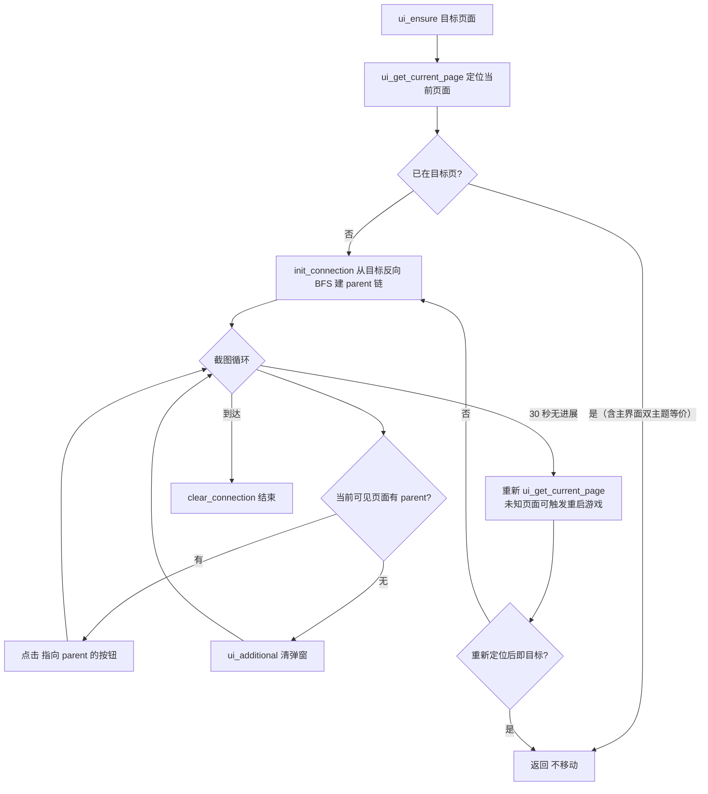

# UI 导航 module/ui

> 以「页面有向图 + BFS 反向链」实现任意页面间的自动导航，并配套开关、滚动条、导航栏、设置面板四类通用控件。

## 1. 模块概述

游戏自动化的第一个难题不是「做什么」，而是「怎么到那里」。碧蓝航线的界面是一张由几十个页面组成的有向图：主界面、战役菜单、商店、船坞、大世界……每个页面靠一个特征按钮（check_button）识别，页面之间靠点击按钮互相跳转。`module/ui` 把这张图显式建模出来，让上层任务只需声明「我要去 page_shop」，导航细节全部下沉。

设计上有两个关键决策：

- **页面图是数据不是代码**。`page.py` 在模块导入时用 `page_xxx.link(button=..., destination=...)` 声明全部边，导航算法对图做整体搜索。新增页面只需要两行声明，不需要触碰导航逻辑本身。
- **导航失败不是终点而是恢复起点**。`ui_goto` 超时后转入 `ui_get_current_page` 重新定位；完全未知的页面先尝试点击右上角 HOME、再巡检弹窗、最后直接重启游戏走登录流程。这套「识别 → 点击回主界面 → 处理弹窗 → 重启」的递进恢复是框架 7×24 运行稳定性的基石。

`UI(InfoHandler)` 是几乎所有游戏业务类的直接或间接基类（`from module.ui.ui import UI` 在仓库中被几十个模块继承），因此本模块的 API 形状决定了整个框架「页面跳转长什么样」：`ui_ensure()` 确保到达、`ui_goto()` 执行导航、`ui_additional()` 在切换途中顺手清掉所有弹窗。

## 2. 模块职责

### 负责

- 页面定义与注册：`Page` 对象、`check_button`、页面间 `link()` 关系（63 个页面，截至 2026-09）。
- 页面导航：`ui_goto` / `ui_ensure` / `ui_back` / `ui_ensure_index`，以及当前页面识别 `ui_get_current_page`。
- 导航途中的弹窗清理：`ui_additional` 及其按页面分组的弹窗处理函数。
- 页面内控件抽象：`Switch`（开关/选择器）、`Scroll`/`AdaptiveScroll`（滚动条）、`Navbar`（页内标签栏）、`Setting`（多组设置项）。
- 新旧两套主界面主题（`page_main` / `page_main_white`）的等价处理。

### 不负责

- 弹窗的具体识别资源与登录、委托、退役等业务流程——属于[处理器层](handler.md)，本模块只调用其 handler 方法。
- `appear()` / 点击 / 截图等底层检测原语——属于[基础层](base/index.md)与[设备层](device.md)。
- 页面进入后的业务操作（选关、购买、编队）——属于各业务模块。
- 按钮/模板图片资源——`assets.py` 由 `dev_tools.button_extract` 生成，勿手改。
- 大世界地图/球面图内的「页面」（IN_MAP / IN_GLOBE）——那是游戏内视图而非 UI 页面，由[大世界核心](os/index.md)自行管理。

## 3. 模块位置

```
module/ui/
├── page.py      # Page 类 + 全部页面定义与链接关系
├── ui.py        # UI 类：导航、页面识别、弹窗巡检
├── switch.py    # Switch：开关/选择器状态切换
├── scroll.py    # Scroll / AdaptiveScroll：滚动条定位与拖拽
├── navbar.py    # Navbar：页内标签导航栏
├── setting.py   # Setting：多组设置面板
└── assets.py    # 本模块按钮资源（生成产物）
```

| 文件 | 作用 |
| --- | --- |
| `page.py` | 页面图唯一事实来源；`Page.all_pages` 全局注册表，模块导入时完成全部建图 |
| `ui.py` | 消费页面图的运行时：`ui_goto` 沿 parent 链点击，`ui_additional` 巡检弹窗 |
| `switch.py` | 「同一位置不同状态」或「多选一」的界面元素，如潜艇开关、目标筛选 |
| `scroll.py` | 按颜色/峰值识别滚动条位置并精确拖拽；`AdaptiveScroll` 适配大世界商店 |
| `navbar.py` | 横/纵向标签栏，按激活色判断当前页签并点击切换 |
| `setting.py` | 复杂筛选面板（多组互斥选项），如仓库排序过滤 |

页面链接并不只在 `page.py`：`Page` 实例注册依赖 `module/ui/assets.py` 等按钮资源，个别页面（RPG 活动、医院）的 check_button 直接借用入口按钮；页面跳转按钮跨模块引用（如 `module.combat.assets` 的奖励弹窗）在 `ui_additional` 中使用。

## 4. 核心入口

| 入口 | 用途 |
| --- | --- |
| `UI.ui_ensure(destination)` | 最常用入口：确保到达目标页面，已在该页则返回 False |
| `UI.ui_goto(destination)` | 从当前页面导航到目标页面（内部建图 + 沿 parent 链点击） |
| `UI.ui_goto_main()` | 回主界面（绝大多数任务的收尾动作） |
| `UI.ui_get_current_page()` | 识别当前页面；未知页面时触发完整恢复链 |
| `UI.ui_additional(get_ship=...)` | 巡检并处理当前画面上的各类弹窗，返回是否处理过 |
| `UI.ui_click(click_button, check_button, ...)` | 通用「点击并等待某画面出现」原语，带超时与额外弹窗回调 |
| `UI.ui_ensure_index(index, letter, ...)` | OCR 读页码并翻页到目标索引 |
| `Switch/Scroll/Navbar/Setting` 的 `set()` | 控件层的统一写入口 |

追代码建议从 `ui_ensure()` 入手：它先调 `ui_get_current_page` 定位，再决定是否 `ui_goto`；`ui_goto` 则是页面图算法的集中体现。

## 5. 核心组件

### Page（page.py）

| 成员 | 说明 |
| --- | --- |
| `Page.all_pages` | 类级注册表，键为页面变量名 |
| `check_button` | 页面特征按钮；`page_unknown` 为 `None` |
| `links` | `{目标 Page: 要点击的 Button}`，`link()` 逐条声明 |
| `parent` | 导航时反向指向目标的父页面，由 `init_connection` 写入 |
| `__init__` | 通过 `traceback.extract_stack` 抓取赋值语句左侧文本作为页面名，因此页面变量必须直接以 `page_xxx = Page(...)` 形式定义 |

建图算法值得注意：docstring 写的是 A*，实际实现是**从目标页出发的 BFS**——`init_connection(destination)` 反复扫描所有页面的 `links`，把每个能一步到达已访问集合的页面标记 `parent`。由于所有边权相等，BFS 即最短路径；`ui_goto` 随后在每个页面上点击「指向 parent 的那条边」，就是逐层逼近目标。

页面定义中沉淀了大量游戏经验，是修改时最需要尊重的部分：

- `page_main` 与 `page_main_white` 是新旧主题的两套入口，业务上等价（见 `is_in_main`）。
- 注释明确标注的禁行路径（如「不要从 page_campaign 进入 page_exercise」）来自真实踩坑：那些路径会被中途弹窗或加载动画破坏。
- `page_unknown` 只有 `GOTO_MAIN` 一条边，是未知页面恢复的出口。
- 个别链接按服务器条件注册（如 TW 服活动临时入口）。

### UI（ui.py）

`UI(InfoHandler)` 组合了信息栏处理后，把页面图变成可执行导航。核心状态只有一个：`ui_current`（最近一次识别到的页面）。

| 方法 | 行为要点 |
| --- | --- |
| `ui_page_appear(page)` | 用 `check_button` 判断页面；`page_main` 用更小 offset，EN 服学院有额外按钮特判 |
| `is_in_main()` | 主界面新旧主题任一命中即为真，全框架统一用这个判断而非直接比对页面 |
| `ui_get_current_page()` | 10 秒窗口内遍历全部页面找特征按钮；找不到先点 `GOTO_MAIN`/`RPG_HOME`、跑 `ui_additional`，仍失败则 `LoginHandler` 重启游戏递归重试；`recover_unknown=False` 时改为抛 `GamePageUnknownError` |
| `ui_goto(destination)` | 每次 `init_connection` 重建 parent 链 → 截图循环里对每个可见页面点「通往 parent 的按钮」→ 30 秒无进展则降级到 `ui_get_current_page` 重新定位再续导航 |
| `ui_ensure(destination)` | 先定位再决定是否导航；`page_main`/`page_main_white` 互为等价目标 |
| `ui_ensure_index(...)` | OCR 识别当前索引后 `multi_click` 一次性翻多页（`fast=True`），索引不连续时逐页点 |
| `ui_back(check_button)` | 点 `BACK_ARROW` 直到 `check_button` 出现 |
| `ui_additional(get_ship)` | 弹窗巡检总入口，见下 |

`ui_additional` 是导航可靠性的关键：每次页面切换间隙都会调用，按优先级处理大世界弹窗（重置券、舰队准备死循环保护）、科研/断线确认、紧急委托、主界面奖励弹窗（月卡到期、通行券、物品过期）、剧情跳过、后宅/指挥喵弹窗、战役准备界面误入、登录与维护公告、待机动画等。它返回「是否处理了东西」，调用方据此重新截图。两个值得注意的内部设计：

- `_opsi_reset_fleet_preparation_click` 计数器在连续点击大世界重置舰队按钮超过 5 次时抛 `RequestHumanTakeover`——这是「点击 → 弹窗 → 再点击」死循环的熔断器。
- 岛屿页面跳过 `GET_SHIP/GET_ITEMS` 检测，因为其 UI 元素与奖励检测区域重叠会产生误识别。

### 四类控件

| 控件 | 识别原理 | 关键行为 |
| --- | --- | --- |
| `Switch` | 逐状态模板匹配 `check_button` | `is_selector` 决定点击语义：选择器点目标状态，开关点当前状态完成翻转；`unknown` 状态采用「两次容忍」策略——首次只警告不点击（可能是切换动画），警告再次出现后才直接点目标状态（可能是未登记的新状态），保证在已知状态间仍可切换。`handle_additional()` 钩子供子类清理遮挡（如 `FleetLockSwitch`） |
| `Scroll` | 在滚动条区域内按颜色逐行列生成掩码，用「掩码均值位置 − 半长」归一化位置 | `set()` 拖拽循环带 `drag_interval` 防连击、滚动条消失 5 秒后假定完成；`drag_page`/`next_page` 按可视长度换算翻页拖拽量；贴边时扩大随机偏移避免过界 |
| `AdaptiveScroll` | 扩背景后灰度化，`scipy.find_peaks` 找峰值行作为滚动条位置 | 适配大世界商店这类背景色不定、滚动条长短变化的场景，`OS_SHOP_SCROLL` 即其实例 |
| `Navbar` | 对 `ButtonGrid` 每个标签做激活色/非激活色像素计数 | `get_info()` 返回（激活索引、可见最左、最右）；`set()` 支持 left/right/upper/bottom 四个方向（从 1 计数），商店内的导航栏会先处理 `GET_SHIP`/`GET_ITEMS` 遮挡 |
| `Setting` | 每个选项按钮按两种主题色判断激活 | `reset_first` 默认先空跑一次恢复默认再设目标值，规避「游戏记住上次选择」的干扰；`need_deselect` 支持非互斥多选 |

控件全部持有调用方 `main`（ModuleBase 实例）而非自行截图，这保证它们复用业务模块已有的设备与间隔计时器状态。

## 6. 工作流程

### 一次完整导航



三个细节决定了实际体验：

- **到达判定先于一切**。每帧先查 `ui_page_appear(destination)`，主界面目标额外接受双主题等价，因此从旧主题页面「导航到新主题主界面」不会真的点击。
- **点击是「页面 → parent」而非「页面 → 目标」**。parent 链本身就是最短路，代码只需在每个页面上找到那条唯一正确的边。
- **间隔计时器全量清理**。`ui_goto` 入口对全部页面 check_button `interval_clear`，防止上一个任务留下的 interval 抑制本任务的页面识别。

### 未知页面恢复链

`ui_get_current_page` 的恢复动作按代价递增排列：点 `GOTO_MAIN`（任何右上角有 HOME 的页面都能走）→ `ui_additional` 清弹窗 → 检查游戏进程与屏幕旋转 → 全部失败后 `app_stop()` + `app_start()` + 登录流程，再递归定位一次。日志中那段针对「未知页面」的嘲讽文案（`杂鱼大叔~`）是刻意的用户提示，标识「自动恢复已到极限，请检查模拟器画面」。

### 弹窗巡检的层次

`ui_additional` 内部按「先特殊后通用」排列：大世界弹窗（`ui_page_os_popups`，含死循环熔断）→ 通用确认/紧急委托 → 主界面弹窗（`ui_page_main_popups`，岛屿页面除外）→ 剧情跳过 → 游戏提示 → 后宅/喵 → 战役准备界面 → 登录公告 → 误点击恢复 → 待机动画。这个顺序是踩坑结果：例如大世界的 popup_confirm 必须先于通用确认处理，否则会误点。

## 7. 调用关系

### 上游

| 模块 | 关系 |
| --- | --- |
| 全部业务模块 | 几乎所有任务类都继承 `UI`（直接或经 `ModuleBase` 之下某层），用 `ui_ensure/ui_goto` 进出页面 |
| [处理器层](handler.md) | `UI` 继承 `InfoHandler`；`ui_additional` 调用 `handle_urgent_commission`、`handle_popup_confirm`、`handle_story_skip` 等 |
| [守护模式](infra/daemon.md) | 守护任务复用 `ui_goto_main` 等空闲导航 |
| [WebUI 总览](webui/index.md) | 无运行时调用关系；前端「实例预览」依赖的截图来自设备层，不经过本模块 |

### 下游

| 模块 | 用途 |
| --- | --- |
| [基础层](base/index.md) | `appear/image_color_count/image_crop`、`Timer`、`Button/ButtonGrid`、`interval_*` 计时器 |
| [设备层](device.md) | `click/multi_click/swipe/screenshot` |
| [OCR 系统](ocr.md) | `ui_ensure_index` 的索引识别 |
| [配置系统](config.md) | 服务器差异（`SERVER`）、控制方式（minicap 卸载判断） |
| [大世界核心](os/index.md) | `ui_page_os_popups` 的弹窗资源、`page_os` 的注册 |

## 8. 数据流

```
Page 定义（导入期）：page_xxx = Page(CHECK) → link() 声明边 → all_pages 注册表

运行期一次导航：
  截图 → 逐页面 appear(check_button) → 命中即得 ui_current
       → init_connection(destination)：BFS 反向标记 parent
       → appear(page.check_button) 命中的页面 → device.click(page.links[page.parent])
       → 循环直至 destination 特征出现

控件层：
  截图 → 控件内部 appear/image_color_count → 状态/位置 → device.click/swipe
```

导航没有持久状态：`parent` 每次导航重建、导航结束 `clear_connection`；唯一跨调用的状态是 `ui_current` 与设备上的 interval 计时器。

## 10. 配置

本模块不定义用户配置组，行为参数集中在代码常量与方法默认值中：

| 参数 | 位置 | 说明 |
| --- | --- | --- |
| `Timer(10, count=20)` | `ui_get_current_page` | 页面识别窗口，超时进入恢复链 |
| `Timer(30, count=60)` | `ui_goto` | 导航超时阈值，触发重新定位 |
| `interval=5` | `ui_goto` 页面点击 | 同一页面特征按钮 5 秒内不重复点击，防连点 |
| `offset=(30, 30)` | 各 appear 调用 | 模板匹配偏移；`page_main` 特例 `(5, 5)`，白色主题常为 `0`（纯颜色匹配） |
| `Scroll.color_threshold=221` 等 | `scroll.py` 类属性 | 滚动条颜色判定、拖拽阈值与贴边扩偏移 |
| `Switch` 的 `set_unknown_timer/click_timer` | `switch.py` | unknown 两次容忍与点击节流 |
| `Navbar` 构造参数 | 各业务模块 | 激活/非激活颜色与像素计数按页面定制 |

## 11. 异常与错误处理

| 异常 | 原因 | 处理 |
| --- | --- | --- |
| `GamePageUnknownError` | `recover_unknown=False` 且页面无法识别 | 上抛给调度器，按可恢复错误处理 |
| `GameNotRunningError` | 导航中发现游戏进程已退出 | 上抛，由设备/调度层重启恢复 |
| `RequestHumanTakeover` | 大世界舰队准备弹窗连续点击超过 5 次 | 直接终止任务请求人工介入（熔断器） |
| `ScriptError` | `Switch.add_state('unknown')`、`Setting` 默认项不在选项中等定义错误 | 开发期立即暴露 |
| 导航超时（非异常） | 页面长时间识别不到 | 降级 `ui_get_current_page` → 必要时重启游戏，不抛错 |

设计取向：导航层几乎不抛错，把「环境不对」内化为自愈动作；只有「游戏根本无法进入已知页面」或「同一动作反复失败」才升级为异常。

## 12. 并发与线程模型

本模块自身无线程，但与调度器/WebUI 并发相关：

- `Page.all_pages` 在模块导入期构建、运行期只读（`parent` 在导航内单线程写），无锁。
- interval 计时器挂在 `self.device.interval_timer` 上，同一实例的任务循环独占，跨线程不可共享。
- `ui_current` 只是最近识别结果的备忘，不作为并发同步点。

## 13. 缓存与持久化

- 无磁盘持久化。页面图每次进程启动由导入重建，parent 每次导航重建——这是刻意的：页面链接会随游戏活动增删（见 `page.py` 中大量被注释的历史活动页面），缓存反而危险。
- `device.interval_timer` 是事实上的「点击节流缓存」，`ui_button_interval_reset` 针对易误点按钮（如主界面入口点击后立即出现的 `GET_SHIP`）做了定向重置。

## 14. 生命周期

- **定义期**：模块导入时构造全部 `Page` 并 `link()`；任何业务模块 `from module.ui.page import page_xxx` 即完成对图的引用。
- **导航期**：`init_connection` → 循环 → `clear_connection`，parent 链随导航生灭。
- **UI 实例**：随宿主任务类创建，无独立销毁逻辑。

## 15. 扩展方式

**新增页面**（最常见）：

1. 在对应模块 `assets` 中准备 `XXX_CHECK` 特征按钮与入口按钮（跑 `uv run -m dev_tools.button_extract` 生成）。
2. 在 `page.py` 中 `page_xxx = Page(XXX_CHECK)` 并 `link()` 双向可达路径（入口边 + `GOTO_MAIN` 出口边）。
3. 若新页面会弹出干扰导航的对话框，在 `ui_additional` 相应分组补处理分支。
4. 新页面的按钮资源同步四服；仅特定服务器可达的入口用 `server.server` 条件注册。

**新增弹窗处理**：优先放进 `ui_page_main_popups`（主界面场景）或 `handler` 层的既有 `handle_*`；处理动作遵循「appear_then_click + interval」或「appear 后显式点击替代按钮」两种模式之一。

**新增控件**：模仿 `Switch` 的「构造时声明状态、set() 内自带截图循环与超时」骨架；控件不要自己持有 device，通过 `main` 参数使用宿主能力。

## 16. 修改注意事项

- **不要把 BFS 改成别的寻路**。所有边权相等时 BFS 即最短路，且实现依赖「parent 每帧重算」来容忍页面识别抖动；换成带权寻路需要同时重做超时恢复语义。
- **`Page.__init__` 依赖调用点写法**。页面名来自赋值语句左侧文本，包一层工厂或循环定义都会让命名失效。
- **主界面必须走 `is_in_main()`**。直接 `ui_page_appear(page_main)` 会漏掉白色主题；反向（只查 white）会漏旧主题。所有「是否在主界面」的判断已经统一，不要新开判断路径。
- **链接注释是契约**。「不要从 page_campaign 进入 page_daily」这类注释来自真实弹窗/加载时序问题，恢复或新增链接前先理解原因。
- **`ui_additional` 的顺序敏感**。大世界弹窗与通用确认的前后关系、岛屿页面的例外都在防误点；新增分支时放在语义相近的分组内并跑一次受影响页面的实测。
- **offset 语义按控件固定**：`appear` 的 offset 是模板匹配容差，`Switch/Navbar` 的 offset 是识别区域偏移，混用会让阈值失效。
- **`ui_ensure_index` 的 `fast` 参数**：索引连续（纯数字页码）才能 multi_click 直达，环形或字母索引必须 `fast=False`，否则点击次数算错。
- **白屏/黑屏防御**：`Navbar.get_info` 对纯黑截图返回 None 的分支是故意的（截图瞬间可能全黑），删除会让导航在截图切换瞬间误点。

## 17. 已知限制

- `page.py` 文档字符串仍写「A* 寻路」，实际是 BFS 反向标记；二者在等权图上结果一致，但阅读时不要去找代价函数。
- 页面特征按钮对游戏改版高度敏感：一次 UI 改版（如 2024-05 新主界面、2026-08 突袭入口改版）通常需要补一套 `*_WHITE`/`*_20260827` 类按钮并保留旧资源，累积的兼容按钮是页面文件膨胀的主因。
- 未知页面恢复最终手段是重启游戏，在模拟器启动慢的环境里一次恢复可能耗时数分钟；导航超时阈值（30 秒）不适合再调小。
- `Switch` 的 unknown 两次容忍假设「unknown 状态要么是动画要么是新状态」，若某状态模板永久失效，set() 会在超时路径上多花一轮警告时间。
- `ui_additional` 清单按活动积累，久未维护的活动分支以注释形式保留；这些注释代码不是死代码，是「该活动复用时的开关位」。

## 18. 示例

定义页面与导航（节选风格，非当前代码）：

```python
# 页面定义（page.py）
page_shop = Page(SHOP_CHECK)
page_shop.link(button=GOTO_MAIN, destination=page_main)      # 出口
page_main.link(button=MAIN_GOTO_SHOP, destination=page_shop) # 入口

# 业务模块中
class MyTask(UI):
    def run(self):
        self.ui_ensure(page_shop)     # 已在该页则无动作
        ...
        self.ui_goto_main()           # 收尾回主界面
```

控件使用（声明一次，多处复用）：

```python
FLEET_LOCK = Switch('Fleet_lock', is_selector=False)
FLEET_LOCK.add_state('on', check_button=SWITCH_ON)
FLEET_LOCK.add_state('off', check_button=SWITCH_OFF)
FLEET_LOCK.set('on', main=self)       # 内部自带截图循环与重试

SIDE_NAVBAR = Navbar(ButtonGrid(...), ...)
SIDE_NAVBAR.set(main=self, left=2)    # 从左数第 2 个标签
```

## 19. 调试方法

- 日志前缀：`[UI]`（定位/导航）、`[UI-额外]`（弹窗处理，格式 `检测到 -> 点击`）、`[UI-开关]/[UI-导航栏]/[UI-设置]`（控件内部状态）。导航卡住先看最后一条 `[UI] 页面切换: A -> B` 与 `UI attr` 输出，判断是「识别错页面」还是「路径错」。
- 页面识别失败时先确认特征按钮资源是否过期（游戏改版后 `appear` 持续 False），再用 `debug_button` 式离线回放截图核对。
- 弹窗漏处理：在 `ui_additional` 对应分组加 `logger.attr` 打印候选按钮的 appear 结果，确认是模板过时还是优先级被前面的分支抢先。
- 导航「点了没反应」：检查 interval——`appear(..., interval=5)` 在 5 秒内会静默返回 False，看起来像页面没识别。

## 20. 相关模块

- [处理器层](handler.md) —— `ui_additional` 调用的弹窗/登录/委托处理与 `InfoHandler` 基类
- [基础层](base/index.md) —— `Button`/`Timer`/`appear()` 检测原语与资源释放
- [设备层](device.md) —— 截图与点击注入
- [OCR 系统](ocr.md) —— `ui_ensure_index` 的索引识别
- [战役执行](campaign.md) —— `CampaignUI` 等基于本模块的业务入口
- [编码规范与设计模式](overview/conventions.md) —— 状态循环模式在导航代码中的规范写法
