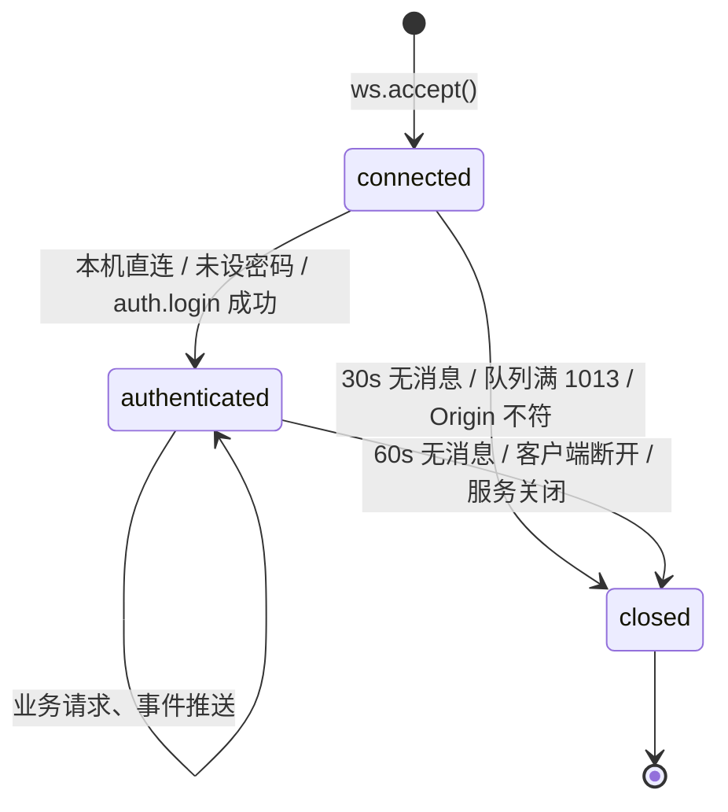

# API 服务（module/api）

> WebUI 的后端服务：一个 Starlette ASGI 应用把 React 静态资源、同源 WebSocket 业务通道与 MCP SSE 子应用组装进同一进程；业务数据全部经 v1 信封走单一 WebSocket，HTTP 只保留静态资源、健康检查与一份自包含报告页。

## 1. 模块概述

module/api 是 React WebUI 的全部后端。浏览器加载 `http://{host}:{port}` 后，页面资源由静态文件服务提供，而之后的一切业务——读配置、改配置、启动调度器、看日志、看截图、读统计、管理更新——都通过同一条 `/api/v1/ws` WebSocket 连接完成。这个「业务全走 WS」的决策是模块的设计核心：

- **单一通道**：认证、限流、背压、请求去重集中在一个会话对象里实现，不需要每个 HTTP 端点重复一套防护；服务器推送事件（实例状态、日志、截图帧）与请求响应复用同一条连接，避免 HTTP 轮询。
- **代理友好**：反向代理只需要正确转发一条 WebSocket Upgrade 路径，并保留外部 Host/Origin 即可；不需要为几十个 REST 端点配置路由。
- **安全边界清晰**：WebSocket 不受浏览器 CORS 保护，因此在升级前必须做 Origin/Host 校验；认证、限流都在连接内完成，凭据只出现在消息体中，不进 URL 与日志。

模块本身刻意做成**薄适配层**：它不做游戏业务，只做「协议收发 + 参数校验 + 编排」。真正的业务要么委托给 `module/runtime/`（进程管理、更新器、部署设置），要么委托给 `module/config/transaction` 的跨进程事务与 `module/statistics/` 的统计数据源。这使 API 层可以在测试中用临时配置目录 + 关闭真实进程生命周期的方式完整运行（`create_app` 的测试参数），而不接触任何设备。

与独立 MCP 服务的关系是**宿主与挂载件**：`create_app(mount_mcp=True)` 时把 MCP SSE 应用以 `Mount('/mcp')` 挂进来，两者共享同一份 `ConfigService`/`RuntimeService` 对象和同一个访问密码，关闭时先等 MCP 在途操作结束再回收共享运行时。独立运行的 MCP（`mcp_server_sse.py`，见 [MCP SSE 服务器](../entry/mcp-server.md)）则自己管理生命周期。

## 2. 模块职责

### 负责

- 组装 Starlette 应用：路由、静态资源、健康检查、MCP 挂载、应用 lifespan（`app.py`）。
- WebSocket v1 协议：信封收发、认证、订阅采样、限流与背压（`socket.py`、`protocol.py`）。
- 显式方法注册表与分发：参数模型验证、DEMO 只读拦截（`router.py`）。
- 配置实例管理：白名单校验、跨进程事务内校验合并、导入/备份（`config_service.py`）。
- 运行状态适配：实例列表、总览、增量日志、被动截图、资源时间线（`runtime_service.py`）。
- 分类统计、指挥喵评分报告、更新器接口（`statistics_service.py`、`meowfficer_service.py`、`update_service.py`）。
- 共享运行时生命周期：启动更新调度/OCR/远程访问/自动运行实例，退出时逐项回收（`lifecycle.py`）。
- 前端静态资源服务：MIME 修正、SPA 回退、缓存策略（`static.py`）。
- 生成前端 API 契约的工具入口在 `dev_tools/export_api_schema.py`（见第 15 节）。

### 不负责

- 监听端口、进程监督、热重载、依赖同步：`gui.py`（见 [WebUI 启动器](../entry/gui.md)）。
- worker（实例调度进程）的状态机与日志转发实现：`module/runtime/process_manager.py`，本模块只消费它的状态与缓冲。
- 更新的实际执行（git 操作、等待实例退出、重启）：`module/runtime/updater.py`，`update_service.py` 只是它的 WebUI 门面。
- 游戏配置的语义与迁移：`module/config/`；API 只按 `args.json` 的字段定义做校验与读写。
- 前端页面逻辑与连接管理（重连、心跳、登录记忆）：`frontend/`（见 [前端](frontend.md)）。
- MCP 协议实现：`mcp_server_sse.py` 挂载时复用本模块的服务对象，但协议自洽。

## 3. 模块位置

```text
module/api/
├── __init__.py            包说明：React 前端使用的版本化 WebSocket API
├── app.py                 create_app 应用工厂：路由组装、密码解析、lifespan
├── protocol.py            信封构造、错误码、pydantic 严格参数模型
├── router.py              Method 显式注册表、dispatch、跨服务协调的写操作
├── socket.py              Gateway（连接准入/认证/退避）+ Session（会话/订阅/背压）
├── config_service.py      实例白名单、配置读取与跨进程事务写
├── runtime_service.py     实例状态/总览/增量日志/被动截图适配层
├── statistics_service.py  六类统计报告的聚合
├── meowfficer_service.py  指挥喵评分报告的只读读取与清理
├── update_service.py      Git 快照/提交历史与后台 fetch/apply（模块级单例）
├── static.py              FrontendFiles：MIME 修正、SPA 回退、隐藏文件拦截
└── lifecycle.py           与界面会话无关的启动/清理（startup/clearup）
```

配套生成产物与契约：`dev_tools/export_api_schema.py` 从 `protocol.py` + `router.py` 生成 `frontend/src/api/generated.ts`（参数类型）与 `frontend/src/api/contract.json`（机器可审契约）。

## 4. 核心入口

| 入口 | 用途 |
| --- | --- |
| `create_app()`（app.py） | uvicorn 以工厂字符串 `module.api.app:create_app` 加载；测试可传 `root`/`password`/`manage_runtime=False`/`mount_mcp=False` 隔离运行 |
| `Gateway.endpoint`（socket.py） | `/api/v1/ws` 的 ASGI 入口：Origin 校验、连接计数、创建 Session |
| `Router.dispatch`（router.py） | 方法名 → 参数验证 → handler 的唯一分发路径 |
| `ConfigService` / `RuntimeService` | MCP 工具与 WS handler 共用的两个服务对象 |
| `startup` / `clearup`（lifecycle.py） | lifespan 调用的共享运行时启动与清理 |
| `dev_tools.export_api_schema.main` | 契约生成入口（CI 校验 diff） |

追代码建议从 `create_app` 读起：它一次展示了密码解析、服务对象组装、MCP 挂载与关闭顺序。

## 5. 核心组件

### Gateway（socket.py）

进程级单例（每个 app 一个），持有连接准入与认证状态：

| 字段 | 类型 | 说明 |
| --- | --- | --- |
| `password` | str | 访问密码；为空表示免密（本机/回环部署） |
| `connections` | int | 当前 WS 连接数，上限 32，超出以 1013 拒绝 |
| `workers` | `asyncio.Semaphore(8)` | 全局并发业务线程上限，dispatch 与订阅采样共享 |
| `failures` | OrderedDict | 按来源 IP 的登录失败退避表，上限 1024 条，超限淘汰最旧 |

### Session（socket.py）

每连接一个，聚合该会话的全部可变状态：

| 字段 | 类型 | 说明 |
| --- | --- | --- |
| `authorized` | bool | 本机直连或密码为空时直接为 True |
| `queue` | `asyncio.Queue(32)` | 发送队列；慢客户端塞满即以 1013 断开 |
| `subscription` | SubscribeParams | 当前订阅集合；除 `instances` 外必须带有效 instance |
| `sequence` / `cache` | int / dict | 事件 seq 计数器；各 topic 的内容指纹（未变化不推送） |
| `responses` | OrderedDict(128) | 已用请求 ID 窗口，重复 ID 报 `DUPLICATE_REQUEST` |
| `log_cursor` | int | 日志增量游标，与 `RuntimeService.logs_cache` 配合 |
| `window` / `requests` | float / int | 每连接 30 请求/秒 的滑动窗口 |
| `preview_changed` / `preview_pending` | Event / msg | 截图帧事件通道；预览在发送队列中只占一个槽 |

### Method 与 Router（router.py）

`Method(params, handler, mutates)` 三元组是注册表的最小单元：`params` 是 pydantic 严格模型，`mutates` 标记写操作。`Router.methods` 是全部方法的**显式白名单**——`dispatch` 只查表，未知方法返回 `METHOD_NOT_FOUND`，从结构上排除了「把 WS 方法名分发成任意 Python 属性调用」的漏洞（有专门回归：`test_unknown_method_does_not_dispatch_python_attributes`）。跨服务协调的写操作（删除实例、设置页）直接作为 Router 方法实现，因为它们要同时动 `ProcessManager`、日志缓存、preview hub 或部署配置，不属于任何单一服务。

### ConfigService（config_service.py）

配置实例的唯一读写入口。`validate_name` + `path()` 构成实例名与路径的**双重白名单**：名称正则（中日文/字母数字开头，长度 ≤64）、Windows 保留名集合（`template`、`deploy`、`con` 等）、符号链接与路径逃逸检查。`read` 在磁盘 JSON 之上深拷贝 `template.json` 并合并缺失字段，返回 SHA-256 作为 revision。`patch` 在 `threading.RLock` + `config_transaction`（跨进程文件锁）内逐字段校验后原子写盘。构造时读入 `args.json`、`menu.json`、`zh-CN.json`、`template.json` 四份生成产物。

### RuntimeService（runtime_service.py）

把 `ProcessManager` 的进程世界翻译成前端视图：`STATES = {1: running, 2: stopped, 3: error, 4: updating}` 是进程状态与前端枚举的唯一映射；`logs()` 用对象身份匹配 `renderables` 的裁剪重叠区，保证游标单调递增；`capture()` 只读 `preview.hub` 的最新帧，**绝不主动触发截图**。

## 6. 工作流程

```mermaid
flowchart TD
    A[WS 连接 /api/v1/ws] --> B{Origin 存在且与 Host 一致?}
    B -- 否 --> C[关闭 1008]
    B -- 是 --> D{连接数 &lt; 32?}
    D -- 否 --> E[关闭 1013]
    D -- 是 --> F[Session.run: 启动 writer/reader/producer/preview 四任务]
    F --> G[推送 session 事件 authRequired]
    G --> H{本机直连或未设密码?}
    H -- 是 --> I[authorized=True]
    H -- 否 --> J[等待 auth.login<br/>失败按 IP 退避]
    J -- 成功 --> I
    I --> K[reader 循环]
    K --> L{≤1MiB 且 ≤30 req/s?}
    L -- 否 --> M[failure 信封]
    L -- 是 --> N[Request 校验 + 请求 ID 去重]
    N --> O{method?}
    O -- auth.login --> P[验证密码 置 authorized]
    O -- events.subscribe --> Q[原子替换订阅 清空缓存]
    O -- 其他 --> R[Semaphore(8) + to_thread 走 dispatch]
    P & Q & R --> S[response/failure 入发送队列] --> K
    F -.-> T[producer 分频采样重主题<br/>overview 1s/instances 2s<br/>指纹未变不推送]
    F -.-> V[log_producer 监听日志到达通知<br/>历史批量初始化/新增逐条推送]
    F -.-> U[preview_producer 事件驱动<br/>新帧即推送, 慢客户端只留最新帧]
```

关键顺序细节：

1. **升级前校验**：Origin 存在时其 scheme 必须是 http/https 且 netloc 与 Host 头一致，否则 1008 拒绝——这一步发生在 `accept()` 之前，跨站脚本无法借浏览器发起跨站 WebSocket。
2. **认证判定**：`Session.authorized = 本机直连 or 密码为空`。本机判定由 `is_local_client` 完成：来源地址、Host 头、Origin 三者都必须是 `127.0.0.1/::1/localhost`，且未命中远程访问隧道标记头 `x-azurpilot-remote-access`（隧道流量同样来自回环，靠标记头区分）。
3. **登录退避**：`auth.login` 用 `secrets.compare_digest` 比对；失败按来源 IP 记数，锁定 `min(60, 次数×2)` 秒。
4. **业务执行**：除 `auth.login` 与 `events.subscribe` 外，所有方法经 `asyncio.to_thread` 在工作线程执行（阻塞 IO 不阻塞事件循环），`Semaphore(8)` 限制全局并发。
5. **订阅推送**：`producer` 只以各 topic 间隔（overview 1s、instances 2s）采样重主题，序列化指纹与上次相同则跳过。日志与截图都不轮询：worker 日志队列每接收一条日志就通过 `log_hub` 唤醒 `log_producer`，截图继续由 `preview` hub 唤醒。用户切换实例时，旧订阅尚未完成的结果按对象身份比对丢弃。
6. **发送**：所有出站消息经单条发送队列；事件按实际发送顺序获得单调递增 `seq`。`send_json` 带 10 秒超时，写死循环即断开。

## 7. 调用关系

### 上游

| 模块 | 关系 |
| --- | --- |
| [WebUI 启动器](../entry/gui.md) | uvicorn 加载 `create_app` 工厂；传入 `--key`/`--run` 参数与 `State.webui_host` |
| [前端](frontend.md) | 唯一业务客户端；参数类型由本模块模型生成 |
| [MCP SSE 服务器](../entry/mcp-server.md) | 挂载为 `/mcp` 子应用，复用 configs/runtime 与密码 |

### 下游

| 模块 | 用途 |
| --- | --- |
| [运行时服务](runtime.md) | `ProcessManager`（实例进程状态/启停/生命周期锁）、`deploy_settings`、`updater`、`preview.hub`、`remote_access` |
| [配置系统](../config.md) | `args.json`/`menu.json`/`i18n` 作为校验依据与下发数据；`config_transaction` 跨进程写锁 |
| [调度器](../entry/alas.md) | `scheduler.start`/`tasks.run` 最终拉起的进程 |
| `module/statistics/*` | 资源时间线、大世界月度、委托收益、舰船经验、掉落缓存 |
| `module/shop_strategy` | 高级商店策略的静态校验（不执行脚本） |
| `deploy/atomic` | 配置与 `password.txt` 的原子写 |

## 8. 数据流

```text
请求路径
  浏览器 → WS reader（限流/认证/模型校验）
        → to_thread: Router.dispatch → 各 service
        → config/*.json（事务锁 + 原子写）或 ProcessManager 状态
        → response/failure 信封 → 发送队列 → writer → 浏览器

订阅路径（instances/overview，按 topic 间隔 2/1 秒轮询）
  producer → RuntimeService 读取 → JSON 序列化指纹
        → 与 cache 不同才 event(seq++) → 发送队列 → 浏览器

预览路径（preview，事件驱动）
  worker 进程截图 → module/runtime/preview 后台编码 JPEG（quality=85）
        → 有界跨进程队列 → ProcessManager 线程校验 runId 后 hub.publish
        → 回调 loop.call_soon_threadsafe 唤醒 preview_producer
        → hub.get 取最新帧 → event('preview') → 浏览器

日志路径
  worker 进程日志队列 → ProcessManager.renderables（ring buffer）
        → log_hub 逐条通知 Session.log_producer
        → RuntimeService.logs 按对象身份找增量 → rich Console 渲染纯文本
        → 历史批量初始化、新增逐条推送 → Session.log_cursor 记账
        → 客户端游标落后则返回 reset
```

预览链路是**纯被动**的：API 层任何接口都不会启动截图任务，没有新帧时前端拿到的就是上一帧及其采集时间。这保证了「看一眼截图」永远不消耗设备资源。

## 9. 状态模型

### 连接会话状态



| 状态 | 含义 |
| --- | --- |
| connected | 已 accept 未认证：只能 `auth.login`，其余一律 `UNAUTHORIZED` |
| authenticated | 可调用全部白名单方法、可订阅 |
| closed | 收发任务全部回收后归还连接槽位（shield 保护，见第 12 节） |

### 更新操作状态（update_service）

模块级单例维护一个 `operation` 槽（None/'fetch'/'apply'），与 `updater.state`（0/1/'checking'/'failed'/'finish'/'start'/'wait'）合成对外的 `state`/`busy`/`canApply`/`canCancel` 视图。操作经 `Thread(daemon=True)` 后台执行，WS 请求只返回 `accepted`；fetch 与更新器共用 `_update_lock` 互斥，避免与定时检查交错。

## 10. 配置

API 模块自身的行为参数来自部署配置 `config/deploy.yaml`（经 `State.deploy_config` 访问），而不是游戏配置体系；`<Task>.<Group>.<Argument>` 路径是本模块**管理并校验的数据**，不是它的输入配置。

| 配置 | 类型 | 默认值 | 说明 |
| --- | --- | --- | --- |
| `Password` | str | None | 访问密码；命令行 `-k/--key` 优先。自动生成的密码会回写此键 |
| `WebuiHost` | str | 0.0.0.0 | 监听地址；公网地址触发随机密码策略（gui.py 消费） |
| `WebuiPort` | int | 25548 | 监听端口（gui.py 消费） |
| `Run` | str | None | 开机自动运行的实例列表；lifespan 解析后交给 `restart_processes` |
| `StartOcrServer` | bool | False | 启动时拉起本地 OCR 服务进程 |
| `EnableRemoteAccess` | bool | False | 启动 SSH 隧道保活线程；隧道流量永远不算本机免密 |
| `DiscordRichPresence` | bool | False | 启动 Discord RPC，失败不影响 WebUI |

`settings.get`/`settings.patch` 就是这批部署设置（按 `deploy_settings.py` 的 `DEPLOY_GROUPS` 白名单）的读写接口；`Password` 只写不读（读出的值恒为空，前端留空表示保持原密码）。

作为数据服务的生成物（进程启动时读入内存，不随源文件热更新）：`module/config/argument/args.json`、`menu.json`、`module/config/i18n/zh-CN.json`、`config/template.json`。其余语言翻译按请求读盘。改 argument 源文件后需重启 WebUI 服务才能生效。

## 11. 异常与错误处理

错误处理分两层：协议层（socket.py 的 reader 循环）把一切异常收敛为 failure 信封，连接保活；业务层用 `ApiError(code, message, details)` 表达可展示错误。

| 异常/来源 | 原因 | 处理 |
| --- | --- | --- |
| `ValidationError` | 参数模型校验失败 | `INVALID_PARAMS`；详情只含 `path`/`type`，**不回显输入**，防密码或私有配置泄漏 |
| `ApiError` | 业务规则（见错误码表） | 原样转为 failure 信封 |
| `ValueError` / `PermissionError` | 底层服务抛出（如部署设置解析失败） | 归为 `INVALID_PARAMS` |
| 其他 `Exception` | 未预期异常 | `logger.exception` 记录完整堆栈；客户端只收到 `INTERNAL_ERROR` 固定文案，无堆栈 |
| `TimeoutError` | 读超时（30s 未认证 / 60s 已认证） | 会话结束，收发任务在 shield 作用域内回收 |
| `WebSocketDisconnect` | 客户端断开 | 正常清理路径 |

错误码（按源码实际出现汇总）：

| 类别 | 错误码 |
| --- | --- |
| 协议 | INVALID_REQUEST、INVALID_PARAMS、METHOD_NOT_FOUND、DUPLICATE_REQUEST |
| 认证/权限 | UNAUTHORIZED、RATE_LIMITED、READ_ONLY |
| 配置/实例 | NOT_FOUND、ALREADY_EXISTS、CONFIG_INVALID、CONFLICT、INSTANCE_RUNNING |
| 运行 | START_FAILED、STOP_FAILED |
| 更新 | UPDATE_FAILED、UPDATE_BUSY、UPDATE_UNAVAILABLE |
| 内部 | INTERNAL_ERROR（meowfficer_service 另用 'INTERNAL'，见第 17 节） |

自动恢复与终止的边界：参数错误、业务错误都不断开连接（客户端可继续下一个请求）；只有读超时、队列溢出、Origin 不符、连接数超限会终止会话。`config.patch` 的校验是全有全无——任一字段失败则整个事务不落盘。

## 12. 并发与线程模型

一个 uvicorn 事件循环承载全部会话；阻塞操作一律离开事件循环：

- **Session 的五个 asyncio 任务**（`run()` 启动）：`reader`（收请求）、`writer`（发消息）、`producer`（overview/instances 分频采样）、`log_producer`（日志到达即推送）、`preview_producer`（截图推送）。任一任务结束即触发全会话收尾；收尾用 `anyio.CancelScope(shield=True)` 屏蔽外层取消，保证归还连接计数前收发任务真正结束——ASGI 服务器可能在客户端退出时取消整个会话作用域。
- **业务线程**：`asyncio.to_thread` 派发，`Gateway.workers = Semaphore(8)` 同时约束 dispatch 与订阅采样的并发总量，防止一次大批量统计查询耗尽默认线程池。
- **跨进程写保护**：`ConfigService.patch/delete` 持有 `self.lock`（RLock）+ `config_transaction` 文件锁（`.json.lock`，msvcrt/fcntl，等待上限 15 秒），与核心运行器的配置写回互斥。
- **实例生命周期锁**：`start/stop/delete` 全部走 `ProcessManager._get_lifecycle_lock(instance)`，与 worker 线程内的状态变更互斥。
- **线程通知**：preview 帧由 worker 子进程编码、父进程线程转发到 `hub`，再用 `loop.call_soon_threadsafe` 唤醒 `preview_producer`——跨线程只传「有新帧」信号，帧本体在 hub 里，订阅者自取。
- **uvicorn 层双保险**（gui.py 配置）：`ws_max_size=1048576`（ASGI 帧上限）与 `ws_max_queue=16`，与 Session 层的 1MiB 校验、32 条发送队列互为冗余。

线程安全对象：`PreviewHub`（自带锁）、`UpdateService`（operation 槽受锁保护）、`ConfigService` 的读操作（依赖 GIL 与只读约定，写操作必须走 `patch/delete` 的锁路径）。

## 13. 缓存与持久化

| 数据 | 位置 | 生命周期 |
| --- | --- | --- |
| args/menu/模板/zh-CN 翻译 | `ConfigService` 内存 | 进程启动读入，重启才刷新 |
| 订阅内容指纹 | `Session.cache` | 重新订阅或切换实例时清空 |
| 已用请求 ID | `Session.responses` | 环形窗口 128 条 |
| 登录退避记录 | `Gateway.failures` | 上限 1024 条，成功登录即清除 |
| 日志增量状态 | `RuntimeService.logs_cache`（每实例 400 条） | 实例删除时移除；服务重启清零（客户端收到 reset） |
| 截图最新帧 | `PreviewHub.frames`（每实例一帧） | 新帧覆盖；实例删除时 `discard` |
| 配置实例 | `config/*.json` | `config_transaction` + `atomic_write` 持久化 |
| 导入源 | `config/import/*.json` | 上传落盘，供创建实例选用 |
| 删除备份 | `config/backup/{name}-{时间戳}.json` | 删除实例时移入，不自动清理 |
| 自动生成密码 | `password.txt`（仓库根） | 仅公网监听且未设密码时生成一次 |
| 指挥喵评分报告 | `log/meowfficer_score.json|md|html` | 评分任务产出；API 只读/删除 |

## 14. 生命周期

```text
gui.py 监督进程 → uvicorn → create_app 工厂
  → 解析 -k/--key、--run（parse_known_args，与 gui.py 共享命令行）
  → 密码决策：--key > deploy.Password；公网监听且未设密码时
    ensure_password_for_host 生成 32 位随机密码写 password.txt 并回写 deploy 配置
  → ConfigService + RuntimeService → Router → Gateway
  → [mount_mcp] configure_auth + Mount('/mcp')
  → Starlette(lifespan)

lifespan 启动（manage_runtime=True，测试可关）：
  State.init（跨进程 Manager/登记）→ updater 事件与调度线程
  → 可选 OCR 服务、SSH 保活 → ProcessManager.restart_processes(runs)

lifespan 关闭（顺序有讲究，测试固化）：
  mcp tools.close()（先等在途 MCP 操作，防孤儿进程）
  → Discord RPC 清理 → lifecycle.clearup()（幂等，逐项回收
    task_handler / OCR / SSH / 每个 worker；全部成功才 State.clearup）
```

服务崩溃（如更新导致解释器替换）由 gui.py 监督层负责重建，本模块不自我重启。

## 15. 扩展方式：新增一个 WS 方法

以 `meowfficer.scoreReport` 为参照，完整流程：

1. **定义参数模型**（`protocol.py`）：继承 `Params`（`extra='forbid', strict=True`），用 `StrictStr/StrictInt`、`Field(min_length=..., ge=..., le=...)`、`Literal[...]` 表达约束。禁止隐式类型转换与额外字段是安全边界，不要放宽。
2. **实现业务**：放对应的 `*_service.py`；需要访问配置的函数第一个参数收 `configs` 做白名单校验（`configs.path(instance)`）。
3. **注册**（`router.py`）：`'meowfficer.scoreReport': Method(p.MeowfficerScoreReportParams, self.meowfficer_score_report)`。**写操作必须标 `mutates=True`**——它同时控制 DEMO 只读拦截与契约中的 `mutates` 字段。重操作（如导入）可用惰性导入避免把游戏模块拖进 API 进程的启动路径。
4. **生成契约**：`uv run python -m dev_tools.export_api_schema`。脚本用 `Router(None, None).methods` 加上手工注册的 `auth.login`/`events.subscribe`（这两个方法由 Session 特判处理，不在注册表里），把每个参数模型的 JSON Schema 写进 `frontend/src/api/contract.json`，并渲染成 `generated.ts` 的 `Parameters` 接口。**两个产物禁止手改**；CI 会重新生成并 `git diff --exit-code`，改 API 不同步生成必挂。
5. **补前端与测试**：更新 `frontend/src/api/types.ts` 的结果类型与 `frontend/API.md` 协议说明，在 `tests/test_api.py` 增加真实 WebSocket 回归（项目惯例：认证、参数边界、订阅行为都有对应用例）。

版本规则：v1 只允许兼容性新增；删除方法、更换字段语义或类型需要新的版本路径（`/api/v2/ws` 一类），信封里的 `v` 字段为迁移留了判别依据。

## 16. 修改注意事项

- **`Router.methods` 是唯一分发面**。不要在 Session 或别处添加「直接调对象方法」的捷径；`__dict__` 这类探测名必须得到 `METHOD_NOT_FOUND`，这是有回归保护的。
- **`mutates` 漏标 = 演示模式漏洞**。DEMO=1 时只拦 `mutates=True` 的方法；新增写方法漏标会被演示环境放行。
- **静态资源 MIME 是写死的**（`static.py`）：Windows 上 Python 的 `mimetypes` 读注册表文件关联并直接覆盖标准表，`.js` 被关联成 `text/plain` 的机器会让前端整片白屏（2026-09 实机事故）。不要「简化」回系统映射。
- **SPA 回退只对无后缀 404 生效**：缺失的 `.js`/图片必须返回真实 404，否则错误页会被当作 JS 执行；`.开头` 的路径段（构建指纹等）永远 404。
- **`config.patch` 的 revision 只是兼容参数**：字段赋值合并到锁内最新快照，不因旧 revision 拒绝写入；但 `delete` 仍校验 revision 防误删。改这块要同时看 `module/config/transaction.py` 与运行器的待写字段机制。
- **读操作不得触发配置写回**：`ConfigService.read` 若发现磁盘配置与模板合并后有差异，只在内存补齐，不落盘——迁移写回是核心运行器的职责。
- **实例名规则与上游一致**：`config/` 下除 `template` 外任何含 `Alas` 段的 `*.json` 都算实例；收紧 `validate_name` 会让上游认可的名字在 WebUI 里消失。
- **`preview.capture` 与 `preview` topic 都只读 hub**：任何「顺手截一张」的改动都会让浏览器流量变成设备负载，破坏 7×24 运行假设。
- **错误详情不回显输入**：`ValidationError` 的 details 只含 loc/type；新增错误分支时保持这一约定。
- **关闭顺序不能颠倒**：MCP 在途操作引用共享运行时，必须先 `tools.close()` 再 clearup，否则会留下孤儿 worker（有测试固化顺序）。

## 17. 已知限制

- 所有防护计数（32 连接、30 req/s、退避表）都是**进程内**的；uvicorn 多 worker 部署会绕过它们（当前 gui.py 只跑单 worker，单进程假设成立）。
- 登录退避按来源 IP 记录，NAT 出口后的多用户共享同一个退避桶。
- overview/instances 订阅采样是「读全量 + 指纹比对」，实例很多时每次采样都要读配置文件；日志使用独立增量游标，不受此限制。
- meowfficer_service 的错误码用 `'INTERNAL'` 而非 `INTERNAL_ERROR`，与协议层兜底码不一致；前端错误映射需注意。
- `frontend/API.md` 列出的 `DEVICE_UNAVAILABLE` 错误码在 module/api 源码中不存在，属于文档先行或历史遗留。
- 预览链路每实例只保留一帧，无法回看历史画面；完整视频回放不在设计目标内。
- `settings.patch` 修改的多数部署设置（端口、密码、SSL）需重启服务才生效，接口层只做校验与保存。

## 18. 示例

### 信封示例

```json
// 请求
{"v":1,"type":"request","id":"req-1","method":"config.get","params":{"instance":"alas"}}
// 成功
{"v":1,"type":"response","id":"req-1","ok":true,"result":{"instance":"alas","revision":"<sha256>","values":{}}}
// 失败
{"v":1,"type":"response","id":"req-1","ok":false,"error":{"code":"INVALID_PARAMS","message":"…","details":null}}
```

### 新增方法的最小实现

```python
# protocol.py
class ExportParams(Params):
    instance: StrictStr = Field(min_length=1, max_length=64)
    days: StrictInt = Field(default=7, ge=1, le=90)

# router.py（mutates=True 标注写方法）
'export.run': Method(p.ExportParams, self.run_export, True),
```

然后运行 `uv run python -m dev_tools/export_api_schema` 同步 `generated.ts` 与 `contract.json`。

### 最小连接流程

```python
ws = websocket_connect('/api/v1/ws')
session = ws.receive_json()          # {'type':'event','topic':'session','data':{'authRequired':True,...}}
ws.send_json({'v':1,'type':'request','id':'1','method':'auth.login','params':{'password':'...'}})
ws.send_json({'v':1,'type':'request','id':'2','method':'events.subscribe',
              'params':{'instance':'alas','topics':['overview','logs']}})
# 之后：按 topic 间隔采样（overview 1s），内容变化才收到 {'type':'event','topic':'overview','seq':N,'data':...}
```

## 19. 调试方法

- **健康检查**：`GET /healthz` 应返回 `{'status': 'ok', 'protocolVersion': 1}`；`GET /` 返回 503 说明前端未构建（在 `frontend/` 执行 `npm ci && npm run build`）。
- **单测夹具**：`create_app(root=临时目录, password='...', manage_runtime=False, mount_mcp=False)` 是标准隔离模式，见 `tests/test_api.py` 的 `fixture()`。相关模块：`tests.test_api`（协议/认证/配置事务）、`tests.test_api_lifecycle`（真实 Manager 生命周期）、`tests.test_api_mcp_integration`（MCP 挂载与关闭顺序）、`tests.test_frontend_static`（MIME 与 SPA 回退）。
- **契约差异**：前端类型对不上时先跑 `uv run python -m dev_tools.export_api_schema` 看 diff，再查是不是手改了生成物。
- **日志**：业务异常在服务日志中带 `WebSocket API 执行失败` 标题（含完整堆栈）；订阅异常有 `订阅数据读取失败`。客户端只会看到无堆栈的 `INTERNAL_ERROR`。
- **更新问题**：`updater.status` 的 `error`/`busy`/`canApply` 字段是更新器状态的唯一窗口；fetch 失败细节在服务日志。
- **连接被断**：1008=Origin 不符；1013=连接超限或客户端读取过慢；30/60 秒读超时静默断开，客户端靠 15 秒一次的 `system.ping` 保活。

## 20. 相关模块

- [WebUI 总览](index.md) — WebUI 体系全貌与进程模型
- [运行时服务](runtime.md) — `module/runtime/`：进程管理、更新器、预览通道、部署设置等被本模块消费的实现
- [WebUI 启动器](../entry/gui.md) — 监听、监督与热重载；本模块的宿主进程
- [MCP SSE 服务器](../entry/mcp-server.md) — 挂载于 `/mcp` 的独立协议子应用
- [配置系统](../config.md) — 被校验与读写的数据来源（argument YAML、i18n、事务）
- [外部桥接与开发工具](../infra/submodule-tools.md) — `dev_tools/export_api_schema` 所在的开发工具层
