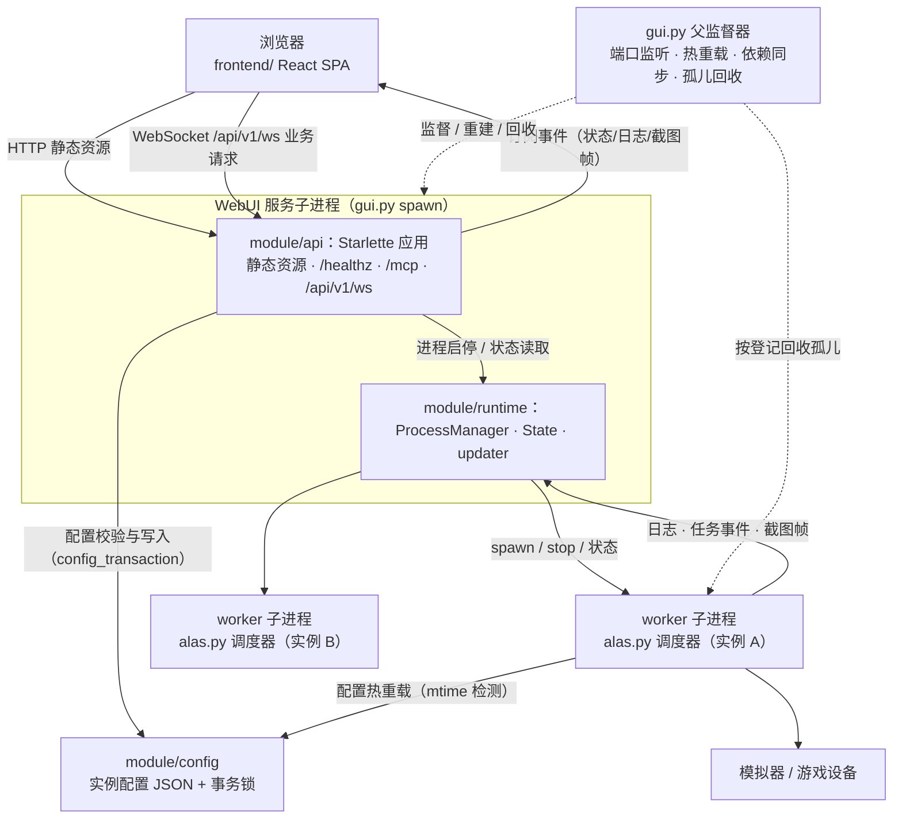
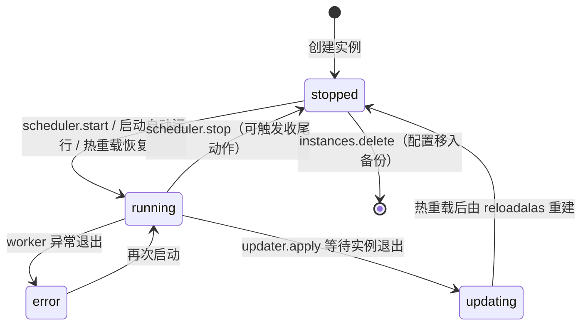
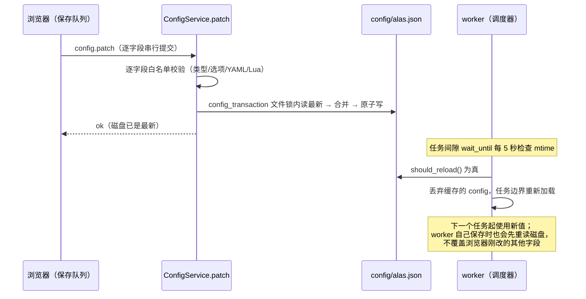

# WebUI 总览

> AzurPilot 的浏览器控制台体系：React 前端、WebSocket API、进程运行时与实例调度器四层协作，把「人在浏览器里点按钮」变成「一组互相监督的子进程安全地控制模拟器」。

## 1. 模块概述

WebUI 是用户与 AzurPilot 交互的唯一界面：创建与配置实例、编辑任务参数、启停调度器、查看日志与截图预览、查看分类统计、管理部署设置与程序更新。它按 7×24 小时运行设计，三条基本承诺贯穿整个体系：浏览器关闭不影响任务运行；程序自我更新不打断正在运行的实例；任何进程异常退出都不留下继续控制模拟器的孤儿。

WebUI 不是一个目录，而是一个跨四层协作的体系：

- **浏览器层（frontend/）**：React + TypeScript + Vite 的单页应用，纯静态资源，不含游戏业务；负责渲染、表单交互、主题与连接管理。
- **API 服务层（module/api/）**：Starlette ASGI 应用，托管静态资源、`/healthz` 与 `/mcp` 挂载，并以 `/api/v1/ws` 这一条 WebSocket 作为唯一业务通道。
- **运行时与进程层（module/runtime/ + gui.py）**：管理 worker（实例调度进程）的生命周期、更新事务、共享状态，以及 WebUI 自身的热重载与依赖同步。
- **调度器实例层（alas.py 子进程）**：每个配置实例一个 worker 进程，运行 `AzurLaneAutoScript.loop()`，真正控制设备。

这样拆分各自解决一个问题。前端与后端解耦：前端可以脱离 Python 用 mock 服务独立开发（见 frontend/README.md），构建产物由后端静态托管。协议与业务解耦：module/api 刻意做成薄适配层，测试可以用临时配置目录并关闭真实进程生命周期完整运行，不接触设备。进程与业务解耦：gui.py 父监督进程不导入游戏模块，更新替换源码与 `.venv` 时父进程仍存活，才能完成「同步依赖 → 重建服务 → 按恢复计划拉回实例」的自我更新闭环。

**历史**：2026-09 前后，旧版 PyWebIO 界面（`module/webui/` 的页面代码与 `webapp/`）整体移除，迁移到 React 前端 + WebSocket API v1；运行服务从旧 `module/webui` 迁往 `module/runtime`。`module/webui/` 现仅剩 `webui_prefs.py` 一个遗留文件（现状见第 16、17 节）。阅读 `.agent/` 下历史文档时注意这一迁移边界：旧架构的页面与协议代码已不存在。

本篇是 WebUI 文档体系的导航篇：画全貌、定边界、解释跨层机制；各层细节见 [WebUI 启动器](../entry/gui.md)、[API 服务](api.md)、[运行时服务](runtime.md)、[前端](frontend.md)。

## 2. 模块职责

### 负责（体系整体）

- 提供浏览器控制台全部能力：实例管理、任务配置、调度启停、日志、截图预览、统计、部署设置、启动偏好、更新器。
- 进程安全：worker 的启动、停止、状态追踪、身份登记与孤儿回收；WebUI 自身的监督、热重载与依赖同步。
- 跨进程配置一致性：WebUI 写配置与调度器读配置经同一把事务锁串行化（见第 8 节）。
- 认证与访问控制：WebSocket 会话认证、来源校验、本机免密、公网密码策略、远程访问隧道状态。
- 承载 MCP SSE 子应用（`/mcp`），与 WebUI 共享服务对象与密码（见 [MCP SSE 服务器](../entry/mcp-server.md)）。

### 不负责

- 游戏自动化业务本身：调度决策与游戏操作在 `alas.py` 与 `module/` 各业务模块（见 [调度器（alas.py）](../entry/alas.md)）。
- 设备、截图与 OCR 的实现：`module/device`、`module/ocr` 在 worker 进程内使用，WebUI 只消费结果。
- 游戏配置 schema 的定义与生成：`module/config/argument/`（见 [配置系统](../config.md)）。
- 统计数据的产生：`module/statistics` 由 worker 写入，WebUI 只读取与聚合展示。
- 游戏识别资源与坐标：`assets/` 与 1280×720 约束属于游戏识别体系，与 WebUI 布局无关。

### 四层职责边界

| 层 | 位置 | 职责 | 明确不做 |
| --- | --- | --- | --- |
| 浏览器 | `frontend/` | 页面渲染、表单与保存队列、主题语言偏好（localStorage/IndexedDB）、连接重连 | 不读写服务端文件，不实现业务规则 |
| API 服务 | `module/api/` | 协议收发、认证限流、参数白名单校验、业务编排、静态资源与 MCP 挂载 | 不管理进程生命周期细节，不做游戏业务 |
| 运行时与进程 | `module/runtime/`、`gui.py` | worker 生命周期、更新事务、共享状态、部署设置、预览通道、端口与监督 | 不解析协议，不校验业务参数 |
| 调度器实例 | `alas.py` worker 进程 | 运行 `AzurLaneAutoScript.loop()`，执行游戏任务 | 不直接对外提供网络接口 |

## 3. 模块位置

```text
AzurPilot/
├── gui.py                     # 第 3 层：父监督器 + WebUI 服务子进程入口
├── frontend/                  # 第 1 层：React SPA 源码，构建产物 dist/ 由服务托管
├── module/api/                # 第 2 层：Starlette 应用与 WebSocket v1 业务服务
│   ├── app.py                 #   create_app 工厂：路由、密码、lifespan、MCP 挂载
│   ├── protocol.py            #   v1 信封、错误码、pydantic 严格参数模型
│   ├── socket.py              #   Gateway（准入/认证）+ Session（会话/订阅/背压）
│   ├── router.py              #   业务方法显式注册表与分发
│   ├── config_service.py      #   实例白名单、配置校验与跨进程事务写
│   ├── runtime_service.py     #   实例状态/总览/增量日志/被动预览适配
│   ├── lifecycle.py           #   共享运行时的启动与逐项回收
│   └── static.py 等           #   静态资源、统计、更新、指挥喵等服务
├── module/runtime/            # 第 3 层：独立于界面的进程与状态服务
│   ├── process_manager.py     #   ProcessManager：worker 生命周期与状态机
│   ├── setting.py             #   State：跨进程状态、锁、SyncManager、依赖同步标记
│   ├── worker_registry.py     #   worker 持久化身份登记（cache/webui-workers.json）
│   ├── updater.py             #   更新与热重载事务的发起方
│   └── process_control.py 等  #   进程身份验证与终止、预览、部署设置、远程访问
├── module/webui/
│   └── webui_prefs.py         # 遗留文件：服务端界面偏好读写（现状见第 16/17 节）
├── alas.py                    # 第 4 层：worker 进程运行 AzurLaneAutoScript
├── mcp_server_sse.py          # MCP SSE 应用（独立运行，或挂载于 WebUI 的 /mcp）
└── config/deploy.yaml         # 部署配置：监听、密码、自动运行实例等
```

| 层 | 位置 | 文档 |
| --- | --- | --- |
| 浏览器 | `frontend/` | [前端](frontend.md)；协议与界面细节见 frontend/README.md、frontend/API.md |
| API 服务 | `module/api/` | [API 服务](api.md) |
| 运行时与进程 | `module/runtime/`、`gui.py` | [运行时服务](runtime.md)、[WebUI 启动器](../entry/gui.md) |
| 调度器实例 | `alas.py`（worker 进程内） | [调度器（alas.py）](../entry/alas.md) |

## 4. 核心入口

| 入口 | 用途 |
| --- | --- |
| `python gui.py`（`__main__`） | 整个体系的进程起点：按 `EnableReload` 分流监督模式或直连模式 |
| `gui.run_webui_supervisor()` / `gui.func()` | 父监督循环 / WebUI 服务子进程体 |
| `module.api.app.create_app` | ASGI 应用工厂，uvicorn 以工厂字符串加载 |
| `/api/v1/ws`（`Gateway.endpoint`） | 浏览器业务连接入口：Origin 校验、认证、会话 |
| `module.api.lifecycle.startup` / `clearup` | 应用 lifespan 钩子：共享运行时的启动与回收 |
| `ProcessManager.run_process` | worker 进程入口：初始化日志、预览与事件后运行调度器 |
| `AzurLaneAutoScript.loop` | worker 内的调度循环（游戏业务从这里开始） |
| `mcp_server_sse.create_app` | MCP 挂载件工厂，复用宿主的 ConfigService/RuntimeService |

追代码建议：自顶向下按「gui.py → create_app → Gateway/Session → Router → ConfigService/RuntimeService → ProcessManager → worker」的顺序读，每层细节见对应子文档。

## 5. 核心组件

| 组件 | 层 | 职责 | 详情 |
| --- | --- | --- | --- |
| `Gateway` / `Session` | API | 连接准入（Origin/Host 校验、32 连接上限）、认证限流；单连接会话的收发、订阅采样与背压 | [API 服务](api.md) |
| `Router` + `Method` 注册表 | API | 约 30 个业务方法的显式登记：参数模型、是否写操作（DEMO 只读拦截） | [API 服务](api.md) |
| `ConfigService` | API | 实例名白名单、配置读取、`config.patch` 字段校验与事务写、实例删除备份 | [API 服务](api.md) |
| `RuntimeService` | API | 实例状态、总览、增量日志、被动预览、资源时间线的适配层 | [API 服务](api.md) |
| `lifecycle.startup/clearup` | API | 应用 lifespan：初始化共享登记、启动更新调度/OCR/远程访问、按序回收 | [API 服务](api.md) |
| `ProcessManager` | 运行时 | 每实例一个管理器：启动/停止 worker、状态机、日志与预览队列转发 | [运行时服务](runtime.md) |
| `State`（setting.py） | 运行时 | 跨进程事件与锁、SyncManager、worker 登记所有权、部署配置缓存 | [运行时服务](runtime.md) |
| `worker_registry` | 运行时 | worker 与 owner 的持久化身份（PID + 创建时间），孤儿回收的依据 | [运行时服务](runtime.md) |
| `updater` | 运行时 | 更新事务：停实例 → 写恢复计划 → git → 置位重启/依赖同步事件 | [运行时服务](runtime.md) |
| `preview hub` | 运行时 | 截图帧中转：worker 编码 JPEG 后发布，WS 会话按订阅推送 | [运行时服务](runtime.md) |
| `config_transaction` | 配置 | 跨线程 + 跨进程的配置文件写事务锁 | [配置系统](../config.md) |
| `run_webui_supervisor` / `func` | 启动器 | 监督循环与服务子进程：端口、热重载、依赖同步、孤儿回收 | [WebUI 启动器](../entry/gui.md) |

## 6. 工作流程



浏览器与后端之间只有两类 HTTP 交互：加载静态资源，以及升级一条 `/api/v1/ws` WebSocket。此后一切业务都是 WS 请求-响应或订阅事件；TCP 断开不影响 worker 运行，浏览器重连后重新认证并重建订阅。

两条主线贯穿日常运行：

- **请求路径**：浏览器 `client.ts` 发送 request → `Session.reader` 校验信封（认证、限流、去重）→ `asyncio.to_thread` 调用 `Router.dispatch` → 委托 ConfigService / RuntimeService → 响应原路返回。写操作在 Router 注册表中显式标记，DEMO 模式统一拒绝。
- **事件路径**：`Session.producer` 约每 2 秒采样已订阅主题（instances / overview / logs），内容指纹变化才推送；preview 主题不轮询，worker 每产生一帧经 preview hub 推送一次。

## 7. 调用关系

### 上游

| 模块 | 关系 |
| --- | --- |
| 浏览器（用户） | 唯一常规交互方；静态资源 + 单条 WebSocket |
| Electron 桌面启动器 | 以 `--electron` 拉起 gui.py 并内嵌页面；免密信任逻辑见 `module/runtime/launcher_trust.py`（现状见第 17 节） |
| MCP 客户端 | 经 `/mcp` 挂载或独立 SSE 服务访问，与 WebUI 共享同一份服务对象与密码 |

### 下游

| 模块 | 用途 |
| --- | --- |
| `module/config` | 实例配置读写（跨进程事务）、args.json/menu.json/i18n 供界面渲染 |
| `module/runtime` | 进程管理、更新器、部署设置、预览、远程访问（WebUI 的业务后盾） |
| `module/statistics` | 统计数据源（只读聚合） |
| `deploy/frontend.py`、`deploy/uv.py` | 前端构建校验与依赖同步服务 |
| `module/ocr.rpc` | 部署设置开启时启动的 OCR server 进程 |
| `module/notify` | worker 异常时经 `notify_webui` 回调（现状见第 17 节） |

## 8. 数据流

### 配置写路径（跨进程事务）

「WebUI 写配置」与「调度器使用配置」的一致性是 WebUI 体系最关键的数据约束，由 `module/config/transaction.py` 的跨进程事务锁保证：

```text
浏览器字段输入 → 前端保存队列（逐字段串行、立即提交、断线续传）
    → WS config.patch → ConfigService.validate（类型/选项/日期/YAML/受限 Lua 白名单）
    → config_transaction（进程内 RLock + config/<name>.json.lock 文件锁，等待上限约 15 秒）
    → 锁内重读磁盘 → 合并本次修改 → 原子写回

worker（调度器进程）侧：
    AzurLaneConfig.save() 使用同一把 config_transaction 锁
    → 保存前重读磁盘，丢弃已被外部修改的字段（_discard_stale_changes），
      保证旧任务快照不覆盖浏览器刚保存的值
    运行间隙：ConfigWatcher.should_reload()（比较 mtime，每 5 秒）
    → 检测到变更后丢弃缓存的 config，任务边界重新加载
```

三层保证协同工作：同一把文件锁使两侧的「读-改-写」串行化；`_discard_stale_changes` 让后写方只合并自己的修改、不覆盖别人的字段；mtime 热重载让修改在任务边界生效而无需重启 worker。绕过 `ConfigService` 与 `AzurLaneConfig.save()` 直写 JSON 的外部脚本不受这套机制保护。

### 日志与截图流

```text
worker 日志（set_func_logger → 跨进程队列）
    → ProcessManager 日志线程（环形缓冲约 400 条）
    → RuntimeService.logs（对象身份定位增量 + 游标）
    → WS logs 订阅（每 2 秒采样，内容变化才发）

worker 截图（统一截图入口投递 RGB）→ preview 后台编码 JPEG → 有界队列（maxsize 2）
    → ProcessManager 预览线程 → preview hub（每实例保留最近一帧）
    → WS preview 事件（新帧触发，慢客户端新帧替换旧帧，绝不主动截图）
```

### 更新事务流

```text
updater.apply → 持 State.restart_lock → 停全部 worker
    → 写盘恢复计划（config/webui-dependency-sync-pending + config/reloadalas）
    → git 更新（成败都不回滚计划）→ 置位 dependency_sync_event + restart_event
    → clearup 回收共享运行时
父监督器（gui.py）：终止 WebUI 子进程树 → 以新代码重建依赖同步服务执行 uv sync
    → 重建前端 → spawn 新服务子进程 → lifespan 读 reloadalas 拉回更新前的实例
```

## 9. 状态模型

WebUI 体系中最核心的跨层状态是**实例（worker）状态**，由服务子进程内的 `ProcessManager.state` 维护，经 API 映射为字符串暴露给浏览器：



| 内部值 | API 状态 | 含义 |
| --- | --- | --- |
| 1 | `running` | worker 进程存活，`current_task` 指示正在运行的任务 |
| 2 | `stopped` | 未运行，或正常退出（含用户停止） |
| 3 | `error` | 异常退出（非零退出码或缺失最终结果） |
| 4 | `updating` | 因更新而退出，等待热重载恢复 |

状态属于服务子进程内的 `ProcessManager` 对象：WebUI 重启后管理器重建，状态从 `stopped` 重新开始，再由 `reloadalas` 名单恢复。状态机与锁的细节见 [运行时服务](runtime.md)。

另一组会话级状态在 WS 连接上：连接建立 → `session` 事件告知是否需要认证 → `auth.login` 后可用全部方法与订阅 → 断开后状态即消失（无跨连接重放，客户端重连后重新认证、重建订阅）。

## 10. 配置

WebUI 涉及三类配置，读写路径与生效时机各不相同：

| 类别 | 文件 | 读写方式 | 生效时机 |
| --- | --- | --- | --- |
| 实例任务配置 | `config/<instance>.json` | 浏览器 `config.patch`（白名单校验 + 事务写）；worker 经 `AzurLaneConfig` 属性绑定读写（路径 `Task.Group.Argument`，访问 `self.config.Group_Argument`） | worker 在任务边界 mtime 热重载，无需重启 |
| 部署配置 | `config/deploy.yaml` | `settings.get` / `settings.patch`；`DeployConfig.__setattr__` 属性写即落盘 | 监听、自动运行等重启服务后生效 |
| 界面偏好 | `config/webui_prefs.json` + 浏览器 localStorage / IndexedDB | 服务端读写见 `module/webui/webui_prefs.py`（遗留，见第 17 节）；主题、语言、背景等保存在浏览器 | 主题即时生效；服务端偏好下次读取生效 |

关键关联：

- `config/deploy.yaml` 的 `Webui.WebuiPort`（默认 25548）、`Webui.WebuiHost`、`Webui.WebuiSSLKey/SSLCert` 决定监听；CLI 参数优先。`Update.EnableReload` 决定是否有热重载监督。
- `Webui.Run`（或 CLI `--run`）列出启动时自动运行的实例，由应用 lifespan 消费。
- 公网监听且未设密码时自动生成 32 位随机密码，写入根目录 `password.txt` 并回写部署配置；本机连接免密。
- 实例配置的全部语义（参数、校验、翻译）来自 [配置系统](../config.md) 的生成产物，WebUI 不另立 schema。

## 11. 异常与错误处理

| 场景 | 表现 | 处理 |
| --- | --- | --- |
| 请求不合法 / 未认证 / 限流 | WS 错误响应（错误码见 frontend/API.md） | 单请求失败，连接保持；错误详情不回显输入 |
| 配置事务等锁超时（约 15 秒） | `TimeoutError` | 上抛为 `INTERNAL_ERROR` 响应；不产生部分写入 |
| worker 启动失败 | `START_FAILED` | 状态保持 stopped；登记不一致时保守拒绝启动防止重复 worker |
| worker 运行中崩溃 | 状态转为 `error`，退出原因保留在日志缓冲 | 不自动重启 worker（更新恢复除外），由用户决定 |
| WebUI 服务子进程崩溃 | 父监督器检测 | 有限重试（未稳定运行即退出最多 3 次），反复崩溃则父进程退出 |
| 更新失败 | 恢复计划已写盘 | 不回滚，父进程完成依赖同步后以一致环境重启 |
| 清理失败 | `clearup` 返回失败 | 父进程终止完整进程树并按登记回收，不带着活 worker 重启 |
| 孤儿 worker | 上次异常退出的残留进程 | 下次启动按持久化身份（PID + 创建时间）验证后回收；旧所有者存活则拒绝双开 |
| 慢客户端 | 会话发送队列达 32 条 | 以 1013 关闭连接，客户端重连续传 |

恢复语义分层：worker 内部的异常恢复（重试、重启模拟器）属于调度器与设备层，不归 WebUI；WebUI 负责的是进程级恢复——服务子进程崩溃由 gui.py 监督重试，worker 残留由登记回收兜底，配置写入要么完整生效要么不写（事务 + 原子替换）。

## 12. 并发与线程模型

WebUI 的并发模型按「进程分层、进程内分工」组织：

| 执行体 | 创建者 | 生命周期 |
| --- | --- | --- |
| gui.py 父监督循环 | 用户/启动器 | 常驻；监督重启事件与子进程存活，Ctrl+C 或反复失败后退出 |
| WebUI 服务子进程（名 `gui`） | 父进程 spawn | uvicorn 事件循环所在进程；热重载/崩溃时被终止重建 |
| 依赖同步服务进程（daemon） | 父监督器 | 空闲等待队列请求；父进程死亡时自行退出 |
| SyncManager 子进程 | 服务子进程内 `State.init()` | 承载跨进程 Queue/Event/dict；`State.clearup()` 关闭 |
| worker 进程 × 实例 | `ProcessManager.start` | 运行调度循环；退出码与退出原因经队列回传 |
| OCR server 进程（可选） | `lifecycle.startup` | 按部署设置启停 |

服务子进程内部的关键并发点：

- **uvicorn 事件循环**（单线程 asyncio）：每个 WS 会话 4 个协作任务（reader / writer / producer / preview）。阻塞业务经 `asyncio.to_thread` 抛给线程池（并发受信号量 8 限制），会话对象本身只在事件循环线程操作。
- **worker 队列线程**：每个运行中的 worker 有两条 daemon 线程消费跨进程队列——日志（进 renderables 环形缓冲）与预览帧（转投 preview hub）。队列与锁按 `run_id` 绑定轮次，旧线程不会污染新一轮。
- **TaskHandler 线程**：`lifecycle.startup` 注册的更新检查/定时更新循环与远程访问保活。

锁与所有权要点（细节见 [运行时服务](runtime.md)）：

- `State.restart_lock`（RLock）：更新事务全程持有；`ProcessManager.start` 非阻塞获取失败即拒绝启动，保证更新/清理期间不冒出新 worker。
- `ProcessManager` 的类级 `_managers_lock` + 每实例生命周期 RLock + `_runtime_lock`/`_queue_lock`：实例状态与队列的轮次一致性。
- `ConfigService.lock`（进程内）+ `config_transaction` 文件锁（跨进程）：API 与 worker 写同一份配置的完整串行化。
- `worker_registry` 文件锁 + 进程内锁：父监督器（回收）与服务子进程（注册/注销）并发读写登记安全。

## 13. 缓存与持久化

| 文件 | 写入者 | 读取者 | 说明 |
| --- | --- | --- | --- |
| `config/<instance>.json` | API（config.patch/delete）与 worker（save），共用事务锁 | 双方 | 实例配置；删除时移入 `config/backup/` |
| `config/deploy.yaml` | `DeployConfig.__setattr__` | `State.deploy_config` | 部署设置，属性写即落盘 |
| `config/webui_prefs.json` | `module/webui/webui_prefs.py` | 同左 | 服务端界面偏好（遗留，见第 17 节） |
| `config/webui-dependency-sync-pending` | updater | 父监督器 | 存在即要求启动前完成依赖同步 |
| `config/reloadalas` | updater | `ProcessManager.restart_processes` | 热重载后待恢复实例名单，恢复后删除 |
| `cache/webui-workers.json` | 服务子进程（登记） | 父监督器（回收/认领） | worker 身份登记（PID + 创建时间），原子写 + 文件锁 |
| `password.txt` | `ensure_password_for_host` | 用户 | 公网自动生成的访问密码 |
| `frontend/dist/` | `ensure_frontend`（npm build） | StaticFiles | 前端产物；`.source-fingerprint` 命中则跳过构建 |
| `log/gui.txt`、`log/<instance>.txt` | 服务子进程 / worker | 排障 | 午夜轮转的文件日志 |

内存态：`ProcessManager.renderables`（日志环形缓冲，约 400 条裁剪）、`RuntimeService.logs_cache`（增量游标）、`preview hub`（每实例最近一帧）、`Session.cache`（订阅内容指纹）均为服务子进程内易失状态，随进程重建消失；持久真相一律落盘。

## 14. 生命周期

1. **启动**：用户运行 `python gui.py` → 强制 spawn 启动方式 → 按 `EnableReload` 分流。热重载模式下父监督循环：孤儿 worker 回收 →（按需）依赖同步 → 前端构建校验 → spawn 服务子进程 → 等待就绪事件。
2. **服务子进程初始化**：uvicorn 加载 `create_app` → 解析密码（必要时生成）→ 组装路由与 MCP 挂载 → lifespan `startup`：`State.init`（SyncManager、认领 worker 登记所有权）→ 注册更新循环 → 可选 OCR server / 远程访问 → 按 `--run`/`Webui.Run`/`reloadalas` 拉起实例 worker。
3. **运行**：浏览器连接、认证、订阅；worker 由 API 启停；配置修改经事务落盘并在 worker 任务边界生效。
4. **更新热重载**：见第 8 节更新事务流；父进程重建子进程，应用以新代码重新 import。
5. **退出**：lifespan `finally` 依次等待 MCP 在途操作结束、关闭 Discord RPC、`clearup` 逐项回收（任务线程、OCR、SSH、全部 worker）；父监督器 finally 终止 WebUI 进程树与依赖同步服务。清理不彻底时保留登记，由下次启动回收。

延迟初始化贯穿始终：uvicorn、前端构建、游戏模块全部推迟到确有需要时；gui.py 父进程保持极简，这正是它能在更新换环境中存活的前提。

## 15. 扩展方式

### 新增 WebUI 业务能力的固定流程

1. 在 `module/api/protocol.py` 定义严格参数模型。
2. 在业务服务（`module/api/*_service.py` 或 `module/runtime/`）实现操作。
3. 在 `module/api/router.py` 显式登记方法与是否写操作。
4. 运行 `uv run python -m dev_tools.export_api_schema` 重新生成 `frontend/src/api/generated.ts` 与 `contract.json`。
5. 更新前端响应类型、frontend/API.md 与真实 WebSocket 回归测试。

v1 只允许兼容性新增；删除方法或更改语义需要新版本路径。

### 什么改动放哪一层

| 想做的事 | 改哪里 | 注意 |
| --- | --- | --- |
| 新增/调整界面页面与交互 | `frontend/src/pages`、`src/components` | 只经 WS API 与后端通信；界面偏好存浏览器 |
| 新增业务方法（查询或写操作） | `module/api/protocol.py` + 服务实现 + `router.py` 登记 | 写操作须登记 `mutates`，参数模型先行 |
| 新增进程管理、更新、认证能力 | `module/runtime/` | 保持独立于界面，可脱离 API 测试 |
| 新增部署设置项 | `module/runtime/deploy_settings.py` 与 deploy 模板 | 经 settings 接口暴露，重启生效类要注明 |
| 新增游戏配置参数 | `module/config/argument/` 六个 YAML + 重新生成 | 前端表单自动跟随，不改前端代码 |
| 新增游戏自动化功能 | `module/` 各业务模块 | WebUI 只是触发与展示方，不承载业务 |
| 新增 MCP 工具 | `mcp_server_sse.py`（复用注入的服务对象） | 关闭顺序须等待在途操作 |

## 16. 修改注意事项

- **层间边界是刻意的**：前端不直接读写服务端文件；module/api 不做游戏业务、不绕过 ConfigService 直写配置；module/runtime 不解析 WebSocket 协议。跨层协作只能经 API 方法或共享服务对象，防止逻辑在层间复制。
- **配置写入只有两个合法入口**：`ConfigService.patch/delete`（API 侧）与 `AzurLaneConfig.save`（worker 侧），都必须持有 `config_transaction` 事务锁。绕开直写 JSON 会与热重载、并发保存竞态。
- **生成产物红线**：`frontend/src/api/generated.ts`、`contract.json`、`args.json`、`menu.json`、`config_generated.py`、`template.json` 均由生成器维护，禁止手改；CI 重新生成并 diff 校验。
- **不要把业务或重活搬进 gui.py**：父进程保持不导入游戏模块与 uvicorn，才能在更新替换源码与 `.venv` 后继续监督重建；`func` 里 uvicorn 启动前的耗时初始化直接吃掉 120 秒就绪预算。
- **`module/webui/` 只剩 `webui_prefs.py`，不要在旧路径新增代码**：新的界面服务端逻辑进 `module/api` 或 `module/runtime`。webui_prefs.py 是 2026-09 迁移后仅存的遗留文件（服务端界面偏好读写，存 `config/webui_prefs.json`，与配置 schema 刻意解耦）；截至 2026-09 它在当前 Python 与前端代码中已无调用方——其消费方随旧版总览面板切换功能一并移除，新功能不应再挂靠此文件。
- **worker 回收的身份验证与终止顺序**（PID + 创建时间验证、先根后 worker）是安全约束，不是风格；绕过会在 PID 复用时误杀无关进程或留下重复控制模拟器的残留。
- **不要给业务加 REST 端点**：WS v1 是唯一业务通道，HTTP 只保留静态资源、`/healthz` 与自包含报告页；协议演进走 v1 兼容新增。
- 1280×720 是游戏识别约束，不约束 WebUI 布局。

## 17. 已知限制

- **业务无 HTTP 回退**：全部业务在一条 WebSocket 上，反向代理必须支持 Upgrade 并保留外部 Host/Origin；WS 不通则无任何业务能力。
- **无跨连接事件重放**：重连后重新认证并重建订阅，服务不提供历史事件重放；日志靠游标增量，落后过多元数据会触发 reset。
- **配额是硬限制**：32 个并发连接、单连接 30 请求/秒、单请求 1 MiB、单连接近 128 个请求 ID 去重——超限是拒绝而非排队。
- **直连模式无热重载**：`EnableReload=false` 时没有监督器与重启通道，更新器拒绝执行需要重载的更新。
- **迁移遗留未清理**：`module/webui/webui_prefs.py`（及 `config/webui_prefs.json`）与 `module/runtime/launcher.py`（`LauncherControl`）、`launcher_trust.py` 在当前活跃代码中没有调用方——前者消费方随旧版总览面板功能移除，后两者是启动器命令通道的实现，尚未接入 `create_app`。`notify_webui` 仍向 `http://127.0.0.1:<port>/api/notify` 发 POST，但当前 `create_app` 未注册该端点，调用会静默失败。
- **预览是被动快照**：API 不主动截图；worker 未运行或未产生新帧时保持最后画面或空。

## 18. 示例

一次典型的「浏览器改配置 → 调度器生效」全链路：



启动一个实例的路径：浏览器 `scheduler.start` → Router（写操作，DEMO 拦截）→ RuntimeService.start → 持实例生命周期锁 → `ProcessManager.start`（非阻塞获取 restart/cleanup 锁，验证登记，spawn worker）→ worker 初始化日志与预览后进入 `AzurLaneAutoScript.loop()` → 状态经 2 秒采样回传浏览器。

## 19. 调试方法

- **服务是否就绪**：访问 `/healthz`，返回 `{"status": "ok", "protocolVersion": 1}` 表示 uvicorn 已监听。
- **日志入口**：`log/gui.txt`（服务子进程，午夜轮转）；`log/<实例名>.txt`（各 worker）；父监督器以 `[GUI]` 前缀输出到控制台。业务异常在服务日志带 `WebSocket API 执行失败` 标题。
- **连接问题**：1008=Origin 不符，1013=连接超限或客户端读取过慢；30/60 秒读超时静默断开，客户端靠 15 秒一次 `system.ping` 保活。先看浏览器 console，再对照 `log/gui.txt`。
- **进程残留**：查 `cache/webui-workers.json` 的 owner/worker 登记与 PID 存活情况；确认无残留后可删除该文件（损坏时系统按空登记自愈）。
- **更新问题**：`updater.status` 的 `error`/`busy`/`canApply` 是唯一状态窗口；`config/webui-dependency-sync-pending` 存在表示上次更新后依赖同步未完成，`config/reloadalas` 是待恢复实例名单。
- **前端问题**：先用 mock 模式复现（`npm run dev:mock --prefix frontend`，无需 Python 与模拟器）；类型对不上先重跑 `uv run python -m dev_tools.export_api_schema` 再查是否手改了生成物。
- **测试**：后端 `uv run python -m unittest tests.test_api tests.test_api_lifecycle tests.test_webui_worker_registry tests.test_config_transaction` 等；前端 `npm run typecheck --prefix frontend`、`npm test --prefix frontend` 与两套 Playwright e2e（主配置连临时 Python 后端并禁真实任务，mock 配置纯前端）。

## 20. 相关模块

- [WebUI 启动器](../entry/gui.md) —— 监督循环、双栈监听、热重载与依赖同步：本体系的进程骨架。
- [API 服务](api.md) —— Starlette 应用组装、WS v1 协议、认证与业务编排。
- [运行时服务](runtime.md) —— `ProcessManager`、`updater`、`State`、登记与预览等被消费的实现。
- [前端](frontend.md) —— React 控制台索引；协议与界面细节见 frontend/API.md 与 frontend/README.md。
- [MCP SSE 服务器](../entry/mcp-server.md) —— 挂载于 `/mcp` 的对外集成，共享服务对象与密码。
- [调度器（alas.py）](../entry/alas.md) —— worker 进程内运行的调度循环。
- [配置系统](../config.md) —— 实例配置的 schema 来源、生成器与事务锁的实现方。
