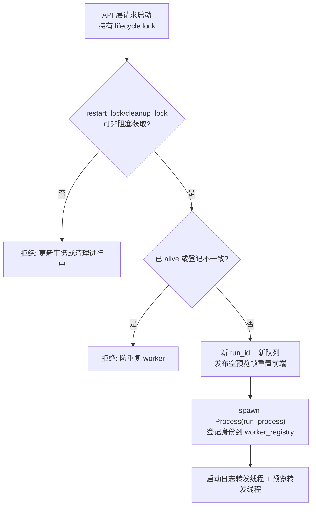
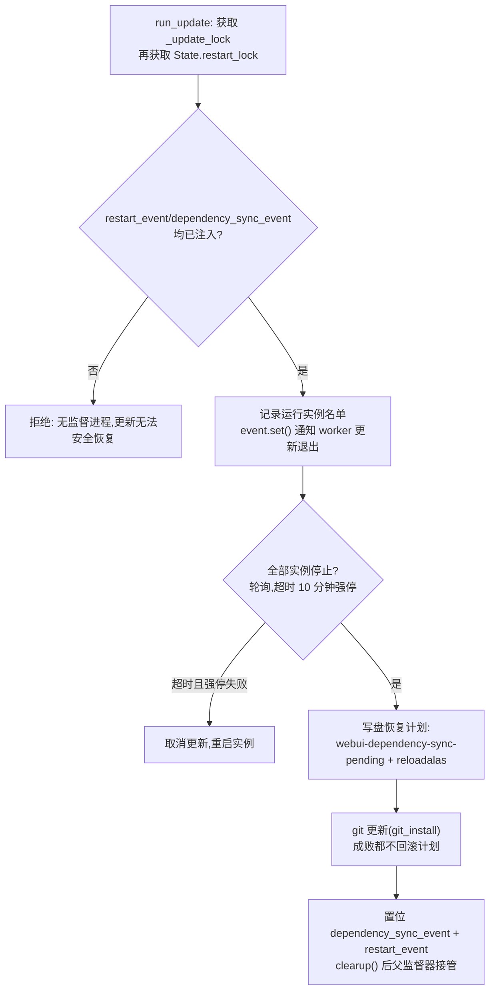
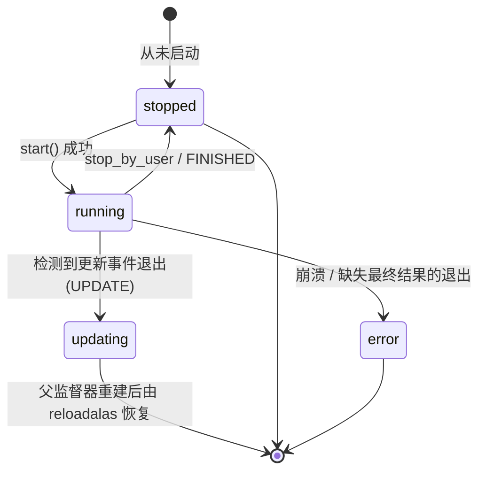

# 运行时服务（module/runtime）

> WebUI 服务子进程内的「进程与后台服务层」：管理每个配置实例的 alas worker 进程、驱动更新事务、调度 WebUI 后台任务、转发日志与截图预览，并为 MCP/远程访问/密码等横切能力提供实现；进程与状态归它管，HTTP 协议归 `module/api`，端口与监督归 `gui.py`。

## 1. 模块概述

`module/runtime` 是 WebUI 服务子进程里的运行时层。浏览器在 `module/api` 看到的「启动实例」「停止实例」「实例状态」「更新」等操作，最终都落到这里的 `ProcessManager` 与 `updater`；worker 进程与 WebUI 之间的日志、任务事件、截图帧也由本模块的队列与登记机制搬运。

它的存在源于一个核心矛盾：调度器（`alas.py`）按 7×24 小时设计，运行中可能卡死、崩溃、被更新打断；而 WebUI 自身也要在更新后整体重建。如果把调度器直接跑在 WebUI 进程的线程里，任何一次设备异常都会威胁控制台本身，更新也无法安全进行。因此本模块把调度器放进**每实例一个的独立进程**（spawn），WebUI 只持有进程句柄、跨进程队列和一份持久化的身份登记，负责启动、停止、状态投影和异常后的兜底回收。

模块内的另一条主线是**更新事务**。更新要改写源码与 `.venv`，运行中的 worker 和 WebUI 都无法「给自己换环境」。`updater` 把这件事编排成多步事务：通知 worker 在任务边界自行退出 → 等待全部实例停止（超时强停）→ 把恢复计划写盘 → 执行 git 更新 → 置位重启与依赖同步事件，把收尾交还给 `gui.py` 父监督器。整条链路用 `State.restart_lock` 串行化，手动启停不能插入中途。

第三条线是**身份与安全**。进程终止若只看 PID，在操作系统复用 PID 时可能误杀无关进程；worker 登记与终止因此一律以「PID + 进程创建时间」二元组验证身份（`process_control`、`worker_registry`）。MCP 工具集把停止实例、改配置、git pull 等破坏性操作直接暴露在 HTTP 上，`mcp_auth` 单独做一层鉴权；密码策略、本机免密判定、远程访问隧道标记则集中在 `password_utils`，供 WebUI 与独立 MCP 共用。

## 2. 模块职责

### 负责

- 实例 worker 进程的完整生命周期：启动（`ProcessManager.start`）、用户停止（`stop_by_user`，含停止后收尾动作）、无收尾停止（`stop`）、状态查询（`state`/`alive`）与日志/任务事件的队列转发。
- worker 身份登记与孤儿恢复：`worker_registry` 维护 `cache/webui-workers.json`，配合 `gui.py` 的孤儿回收与「拒绝第二个 WebUI」判定。
- WebUI 后台任务调度：`TaskHandler` 驱动更新检查、每日定时更新与远程访问保活。
- 更新流程：`updater` 检查上游、编排停止-更新-重启事务，`module/api/update_service.py` 只是它的 WebUI 门面。
- 被动截图通道：`preview.py` 接收 worker 截图、后台编码 JPEG、按实例保留最新帧。
- 横切安全能力：`mcp_auth`（MCP 鉴权与会话）、`password_utils`（密码策略与本机判定）、`launcher_trust`（启动器信任令牌）。
- 远程访问：`remote_access.py` 的 SSH 反向隧道与 WebRTC P2P 两种 provider 及自动切换。
- 部署设置：`deploy_settings` 定义表单 schema 与校验，`config.py` 的 `DeployConfig` 把属性赋值自动落盘到 `deploy.yaml`。
- 共享状态根：`setting.py` 的 `State`（跨进程事件、SyncManager、进程注册表）。
- 停止后收尾：`scheduler_stop` 在独立进程中执行返回主页/关游戏/关模拟器。

### 不负责

- HTTP/WS 协议、路由、认证会话：`module/api`（见 [API 服务](api.md)）。
- 监听端口、热重载监督、依赖同步服务：`gui.py`（见 [WebUI 启动器](../entry/gui.md)）。
- 调度器内部的任务排序与游戏逻辑：`alas.py`（见 [调度器](../entry/alas.md)）；本模块只投递退出事件，不干预任务执行。
- 配置的语义校验与迁移：`module/config/`；`deploy_settings` 只管部署设置的白名单与类型。
- MCP 协议与工具实现：`mcp_server_sse.py` 与 `module/mcp/`（见 [MCP SSE 服务器](../entry/mcp-server.md)）；本模块只提供它们调用的鉴权与进程服务。

## 3. 模块位置

```text
module/runtime/
├── __init__.py            # 导入 logger 并注入 deploy.logger（必须最先加载）
├── process_manager.py     # ProcessManager：worker 进程池、状态、日志/预览转发
├── process_control.py     # 进程身份（PID+create_time）验证与分级终止
├── worker_registry.py     # cache/webui-workers.json 的登记事务（文件锁 + 原子写）
├── worker_events.py       # TaskEvent/ExitEvent/WorkerResult：worker 事件协议
├── task_handler.py        # TaskHandler/Task：WebUI 侧后台任务循环
├── updater.py             # Updater：更新检查与停止-更新-重启事务
├── setting.py             # State：跨进程状态、依赖同步 pending 标记
├── config.py              # WebUI 版 DeployConfig：赋值即落盘
├── deploy_settings.py     # 部署设置 schema、启动运行项读写
├── preview.py             # PreviewHub：被动截图最新帧分发
├── scheduler_stop.py      # 手动停止后的收尾动作（独立进程执行）
├── remote_access.py       # SSH / WebRTC 远程访问 provider
├── mcp_auth.py            # MCP 鉴权：凭据提取、常数时间比对、会话表、日志脱敏
├── password_utils.py      # 密码生成/校验、本机判定、远程访问标记头
├── launcher.py            # LauncherControl：外部启动器命令通道（当前未接线）
├── launcher_trust.py      # 启动器信任免密令牌（当前未接线）
├── discord_presence.py    # Discord Rich Presence（pypresence 异步客户端）
└── event_calculator.py    # Wiki 活动计算器数据服务（当前无前端消费者）
```

| 文件 | 作用 |
| --- | --- |
| `process_manager.py` | 本模块核心。`run_process` 是 worker 进程入口，`ProcessManager` 是 WebUI 侧的管理器 |
| `process_control.py` | `process_matches`（True 同一进程 / False PID 复用 / None 已消失）、`stop_process_tree` 分级终止 |
| `worker_registry.py` | `claim_owner`/`register_worker`/`get_workers` 等登记事务；损坏文件按空登记自愈 |
| `task_handler.py` | `TaskHandler` 条件变量调度循环；`get_next_time` 把「今日 HH:MM」换算为秒数 |
| `updater.py` | `updater` 模块级单例；状态机与事务编排 |
| `setting.py` | `State` 类属性容器；`mark/is/clear_dependency_sync_pending` 持久化标记 |
| `deploy_settings.py` | `DEPLOY_GROUPS` 字段定义 → `deploy_settings_schema`/`save_deploy_settings` |
| `mcp_auth.py` | `authorize` 集中判定；`register_session`/`expire_session`；`redact` + uvicorn 过滤器 |

## 4. 核心入口

| 入口 | 用途 |
| --- | --- |
| `ProcessManager.get_manager(config_name)` | 外部进入点：不存在则创建管理器（`module/api/runtime_service.py`、MCP 均经此） |
| `ProcessManager.start/stop/stop_by_user` | worker 生命周期操作；`runtime_service.start/stop` 与 MCP `start_instance/stop_instance` 的落点 |
| `ProcessManager.running_instances()` / `restart_processes()` | 枚举运行实例；应用 lifespan 启动与更新恢复时拉起 worker |
| `updater.check_update()` / `run_update()` | 更新检查与事务执行；由 `TaskHandler` 任务与 `update_service` 触发 |
| `module.api.lifecycle.startup/clearup`（消费方） | 应用 lifespan 调用 `State.init()`、装载 `TaskHandler` 任务、逐项回收 |
| `mcp_auth.authorize(path, method, headers, query_string)` | MCP ASGI 层的唯一鉴权判定 |
| `State.init()` / `State.clearup()` | 共享状态（Manager、登记所有权）的创建与销毁 |
| `worker_registry.claim_owner(pid)` | WebUI 服务子进程启动时原子认领登记所有权 |
| `load_event_calculator()` / `LauncherControl` | 预留服务（见第 17 节） |

追代码建议：先读 `process_manager.py` 的 `start` → `run_process` → `_run_process` 三段（一次 worker 启动的完整路径），再读 `state` 属性（状态合成逻辑），最后按需展开 `updater.run_update` 的事务链。

## 5. 核心组件

### ProcessManager（process_manager.py）

每个配置实例一个，由类级字典 `_processes`（`_managers_lock` 保护）持有；另按配置名维护实例级 `_lifecycle_lock`（RLock），所有生命周期操作（start/stop/state/alive）都必须持锁，保证跨线程安全。

| 字段/方法 | 说明 |
| --- | --- |
| `_process: Process` | 当前轮 worker 的 multiprocessing 句柄；`is_process_alive` 只信它 |
| `run_id` | 每轮启动生成的 `uuid4().hex`；队列事件都携带它，旧轮迟到事件被丢弃 |
| `_renderable_queue` | SyncManager Queue；worker 的日志行、`TaskEvent`、`ExitEvent` 都走它 |
| `_preview_queue` | 每轮独立的有界队列（maxsize=2）；worker 编码后的 JPEG 帧 |
| `renderables` | 日志环形缓冲，上限 400 条，超出裁剪到 80 条 |
| `current_task` / `exit_result` | 当前任务名（`TaskEvent.command`）与最终结果（`WorkerResult`） |
| `_registered_worker()` | 读取并验证登记身份（PID + 创建时间 + owner 归属），返回 `(pid, record, verified)` |
| `set_state_override()` | 临时覆盖 `state` 返回值，仅供界面图标测试 |

### State（setting.py）

类属性形式的共享状态容器。`init()` 创建 `multiprocessing.Manager()`（SyncManager 子进程，承载跨进程 Queue/dict/Event）、把 `process_registry` 指向 `manager.dict()`，然后 `claim_owner(os.getpid())` 原子认领登记所有权——认领失败（旧 owner 或其 worker 仍存活）则关闭 Manager 并中止启动。`clearup()` 在确认无存活 worker 登记后关闭 Manager 并清除 owner。

| 字段 | 类型 | 说明 |
| --- | --- | --- |
| `restart_event` | `multiprocessing.Event` | 子进程（updater）置位 → 父监督器终止并重建 WebUI |
| `dependency_sync_event` | `multiprocessing.Event` | 置位表示重建前必须先执行依赖同步 |
| `restart_lock` / `cleanup_lock` | `RLock` / `Lock` | 更新事务与清理期间拒绝启动新 worker |
| `manager` / `process_registry` | SyncManager / dict 代理 | 跨进程队列与 PID 缓存的载体；clearup 后置 None |
| `deploy_config` | `cached_class_property` | 各进程内惰性创建的 `DeployConfig` 单例 |

### TaskHandler（task_handler.py）

WebUI 侧的后台任务调度器（与游戏侧的任务调度无关）。单例在 `module/api/lifecycle.py` 创建，`loop()` 必须运行在独立线程：按 `next_run` 排序取最早任务，未到点用 `Condition.wait(timeout)` 休眠，增删任务时 `notify` 立即唤醒。`add()` 接受 Callable（经 `get_generator` 包装成「先预热、再周期执行」的生成器）或生成器；生成器第一个 `yield` 收到 TaskHandler 本身，可据此调整自身 `delay` 或自移除（`th.remove_current_task()`）。每次执行后 `next_run = time.time() + delay`——从当前时间重新计时，系统休眠或阻塞后**不补跑**已过期的周期任务。

`get_next_time(t)` 返回今日（或次日）`t` 时刻距现在的秒数，供 `updater.schedule_update` 做「每日 HH:MM」对齐。

### Updater（updater.py）

同时继承 `module/runtime/config.py` 的 `DeployConfig`（读 `deploy.yaml`）与 `deploy/git.py` 的 `GitManager`（git 操作）。模块级单例 `updater` 的 `event`（SyncManager Event）在 lifespan 中注入：它既传给 worker 作为 `AzurLaneConfig.stop_event`（通知更新退出），也在 `run_process` 里用于把退出结果归类为 `WorkerResult.UPDATE`。

### worker 事件协议（worker_events.py）

`TaskEvent(run_id, command)` 与 `ExitEvent(run_id, result)` 经日志队列传递。worker 侧 `initialize(sink, run_id)` 安装输出通道，`alas.py` 每次执行任务前 `set_task(命令名)`、finally `set_task(None)`——WebUI 的 `current_task` 由此而来，是从结构化事件而非日志文字推测的可靠边界。

### 进程身份与终止（process_control.py）

`process_matches(record)` 用 psutil 比对 `pid + create_time`（0.01 秒容差），三值语义避免了「只看 PID」在复用场景下的误杀。`stop_process_tree` 先记录后代再逐个 `_kill_record`（每次发信号前重验创建时间），Windows 根进程用 `taskkill /T /F`，本地句柄保留 terminate→kill 升级与 `join` 回收语义。它不调用 `wait()`，避免抢走 multiprocessing 的 `waitpid` 结果。

## 6. 工作流程

### worker 启动（runtime_service.start → ProcessManager.start）



### worker 内部（run_process → _run_process）

worker 是 spawn 的全新解释器：初始化文件日志（`log/{配置名}.txt`）、把 `set_func_logger(q.put)` 接到日志队列、初始化 preview 编码线程，然后按 `func` 分发——`alas` 走完整调度循环 `AzurLaneAutoScript(config_name).loop()`；`get_available_func()` 中的任务（Daemon、MeowfficerScore 等）走单任务 `run()`；`maa`/`fpy` 走 submodule。传入的 `ev`（updater.event）同时挂到 `AzurLaneConfig.stop_event` 与 `AzurLaneAutoScript.stop_event`，调度器在任务边界与 `wait_until` 轮询中检测到置位后 `exit(0)`；`run_process` 捕获 `SystemExit`，若 `ev.is_set()` 则最终结果为 `UPDATE`，否则 `FINISHED`。任何异常路径都以 `q.put(ExitEvent(run_id, result))` 收尾，保证 WebUI 不会把「无结果的退出」误判为停止。

### 状态合成（state 属性）

`state` 整轮持有 lifecycle lock，避免把旧句柄的退出码用于新轮事件：先看测试覆盖（`_state_override`），再 `alive` → 1（运行中）；退出后按 `exit_result` 与 `exitcode` 合成——`MANUAL_STOP` → 2、非零退出码 → 3、`UPDATE` → 4、`FINISHED` → 2；从未启动的实例默认 2；**有 run_id 但缺失最终结果的退出一律 3（异常）**。前端看到的 `running/stopped/error/updating` 四态即此映射（`runtime_service.STATES`）。

#### 后端退出状态与合成决策表

| 判定优先级 | 判定条件 | `exit_result` | 句柄 `exitcode` | 内部 `state` | API 状态 (`status`) | 前端含义 / UI 表现 |
| :---: | :--- | :--- | :--- | :---: | :---: | :--- |
| **1** (最高) | `_state_override is not None` | 任意 | 任意 | 1 / 2 / 3 / 4 | 对应映射 | 开发调试覆盖（仅供状态徽章图标测试，默认 10 秒超时） |
| **2** | `alive == True` (句柄存活或已登记 PID 存活) | 任意 | - | `1` | `'running'` | **运行中**（绿标，展示当前任务 `currentTask`） |
| **3** | `exit_result == WorkerResult.MANUAL_STOP` | `manual_stop` | 任意 (通常为负值/信号终止) | `2` | `'stopped'` | **已停止**（用户点击停止，触发收尾动作） |
| **4** | `isinstance(exitcode, int) and exitcode != 0` | 任意 (除 manual_stop 外) | 非 0 (如 1, -9 等) | `3` | `'error'` | **异常**（红标，子进程非零退出码，如代码崩溃或被 OOM 强杀） |
| **5** | `exit_result == WorkerResult.UPDATE` | `update` | 0 或 None | `4` | `'updating'` | **更新中**（蓝标/旋转动画，等待代码拉取与重启） |
| **6** | `exit_result == WorkerResult.FINISHED` | `finished` | 0 或 None | `2` | `'stopped'` | **已停止**（单次任务正常完成或调度循环正常退出） |
| **7** | 未启动 (`run_id is None and exit_result is None and not _worker_observed`) | `None` | `None` | `2` | `'stopped'` | **未运行**（初始待机状态，尚未启动任何任务） |
| **8** (兜底) | 缺失最终结果或显式异常 (`run_id` 存在但缺失结果，或结果为 `error`) | `error` 或 `None` | 0 或 None | `3` | `'error'` | **异常**（红标，丢失 ExitEvent 或执行中抛出未捕获异常） |

#### Worker 退出事件与最终结果协议（WorkerResult）

| 枚举值 (`WorkerResult`) | 字符值 | 触发场景 | 子进程退出码 | 最终流转与处理 |
| :--- | :--- | :--- | :---: | :--- |
| `FINISHED` | `"finished"` | 单任务 (`run()`) 成功完成；无更新事件正常退出；演示模式结束 | 0 | 实例状态合成为 `stopped` (2) |
| `MANUAL_STOP` | `"manual_stop"` | 用户点击 WebUI「停止」按钮触发 `stop_by_user()` | 信号杀灭 (负值或 15) | 实例状态合成为 `stopped` (2)，启动独立收尾进程（回主界面/关游戏/关模拟器） |
| `UPDATE` | `"update"` | 更新器置位 `updater.event`，worker 在任务边界安全退出 (`exit(0)`) | 0 | 实例状态合成为 `updating` (4)，更新器等待实例全停后执行 git 更新与依赖同步 |
| `ERROR` | `"error"` | 任务返回 `False`/`"recoverable"`；模块加载失败；抛出未捕获异常；子进程异常退出导致缺失 ExitEvent | 非 0 或异常 | 实例状态合成为 `error` (3)，前端标红提示人工检查日志 |

#### 后端各层进程退出码汇总表

| 进程层级 | 退出码 | 常量/触发源 | 场景说明 |
| :--- | :---: | :--- | :--- |
| **WebUI 监督父进程** (`gui.py`) | `0` | 正常退出 | 用户按下 Ctrl+C (`KeyboardInterrupt`) 或非重载模式下正常退出 |
| **WebUI 监督父进程** (`gui.py`) | `70` | `EXIT_STARTUP_FAILURE` | 启动或热重载恢复致命失败（残留 worker 无法回收、依赖同步失败、前端构建失败、子进程连续启动/监听失败、反复意外崩溃超过 3 次等） |
| **Worker / 调度器** (`alas.py`) | `0` | 正常更新退出 | 调度器检测到 `stop_event.is_set()`，跳出主循环安全退出 |
| **Worker / 调度器** (`alas.py`) | `1` | 致命异常退出 | 缺少配置文件 (`is_oobe_needed`)、敏感任务失败 (`_check_sensitive_exit`)、连续代码错误超限 (`ScriptError`) |
| **Worker / 调度器** (`alas.py`) | *(不退出)* | 容错自愈循环 | 游戏卡死 (`GameStuckError`)、客户端崩溃 (`GameBugError`)、网络断开等，通过重启模拟器 + 注入 `Restart` + 指数退避 (20s~300s) 持续自愈 |
| **停止收尾进程** (`process_manager.py`) | `0` / 非0 | `Optimization_WhenSchedulerStopped` | 执行 `stay_there` / `goto_main` / `close_game` / `close_emulator`，限时 30 秒超时强杀 |

### 手动停止与收尾（stop_by_user）

该入口仅供 WebUI 停止按钮使用；更新、WebUI 清理与 MCP 调用 `stop()`，**不会**触发收尾。停止流程在 lifecycle lock 内验证登记身份（未验证的 PID 拒绝发信号）、按进程树终止 worker、注销登记、标记 `MANUAL_STOP`，然后按用户配置 `Optimization_WhenSchedulerStopped` 在**独立收尾进程**中执行动作（重新读取配置，最长 30 秒）：`stay_there` 不做任何事；`goto_main` 连接已有设备后导航回主页面；`close_game` 调用 `app_stop`；`close_emulator` 用 `Platform.emulator_stop`。独立进程的设计让 WebUI 父进程不必加载设备依赖，也让收尾超时可被强杀而不拖累 WebUI。

### 更新事务（updater.run_update）



「先写盘再更新」是关键顺序：git reset/pull 即使报错也可能已部分改写源码，因此一旦开始更新，恢复只能走「依赖同步后重启」一条路。更新检查本身分两条路：`GitOverCdn` 开启时读 CDN 状态（`uptodate`/`behind`/`failed`，failed 回退 git）；否则 `git fetch` 后对比 `..origin/{Branch}`，本地存在上游没有的提交（开发分叉）时跳过更新。云端开关（`cloud_auto_update_enabled`）与强制更新开关每轮检查，强制开启时检查间隔缩短到 1 秒。

### 更新检查的调度

两个任务挂在 `TaskHandler` 上：`check_update_loop` 按 `CheckUpdateInterval` 分钟周期检查（强制模式下 1 秒一查）；`schedule_update` 在每日 `AutoRestartTime` 触发检查并执行更新（用 `get_next_time` 对齐到下一个时刻）。

## 7. 调用关系

### 上游

| 模块 | 关系 |
| --- | --- |
| `module/api/runtime_service.py` | `instances/overview/logs/capture/start/stop` 全部消费 `ProcessManager` 的状态与缓冲 |
| `module/api/lifecycle.py` | lifespan 启动时 `State.init()`、装载 updater 任务与远程访问保活、`restart_processes(runs)`；关闭时逐项回收 |
| `module/api/update_service.py` | `updater.fetch/apply/cancel` 的门面，与更新器共用 `_update_lock` |
| `module/api/socket.py` / `router.py` | 预览订阅（`hub.subscribe`）、本机判定与隧道标记（`password_utils`） |
| `mcp_server_sse.py` + `module/mcp/` | 挂载/独立模式都经 `mcp_auth.authorize` 鉴权、经 `ProcessManager` 启停实例 |
| `gui.py` | 不走本模块的入口，而是消费 `worker_registry`（孤儿回收）与 `State` 事件（热重载） |
| `alas.py`（worker 内） | `preview.set_task` 上报任务边界；`AzurLaneConfig.stop_event` 消费更新事件 |

### 下游

| 模块 | 用途 |
| --- | --- |
| `alas.py` / `module/submodule` | worker 进程内实际运行的调度器与 maa/fpy 桥接 |
| `module/config/config.py` | `AzurLaneConfig.stop_event`；worker 内 `ALAS_CONFIG_NAME` 环境变量供 OCR 预加载 |
| `module/ocr/rpc.py` | `State.deploy_config`（OcrClientAddress）；lifecycle 按需启动/停止 OCR 服务进程 |
| `module/device/*` | 隧道标记头区分远程流量；ADB 路径读取 `State.deploy_config` |
| `deploy/atomic`、`deploy/git` | 登记与恢复计划的原子写；GitManager 提供更新命令 |
| `module/logger` | `[WebUI-*]` 前缀日志与 `exception_context` 结构化错误 |

## 8. 数据流

```text
worker 启停:  API/MCP ──lifecycle lock──> ProcessManager.start/stop_by_user
              ──spawn + worker_registry 登记──> worker 进程（调度器）

日志:  worker set_func_logger(q.put) ──SyncManager Queue──>
       ProcessManager 日志转发线程 ──renderables(≤400)──> RuntimeService.logs 增量读取

任务事件:  worker alas.run() ──TaskEvent/ExitEvent(run_id)──> 同一队列
           ──_consume_worker_message(校验 run_id)──> current_task / exit_result

预览:  worker 截图入口 publish(image) ──编码线程 JPEG(quality=85)──>
       _preview_queue(≤2) ──预览转发线程(校验 runId)──> hub.publish ──回调──>
       socket.preview_producer ──event('preview')──> 浏览器（每实例仅最新一帧）

更新:  云端开关/GitOverCdn/git fetch ──> updater.state ──> update_service 快照
       run_update ──event.set()──> worker 任务边界退出 ──> reloadalas + pending 标记落盘
       ──restart_event──> gui.py 父监督器 ──依赖同步──> 重建 WebUI ──restart_processes──> 恢复实例
```

## 9. 状态模型

### worker 实例状态（ProcessManager.state → 前端四态）



| 状态值 | 前端映射 | 含义 |
| --- | --- | --- |
| 1 | `running` | 本地句柄或已验证登记显示 worker 存活 |
| 2 | `stopped` | 手动停止、正常完成、或从未启动 |
| 3 | `error` | 非零退出码、或一轮运行缺少 `ExitEvent`（如被强杀） |
| 4 | `updating` | worker 因更新事件退出，等待父监督器恢复 |

### updater 状态

`0`（无更新）/ `1`（有更新）/ `'checking'` / `'start'` / `'wait'`（等实例退出）/ `'run update'` / `'reload'`（更新成功待重启）/ `'failed'` / `'finish'` / `'cancel'`。`module/api/update_service.py` 把它加上自身的 `operation` 槽合成对外的 `state/busy/canApply/canCancel` 视图；`canApply` 要求「本地不领先上游、监督事件已注入」——分叉的仓库不能自动更新。

## 10. 配置

本模块不使用 `<Task>.<Group>.<Argument>` 游戏配置；行为由**部署配置** `config/deploy.yaml`（经 `State.deploy_config` 访问）驱动，字段白名单在 `deploy_settings.py` 的 `DEPLOY_GROUPS` 中定义（Git/Python/Adb/Ocr/Update/Misc/RemoteAccess/Webui 八组）。

| 配置 | 类型 | 默认值 | 说明 |
| --- | --- | --- | --- |
| `Update.CheckUpdateInterval` | int | 5 | 更新检查周期（分钟）；`updater.delay` 换算为秒 |
| `Update.AutoRestartTime` | str\|null | null | 每日定时更新时刻（ISO time）；null 则移除定时任务 |
| `Update.EnableReload` | bool | true | false 时 `State.restart_event` 为 None，更新器拒绝执行热重载更新 |
| `Git.GitOverCdn` | bool | false | 走 GitOverCdn 检查/更新，failed 时回退 `git pull` |
| `RemoteAccess.RemoteAccessMode` | select | auto | `auto`/`webrtc`/`ssh`，决定激活哪个远程访问 provider |
| `RemoteAccess.EnableRemoteAccess` | bool | false | 启动时挂载远程访问保活任务 |
| `RemoteAccess.SSHServer` / `SignalingServer` / `StunServers` / `TurnServers` | str\|null | null | 隧道与信令配置；未配置信令时从 SSHServer 推导 |
| `Webui.Password` | str\|null | null | WebUI 与 MCP 共用密码；公网监听未设置时自动生成并回写 |
| `Optimization.WhenSchedulerStopped`（实例配置） | select | stay_there | 手动停止后的收尾动作，`scheduler_stop` 消费 |

关联：`DeployConfig.__setattr__`（`module/runtime/config.py`）拦截大写开头且已存在的键，变更即 `write()` 落盘——`updater` 读取 `CheckUpdateInterval` 等属性时每次都 `read()` 最新值，设置页保存后无需重启即对下一次读取生效。`deploy.yaml` 中不属于 `DEPLOY_FIELDS` 的键（如旧版 `Language`/`Theme`）按 `LEGACY_DEPLOY_FIELDS` 兼容解析，不出现在设置表单中。

## 11. 异常与错误处理

| 异常/场景 | 原因 | 处理 |
| --- | --- | --- |
| `WorkerRegistryOwnershipError` | 旧 WebUI 所有者或其 worker 仍存活、PID 复用、身份缺失 | `State.init` 记录后中止启动；`gui.py` 拒绝启动第二个 WebUI |
| worker 身份无法验证 | 登记损坏、PID 已复用 | 保守拒绝终止/重复启动；`process_matches` 无法确认时按存活处理（宁可不覆盖，不漏回收） |
| `stop` 未确认全部退出 | 树枚举被拒、进程卡死 | 返回 False，API 层报 `STOP_FAILED`；登记保留供重试 |
| 启动收尾进程失败/超时 | 设备依赖异常、动作超过 30 秒 | 记录告警；超时收尾进程被终止，不影响已完成的停止 |
| 更新等不到实例退出 | worker 卡在不可中断的设备操作 | 等待 10 分钟后 `stop()` 强停；仍有存活则取消更新并重启实例 |
| git 更新失败 | 网络、锁文件、分叉 | 不回滚恢复计划——reset/pull 可能已部分完成，交父进程以「同步后重启」收场 |
| 更新检查线程异常 | 云端开关不可达、git 命令失败 | `state = 0`（或 failed），下个周期重试；不中断调度任务 |
| 云端开关不可访问 | 控制点网络失败 | `_check_update` 跳过本轮检查（`fatal=False`） |
| TaskHandler 任务抛异常 | 业务任务 bug | `logger.exception` 后立即移除该任务，其余任务不受影响 |
| 预览队列异常（EOF/OSError） | worker 或队列消亡 | 转发线程退出；丢帧不中断实际任务，队列满时丢弃旧帧 |

恢复语义：登记与身份相关的失败**一律拒绝动作**而非猜测；更新链条一旦越过「停止 worker」的门槛就只能向前（父进程依赖同步后重启恢复），不会回到「带旧代码继续跑」。

## 12. 并发与线程模型

全部核心服务运行在 **WebUI 服务子进程**（gui.py spawn 的 `gui` 进程，uvicorn 事件循环所在进程）内；`gui.py` 父监督进程只持有事件与登记文件，不导入本模块的重依赖。

| 执行体 | 进程/线程 | 创建者 | 生命周期 |
| --- | --- | --- | --- |
| uvicorn 事件循环 | 服务子进程主线程 | gui.py 监督器 | 常驻；监督器重建时整树回收 |
| SyncManager 子进程 | 独立进程 | `State.init()` | 承载跨进程 Queue/dict/Event；`State.clearup()` 关闭 |
| worker ×实例 | 独立进程（spawn） | `ProcessManager.start` | `run_process` 结束或被 `stop_process_tree` 终止 |
| TaskHandler 调度线程 | 服务子进程 daemon 线程 | `task_handler.start()` | `stop()` 置 `_alive=False` 后 join（2 秒超时） |
| 更新检查线程 | 服务子进程 daemon 线程 | `updater.check_update` | 单次检查即结束 |
| 日志/预览转发线程 ×2/实例 | 服务子进程线程 | `start_log_queue_handler` | 检测到本轮进程退出后 `join(1)` 回收 |
| 远程访问线程 | 服务子进程**非 daemon** 线程 | provider.start() | stop_event 或进程内唯一线程时退出 |
| preview 编码线程 | **worker 进程内** daemon 线程 | `preview.initialize` | 队列断开即退出 |

同步约束：

- **实例 lifecycle lock（RLock，按配置名）**是 worker 状态的一切读写入口；`state`/`alive` 整轮持锁，避免把旧轮退出码用于新轮。API 层的 `start/stop/delete` 也持同一把锁（经 `_get_lifecycle_lock`）。
- **`State.restart_lock`（RLock）**把「更新或重启事务」与 worker 启动互斥；`start()` 非阻塞获取，失败即拒绝启动，同线程重入（更新失败后恢复）仍然可行。`cleanup_lock` 同理覆盖清理窗口。
- **`run_id` + 每轮独立队列**解决「旧轮转发线程污染新轮状态」：每轮启动生成新 UUID 与新 Queue，转发线程、事件校验、预览帧过滤都以 `run_id` 判界。
- **登记文件事务**以进程内 RLock + 跨进程文件锁（Windows `msvcrt.locking` / POSIX `fcntl`，10 秒超时）串行化；锁文件保留一个锁字节（msvcrt 不能锁空文件）。
- **日志队列处理线程不取 lifecycle lock 检查进程存活**（避免与持锁 join 的 stop 互相等待），只检查本轮句柄；排空队列时才短暂持锁。
- worker 进程内的 `AzurLaneConfig.stop_event` / `AzurLaneAutoScript.stop_event` 由 `State.manager.Event()` 创建、随 spawn 参数传入；调度器只在任务边界与 `wait_until` 轮询中检测它，因此更新退出的时延是「任务粒度」的。

## 13. 缓存与持久化

| 文件 | 写入者 | 读取者 | 说明 |
| --- | --- | --- | --- |
| `cache/webui-workers.json` | 服务子进程（register/unregister/claim_owner） | gui.py（孤儿回收）、本模块（身份验证） | worker 身份登记；原子写 + 文件锁；损坏按空登记自愈；旧路径 `config/webui-workers.json` 在旧 owner 退出后迁移 |
| `config/webui-dependency-sync-pending` | updater（更新前） | gui.py（启动前检查）、setting（is/clear） | 存在即「必须先依赖同步再启动 WebUI」；仅同步成功后清除 |
| `config/reloadalas` | updater（更新前写实例名单） | `ProcessManager.restart_processes` | 更新后待恢复的实例列表；恢复后删除 |
| `config/deploy.yaml` | `DeployConfig.__setattr__` / `save_deploy_settings` | 全模块经 `State.deploy_config` | 部署设置唯一持久化点；属性赋值即落盘 |
| `password.txt`（仓库根） | `ensure_password_for_host` | 用户查看 | 公网监听自动生成的密码副本 |
| `cache/wiki_event_calculator.json` | `event_calculator` | `load_event_calculator` | Wiki 解析结果缓存（`cache_version=2`），网络失败时回退 |
| 内存 `renderables` / `PreviewHub.frames` | 转发线程 / worker | RuntimeService | 日志环形缓冲（≤400）与每实例最新一帧，进程级不持久化 |

## 14. 生命周期

- **创建**：`gui.py` 父监督器 spawn 服务子进程 → uvicorn 加载 `create_app` → lifespan 启动（`manage_runtime=True`）。
- **初始化**（`module/api/lifecycle.startup`）：`State.init()` 创建 Manager 并认领登记所有权 → `updater.event = State.manager.Event()` → 按 `CheckUpdateInterval`/`AutoRestartTime` 装载更新任务、按 `EnableRemoteAccess` 挂载保活任务 → `TaskHandler.start()` → 可选启动 OCR 服务进程 → `ProcessManager.restart_processes(runs)`（CLI `--run` 或 `Webui.Run`）拉起实例。
- **运行**：TaskHandler 线程驱动周期任务；uvicorn 事件循环承载 API 与 MCP；worker 进程各自运行调度器。
- **更新**：见第 6 节事务；结束时 `State._restart_requested = True`，clearup 逐项回收（TaskHandler → OCR → 远程访问 → 全部 worker），全部成功才 `State.clearup()`（关闭 Manager、清除 owner），随后父监督器终止本进程并重建。
- **销毁**：父监督器 `_stop_webui_process_tree` 先停根（WebUI 及 SyncManager 等整树），再按登记回收 worker；父进程被强杀的场景由下一次启动的孤儿恢复兜底。

延迟初始化是本模块的惯例：`State.deploy_config`（cached_class_property）、`updater` 的 git 属性、`preview` 的编码线程、独立 MCP 的 `State` 都在首次使用时才创建，保证「轻量导入」（独立 MCP 进程与测试环境不拖入设备依赖）。

## 15. 扩展方式

- **新增 WebUI 后台周期任务**：在 `module/api/lifecycle.startup` 中 `task_handler.add(生成器, 初始延迟)`；生成器第一个 `yield` 接收 TaskHandler，可动态改 `th._task.delay`（参照 `updater.check_update_loop`）或 `th.remove_current_task()` 自毁。
- **新增 worker 启动形态**：`_run_process` 的 `func` 分发已覆盖 `alas` / 单任务 / submodule / submodule 单功能四种；新增形态在此添加分支并让 `get_config_mod` 能解析对应配置名。
- **新增停止收尾动作**：在 `scheduler_stop.STOP_ACTIONS` 加选项、`execute_stop_action` 加分支，并在 `module/config/argument/argument.yaml` 的 `WhenSchedulerStopped` 选项中登记（五个 i18n 文件补翻译）。
- **新增远程访问 provider**：继承 `RemoteAccessProvider`（start/stop/is_alive/get_state/get_entry_point/get_connection_state/get_error 七个接口），接入 `AutoRemoteAccessProvider` 的模式分派。
- **新增部署设置字段**：`deploy_settings.py` 的 `DEPLOY_GROUPS` 加 `DeployField`，`deploy/config.py` 加模板默认值，`gui.yaml` 补 `Gui.DeploySetting.*` 翻译；类型解析在 `_parse_value` 扩展。
- **新增 MCP 端点保护**：只需扩展 `mcp_auth.ROUTE_METHODS` 与 `route_of` 的末尾匹配，`authorize` 会自动覆盖。

## 16. 修改注意事项

- **不要绕过 lifecycle lock 操作 worker 状态**。`state`/`alive` 的锁语义（整轮持锁）是「旧轮退出码不污染新轮」的保证；为性能拆细粒度锁会引入跨轮竞态，`_registered_worker` 的验证-终止序列也依赖它。
- **身份验证先于一切信号**。`process_matches` 返回 False（PID 复用）时终止必须拒绝；`_may_signal` 在每次 `kill` 前重验创建时间。用「缓存 PID + os.kill」的捷径会在 PID 复用后误杀无关进程。
- **`stop_by_user` 与 `stop` 的区分是产品语义**：更新、清理、MCP 停止都走 `stop()`，只有用户点停止按钮才执行收尾动作（关游戏/关模拟器）。把收尾挂到 `stop()` 会让自动更新顺带关闭用户的模拟器。
- **run_update 的事务边界不可收缩**：`restart_lock` 必须覆盖「停 worker → 写恢复计划 → git → 置位事件」全程；手动重启插进中间会产生新旧版本 worker 并存。恢复计划写盘失败时更新尚未开始，可以直接回滚重启实例；但 git 开始之后失败**不能**回滚计划。
- **`TaskHandler` 的计时语义是「执行后重新计时」**：改回「按固定周期补跑」会让系统休眠醒来后瞬间挤满过期刷新任务。
- **预览链路必须保持被动**：`hub.get` 与 `preview.capture` 都只读已有帧。任何「查询时顺手截一张」的实现都会把浏览器流量变成设备负载，破坏 7×24 假设（`module/api` 侧有同样的红线）。
- **`mcp_auth` 只依赖标准库**是刻意的：独立 MCP 进程的 CI 导入守卫禁止 WebUI/OCR 依赖进入；给它加 `requests`/PIL 之类的依赖会破坏进程隔离测试。
- **登记文件的迁移逻辑以「旧 owner 存活状态」为唯一裁决**：不要加入两份文件的内容比对——所有写事务在同一把跨进程锁内串行，内容不一致不代表存在并发会话。
- worker 进程通过 spawn 创建，**模块级单例在每个进程各有一份**：`State`、`updater`、`preview.hub` 在 worker 内的状态与 WebUI 侧互不可见；跨进程只走显式的队列、Event 与登记文件。

## 17. 已知限制

- **`launcher.py`、`launcher_trust.py`、`event_calculator.py` 当前没有生产消费者**（截至 2026-09）：三者自旧 PyWebIO 前端迁移而来，逻辑与单测完整，但新 React 前端尚未实现启动器命令通道（`/api/launcher/*` 端点已随旧前端移除）、启动器免密令牌签发（无生产代码调用 `configure`/`issue_token`）与活动计算器页面。它们是预留能力，接线前不会生效。
- worker 的更新退出依赖任务边界轮询（`wait_until` 每 5 秒、任务间每次循环），**正在执行的长任务会推迟更新等待**，因此事务里有 10 分钟超时强停兜底；强停可能让该实例下次启动时状态不完整。
- `alive` 在登记不可验证时保守返回 False，配合 `start()` 的二次验证避免重复启动；但这意味着登记文件损坏期间（自愈前）实例可能显示为已停止。
- 远程访问线程是非 daemon 线程，其退出依赖 `stop_event` 或「进程内唯一线程」检测；极端情况下（其他线程意外全部退出）可能延迟进程退出。
- 预览每实例仅保留一帧且队列容量 2，快速连续截图时中间帧会被丢弃；这是设计（前端只看最新画面），不提供回放。
- `restart_processes` 从 `reloadalas` 恢复实例时不校验实例是否仍存在（文件由 updater 按当时运行名单写入）；恢复一个刚被删除的实例会以启动失败告终并记录日志。

## 18. 示例

通过 API 层启动并停止一个实例（生产路径）：

```python
from module.runtime.process_manager import ProcessManager
from module.api.lifecycle import startup, clearup

startup(runs=['alas'])            # lifespan 启动：State.init + TaskHandler + 拉起实例
m = ProcessManager.get_manager('alas')
print(m.alive, m.state, m.current_task)   # True 1 'Main' 之类

m.stop_by_user(action='close_game')       # WebUI 停止按钮路径：停 worker + 关游戏
print(m.state)                            # 2 (stopped)
clearup()                                 # 逐项回收：TaskHandler/OCR/远程访问/worker
```

触发一次更新（等价于 `updater.apply`）：

```python
from module.runtime.updater import updater

if updater.check_update():        # 异步检查；结果落在 updater.state / force_update
    ok = updater.run_update()     # 停实例 → 写恢复计划 → git → 置位重启事件
    # ok=True 时 WebUI 将被父监督器重建并按 reloadalas 恢复实例
```

## 19. 调试方法

- 日志入口：WebUI 侧 `log/gui.txt`；每个 worker 写 `log/{配置名}.txt`（`set_file_logger` 按进程名轮转）。登记与更新问题分别看 `[WebUI-进程管理]`、`[WebUI-更新]` 前缀。
- 实例状态不符预期时，先核对三处：`ProcessManager._processes` 是否有该实例、`cache/webui-workers.json` 的登记（owner_pid/worker pid/created_at）、对应 PID 是否存活（`psutil.Process(pid).create_time()`）。三者不一致即身份验证拒绝的来源。
- 「拒绝启动 worker」日志（更新事务/清理中/登记不一致）出现时，检查 `State._restart_requested`、`State._clearup` 与 `reloadalas` 文件是否残留。
- 更新卡在 `wait` 状态：`updater.state` 属性 + 各实例 `alive` 逐个排查；10 分钟超时强停的记录会以 `critical` 输出。
- MCP 鉴权问题：401 表示凭据未命中（三种传参方式见 `DENIED_MESSAGES`）；`mcp_auth.redact` 保证日志不落明文，排障时可临时在测试中直接调用 `check(candidate)`。
- 单测覆盖：`tests/test_process_manager.py`（状态与事件）、`tests/test_webui_worker_registry.py`（登记/认领/回收）、`tests/test_webui_updater.py`（更新事务）、`tests/test_mcp_auth.py`、`tests/test_runtime_task_handler.py`、`tests/test_scheduler_stop.py`、`tests/test_process_control.py`、`tests/test_console_runtime.py`（预览）、`tests/test_webui_lifecycle.py`（State）。

## 20. 相关模块

- [WebUI 总览](index.md)：三层进程模型与请求路径全景。
- [API 服务](api.md)：消费本模块状态的协议层；`RuntimeService` 是 `ProcessManager` 的投影。
- [WebUI 启动器（gui.py）](../entry/gui.md)：父监督器，消费 `State` 事件与登记文件；worker 由本模块而非 gui.py 拉起。
- [调度器（alas.py）](../entry/alas.md)：worker 进程内运行的调度循环；`stop_event` 的消费方。
- [MCP SSE 服务器](../entry/mcp-server.md)：`mcp_auth` 的使用者；经 `RuntimeService` 间接驱动本模块。
- [配置系统](../config.md)：`State.deploy_config` 的存储格式与 `AzurLaneConfig.stop_event` 的宿主。
